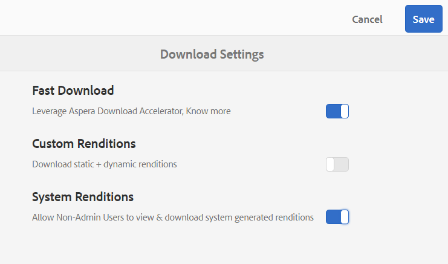

# Snabba upp nedladdningen av varumärkesportalen {#guide-to-accelerate-downloads-from-brand-portal}

Med Brand Portal kan du förbättra hämtningsprestanda för stora filer genom att integrera med IBM Aspera Connect, som är ett program som installeras vid behov. Programmet använder tillverkarspecifik teknik för att ta bort TCP-omkostnader och förbättrar överföringshastigheten för resursfilerna. Integreringen ger en förbättrad nedladdningsupplevelse.

>[!NOTE]
>
>Nedladdningshastigheten varierar för användarna eftersom den beror på t.ex. nätverkets bandbredd, serverns latens och klienternas geografiska placering.

Konfigurationen **[!UICONTROL Fast Download]** är som standard aktiverad, vilket minskar den tid det tar att hämta önskade resursfiler från varumärkesportalen avsevärt.

## Förutsättningar för att snabba upp filnedladdningen {#prerequisites-to-accelerate-file-download}

Om du vill hämta filerna snabbare bör du göra följande:

* Navigera till **[!UICONTROL Tools]** > **[!UICONTROL Download]** och verifiera att konfigurationen **[!UICONTROL Fast Download]** är aktiverad i **[!UICONTROL Download Settings]**.
* Kontrollera att port 33001 (både TCP och UDP) är öppen i brandväggen. Mer information om förutsättningarna finns i [dokumentationen för IBM Aspera Connect Client](https://downloads.asperasoft.com/en/documentation/8).
* [Installera IBM Aspera Connect 3.9.9](https://www.ibm.com/support/knowledgecenter/SSXMX3_3.9.9/kc/connect_welcome.html) i webbläsartillägget med administratörsbehörighet.
* Plattformsstöd för Aspera-överföringsklient finns i [supportmatris för IBM Aspera Connect-plattformen](https://www.asperasoft.com/company/support/transfer-clients/).

## Hämta domäner {#download-domains}

Nedan följer hämtningsdomänerna för olika platser:

| Regionkod | Domän |
|---|---|
| NA OR1 | downloads-na1.brand-portal.adobe.com |
| NA VA5 | downloads-na2.brand-portal.adobe.com |
| EMEA LON5 | downloads-emea1.brand-portal.adobe.com |
| APAC SIN2 | downloads-apac1.brand-portal.adobe.com |

## Exempel på hämtningsprestanda med filacceleratorn {#expected-download-performance-using-file-accelerator}

I följande tabell visas hämtningsprestanda för 2 GB-filer med Aspera Connect-filhämtningsacceleratorn:

*De observerade resultaten varierar beroende på faktorer som nätverksbandbredd, serverfördröjning och klientplats, med tanke på att Brand Portal-servern är i Oregon (USA).*

| Klientplats | Latens mellan klient och server (millisekunder) | Snabba upp med Aspera Connect File Transfer Accelerator (MBps) | Tid för hämtning av 2 GB fil med Aspera File Transfer Accelerator (sekunder) |
|---------------------------|-----------------------------------|---------------------------------------------|-------------------------------------------------------------------------|
| Västra USA (N) Kalifornien) | 18 | 36 | 57 |
| Västra USA (Oregon) | 42 | 36 | 57 |
| Östra USA (N) Virginia) | 85 | 35 | 58 |
| APAC (Tokyo) | 124 | 36 | 57 |
| Noida (Indien) | 275 | 13.36 | 153 |
| Sydney | 175 | 29 | 70 |
| London | 179 | 35 | 58 |
| Singapore | 196 | 34 | 60 |

## Hämta arbetsflöde med filacceleratorn {#download-workflow-using-file-accelerator}

Så här hämtar du resurser snabbare från varumärkesportalen:

1. Logga in på varumärkesportalen med en webbläsare som stöds.
1. Bläddra och välj de mappar eller resurser som du vill hämta. Klicka på ikonen **[!UICONTROL Download]** i verktygsfältet överst. Dialogrutan **[!UICONTROL Download]** visas med kryssrutorna **[!UICONTROL Asset(s)]** och **[!UICONTROL Enable download acceleration]** markerade som standard.

   

   >[!NOTE]
   >
   >Funktionen för att skicka e-postmeddelanden med länken för att hämta resurser stöds för närvarande inte medan snabbare hämtningar är aktiverade.

   

1. Klicka på **[!UICONTROL Download]**.

   Om du vill få en snabbare nedladdning på ditt varumärkesportal-klientkonto måste du ha Aspera Connect-klientprogrammet installerat i webbläsartillägget.

1. **Ladda ned Aspera Connect Client**

   Om Aspera Connect-klienten inte är installerad på datorn eller om den befintliga Aspera Connect-klienten är inaktuell, visas ett meddelande på webbläsarsidan där du kan hämta den systemspecifika Aspera Connect-klienten genom att välja **[!UICONTROL Download Latest Version]**.

   

   Om du vill hämta den senaste versionen av Aspera Connect från [https://downloads.asperasoft.com/connect2/](https://downloads.asperasoft.com/connect2/) väljer du **[!UICONTROL Download Now]** och följer instruktionerna.

1. **Installera Aspera Connect Client**

   Om du vill installera installationsprogrammet för IBM Aspera Connect-klienten kör du installationsprogrammet från MSI-filen för klientprogrammet IBM Aspera Connect och följer installationsguiden.

1. När klienten har installerats uppdaterar du webbläsarsidan och startar hämtningsstegen igen.

   När du använder Aspera Connect för första gången uppmanas webbläsaren att öppna länken med **[!UICONTROL IBM Aspera Connect]**. Aktivera **[!UICONTROL Remember my choice for FASP links]** om du vill hoppa över den här dialogrutan i framtiden.

   >[!NOTE]
   >
   >Det här meddelandet skiljer sig åt i olika webbläsare.

1. En dialogruta bekräftar om överföringen ska fortsätta eller inte. Välj **[!UICONTROL Allow]** för att börja.
Aktivera **[!UICONTROL Use my choice for all connections with this host]** om du vill hoppa över den här dialogrutan i framtiden.
Hämtningen börjar. En dialogruta visar hämtningens förlopp. Använd dialogrutan för att **[!UICONTROL pause]**, **[!UICONTROL resume]** eller **[!UICONTROL cancel]** hämta filen.
Aspera Connect-programmet tillhandahåller ett aktivitetsfönster i systemet där användaren kan visa och hantera alla överföringssessioner. Mer information finns i [Aspera Connect Client-dokumentationen](https://downloads.asperasoft.com/en/documentation/8).

När hämtningen är klar visas en dialogruta där resurserna hämtas till användarens system. Om ett fel uppstår visas ett felmeddelande.

>[!NOTE]
>
>Det finns en känd begränsning i Aspera Connect-klientprogrammet att ingen uppmaning om att välja hämtningsplats visas om **[!UICONTROL Always ask me where to save downloaded files]** är aktiverat under fliken **[!UICONTROL Transfers]** i **[!UICONTROL Preferences]**. Ange platsen i textrutan **[!UICONTROL Save downloaded files to]** innan hämtningen börjar.

## Använda filacceleratorn i Microsoft Edge-webbläsaren {#using-file-accelerator-on-microsoft-edge-browser}

Microsoft Edge körs i EPM (Enhanced Protected Mode) som förhindrar kommunikation med Aspera Connect-servern, samtidigt som programmet finns i samma privata nätverk eller med en betrodd plats. Därför visas ett popup-fönster varje gång en anslutning till servern upprättas.

Om du vill använda accelererad nedladdningsfunktion i Microsoft Edge tar du bort webbplatsen för varumärkesportalen från listan över betrodda webbplatser.

1. Öppna Kontrollpanelen (**[!UICONTROL Window key + X]** och välj **[!UICONTROL Control Panel]**).
1. Gå till **[!UICONTROL Network and Internet]** > **[!UICONTROL Internet Options]**. Klicka på fliken **[!UICONTROL Security]**.
1. Klicka på **[!UICONTROL Trusted sites zone]** och sedan på **[!UICONTROL Sites]**.
1. Ta bort webbplatsen för varumärkesportalen från listan.

## Klientinställningar för Aspera Connect {#aspera-connect-client-preferences}

Det finns några användbara inställningar som du kan ange i inställningarna för IBM Aspera Connect Client genom att högerklicka på ikonen och välja **[!UICONTROL Preferences]**.

Du kan ange standardplats för hämtning.

Dessutom kan Aspera Connect-klienten markeras så att den startar automatiskt när datorn startas så att anslutningsklienten körs och kan ladda ned snabbare.

## Felsöka problem med nedladdningsacceleration {#troubleshoot-issues-with-download-acceleration}

Om det inte går att hämta acceleration felsöker du följande steg:

1. Kontrollera att portar inte blockeras genom att gå till [https://test-connect.asperasoft.com](https://test-connect.asperasoft.com/) från datorn.

   Om portarna inte fungerar som de ska ska du kontakta ditt nätverksteam och se till att porterna 33001 (både TCP och UDP) inte blockeras i brandväggen.

1. Om portarna är OK kontrollerar du om nätverket inte är långsamt genom att mäta den tillgängliga bandbredden med [https://www.speedtest.net/](https://www.speedtest.net/).

   Om bandbredden är några få (1-10 Mbit/s) eller i kbit/s använder du inställningarna för Aspera och försöker begränsa den bandbredd som är lika med den tillgängliga bandbredden.

1. Använd [https://demo.asperasoft.com/aspera/user](https://demo.asperasoft.com/aspera/user) för att kontrollera om hämtningarna från Aspera-demoservern fungerar.\
   (inloggning:  asperaweb, lösenord:  demoaspera )

1. Om ingen av ovanstående felsökningssteg fungerar avmarkerar du alternativet Aktivera acceleration för hämtning och använder den normala nedladdningen.
