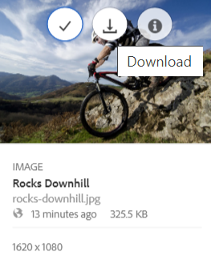

# Snabba upp nedladdningen av Brand Portal {#guide-to-accelerate-downloads-from-brand-portal}

<!-- This topic is woefully out of date. It talks at length about using a third party application whose URLs have a variety of problems. Topic should either be deleted or updated entirely to not talk about a specific third party application that Adobe has no control over. It also appears that the third party app is NOT free anymore. -->

Med Adobe Experience Manager Assets Brand Portal kan du förbättra hämtningsprestanda för stora filer genom att integrera med IBM® Aspera Connect, som är ett program som installeras vid behov. Programmet använder tillverkarspecifik teknik för att ta bort TCP-omkostnader och förbättrar överföringshastigheten för resursfilerna. Integreringen ger en förbättrad nedladdningsupplevelse.

>[!NOTE]
>
>Nedladdningshastigheten varierar för användarna eftersom den beror på t.ex. nätverkets bandbredd, serverns latens och klienternas geografiska placering.

The **[!UICONTROL Fast Download]** är som standard aktiverat, vilket avsevärt minskar tiden det tar att hämta önskade resursfiler från Brand Portal.

## Förutsättningar för snabbare filhämtning {#prerequisites-to-accelerate-file-download}

Om du vill hämta filerna snabbare bör du göra följande:

* Navigera till **[!UICONTROL Tools]** > **[!UICONTROL Download]** och verifiera att **[!UICONTROL Fast Download]** konfigurationen är aktiverad i **[!UICONTROL Download Settings]**.
* Kontrollera att port 33001 (både TCP och UDP) är öppen i brandväggen. Mer information om krav finns i [IBM® Aspera Connect Client-dokumentation](https://downloads.asperasoft.com/en/documentation/8).
* **Installera IBM® Aspera Connect 3.9.9** i webbläsarens tillägg med administratörsbehörighet (`https://www.ibm.com/docs/en/aspera-connect/3.9.9`).
* Plattformsstöd för Aspera-överföringsklienten finns på [Supportmatris för IBM® Aspera Connect-plattformen](https://www.asperasoft.com/company/support/transfer-clients/).

>[!NOTE]
>
>Det finns ett känt problem med IBM® Aspera Connect. Snabb nedladdning fungerar inte med IBM® Aspera Connect version 3.10 och senare.

## Hämta domäner {#download-domains}

Nedan följer hämtningsdomänerna för olika platser:

| Regionkod | Domän |
|---|---|
| NA OR1 | downloads-na1.brand-portal.adobe.com |
| NA VA5 | downloads-na2.brand-portal.adobe.com |
| EMEA LON5 | downloads-emea1.brand-portal.adobe.com |
| APAC SIN2 | downloads-apac1.brand-portal.adobe.com |

## Exempel på nedladdningsprestanda med filaccelerator {#expected-download-performance-using-file-accelerator}

I följande tabell visas hämtningsprestanda för en fil som är 2 GB med filhämtningsacceleratorn Aspera Connect:

*Resultatet som observeras varierar beroende på faktorer som nätverksbandbredd, serverfördröjning och klientplacering, eftersom Brand Portal-servern är i Oregon (USA).*

| Klientplats | Latens mellan klient och server (millisekunder) | Snabba upp med Aspera Connect File Transfer Accelerator (MBps) | Tidsåtgång för att ladda ned en fil som är 2 GB med Aspera File Transfer Accelerator (sekunder) |
|---------------------------|-----------------------------------|---------------------------------------------|-------------------------------------------------------------------------|
| Västra USA (N) Kalifornien) | 18 | 36 | 57 |
| Västra USA (Oregon) | 42 | 36 | 57 |
| Östra USA (N) Virginia) | 85 | 35 | 58 |
| APAC (Tokyo) | 124 | 36 | 57 |
| Noida (Indien) | 275 | 13.36 | 153 |
| Sydney | 175 | 29 | 70 |
| London | 179 | 35 | 58 |
| Singapore | 196 | 34 | 60 |

## Hämta resurser {#download-assets}

Så här hämtar du resurser snabbare från Brand Portal:

1. Logga in på din Brand Portal-klient. Som standard är **[!UICONTROL Files]** öppnas som innehåller alla publicerade resurser och mappar.

   Gör något av följande:

   * Markera de resurser eller mappar som du vill hämta. Klicka på knappen **[!UICONTROL Download]** ikon.

      

   * Om du vill hämta särskilda återgivningar av en resurs håller du pekaren över resursen och klickar på **[!UICONTROL Download]** -ikonen finns i miniatyrbilderna för snabbåtgärder.

      

1. The **[!UICONTROL Download]** öppnas en dialogruta där alla markerade resurser visas.

   Om du vill bevara mapphierarkin i Brand Portal när du hämtar resurser väljer du **[!UICONTROL Create separate folder for each asset]** kryssruta.

   Nedladdningsknappen visar antalet markerade objekt. När du är klar med reglerna klickar du på **[!UICONTROL Download items]**. Mer information om hur du använder regler finns i [ladda ned resurser](../using/brand-portal-download-assets.md#download-assets).

   

1. Som standard är **[!UICONTROL Fast Download]** inställningen är aktiverad i **[!UICONTROL Download Settings]**. Därför visas en bekräftelseruta där du kan hämta resurser med IBM® Aspera Connect.

   Om du hämtar resurserna för första gången och inte har IBM® Aspera Connect installerat i webbläsaren, eller om den befintliga versionen är inaktuell, uppmanas du att installera Aspera Download Accelerator (`https://www.ibm.com/docs/en/aspera-connect/3.9.9`).

   

1. **Installera Aspera Connect Client**

   Om du vill installera installationsprogrammet för IBM® Aspera Connect-klienten kör du installationsprogrammet från MSI-filen för IBM® Aspera Connect-klientprogrammet och följer installationsguiden.

   

1. När klienten har installerats uppdaterar du webbläsarsidan och startar hämtningsstegen igen.

1. För att fortsätta använda **[!UICONTROL Fast Download]**, klicka **[!UICONTROL Allow]**. Alla valda återgivningar hämtas i en zip-mapp med IBM® Aspera Connect.

   När hämtningen är klar visas en dialogruta där resurserna hämtas till användarens system.

   

   Om du inte vill använda IBM® Aspera Connect klickar du på **[!UICONTROL Deny]**. If **[!UICONTROL Fast Download]** nekas eller misslyckas fyller systemet i ett felmeddelande. Klicka på **[!UICONTROL Normal Download]** om du vill fortsätta hämta resurserna.

>[!NOTE]
Om **[!UICONTROL Fast Download]** inställningen är inaktiverad av administratören. De valda återgivningarna hämtas direkt till en zip-mapp utan att IBM® Aspera Connect används.

<!-- 
On successful completion of the download, a dialog box shows the location where assets are downloaded onto the user's system. If there is a failure, it shows error.

   >[!NOTE]
   >
   >There is a known limitation in Aspera Connect client application that no prompt to select download location appears if **[!UICONTROL Always ask me where to save downloaded files]** is enabled under the tab **[!UICONTROL Transfers]** within **[!UICONTROL Preferences]**. Before any download begins, provide the location in the text box **[!UICONTROL Save downloaded files to]**.

1. Log in to Brand Portal using a supported browser.
1. Browse and select the folders or assets you want to download. From the toolbar at the top, click the **[!UICONTROL Download]** icon. the **[!UICONTROL Download]** dialog appears with the **[!UICONTROL Asset(s)]** and **[!UICONTROL Enable download acceleration]** check boxes selected by default. 

   

   >[!NOTE]
   >
   >The functionality to send email notification with the link to download assets is presently not supported while faster downloads are enabled.

   

1. Click **[!UICONTROL Download]**.

   To speed up the download experience on your Brand Portal tenant account, you need to have Aspera Connect client application installed in your browser's extension.

1. **Download Aspera Connect Client**

   If Aspera Connect client is not installed on your system or the existing Aspera Connect client is out of date, a prompt is displayed on the browser page from where you can download the system-specific Aspera Connect client by selecting **[!UICONTROL Download Latest Version]**.

   

   To download the latest version of Aspera Connect from [https://downloads.asperasoft.com/connect2/](https://downloads.asperasoft.com/connect2/), select **[!UICONTROL Download Now]** and follow the instructions.

1. **Install Aspera Connect Client**

   To install IBM Aspera Connect client setup, run the setup from  .msi  file of IBM Aspera Connect client application and follow the installation wizard.

1. Once the client is successfully installed, refresh the browser page and initiate the download steps again.

   When using Aspera Connect for the first time, the browser prompts to open the link using **[!UICONTROL IBM Aspera Connect]**. To skip this dialog in future, enable **[!UICONTROL Remember my choice for FASP links]**.

   >[!NOTE]
   >
   >This message is different on the different browsers.

1. A dialog box confirms whether to proceed the transfer or not. Select **[!UICONTROL Allow]** to begin.
To skip this dialog in future, enable **[!UICONTROL Use my choice for all connections with this host]**.
Download begins. A dialog box shows the progress of the download. Use the dialog box to **[!UICONTROL pause]**, **[!UICONTROL resume]**, or **[!UICONTROL cancel]** the download.
Aspera Connect application provides an Activity Window on the system where user can view and manage all transfer sessions. For more information, refer [Aspera Connect Client documentation](https://downloads.asperasoft.com/en/documentation/8).

On successful completion of the download, a dialog box shows the location where assets are downloaded onto the user's system. If there is a failure, it shows error.

   >[!NOTE]
   >
   >There is a known limitation in Aspera Connect client application that no prompt to select download location appears if **[!UICONTROL Always ask me where to save downloaded files]** is enabled under the tab **[!UICONTROL Transfers]** within **[!UICONTROL Preferences]**. Before any download begins, provide the location in the text box **[!UICONTROL Save downloaded files to]**.
-->

## Använda filacceleratorn i webbläsaren Microsoft® Edge {#using-file-accelerator-on-microsoft-edge-browser}

Microsoft® Edge körs i EPM (Enhanced Protected Mode) som förhindrar kommunikation med Aspera Connect-servern, samtidigt som den finns i samma privata nätverk eller med en betrodd plats. Därför visas ett popup-fönster varje gång en anslutning till servern upprättas.

Om du vill använda accelererad nedladdningsfunktion på Microsoft® Edge tar du bort Brand Portal webbplats från listan över tillförlitliga webbplatser.

1. Öppna Kontrollpanelen (**[!UICONTROL Window key + X]** väljer **[!UICONTROL Control Panel]**).
1. Gå till **[!UICONTROL Network and Internet]** > **[!UICONTROL Internet Options]**. Klicka på **[!UICONTROL Security]** -fliken.
1. Klicka på **[!UICONTROL Trusted sites zone]** och sedan klicka **[!UICONTROL Sites]**.
1. Ta bort Brand Portal webbplats från listan.

## Inställningar för Aspera Connect-klient {#aspera-connect-client-preferences}

Det finns några användbara inställningar som du kan ange i inställningarna för IBM® Aspera Connect Client genom att högerklicka på ikonen och välja **[!UICONTROL Preferences]**.

Du kan ange standardplats för hämtning.

Dessutom kan Aspera Connect-klienten markeras så att den startar automatiskt när datorn startas så att anslutningsklienten körs och kan ladda ned snabbare.

## Felsöka problem med nedladdningsacceleration {#troubleshoot-issues-with-download-acceleration}

Om det inte går att hämta acceleration kan du prova med följande förslag:

1. Kontrollera att portar inte är blockerade. Använd Google Search för att hitta alternativ som gör att du kan kontrollera om portar blockeras, beroende på vilket operativsystem som används.  <!-- THIS URL IS 404 AND DOES NOT REDIRECT [https://test-connect.asperasoft.com](https://test-connect.asperasoft.com/) from your computer. -->

   Om portarna inte fungerar som de ska ska du kontakta ditt nätverksteam och se till att porterna 33001 (både TCP och UDP) inte blockeras i brandväggen.

1. Om portarna är OK kontrollerar du om nätverket inte är långsamt genom att mäta tillgänglig bandbredd med [https://www.speedtest.net/](https://www.speedtest.net/).

   Om bandbredden är några få (1-10 Mbit/s) eller i kbit/s använder du inställningarna för Aspera och försöker begränsa den bandbredd som är lika med den tillgängliga bandbredden.

   <!-- The URL in this step is giving a 404 error. 1. To confirm whether the downloads from Aspera demo server are working, use [https://demo.asperasoft.com/aspera/user](https://demo.asperasoft.com/aspera/user).  
   (login:  asperaweb , password:  demoaspera ) -->

1. Om ingen av ovanstående felsökningssteg fungerar avmarkerar du alternativet Aktivera acceleration för hämtning och använder den normala nedladdningen.
