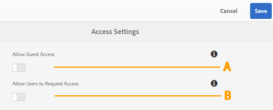
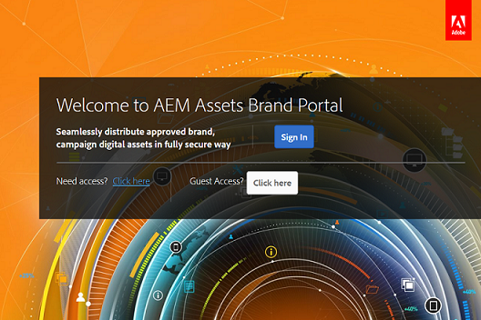

# Administrera användaråtkomst på Brand Portal {#administer-user-access-on-brand-portal}

AEM Assets Brand Portal 6.4.2 och senare ger administratörer behörighet att konfigurera gäståtkomst och göra det möjligt för användare att begära åtkomst till Brand Portal från sin organisation. Dessa konfigurationer har angetts som **[!UICONTROL Access Settings]**-konfigurationer på administrationspanelen. Båda inställningarna är inaktiverade som standard.

****   AConfiguration som tillåter gäståtkomst på Brand Portal via  **[!UICONTROL Guest Access?]** länken på Brand Portal välkomstskärm. (Standard är inaktiverat)

**BConfiguration**   som tillåter användare att begära åtkomst till Brand Portal via  **[!UICONTROL Need access?]** länken på Brand Portal välkomstskärm. (Standard är inaktiverat)

## Tillåt gäståtkomst {#allow-guest-access}

Genom att tillåta gäståtkomst kan användarna få åtkomst till offentliga resurser utan att behöva logga in på Brand Portal.
Administratören måste utföra följande steg för att tillåta gäståtkomst:

1. Välj AEM logotyp för att öppna administrationsverktygen i verktygsfältet högst upp.
1. På panelen Administrationsverktyg väljer du **[!UICONTROL Access]** för att öppna sidan **[!UICONTROL Access Settings]**.
1. Aktivera **[!UICONTROL Allow Guest Access]**-konfigurationen.
1. **[!UICONTROL Save]** ändringarna.
1. Logga ut för att ändringarna ska börja gälla.

## Tillåt användare att begära åtkomst {#allow-users-to-request-access}

Administratörer kan tillåta användare i organisationen att begära åtkomst till Brand Portal från välkomstskärmen. Administratörer måste dock aktivera konfigurationen **[!UICONTROL Allow Users to Request Access]** så att länken för åtkomstbegäran visas på välkomstskärmen.

För att organisationsanvändare ska kunna begära åtkomst från Brand Portal måste administratörerna:

1. Välj AEM logotyp för att öppna administrationsverktygen i verktygsfältet högst upp.
1. På panelen Administrationsverktyg väljer du **[!UICONTROL Access]** för att öppna sidan **[!UICONTROL Access Settings]**.
1. Aktivera **[!UICONTROL Allow Users to Request Access]**-konfigurationen.
1. **[!UICONTROL Save]** ändringarna.
1. Logga ut för att ändringarna ska börja gälla.
