# Hantera användare, grupper och användarroller {#manage-users-groups-and-user-roles}

Administratörer kan använda Adobe Admin Console för att skapa AEM Assets Brand Portal-användare och produktprofiler och hantera sina roller med Brand Portal användargränssnitt. Det här privilegiet är inte tillgängligt för granskare och redigerare.

I [[!UICONTROL Admin Console]](http://adminconsole.adobe.com/enterprise/overview) kan du visa alla produkter som är kopplade till din organisation. En produkt kan vara en valfri Experience Cloud-lösning, som Adobe Analytics, Adobe Target eller AEM Brand Portal. Du måste välja AEM Brand Portal och skapa produktprofiler.

<!--
Comment Type: draft

<note type="note">

Product Profiles (formerly known as product configurations*). 

* The nomenclature has changed from product configurations to product profiles in the new Adobe Admin Console.

</note>
-->
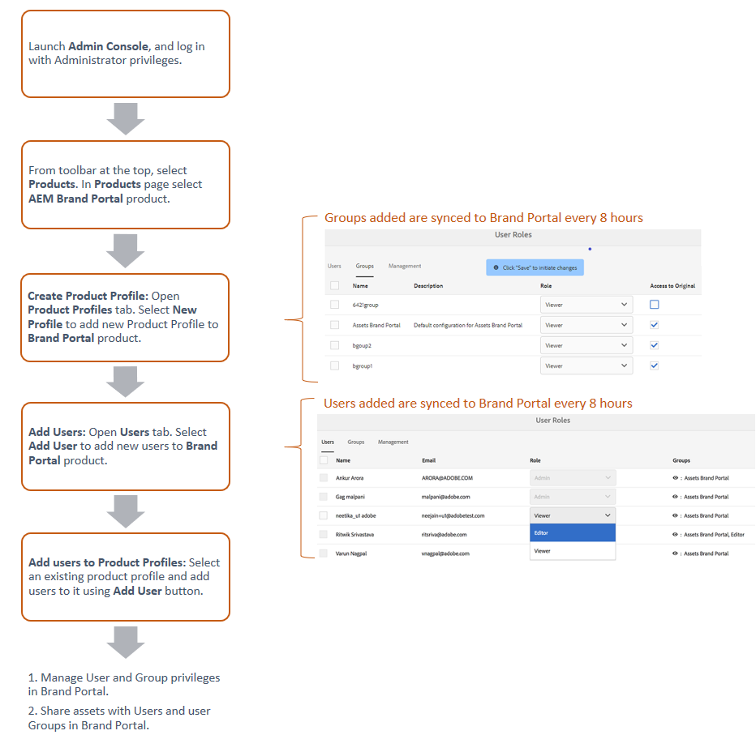

Dessa produktprofiler synkroniseras med Brand Portal användargränssnitt var 8:e timme och visas som grupper i Brand Portal. När du har lagt till användare och skapat produktprofiler, och lagt till användare i produktprofilerna, kan du tilldela roller till användare och grupper i Brand Portal.

>[!NOTE]
>
>Om du vill skapa grupper i Brand Portal från Adobe [!UICONTROL Admin Console] använder du **[!UICONTROL Products > Product Profiles]** i stället för **[!UICONTROL User page > User Groups]**. Produktprofiler i Adobe [!UICONTROL Admin Console] används för att skapa grupper i Brand Portal.

## Lägg till en användare {#add-a-user}

Om du är produktadministratör använder du Adobe [[!UICONTROL Admin Console]](http://adminconsole.adobe.com/enterprise/overview) för att skapa användare och tilldela dem till produktprofiler (*tidigare produktkonfigurationer*) som visas som grupper i Brand Portal. Du kan använda grupper för att utföra gruppåtgärder som rollhantering och resursdelning.

>[!NOTE]
>
>Nya användare som inte har tillgång till Brand Portal kan begära åtkomst från inloggningsskärmen i Brand Portal. Mer information finns i [Begär åtkomst till Brand Portal](../using/brand-portal.md#request-access-to-brand-portal). När du har fått meddelanden om åtkomstbegäran i meddelandefältet klickar du på det relevanta meddelandet och sedan på **[!UICONTROL Grant Access]**. Du kan även följa länken i det e-postmeddelande om åtkomstbegäran som har tagits emot. Om du sedan vill lägga till en användare via [Adobe [!UICONTROL Admin Console]](http://adminconsole.adobe.com/enterprise/overview) följer du steg 4-7 i proceduren nedan.

>[!NOTE]
>
>Du kan logga in på [Adobe [!UICONTROL Admin Console]](http://adminconsole.adobe.com/enterprise/overview) direkt eller från Brand Portal. Om du loggar in direkt följer du steg 4-7 i proceduren nedan för att lägga till en användare.

1. Klicka på Adobe-logotypen AEM verktygsfältet överst för att öppna administrationsverktygen.

   

1. Klicka på **[!UICONTROL Users]** på panelen Administrationsverktyg.

   

1. På sidan [!UICONTROL User Roles] klickar du på fliken **[!UICONTROL Management]** och sedan på **[!UICONTROL Launch Admin Console]**.

   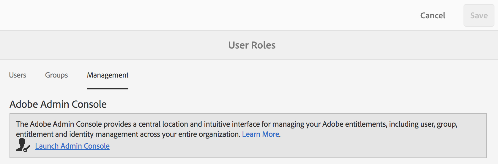

1. Gör något av följande i Admin Console för att skapa en ny användare:

   * Klicka på **[!UICONTROL Overview]** i verktygsfältet överst. Klicka på **[!UICONTROL Assign Users]** på Brand Portal produktkort på sidan [!UICONTROL Overview].

   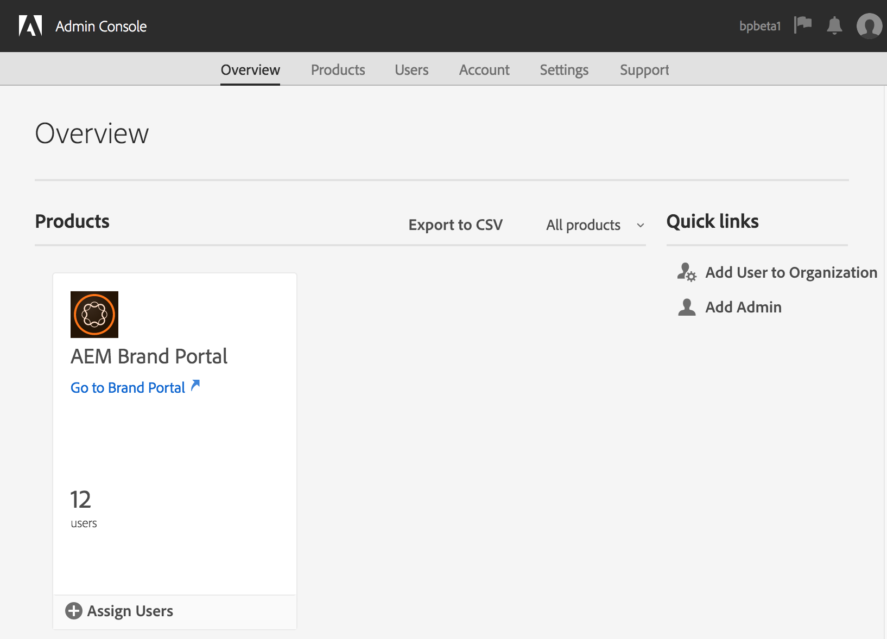

   * Klicka på **[!UICONTROL Users]** i verktygsfältet överst. På sidan [!UICONTROL Users] är [!UICONTROL Users] i den vänstra listen markerad som standard. Klicka på **[!UICONTROL Add User]**.

   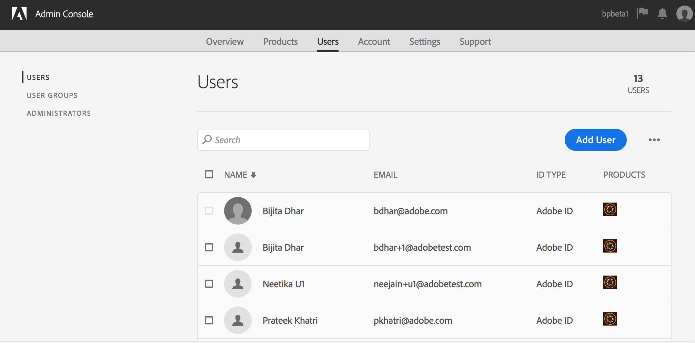

1. I dialogrutan Lägg till användare skriver du e-post-ID:t för den användare som du vill lägga till eller väljer användaren i listan med förslag som visas när du skriver.

   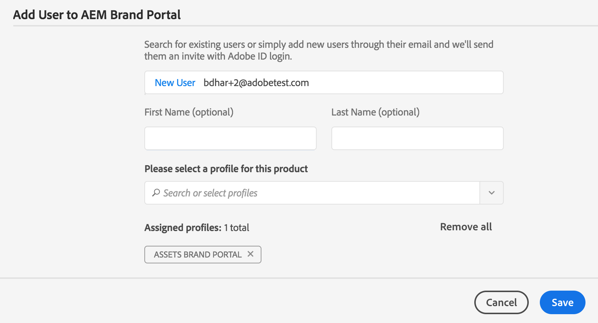

1. Tilldela användaren minst en produktprofil (tidigare produktkonfigurationer) så att användaren kan komma åt Brand Portal. Välj lämplig produktprofil i fältet **[!UICONTROL Please select a profile for this product]**.
1. Klicka på **[!UICONTROL Save]**. Ett välkomstmeddelande skickas till den nya användaren. Den inbjudna användaren kan klicka på länken i välkomstmeddelandet för att få åtkomst till Brand Portal. Användaren kan logga in med det e-post-ID ([!UICONTROL Adobe ID], [!UICONTROL Enterprise ID] eller [!UICONTROL Fedrated ID]) som är konfigurerat i Admin Console. Mer information finns i [Första gången du loggar in](../using/brand-portal-onboarding.md).

   >[!NOTE]
   >
   >Om en användare inte kan logga in på Brand Portal bör organisationens administratör besöka Adobe [!UICONTROL Admin Console] och kontrollera om användaren finns och har lagts till i minst en produktprofil.

   Information om hur du tilldelar användaren administratörsbehörighet finns i [Ge administratörsbehörighet till användare](../using/brand-portal-adding-users.md#provideadministratorprivilegestousers).

## Lägg till en produktprofil {#add-a-product-profile}

Produktprofiler (som tidigare kallades produktkonfigurationer) i [!UICONTROL Admin Console] används för att skapa grupper i Brand Portal så att du kan utföra gruppåtgärder som rollhantering och resursdelning i Brand Portal. **Brand** Portalis the default product profile available; kan du skapa fler produktprofiler och lägga till användare i de nya produktprofilerna.

>[!NOTE]
>
>Du kan logga in på [[!UICONTROL Admin Console]](http://adminconsole.adobe.com/enterprise/overview) direkt eller från Brand Portal. Om du loggar in på [!UICONTROL Admin Console] direkt följer du steg 4-7 i proceduren nedan för att lägga till en produktprofil.

1. Klicka på Adobe-logotypen AEM verktygsfältet överst för att öppna administrationsverktygen.

   

1. Klicka på **[!UICONTROL Users]** på panelen Administrationsverktyg.

   

1. På sidan [!UICONTROL User Roles] klickar du på fliken **[!UICONTROL Management]** och sedan på **[!UICONTROL Launch Admin Console]**.

   

1. Klicka på **[!UICONTROL Products]** i verktygsfältet överst.
1. På sidan [!UICONTROL Products] är [!UICONTROL Product Profiles] markerat som standard. Klicka på **[!UICONTROL New Profile]**.

   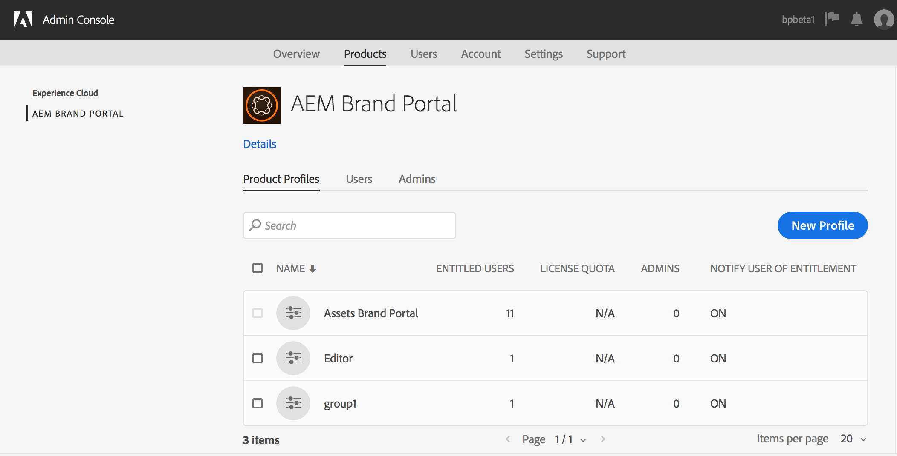

1. På sidan [!UICONTROL Create a New Profile] anger du profilnamn, visningsnamn, profilbeskrivning och väljer om du vill meddela användare via e-post när de läggs till eller tas bort från profilen.

   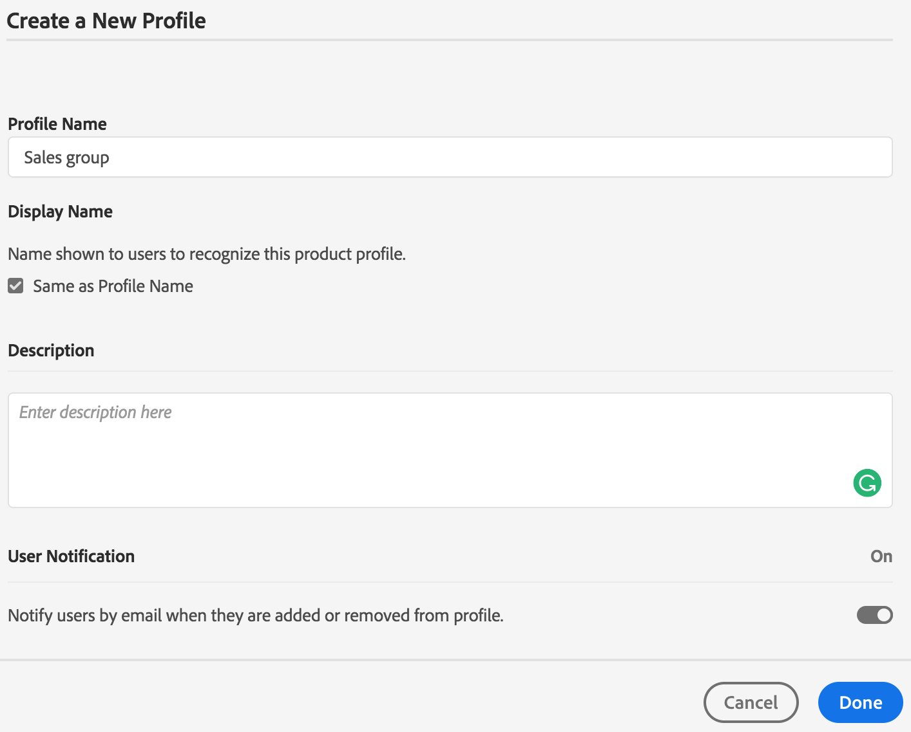

1. Klicka på **[!UICONTROL Done]**. Produktkonfigurationsgruppen, till exempel **[!UICONTROL Sales group]**, läggs till i Brand Portal.

   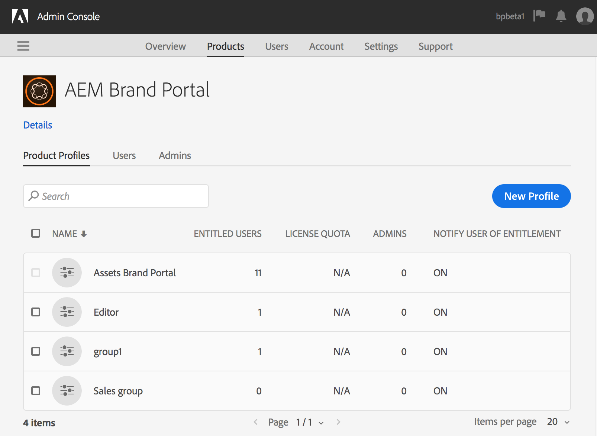

## Lägga till användare i en produktprofil {#add-users-to-a-product-profile}

Om du vill lägga till användare i en Brand Portal-grupp lägger du till dem i motsvarande produktprofil (tidigare produktkonfigurationer) i [!UICONTROL Admin Console]. Du kan lägga till användare individuellt eller gruppvis.

>[!NOTE]
>
>Du kan logga in på [[!UICONTROL Admin Console]](http://adminconsole.adobe.com/enterprise/overview) direkt eller från Brand Portal. Om du loggar in direkt på Admin Console följer du steg 4-7 i proceduren nedan för att lägga till användare i en produktprofil.

1. Klicka på Adobe-logotypen AEM verktygsfältet överst för att öppna administrationsverktygen.

   

1. Klicka på **[!UICONTROL Users]** på panelen Administrationsverktyg.

   

1. På sidan [!UICONTROL User Roles] klickar du på fliken **[!UICONTROL Management]** och sedan på **[!UICONTROL Launch Admin Console]**.

   ![Starta  [!DNL Admin Console]](assets/launch_admin_console.png)

1. Klicka på **[!UICONTROL Products]** i verktygsfältet överst.
1. På sidan [!UICONTROL Products] är [!UICONTROL Product Profiles] markerat som standard. Öppna produktprofilen som du vill lägga till en användare i, till exempel [!UICONTROL Sales group].

   

1. Så här lägger du till enskilda användare i produktprofilen:

   * Klicka på **[!UICONTROL Add User]**.

   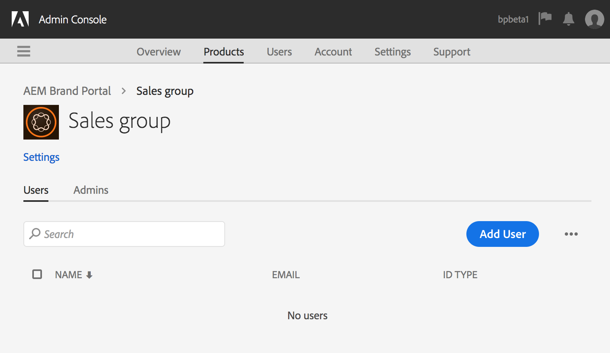

   * På sidan [!UICONTROL Add User to Sales group] skriver du e-post-ID för den användare som du vill lägga till eller väljer användaren i listan med förslag som visas när du skriver.

   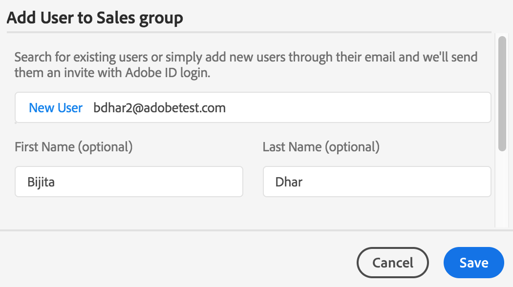

   * Klicka på **[!UICONTROL Save]**.

1. Så här lägger du till massanvändare i produktprofilen:

   * Choose **[!UICONTROL ellipsis (...) > Add users by CSV]**.

   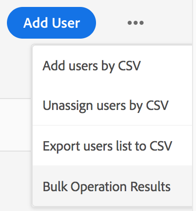

   * Hämta en CSV-mall eller dra och släpp en CSV-fil på sidan **[!UICONTROL Add Users by CSV]**.

   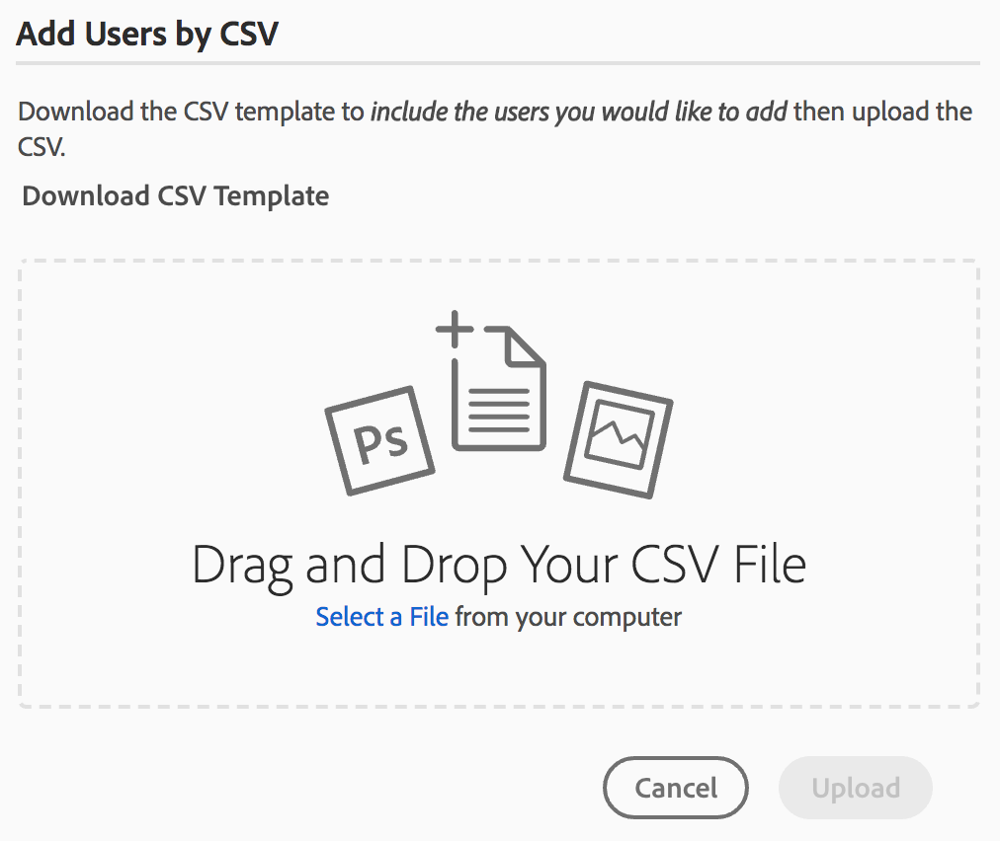

   * Klicka på **[!UICONTROL Upload]**.
   Om du har lagt till användare i standardproduktprofilen, dvs. Brand Portal, skickas ett välkomstmeddelande till e-post-ID:t för de användare som du har lagt till. De inbjudna användarna kan komma åt Brand Portal genom att klicka på länken i välkomstmeddelandet och logga in med en [!UICONTROL Adobe ID]. Mer information finns i [Första gången du loggar in](../using/brand-portal-onboarding.md).

   Användare som läggs till i en anpassad eller ny produktprofil får inga e-postmeddelanden.

## Ge användarna administratörsbehörighet {#provide-administrator-privileges-to-users}

Du kan ge systemadministratören eller produktadministratörsbehörighet till en Brand Portal-användare. Ange inte andra administrativa rättigheter som är tillgängliga i [!UICONTROL Admin Console], t.ex. administratör för produktprofiler, administratör för användargrupper och supportadministratör. Mer information om rollerna finns i [Administrativa roller](https://helpx.adobe.com/enterprise/using/admin-roles.html).

>[!NOTE]
>
>Du kan logga in på [[!UICONTROL Admin Console]](https://adminconsole.adobe.com/enterprise/overview) direkt eller från Brand Portal. Om du loggar in på [!UICONTROL Admin Console] direkt följer du steg 4-8 i proceduren nedan för att lägga till en användare i en produktprofil.

1. Klicka på Adobe-logotypen AEM verktygsfältet överst för att öppna administrationsverktygen.

   

1. Klicka på **[!UICONTROL Users]** på panelen Administrationsverktyg.

   

1. På sidan [!UICONTROL User Roles] klickar du på fliken **[!UICONTROL Management]** och sedan på **[!UICONTROL Launch Admin Console]**.

   

1. Klicka på **[!UICONTROL Users]** i verktygsfältet överst.
1. På sidan [!UICONTROL Users] är [!UICONTROL Users] i den vänstra listen markerad som standard. Klicka på användarnamnet för den användare som du vill ge administratörsbehörighet till.

   

1. Gå till avsnittet **[!UICONTROL Administrative Rights]** längst ned på användarprofilsidan och välj **[!UICONTROL ellipsis (...) > Edit admin rights]**.
   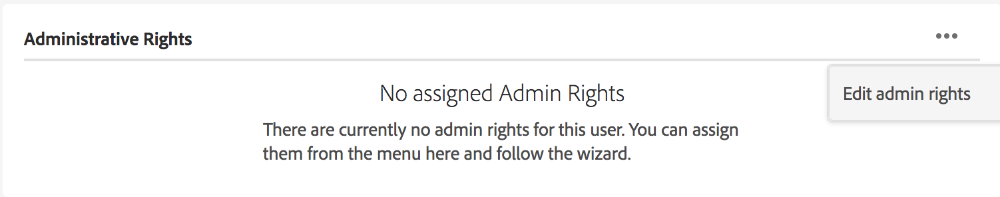

1. På sidan [!UICONTROL Edit Admin] väljer du Systemadministratör eller Produktadministratör.

   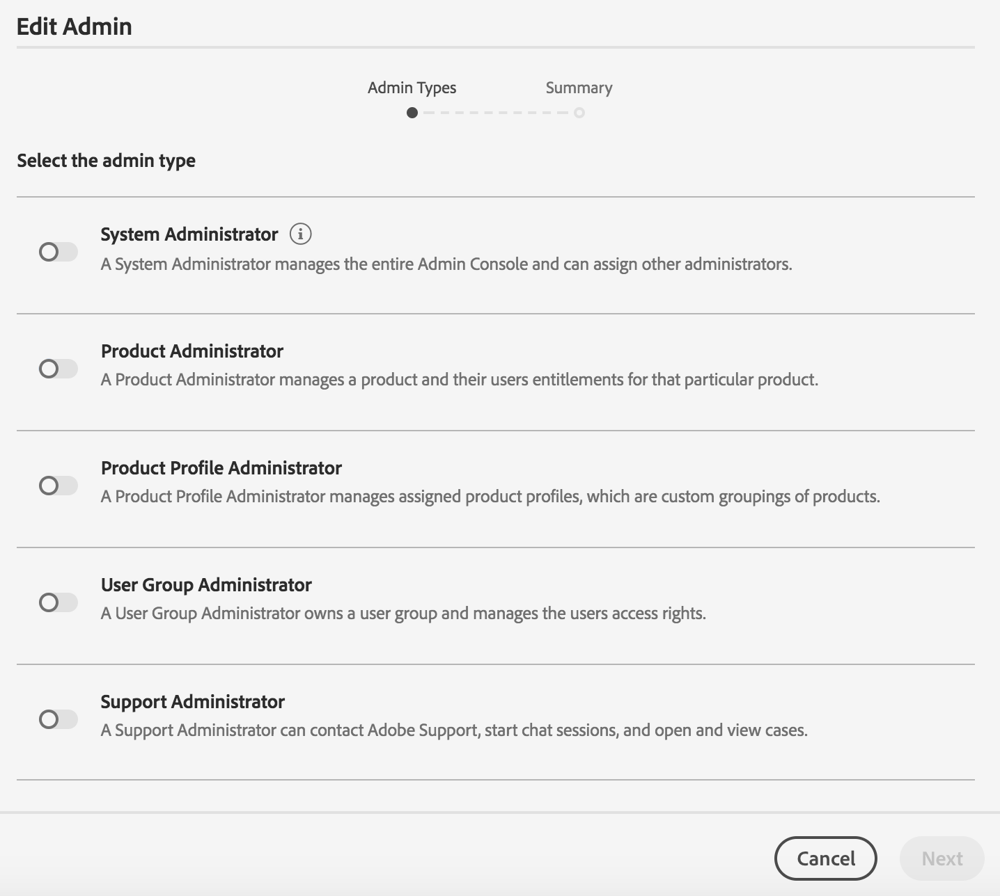

   >[!NOTE]
   >
   >Brand Portal har endast stöd för systemadministratörs- och produktadministratörsroller.
   >
   >Adobe rekommenderar att du undviker att använda systemadministratörsrollen eftersom den ger administratörsbehörighet för hela organisationen för alla produkter i en organisation. En systemadministratör för en organisation som inkluderar tre molnprodukter för marknadsföring har till exempel hela uppsättningen behörigheter för alla tre produkterna. Endast en systemadministratör kan konfigurera AEM Assets så att resurser kan publiceras från AEM Assets till Brand Portal. Mer information finns i [Konfigurera AEM Assets med Brand Portal](../using/configure-aem-assets-with-brand-portal.md).
   >
   >Produktadministratörsrollen ger däremot administratörsbehörighet för en viss produkt. Om du vill använda en mer detaljerad åtkomstkontroll i Brand Portal använder du produktadministratörsrollen och väljer produkten som Brand Portal.

   >[!NOTE]
   >
   >Brand Portal stöder inte administratörsbehörighet för produktprofiler (tidigare konfigurationsadministratör). Undvik att tilldela en användare administratörsrättigheter för produktprofiler.

1. Granska valet av admintyp och klicka på **[!UICONTROL Save]**.

   >[!NOTE]
   >
   >Om du vill återkalla administratörsbehörighet för en användare gör du önskade ändringar på sidan **[!UICONTROL Edit Admin]** och klickar sedan på **[!UICONTROL Save]**.

## Hantera användarroller {#manage-user-roles}

En administratör kan ändra roller för användare i Brand Portal.

Förutom administratörsrollen har Brand Portal stöd för följande roller:

* [!UICONTROL Viewer]: Användare med den här rollen kan visa filer och mappar som en administratör delar med sig. Visningsprogram kan även söka efter och hämta resurser. Visningsprogram kan dock inte dela innehåll (filer, mappar, [!UICONTROL collections]) med andra användare.
* [!UICONTROL Editor]: Användare med den här rollen har alla behörigheter som finns för ett visningsprogram. Dessutom kan redigerare dela innehåll (mappar, [!UICONTROL collections], länkar) med andra användare.

1. Klicka på Adobe-logotypen AEM verktygsfältet överst för att öppna administrationsverktygen.

   

1. Klicka på **[!UICONTROL Users]** på panelen Administrationsverktyg.

   

1. På sidan [!UICONTROL User Roles] är fliken [!UICONTROL Users] markerad som standard. För den användare vars roll du vill ändra väljer du **[!UICONTROL Editor]** eller **[!UICONTROL Viewer]** i listrutan **[!UICONTROL Role]**.

   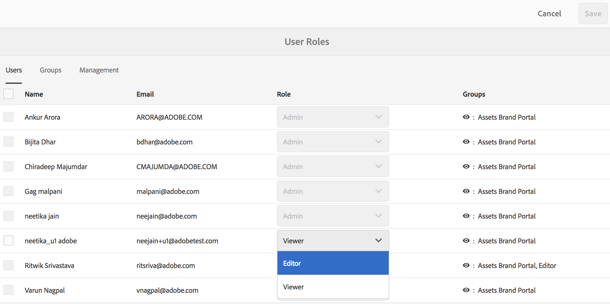

   Om du vill ändra rollen för flera användare samtidigt markerar du användarna och väljer rätt roll i listrutan **[!UICONTROL Role]**.

   >[!NOTE]
   >
   >[!UICONTROL Role]-listan för administratörsanvändare är inaktiverad. Du kan inte välja dessa användare för att ändra deras roller.

   >[!NOTE]
   >
   >Användarrollen är också inaktiverad om användaren är medlem i gruppen Redigerare. Om du vill återkalla redigeringsbehörighet för användaren tar du antingen bort användaren från gruppen Redigerare eller ändrar rollen för hela gruppen till Visningsprogram.

1. Klicka på **[!UICONTROL Save]**. Rollen ändras för motsvarande användare. Om du har valt flera användare ändras rollerna för alla användare samtidigt.

   >[!NOTE]
   >
   >Ändringar i användarbehörigheterna återspeglas på **[!UICONTROL User Roles]**-sidan först efter att användarna har loggat in på Brand Portal igen.

## Hantera grupproller och behörigheter {#manage-group-roles-and-privileges}

En administratör kan associera specifika behörigheter med en [grupp](../using/brand-portal-adding-users.md#main-pars-title-278567577) med användare i Brand Portal. På fliken **[!UICONTROL Groups]** på sidan **[!UICONTROL User Roles]** kan administratörer:

* Tilldela roller till användargrupper
* Begränsa användargrupper så att de hämtar originalåtergivningar av bildfiler (.jpeg, .tiff, .png, .bmp, .gif, .pjpeg, x-portable-anymap, x-portable-bitmap, x-portable-graymap, x-portable-pixmap, x-rgb, x-bitmap, x-pixmap, x-icon, image/image photoshop, image/x-photoshop, .psd, image/vnd.adobe.photoshop) from Brand Portal.

>[!NOTE]
>
>För de resurser som delas som länken gäller behörigheten att komma åt de ursprungliga återgivningarna av bildfiler baserat på behörigheten för den användare som delar resurserna.

Så här ändrar du rollen och åtkomsträttigheten till de ursprungliga återgivningarna för specifika gruppmedlemmar:

1. Gå till fliken **[!UICONTROL Groups]** på sidan **[!UICONTROL User Roles]**.
1. Markera de grupper som du vill ändra roller för.
1. Välj lämplig roll i listrutan **[!UICONTROL Role]**.

   Om du vill att medlemmarna i en grupp ska kunna få tillgång till de ursprungliga återgivningarna av bildfiler (.jpeg, .tiff, .png, .bmp, .gif, .pjpeg, x-portable-anymap, x-portable-bitmap, x-portable-graymap, x-portable-pixmap, x-rgb, x-bitmap, x-pixmap ikon, image/photoshop, image/x-photoshop, .psd, image/vnd.adobe.photoshop) som de hämtar från portalen eller den delade länken, behåll alternativet **[!UICONTROL Access to  Original]** markerat för den gruppen. Alternativet **[!UICONTROL Access to Original]** är valt som standard för alla användare. Om du vill förhindra att en användargrupp får åtkomst till de ursprungliga återgivningarna avmarkerar du det alternativ som motsvarar den gruppen.

   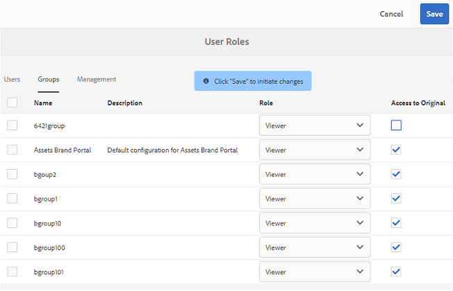

   >[!NOTE]
   >
   >Om en användare läggs till i flera grupper och en av dessa grupper har begränsningar, gäller begränsningarna den användaren.
   >
   >Begränsningar för åtkomst till ursprungliga återgivningar av bildfiler gäller inte för administratörer även om de är medlemmar i begränsade grupper.

1. Klicka på **[!UICONTROL Save]**. Rollen ändras för motsvarande grupper.

   >[!NOTE]
   >
   >Associationen användare-till-grupp, eller gruppmedlemskapet för en användare, synkroniseras med Brand Portal var 8:e timme. Ändringar i användar- eller grupproller börjar gälla efter att nästa synkroniseringsjobb har körts.
