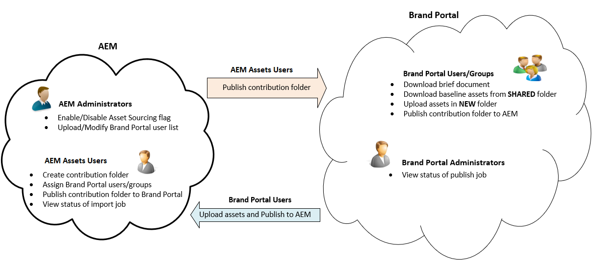
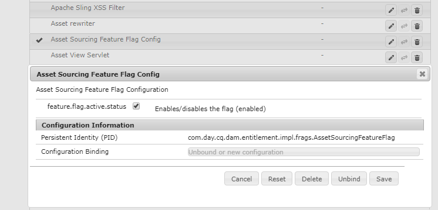
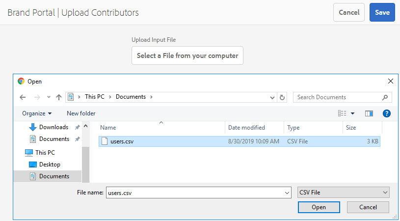

# Översikt över resurskälla {#overview-asset-sourcing-in-bp}

**Med** resurskälla kan AEM (administratörer/icke-admin-användare) skapa nya mappar med en extra  **Asset** Contributionsegenskap och säkerställa att den nya mappen som skapas är öppen för att skickas av Brand Portal-användare. Detta utlöser automatiskt ett arbetsflöde som skapar ytterligare två undermappar, som kallas **DELAD** och **NYTT**, i den nyligen skapade **Contribute**-mappen. Den AEM administratören definierar sedan behovet genom att ladda upp en översikt över de typer av resurser som ska läggas till i bidragsmappen, samt en uppsättning baslinjeresurser, till mappen **SHARED** för att säkerställa att BP-användarna har den referensinformation de behöver. Administratören kan sedan ge aktiva Brand Portal-användare åtkomst till mappen för bidrag innan den nyskapade **Contribute**-mappen publiceras på Brand Portal. När användaren är klar med att lägga till innehåll i mappen **NEW** kan han eller hon publicera bidragsmappen i den AEM författarmiljön. Observera att det kan ta några minuter att slutföra importen och återspegla det nya publicerade innehållet i AEM Assets.

Dessutom ändras inte alla befintliga funktioner. Användare av varumärkesportalen kan visa, söka efter och hämta resurser från bidragsmappen samt från andra tillåtna mappar. Administratörer kan dessutom dela mappen för bidrag ytterligare, ändra egenskaper och lägga till resurser i samlingar.

## Förutsättningar {#prerequisites}

* AEM Assets som Cloud Service, AEM Assets 6.5.2 eller senare.
* Kontrollera att din AEM Assets-instans är konfigurerad med varumärkesportalen. Se [Konfigurera AEM Assets med varumärkesportalen](../using/configure-aem-assets-with-brand-portal.md).
* Se till att din varumärksportal är konfigurerad med en instans av AEM Assets-författare.

>[!VIDEO](https://video.tv.adobe.com/v/29365/?quality=12)

>[!NOTE]
>
>Det finns ett känt fel i AEM Assets 6.5.4. Användare av varumärkesportalen kan inte publicera resurser i mappen för bidrag till AEM Assets när de uppgraderar till Adobe Developer Console.
>
>Problemet är åtgärdat i AEM 6.5.5. Du kan uppgradera din AEM Assets-instans till den senaste Service Pack-versionen AEM 6.5.5 och [uppgradera dina konfigurationer](https://docs.adobe.com/content/help/en/experience-manager-65/assets/brandportal/configure-aem-assets-with-brand-portal.html#upgrade-integration-65) på Adobe Developer Console.
>
>För att åtgärda AEM 6.5.4 rekommenderar vi att du [hämtar snabbkorrigeringen](https://www.adobeaemcloud.com/content/marketplace/marketplaceProxy.html?packagePath=/content/companies/public/adobe/packages/cq650/hotfix/cq-6.5.0-hotfix-33041) och installerar den på din författarinstans.

## Konfigurera resurskälla {#configure-asset-sourcing}

**Resurskällan** konfigureras inifrån AEM Assets-författarinstansen. Administratörerna kan aktivera konfigurationen av resurskällans funktionsflagga i **AEM Web Console Configuration** och överföra listan över aktiva Brand Portal-användare i **AEM Assets**.

>[!NOTE]
>
>Resurshantering är som standard aktiverat i AEM Assets som Cloud Service. Den AEM administratören kan överföra de aktiva Brand Portal-användarna direkt för att ge dem åtkomst till funktionen Resurser.

>[!NOTE]
>
>Innan du börjar med konfigurationen kontrollerar du att din AEM Assets-instans har konfigurerats med Varumärksportal. Se [Konfigurera AEM Assets med varumärkesportalen](../using/configure-aem-assets-with-brand-portal.md).

I följande video visas hur du konfigurerar Resurser för din AEM Assets-författarinstans:

>[!VIDEO](https://video.tv.adobe.com/v/29771)

### Aktivera resurskälla {#enable-asset-sourcing}

AEM administratörer kan aktivera funktionsflaggan Resurser i AEM Web Console Configuration (alias Configuration Manager).

>[!NOTE]
>
>Det här steget gäller inte för AEM Assets som Cloud Service.

**Så här aktiverar du resurskälla:**
1. Logga in på din AEM Assets-författarinstans och öppna Configuration Manager.
Standard-URL: http:// localhost:4502/system/console/configMgr.
1. Sök med nyckelordet **Resurser** för att hitta **[!UICONTROL Asset Sourcing Feature Flag Config]**.
1. Klicka på **[!UICONTROL Asset Sourcing Feature Flag Config]** för att öppna konfigurationsfönstret.
1. Markera kryssrutan **[!UICONTROL feature.flag.active.status]**.
1. Klicka på **[!UICONTROL Save]**.

### Överför användarlista för varumärkesportalen {#upload-bp-user-list}

AEM administratörer kan överföra användarkonfigurationsfilen för varumärkesportalen (.csv) som innehåller den aktiva användarlistan för varumärkesportalen i AEM Assets. En mapp för bidrag kan bara delas med de aktiva Brand Portal-användare som definieras i användarlistan. Administratören kan även lägga till nya användare i konfigurationsfilen och överföra den ändrade användarlistan.

>[!NOTE]
>
>CSV-filens format är detsamma som det som stöds i Admin Console för bulkanvändarimport. E-post, förnamn och efternamn är obligatoriska.

Administratörerna kan lägga till nya användare i AEM Admin Console, se [Hantera användare](brand-portal-adding-users.md) för mer information. När du har lagt till användare i Admin Console kan dessa användare läggas till i användarkonfigurationsfilen för varumärkesportalen och sedan tilldelas behörighet att komma åt mappen för bidrag.

**Så här överför du användarlistan för varumärkesportalen:**
1. Logga in på din AEM Assets-instans.
1. Gå till **[!UICONTROL Assets]** > **[!UICONTROL Brand Portal Users]** på panelen **Verktyg**.

1. Fönstret för ladda upp medverkande på varumärkesportalen öppnas.
Bläddra från den lokala datorn och överför **konfigurationsfilen (.csv)** som innehåller listan med aktiva Brand Portal-användare.
1. Klicka på **[!UICONTROL Save]**.

   

Administratörer kan ge åtkomst till specifika användare från den här användarlistan när de konfigurerar en mapp för bidrag. Endast de användare som är tilldelade till en avgiftsbelagda mapp har tillgång till bidragsmappen och publicerar resurser från varumärkesportalen till AEM Assets.

## Se även {#reference-articles}

* [Konfigurera och publicera avgiftsbelagda mappar på varumärkesportalen](brand-portal-publish-contribution-folder-to-brand-portal.md)

* [Publicera bidragsmapp till AEM Assets](brand-portal-publish-contribution-folder-to-aem-assets.md)
