# Anpassa skrivbordsunderlägg, sidhuvud och e-postmeddelanden {#customize-wallpaper-header-and-email-message}

Administratörer för varumärkesportaler kan göra begränsade anpassningar av gränssnittet som visas för användarna. Du kan välja en viss bakgrundsbild (skrivbordsunderlägg) för inloggningssidan för varumärkesportalen. Du kan också lägga till en huvudbild och anpassa e-postmeddelanden om resursdelning så att de matchar kundens varumärke.

## Anpassa skrivbordsunderlägg för inloggningsskärmen {#customize-the-login-screen-wallpaper}

Om det inte finns någon anpassad bakgrundsbild visas ett standardskrivbordsunderlägg på inloggningssidan.

1. I AEM-verktygsfältet överst klickar du på Adobes logotyp för att öppna administrationsverktygen.

   

1. Klicka på panelen Administrationsverktyg **[!UICONTROL Branding]**.

   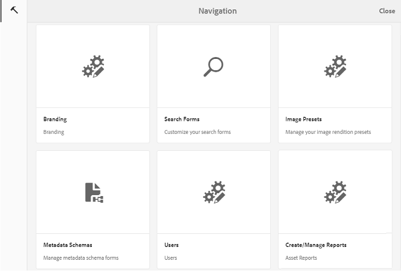

1. Till vänster på **[!UICONTROL Configure Branding]** sidan **[!UICONTROL Wallpaper]** markeras som standard. Standardbakgrundsbilden som visas på inloggningssidan visas.

   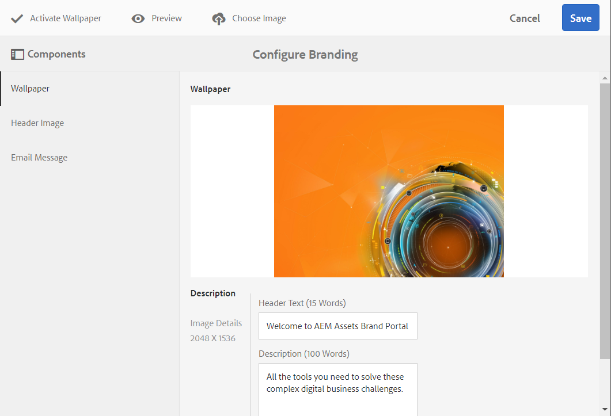

1. Om du vill lägga till en ny bakgrundsbild klickar du på **[!UICONTROL Choose Image]** ikonen i verktygsfältet högst upp.

   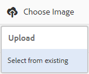

   Gör något av följande:

   * Om du vill överföra en bild från datorn klickar du på **[!UICONTROL Upload]**. Navigera till önskad bild och överför den.
   * Om du vill använda en befintlig Brand Portal-bild klickar du på **[!UICONTROL Select from existing]**. Välj en bild med resursväljaren.

   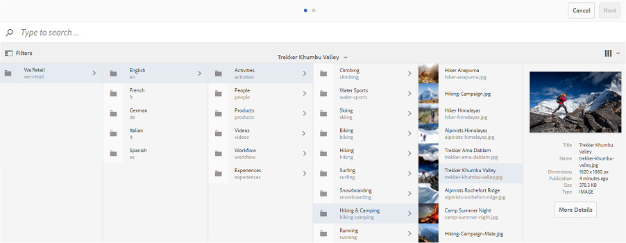

1. Ange en rubriktext och beskrivning för bakgrundsbilden. Spara ändringarna genom att klicka **[!UICONTROL Save]** i verktygsfältet högst upp.

1. Klicka på ikonen i verktygsfältet längst upp för att skapa en förhandsvisning av gränssnittet för varumärkesportalen med bilden. **[!UICONTROL Preview]**

   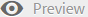

   

1. Gör följande på **[!UICONTROL Configure Branding > Wallpaper]** sidan om du vill aktivera eller inaktivera standardskrivbordsunderlägget:

   * Om du vill visa standardbilden för skrivbordsunderlägg på inloggningssidan för varumärkesportalen klickar du på **[!UICONTROL Deactivate Wallpaper]** i verktygsfältet högst upp. Ett meddelande bekräftar att den anpassade bilden är inaktiverad.

   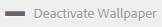

   * Om du vill återställa den anpassade bilden på inloggningssidan för varumärkesportalen klickar du på **[!UICONTROL Activate Wallpaper]** i verktygsfältet. Ett meddelande bekräftar att bilden har återställts.

   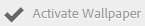

   * Click **[!UICONTROL Save]** to save the changes.

## Anpassa rubriken {#customize-the-header}

Sidhuvudet visas på olika sidor på varumärkesportalen när du har loggat in på varumärkesportalen.

1. I AEM-verktygsfältet överst klickar du på Adobes logotyp för att öppna administrationsverktygen.

   

1. Klicka på panelen Administrationsverktyg **[!UICONTROL Branding]**.

   

1. Om du vill anpassa sidhuvudet för gränssnittet för varumärkesportalen väljer du **[!UICONTROL Configure Branding]** från den vänstra listen på **[!UICONTROL Header Image]** sidan. Standardbilden för sidhuvud visas.

   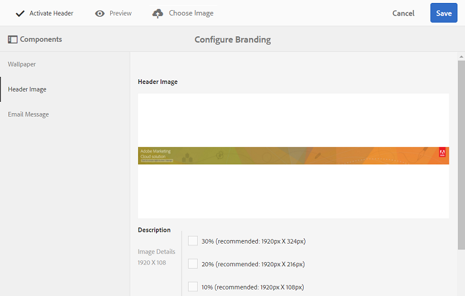

1. Om du vill överföra en rubrikbild klickar du på **[!UICONTROL Choose Image]** ikonen och väljer **[!UICONTROL Upload]**.

   Om du vill använda en befintlig Brand Portal-bild väljer du **[!UICONTROL Select from existing]**.

   

   Välj en bild med resursväljaren.

   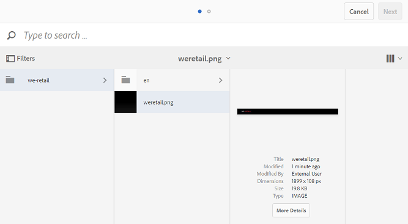

1. Om du vill inkludera en URL-adress i rubrikbilden anger du den i **[!UICONTROL Image URL]** rutan. Du kan ange externa eller interna URL-adresser. Interna länkar kan också vara relativa länkar, till exempel
   [!UICONTROL `/mediaportal.html/content/dam/mac/tenant_id/tags`].
Den här länken dirigerar användare till mappen taggar.
Spara ändringarna genom att klicka **[!UICONTROL Save]** i verktygsfältet högst upp.

   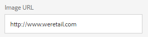

1. Klicka på ikonen i verktygsfältet längst upp för att skapa en förhandsvisning av gränssnittet för varumärkesportalen med rubrikbilden. **[!UICONTROL Preview]**

   
   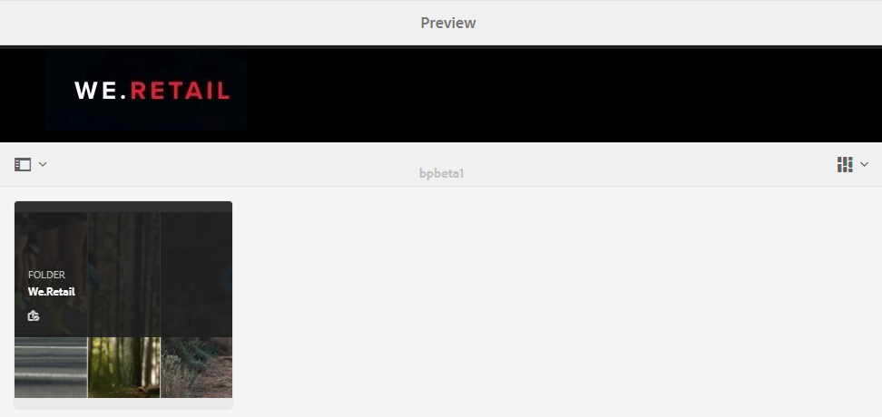

1. Så här aktiverar eller inaktiverar du rubrikbilden på **[!UICONTROL Configure Branding > Header Image]** sidan:

   * Om du inte vill att en rubrikbild ska visas på sidorna i varumärkesportalen klickar du på **[!UICONTROL Deactivate Header]** i verktygsfältet högst upp. Ett meddelande bekräftar att bilden är inaktiverad.

   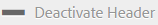

   * Om du vill att rubrikbilden ska visas igen på sidorna för varumärkesportalen klickar du på **[!UICONTROL Activate Header]** i verktygsfältet högst upp. Ett meddelande bekräftar att bilden är aktiverad.

   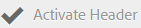

   * Click **[!UICONTROL Save]** to save the changes.

## Anpassa e-postmeddelanden {#customize-the-email-messaging}

När resurser delas som en länk får användarna ett e-postmeddelande med länken. Administratörer kan anpassa meddelandena, det vill säga logotyp, beskrivning och sidfot, för dessa e-postmeddelanden.

1. I AEM-verktygsfältet överst klickar du på Adobes logotyp för att öppna administrationsverktygen.

   

1. Klicka på panelen Administrationsverktyg **[!UICONTROL Branding]**.

   

1. När resurser delas som länkar eller hämtas via e-post, och när de **[!UICONTROL collections]** delas, skickas e-postmeddelanden till användarna. Om du vill anpassa e-postmeddelandet väljer du **[!UICONTROL Configure Branding]** från den vänstra listen på **[!UICONTROL Email Message]** sidan.

   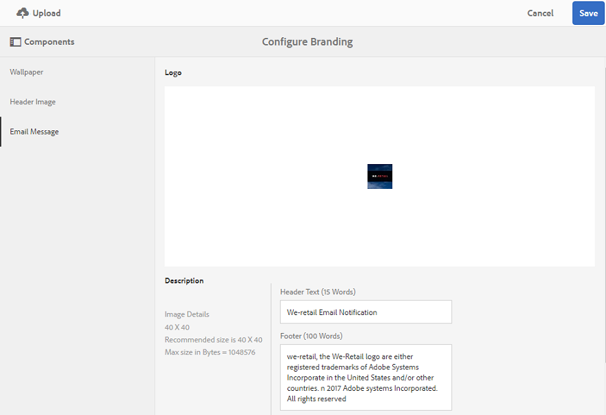

1. Om du vill lägga till en logotyp i utgående e-postmeddelanden klickar du på **[!UICONTROL Upload]** i verktygsfältet högst upp.

1. Ange sidhuvud och sidfot för e-post i **[!UICONTROL Description]** avsnittet. Spara ändringarna genom att klicka **[!UICONTROL Save]** i verktygsfältet högst upp.

   >[!NOTE]
   >
   >Om du inte använder den rekommenderade storleken för logotypen, eller om sidhuvuds- och sidfotstexten överskrider det rekommenderade antalet ord, kan innehållet i e-postmeddelandet bli förvrängt.
