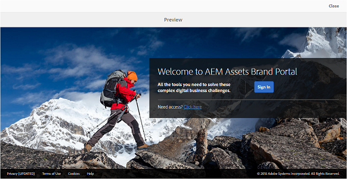

# Anpassa skrivbordsunderlägg, sidhuvud och e-postmeddelanden {#customize-wallpaper-header-and-email-message}

Brand Portal-administratörer kan göra begränsade anpassningar av gränssnittet som visas för användarna. Du kan välja en viss bakgrundsbild (skrivbordsunderlägg) för inloggningssidan för Brand Portal. Du kan också lägga till en huvudbild och anpassa e-postmeddelanden om resursdelning så att de matchar kundens varumärke.

## Anpassa skrivbordsunderlägg för inloggningsskärmen {#customize-the-login-screen-wallpaper}

Om det inte finns någon anpassad bakgrundsbild visas ett standardskrivbordsunderlägg på inloggningssidan.

1. Klicka på Experience Manager-logotypen i verktygsfältet överst för att öppna administrationsverktygen.

   

1. På panelen Administrationsverktyg klickar du på **[!UICONTROL Branding]**.

   

1. På vänster sida **[!UICONTROL Configure Branding]** sida, **[!UICONTROL Wallpaper]** är markerat som standard. Standardbakgrundsbilden som visas på inloggningssidan visas.

   

1. Om du vill lägga till en ny bakgrundsbild klickar du på **[!UICONTROL Choose Image]** ikonen i verktygsfältet överst.

   

   Gör något av följande:

   * Om du vill överföra en bild från datorn klickar du på **[!UICONTROL Upload]**. Navigera till önskad bild och överför den.
   * Om du vill använda en befintlig Brand Portal-bild klickar du på **[!UICONTROL Select from existing]**. Välj en bild med resursväljaren.

   

1. Ange en rubriktext och beskrivning för bakgrundsbilden. Spara ändringarna genom att klicka på **[!UICONTROL Save]** i verktygsfältet högst upp.

1. Klicka på knappen **[!UICONTROL Preview]** om du vill generera en förhandsvisning av Brand Portal-gränssnittet med bilden.

   

   

1. Så här aktiverar eller inaktiverar du standardskrivbordsunderlägget: **[!UICONTROL Configure Branding > Wallpaper]** sida:

   * Om du vill visa standardbilden för skrivbordsunderlägg på Brand Portal inloggningssida klickar du på **[!UICONTROL Deactivate Wallpaper]** i verktygsfältet högst upp. Ett meddelande bekräftar att den anpassade bilden är inaktiverad.

   

   * Om du vill återställa den anpassade bilden på inloggningssidan för Brand Portal klickar du på **[!UICONTROL Activate Wallpaper]** i verktygsfältet. Ett meddelande bekräftar att bilden har återställts.

   

   * Klicka **[!UICONTROL Save]** för att spara ändringarna.

## Anpassa rubriken {#customize-the-header}

Sidhuvudet visas på olika Brand Portal-sidor när du har loggat in på Brand Portal.

1. Klicka på Experience Manager-logotypen i verktygsfältet överst för att öppna administrationsverktygen.

   

1. På panelen Administrationsverktyg klickar du på **[!UICONTROL Branding]**.

   

1. Anpassa sidhuvudet för Brand Portal-gränssnittet på **[!UICONTROL Configure Branding]** sida, markera **[!UICONTROL Header Image]** från den vänstra listen. Standardbilden för sidhuvud visas.

   

1. Om du vill överföra en rubrikbild klickar du på **[!UICONTROL Choose Image]** ikon och välj **[!UICONTROL Upload]**.

   Om du vill använda en befintlig Brand Portal-bild väljer du **[!UICONTROL Select from existing]**.

   

   Välj en bild med resursväljaren.

   

1. Om du vill ta med en URL-adress i rubrikbilden anger du den i dialogrutan **[!UICONTROL Image URL]** box. Du kan ange externa eller interna URL-adresser. Interna länkar kan också vara relativa länkar, till exempel
   [!UICONTROL `/mediaportal.html/content/dam/mac/tenant_id/tags`].
Den här länken dirigerar användare till mappen taggar.
Spara ändringarna genom att klicka på **[!UICONTROL Save]** i verktygsfältet högst upp.

   

1. Klicka på knappen **[!UICONTROL Preview]** om du vill generera en förhandsvisning av Brand Portal-gränssnittet med rubrikbilden.

   
   

1. Så här aktiverar eller inaktiverar du rubrikbilden: **[!UICONTROL Configure Branding > Header Image]** sida:

   * Om du vill förhindra att en rubrikbild visas på Brand Portal sidor klickar du på **[!UICONTROL Deactivate Header]** i verktygsfältet högst upp. Ett meddelande bekräftar att bilden är inaktiverad.

   

   * Om du vill att sidhuvudsbilden ska visas igen på Brand Portal-sidor klickar du på **[!UICONTROL Activate Header]** i verktygsfältet högst upp. Ett meddelande bekräftar att bilden är aktiverad.

   

   * Klicka **[!UICONTROL Save]** för att spara ändringarna.

## Anpassa e-postmeddelanden {#customize-the-email-messaging}

När resurser delas som en länk får användarna ett e-postmeddelande med länken. Administratörer kan anpassa meddelandena, det vill säga logotyp, beskrivning och sidfot, för dessa e-postmeddelanden.

1. Klicka på Experience Manager-logotypen i verktygsfältet överst för att öppna administrationsverktygen.

   

1. På panelen Administrationsverktyg klickar du på **[!UICONTROL Branding]**.

   

1. När resurser delas som länkar eller hämtas via e-post och när  **[!UICONTROL collections]** delas, e-postmeddelanden skickas till användarna. Anpassa e-postmeddelandet på **[!UICONTROL Configure Branding]** sida, markera **[!UICONTROL Email Message]** från den vänstra listen.

   

1. Om du vill lägga till en logotyp i utgående e-postmeddelanden klickar du på **[!UICONTROL Upload]** i verktygsfältet högst upp.

1. I **[!UICONTROL Description]** anger du sidhuvud och sidfot för e-post. Spara ändringarna genom att klicka på **[!UICONTROL Save]** i verktygsfältet högst upp.

   >[!NOTE]
   >
   >Om du inte använder den rekommenderade storleken för logotypen, eller om sidhuvuds- och sidfotstexten överskrider det rekommenderade antalet ord, kan innehållet i e-postmeddelandet bli förvrängt.
