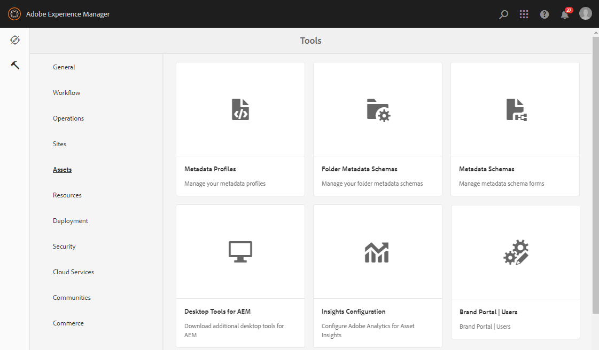

# Konfigurera resurskälla {#configure-asset-sourcing}

AEM administratörer kan konfigurera **Resurser** från den AEM författarinstansen. Administratören aktiverar konfigurationen av resurskällans funktionsflagga från **AEM webbkonsolkonfiguration** och överför listan över aktiva Brand Portal-användare i **AEM Assets**.

>[!NOTE]
>
>Innan du börjar med konfigurationen kontrollerar du att din AEM Assets-instans har konfigurerats med Varumärksportal. See, [Configure AEM Assets with Brand Portal](../using/configure-aem-assets-with-brand-portal.md).

I följande video visas hur du konfigurerar resurskälla för AEM författarinstans:

>[!VIDEO](https://video.tv.adobe.com/v/29771)

## Aktivera resurskälla {#enable-asset-sourcing}

AEM administratörer kan aktivera Resurshantering från AEM Web Console Configuration (alias Configuration Manager).

**Så här aktiverar du resurskälla:**
1. Logga in på AEM författarinstans och öppna Configuration ManagerDefault URL: http:// localhost:4502/system/console/configMgr
1. Sök med nyckelordet **Resurser** för att hitta **[!UICONTROL Asset Sourcing Feature Flag Config]**
1. Klicka **[!UICONTROL Asset Sourcing Feature Flag Config]** för att öppna konfigurationsfönstret
1. Select the **[!UICONTROL feature.flag.active.status]** check box.
1. Klicka på **[!UICONTROL Save]**.

## Överför användarlista för varumärkesportalen {#upload-bp-user-list}

AEM administratörer kan överföra användarkonfigurationsfilen för varumärkesportalen (.csv) som innehåller den aktiva användarlistan för varumärkesportalen i AEM Assets. En mapp för bidrag kan bara delas med de aktiva Brand Portal-användare som definieras i användarlistan. Administratören kan även lägga till nya användare i konfigurationsfilen och överföra den ändrade användarlistan.

>[!NOTE]
>
>CSV-filens format är detsamma som det som stöds i Admin Console för bulkanvändarimport. E-post, förnamn och efternamn är obligatoriska.

Administratören kan lägga till nya användare i AEM Admin Console. Mer information finns i [Hantera användare](brand-portal-adding-users.md) . När du har lagt till användare i Admin Console kan dessa användare läggas till i användarkonfigurationsfilen för varumärkesportalen och sedan tilldelas behörighet att komma åt mappen för bidrag.

**Så här överför du användarlistan för varumärkesportalen:**
1. Logga in på AEM författarinstansStandard-URL: http:// localhost:4502/aem/start.html
1. From **Tools**  panel, navigate to **[!UICONTROL Assets > Brand Portal Users]**

   

1. Fönstret för ladda upp medverkande på varumärkesportalen öppnas.
Bläddra från den lokala datorn och överför **konfigurationsfilen** (.csv) som innehåller listan över aktiva Brand Portal-användare.
1. Klicka på **[!UICONTROL Save]**.

   

Administratörer kan ge åtkomst till specifika användare från den här användarlistan när de konfigurerar mappen för bidrag.

Mer information finns i [Konfigurera mapp](brand-portal-contribution-folder.md)för bidrag.
