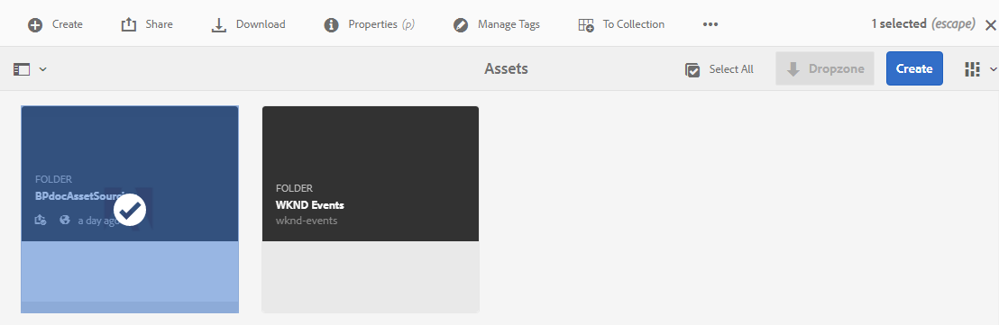
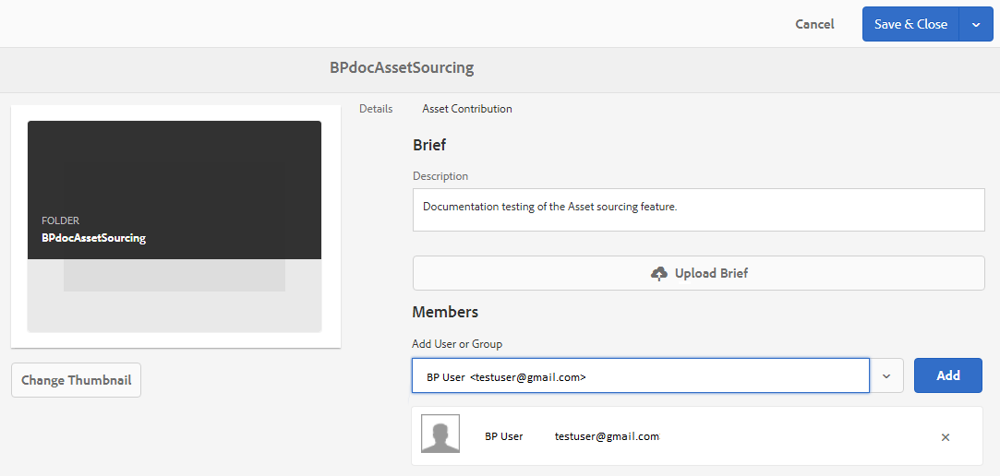

# Konfigurera egenskaper för bidragsmapp {#configure-contribution-folder-properties}

AEM-administratören utför följande åtgärder när egenskaperna för en avgiftsmapp konfigureras.

* **Lägg till beskrivning**: Ange en beskrivning av bidragsmappen på hög nivå.
* **Överför i korthet**:  Överför tillgångskravsdokument som innehåller resursrelaterad information.
* **Lägg till medverkande**: Lägg till Brand Portal-användare eller -grupper för att ge dem åtkomst till mappen för bidrag.

Resurskravet avser den information som administratörer tillhandahåller för att hjälpa medverkande (varumärkesportalanvändare) att förstå behovet och kraven av bidragsmappen. Administratören överför ett tillgångskravsdokument som innehåller en sammanfattning om vilken typ av resurser som ska läggas till i avgiftsmappen och resursrelaterad information, till exempel syfte, typ av bilder, maxstorlek osv.

Administratören kan sedan ge Brand Portal-användare/grupper åtkomst till mappen för bidrag innan den nya Contribute-mappen publiceras på varumärkesportalen.

**Så här konfigurerar du bidragsmappens egenskaper:**
1. Logga in på din AEM-författarinstansStandard-URL: http:// localhost:4502/aem/start.html
1. Navigera till **[!UICONTROL Resurser > Filer]** och leta upp mappen för bidrag.
1. Välj mapp för bidrag och klicka på **[!UICONTROL Egenskaper]** . Fönstret Mappegenskaper öppnas.
   
1. Gå till fliken **[!UICONTROL Resursbidrag]** .
1. Ange en **[!UICONTROL beskrivning]** på hög nivå av mappen för bidrag.
1. Klicka på **[!UICONTROL Överför sammanfattning]**  för att bläddra från den lokala datorn och överföra ett **tillgångskravsdokument**.
1. I **[!UICONTROL Lägg till användare eller grupp]** söker du efter och **[!UICONTROL lägger till]** profilanvändare eller grupper som du vill dela mappen för bidrag med.
Dessa Brand Portal-användare/grupper har behörighet att komma åt mappen för bidrag och överföra innehåll från gränssnittet för varumärkesportalen utan att ha tillgång till AEM-författarinstansen.
1. Click **[!UICONTROL Save]**.
   

>[!NOTE]
>
>Sökresultaten baseras på användarlistan i varumärkesportalen som konfigurerats i AEM Resurser. Se till att du har den uppdaterade användarlistan för varumärkesportalen. Se Användarlista för [Överför varumärkesportal](brand-portal-configure-asset-sourcing.md).