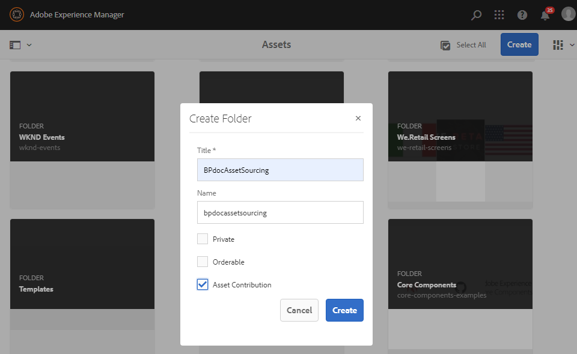
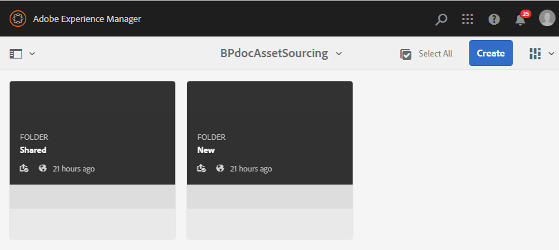

# Skapa avgiftsmapp {#create-contribution-folder}

AEM administratörer och icke-adminanvändare som har behörighet att skapa en ny mapp kan skapa en mapp för bidrag i AEM Assets.
Om du vill skapa en mapp för bidrag skapar du en ny mapp av typen Resursbidrag, som ser till att den nya mappen som skapas är öppen för att skickas in av Brand Portal-användare.  Detta utlöser automatiskt ett arbetsflöde som skapar ytterligare två undermappar, som kallas DELAD och NYTT, i bidragsmappen.

>[!NOTE]
>
>Du kan skapa flera mappar för bidrag i en mapp, men du får inte skapa en mapp för bidrag i en annan mapp för bidrag.

Så här skapar du en bidragsmapp:
1. Logga in på AEM författarinstans.

   Standardwebbadressen är http:// localhost:4502/aem/start.html.

1. Navigera till **[!UICONTROL Assets]** > **[!UICONTROL Files]**. Den visar alla befintliga mappar i AEM Assets-databasen.

1. Klicka **[!UICONTROL Create]** för att skapa en ny mapp. **[!UICONTROL Create Folder]** öppnas.

1. Ange **[!UICONTROL Title]** och **[!UICONTROL Name]** markera **[!UICONTROL Asset Contribution]** kryssrutan.
Vi rekommenderar att du använder gemener utan blanksteg för att namnge mappen.

1. Klicka på **[!UICONTROL Create]**. Du kan se bidragsmappen i AEM Assets-databasen.

   >[!NOTE]
   >
   >En icke-admin-användare kan skapa och dela en resursavgiftsmapp, men kan inte ändra eller ta bort den.

   

1. Klicka för att öppna mappen för bidrag, du kan se två undermappar **[!UICONTROL SHARED]** och **[!UICONTROL NEW]** skapas automatiskt i mappen för bidrag.

   

Du kan nu [konfigurera bidragsmappens egenskaper](brand-portal-configure-contribution-folder-properties.md).

