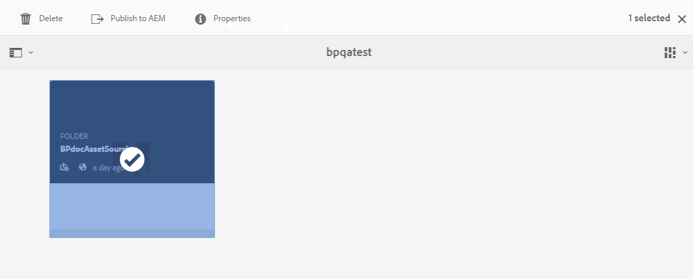
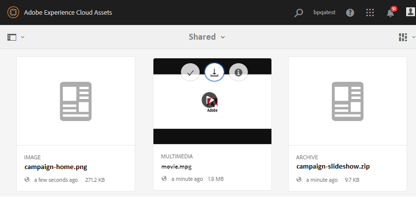

# Hämta resurskrav {#using-asset-souring-in-bp}

Brand Portal-användare får automatiskt e-post-/pulsmeddelanden varje gång en avgiftsmapp delas av den AEM användaren, så att de kan hämta det korta (resurskrav) dokumentet samt hämta basresurserna (referensinnehåll) från mappen **SHARED** för att vara säkra på att de förstår vad som krävs för mediefilen.

Användare av varumärkesportalen utför följande aktiviteter för att hämta tillgångskrav:

* **Ladda ned i korthet**: Ladda ned översikten (tillgångskravsdokument) som är bifogad till mappen för bidrag och som innehåller resursrelaterad information som typ av resurser, syfte, format som stöds, maximal storlek på mediefilen osv.
* **Hämta baslinjeresurser**: Hämta baslinjeresurser som kan användas för att förstå vilka typer av resurser som krävs. Användare av varumärkesportalen kan använda dessa resurser som referens för att skapa nya resurser som bidrag.

Kontrollpanelen för varumärkesportalen innehåller alla befintliga mappar som är tillåtna för användaren på varumärkesportalen tillsammans med den nyligen delade mappen för bidrag. I det här exemplet har Brand Portal-användaren bara åtkomst till den nyligen skapade mappen för bidrag, ingen annan befintlig mapp delas med användaren.

**Så här hämtar du resurskrav:**

1. Logga in på din Brand Portal-instans.
1. Välj mapp för bidrag från kontrollpanelen för varumärkesportalen.
1. Klicka på **[!UICONTROL Properties]** . Egenskapsfönstret öppnas med information om mappen Resursbidrag.
   
1. Klicka på **[!UICONTROL Download Brief]**  för att hämta dokumentet om resurskrav på den lokala datorn.
   
1. Gå tillbaka till kontrollpanelen för varumärkesportalen.
1. Klicka för att öppna mappen för bidrag, du kan se två undermappar -**[!UICONTROL SHARED]** och **[!UICONTROL NEW]** i mappen för bidrag. Mappen SHARED innehåller alla baslinjeresurser (referensinnehåll) som delas av administratörerna.
1. Du kan hämta mappen **[!UICONTROL SHARED]** som innehåller alla baslinjeresurser på den lokala datorn.
Du kan också öppna mappen **[!UICONTROL SHARED]** och klicka på **ikonen Hämta**  för att hämta enskilda filer/mappar.
   

Gå igenom översikten (tillgångskravsdokument) och hänvisa till bastillgångarna för att förstå tillgångskraven. Nu kan du skapa nya resurser för bidrag och överföra dem till mappen för bidrag. Se [Överför resurser till mappen för bidrag](brand-portal-upload-assets-to-contribution-folder.md).

