# Hämta resurser från varumärkesportalen {#download-assets-from-bp}

<!-- Before update in Download experience - 26th Aug 2020 comment by Vishabh.
 All users can simultaneously download multiple assets and folders accessible to them from Brand Portal. This way, approved brand assets can be securely distributed for offline use. Read on to know how to download approved assets from Brand Portal, and what to expect from the [download performance](../using/brand-portal-download-assets.md#main-pars-header).
-->

Adobe Experience Manager Assets Brand Portal förbättrar nedladdningen genom att användarna samtidigt kan hämta flera resurser och mappar som är tillgängliga för dem från Brand Portal. På så sätt kan godkända varumärkesresurser distribueras säkert för användning offline. Läs vidare för att lära dig hur du hämtar godkända resurser från Brand Portal och vad du kan förvänta dig av [hämtningsprestanda](../using/brand-portal-download-assets.md#expected-download-performance).

>[!NOTE]
>
>I Brand Portal 2020.10.0 (och senare) är **[!UICONTROL Fast Download]** inställningen aktiverad som standard, vilket innebär att IBM Aspera Connect används för att hämta resurserna snabbare. Installera IBM Aspera Connect 3.9.9 i webbläsartillägget innan du hämtar materialet från Brand Portal.
>
>Om du inte vill använda IBM Aspera Connect och fortsätta med den normala hämtningsprocessen kontaktar du administratören för varumärkesportalen och stänger av **[!UICONTROL Fast Download]** inställningen.

## Konfigurera hämtning av resurser {#configure-download}

Administratörer för varumärkesportalen kan konfigurera resurshämtningsinställningar och behörigheter för dem som använder varumärkesportalen så att de kan komma åt och hämta resursåtergivningar från gränssnittet för varumärkesportalen.

Åtkomst till och hämtning av återgivningar från varumärkesportalen definieras av följande konfigurationer:

* Aktivera hämtningsinställningar
* Konfigurera hämtningsbehörigheter

### Aktivera hämtningsinställningar {#enable-download-settings}

Administratörerna kan aktivera resursen **[!UICONTROL Download Settings]** för att definiera uppsättningen renderingar som är tillgängliga för Brand Portal-användare för hämtning.

De tillgängliga inställningarna är:

* **[!UICONTROL Fast Download]**

   Den snabbar upp hämtningen av materialet med hjälp av IBM Aspera Connect. Som standard är inställningen aktiverad **[!UICONTROL Fast Download]** i **[!UICONTROL Download Settings]**.

   Mer information finns i [guiden för att snabba upp hämtningar från varumärkesportalen](../using/accelerated-download.md).

* **[!UICONTROL Custom Renditions]**

   Aktiverar hämtning av anpassade och (eller) dynamiska återgivningar av resurserna.

   Alla resursåtergivningar som inte är den ursprungliga resursen och systemgenererade återgivningar kallas anpassade återgivningar. Den innehåller både statiska och dynamiska renderingar som är tillgängliga för resursen. Alla användare kan skapa en anpassad statisk återgivning i AEM Assets, medan bara AEM kan skapa anpassade dynamiska återgivningar. Mer information finns i [Använda bildförinställningar eller dynamiska återgivningar](../using/brand-portal-image-presets.md).

* **[!UICONTROL System Renditions]**

   Aktiverar hämtning av systemgenererade återgivningar av resurserna.

   Det här är miniatyrbilder som skapas automatiskt i AEM Assets baserat på arbetsflödet&quot;DAM-uppdateringsresurs&quot;.

Logga in som administratör på din varumärkesportal och navigera till **[!UICONTROL Tools]** > **[!UICONTROL Download]**.

Administratörerna kan aktivera valfri kombination av inställningar så att Brand Portal-användarna kan komma åt och hämta renderingar.

>[!NOTE]
>
>Endast administratörer kan hämta utgångna resurser. Mer information om utgångna resurser finns i [Hantera digitala rättigheter för resurser](../using/manage-digital-rights-of-assets.md).

### Konfigurera hämtningsbehörigheter {#configure-download-permissions}

Förutom **[!UICONTROL Download Settings]** kan administratören för varumärkesportalen ytterligare konfigurera behörigheter för olika användargrupper så att de kan visa och (eller) hämta originalresurserna och deras återgivningar.

Logga in som administratör på din varumärkesportal och navigera till **[!UICONTROL Tools]** > **[!UICONTROL Users]**. På **[!UICONTROL User Roles]** sidan går du till **[!UICONTROL Groups]** fliken för att konfigurera vyn och (eller) hämtningsbehörighet för användargrupperna.

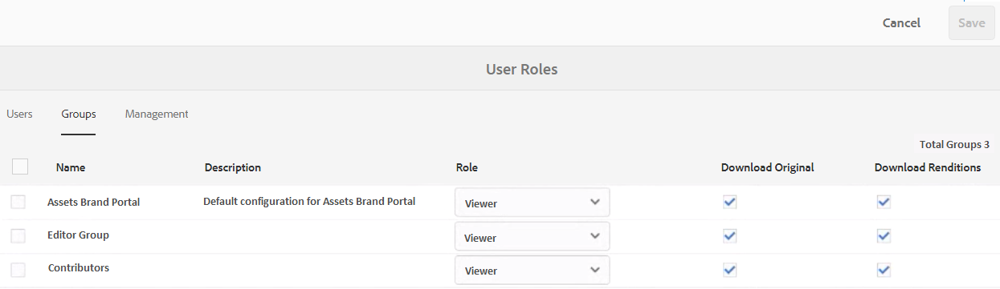

>[!NOTE]
>
>Om en användare läggs till i flera grupper och om en av grupperna har begränsningar, gäller begränsningarna användaren.

Beroende på konfigurationen förblir hämtningsarbetsflödet konstant för fristående resurser, flera resurser, mappar som innehåller resurser, licensierade eller olicensierade resurser och för att hämta resurser med hjälp av delningslänken.

I följande matris definieras om en användare har åtkomst till återgivningarna beroende på [hämtningskonfigurationerna](#configure-download):

| **Hämtningsinställningar: Anpassade återgivningar** | **Hämtningsinställningar: Systemåtergivningar** | **Behörigheter för användargrupp: Hämta original** | **Behörigheter för användargrupp: Hämta återgivningar** | **Resultat** |
|---|---|---|---|---|
| PÅ | PÅ | PÅ | PÅ | Visa och hämta alla återgivningar |
| PÅ | PÅ | AV | AV | Visa ursprunglig resurs |
| AV | AV | PÅ | PÅ | Visa och hämta originalresurs |
| PÅ | AV | PÅ | PÅ | Visa och hämta ursprungliga resurser och anpassade återgivningar |
| AV | PÅ | PÅ | PÅ | Visa och hämta ursprungliga resurs- och systemåtergivningar |
| PÅ | AV | AV | AV | Visa ursprunglig resurs |
| AV | PÅ | AV | AV | Visa ursprunglig resurs |
| AV | AV | AV | PÅ | Visa ursprunglig resurs |
| AV | AV | PÅ | AV | Visa och hämta originalresurs |
| AV | AV | AV | AV | Visa ursprunglig resurs |

## Hämta resurser {#download-assets}

Användare av varumärkesportalen kan hämta flera resurser, mappar med resurser och samlingar från gränssnittet för varumärkesportalen.

>[!NOTE]
>
>Kontakta administratören för varumärkesportalen om du inte har behörighet att komma åt eller hämta återgivningarna.

Om användaren har åtkomst till återgivningar får användaren tillgång till den förbättrade **[!UICONTROL Download]** dialogrutan med följande funktioner:
* Visa alla tillgängliga återgivningar av alla resurser i hämtningslistan.
* Undanta återgivningar av resurser som inte behövs för hämtning.
* Använd samma uppsättning renderingar för alla liknande resurstyper med ett klick.
* Använd olika uppsättningar återgivningar för olika resurstyper.
* Skapa en separat mapp för varje resursåtergivning.
* Hämta markerade resurser och deras återgivningar.

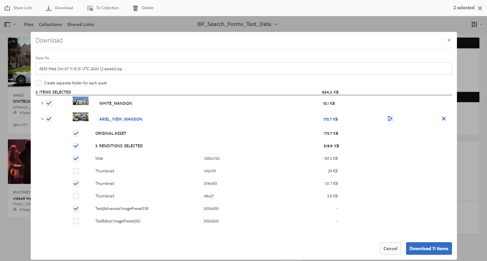

>[!NOTE]
>
>Dialogrutan visas bara om resurserna har valts för hämtning och **[!UICONTROL Download]** eller **[!UICONTROL Custom Renditions]** är aktiverat i **[!UICONTROL System Renditions]** **[!UICONTROL Download Settings]**.

### Steg för att hämta resurser {#bulk-download}

Så här hämtar du resurser eller mappar som innehåller resurser från gränssnittet för varumärkesportalen:

1. Logga in på din klient för varumärkesportalen. Som standard öppnas **[!UICONTROL Files]** vyn som innehåller alla publicerade resurser och mappar.

   Gör något av följande:

   * Markera de resurser eller mappar som du vill hämta. Klicka på **[!UICONTROL Download]** ikonen i verktygsfältet överst.

      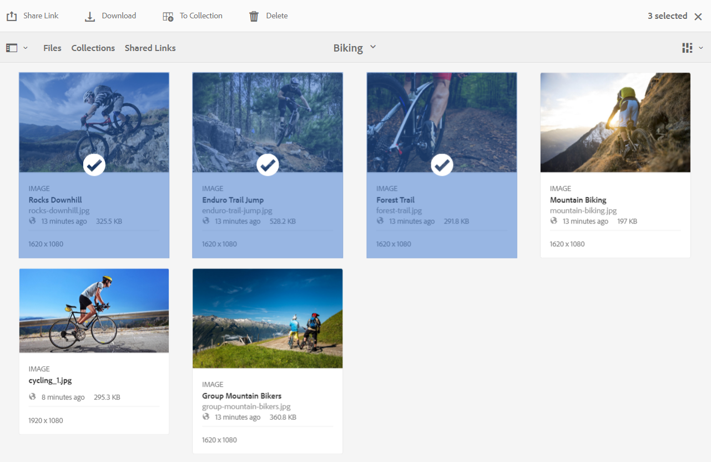

   * Om du vill hämta särskilda återgivningar av en resurs håller du pekaren över resursen och klickar på **[!UICONTROL Download]** ikonen som finns i miniatyrbilderna för snabbåtgärden.

      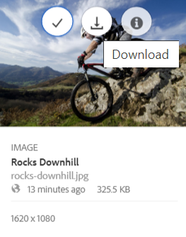

      >[!NOTE]
      >
      >Om du hämtar materialet för första gången och inte har IBM Aspera Connect installerat i webbläsaren uppmanas du att installera Aspera Download Accelerator.

      >[!NOTE]
      >
      >Om de mediefiler du hämtar också innehåller licensierade mediefiler omdirigeras du till **[!UICONTROL Copyright Management]** sidan. På den här sidan markerar du resurserna, klickar **[!UICONTROL Agree]** och sedan på **[!UICONTROL Download]**. Om du inte håller med hämtas inte licensierade mediefiler.
      > 
      >Licensskyddade mediefiler har [licensavtal som är kopplade](https://helpx.adobe.com/experience-manager/6-5/assets/using/drm.html#DigitalRightsManagementinAssets) till dem, vilket görs genom att objektets [metadataegenskap](https://helpx.adobe.com/experience-manager/6-5/assets/using/drm.html#DigitalRightsManagementinAssets) ställs in i Experience Manager Assets.

      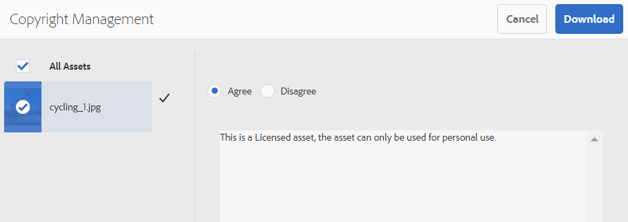

1. Dialogrutan **[!UICONTROL Download]** med alla markerade resurser öppnas.

   Klicka på en resurs för att visa tillgängliga återgivningar och markera kryssrutorna för de återgivningar som du vill hämta.

   Du kan välja eller exkludera återgivningar manuellt för enskilda resurser eller klicka på ikonen **Använd** för att välja samma uppsättning återgivningar som ska hämtas för liknande resurstyper (alla bildfiler i det här exemplet). I **[!UICONTROL Apply All]** dialogrutan klickar du på **[!UICONTROL Done]** för att tillämpa regeln på alla liknande resurser.

   

   Du kan också ta bort en resurs från hämtningslistan (om det behövs) genom att klicka på ikonen **Ta bort** .

   

   Markera kryssrutan om du vill bevara mapphierarkin för varumärkesportalen när du hämtar resurser **[!UICONTROL Create separate folder for each asset]** . Som standard ignoreras mapphierarkin för varumärkesportalen och alla resurser hämtas till en zip-mapp.

   Nedladdningsknappen visar antalet markerade objekt. När du är klar med reglerna klickar du på **[!UICONTROL Download items]**.

   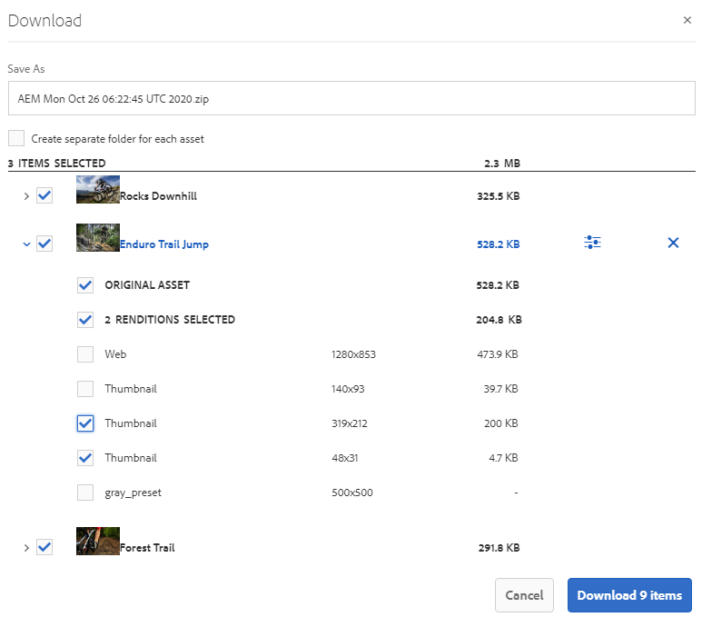

1. Som standard är **[!UICONTROL Fast Download]** inställningen aktiverad i **[!UICONTROL Download Settings]**. Därför visas en bekräftelseruta som tillåter snabb hämtning med IBM Aspera Connect.

   Klicka på **[!UICONTROL Fast Download]** om du vill fortsätta använda **[!UICONTROL Allow]**. Alla valda återgivningar laddas ned i en zip-mapp med hjälp av IBM Aspera Connect.

   Om du inte vill använda IBM Aspera Connect klickar du på **[!UICONTROL Deny]**. Om **[!UICONTROL Fast Download]** nekas eller misslyckas fyller systemet i ett felmeddelande. Klicka på **[!UICONTROL Normal Download]** knappen för att fortsätta hämta resurserna. De valda återgivningarna laddas ned i en zip-mapp utan att använda IBM Aspera Connect.

>[!NOTE]
>
>Om **[!UICONTROL Fast Download]** inställningen är inaktiverad av administratören hämtas de valda återgivningarna direkt till en zip-mapp utan att använda IBM Aspera Connect.

>[!NOTE]
>
>Om fler än 20 resurser har valts för hämtning hoppas dialogrutan över och alla återgivningar som är tillgängliga för användaren, förutom de dynamiska återgivningarna, hämtas direkt till en zip-mapp. **[!UICONTROL Download]**
>
>Samma beteende används när mappar som innehåller resurser och samlingar hämtas. De tillgängliga återgivningarna, exklusive de dynamiska återgivningarna, hämtas direkt till en zip-mapp.

>[!NOTE]
>
>Brand Portal har stöd för konfiguration av dynamiska media i både läget Hybrid och Scene 7.
>
>(*Om AEM författarinstans körs i **läget***Dynamic Media Hybrid)
>
>Om du vill förhandsgranska eller hämta dynamiska återgivningar av en resurs kontrollerar du att det dynamiska mediet är aktiverat och att resursens Pyramid-tiff-återgivning finns på den AEM Assets-författarinstans där resurserna har publicerats. När en resurs publiceras från AEM till varumärkesportalen publiceras även dess Pyramid-tiff-rendering.

Om administratören inte har [gett dig åtkomst till de ursprungliga återgivningarna](../using/brand-portal-adding-users.md#main-pars-procedure-202029708)hämtas inte de ursprungliga återgivningarna för de valda resurserna.

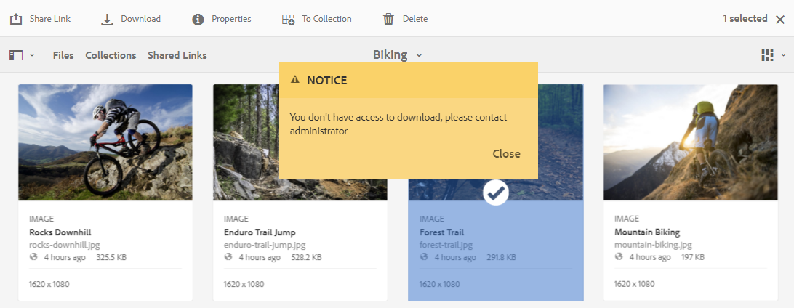

<!-- This issue has been resolved, check with engineering.
>[!NOTE]
>
>Once you have downloaded the asset renditions, the **[!UICONTROL Download]** button is disabled to avoid creating duplicate copies of the renditions. To download more (missing or another copy of renditions), refresh the browser to re-enable the download button.
-->

### Hämta resurser från sidan med resursinformation {#download-assets-from-asset-details-page}

Förutom hämtningsarbetsflödet finns det en annan metod för att hämta återgivningar för enskilda resurser direkt från sidan med resursinformation.

Användarna kan förhandsgranska olika återgivningar, välja specifika återgivningar och hämta dem direkt från **[!UICONTROL Renditions]** panelen på sidan med resursinformation utan att behöva öppna **[!UICONTROL Download]** dialogrutan.

Så här hämtar du resursåtergivningar från sidan med resursinformation:

1. Logga in på din innehavare av varumärkesportalen och klicka på resursen för att öppna sidan med resursinformation.
1. Klicka på övertäckningsikonen till vänster och klicka sedan på **[!UICONTROL Renditions]**.

   

1. På **[!UICONTROL Renditions]** panelen visas alla tillgängliga resursåtergivningar baserat på [hämtningskonfigurationerna](#configure-download).

   Välj de renderingar du vill hämta och klicka på **[!UICONTROL Download items]**.

   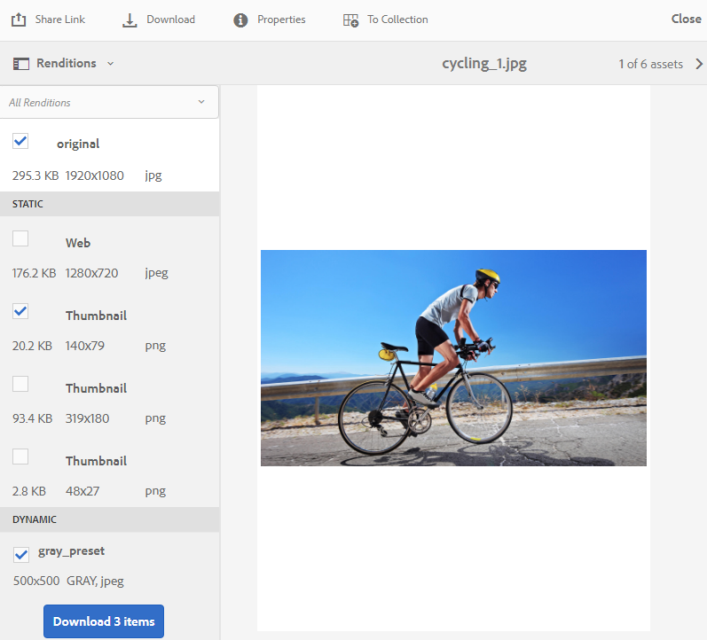

1. Som standard är **[!UICONTROL Fast Download]** inställningen aktiverad i **[!UICONTROL Download Settings]**. Därför visas en bekräftelseruta som tillåter snabb hämtning med IBM Aspera Connect.

   Klicka på **[!UICONTROL Fast Download]** om du vill fortsätta använda **[!UICONTROL Allow]**. Alla valda återgivningar laddas ned i en zip-mapp med hjälp av IBM Aspera Connect.

   Om du nekar att använda **[!UICONTROL Fast Download]** visas ett felmeddelande. Klicka på **[!UICONTROL Normal Download]** knappen för att fortsätta nedladdningen. De valda återgivningarna laddas ned i en zip-mapp utan att använda IBM Aspera Connect.

>[!NOTE]
>
>Om **[!UICONTROL Fast Download]** inställningen är inaktiverad av administratören hämtas de valda återgivningarna direkt till en zip-mapp utan att använda IBM Aspera Connect.

>[!NOTE]
>
>Resurser som hämtas individuellt visas i resurshämtningsrapporten. Om en mapp som innehåller resurser däremot hämtas visas inte mappen och resurserna i hämtningsrapporten för resurser.

<!--
>[!NOTE]
>
>Assets that are individually downloaded are visible in the assets download report. However, if a folder containing assets is downloaded, the folder and assets are not displayed in the assets download report.
-->

<!-- Backup of content before updating the new feature docs.
## Configure asset download {#configure-download}

The download configuration allows the Brand Portal administrators to define the set of renditions available to the Brand Portal users for downloading the assets. The administrator can configure the asset **[!UICONTROL Download]** settings from the Brand Portal interface. 

The available configurations are:

* **[!UICONTROL Fast Download]** 

  Enables high-speed download of the assets. To know more, see [guide to accelerate downloads from Brand Portal](../using/accelerated-download.md).

* **[!UICONTROL Custom Renditions]** 
  
  Download custom and (or) dynamic renditions of the assets. 
  All the asset renditions other than the original asset and system-generated renditions are called as custom renditions. It includes static as well as dynamic renditions available for the asset. Any user can create a custom static rendition in AEM Assets, whereas, only the AEM administrator can create custom dynamic renditions. To know more, see [how to apply image presets or dynamic renditions](../using/brand-portal-image-presets.md)

* **[!UICONTROL System Renditions]** 

  Download system-generated renditions of the assets. These are the thumbnails which are automatically generated in AEM Assets based on the "DAM update asset" workflow. 

Log in to your Brand Portal tenant as an administrator and navigate to **[!UICONTROL Tools]** > **[!UICONTROL Download]**. By default, the **[!UICONTROL Fast Download]** configuration is enabled in the **[!UICONTROL Download Settings]**. 

The administrators can enable any combination to configure the asset download process.

Based on the configuration, the download workflow remains constant for stand-alone assets, multiple assets, folders containing assets, licensed or unlicensed assets, and downloading assets using share link. 

* If both **[!UICONTROL Custom Renditions]** and **[!UICONTROL System Renditions]** configurations are turned-off, the original renditions of the assets are downloaded without any additional dialog being presented to the users.    

* If any of the **[!UICONTROL Custom Renditions]** or **[!UICONTROL System Renditions]** configuration is enabled, an additional **[!UICONTROL Download]** dialog box appears wherein you can choose whether to download the original asset along with its renditions, or download only specific renditions. 

>[!NOTE]
>
>Only the administrators can download the expired assets. For more information about expired assets, see [manage digital rights of assets](../using/manage-digital-rights-of-assets.md).

## Steps to download assets {#steps-to-download-assets}

Following are the steps to download assets or folders containing assets from Brand Portal:

1. From the Brand Portal interface, do one of the following:

   * Select the folders or assets you want to download. From the toolbar at the top, click the **[!UICONTROL Download]** icon.

     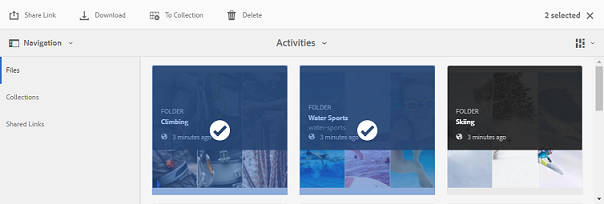

   * To download a specific asset or folder, hover the pointer over the asset or folder and click the **[!UICONTROL Download]** icon available in the quick action thumbnails.

     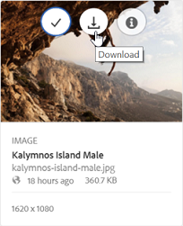

     >[!NOTE]
     >
     >If you are downloading the assets for the first time and do not have IBM Aspera Connect installed in your browser, it will prompt you to install the Aspera download accelerator. 

     >[!NOTE]
     >
     >If the assets you are downloading also include licensed assets, you are redirected to the **[!UICONTROL Copyright Management]** page. In this page, select the assets, click **[!UICONTROL Agree]**, and then click **[!UICONTROL Download]**. If you choose to disagree, licensed assets are not downloaded. 
     > 
     >License-protected assets have [license agreement attached](https://helpx.adobe.com/experience-manager/6-5/assets/using/drm.html#DigitalRightsManagementinAssets) to them, which is done by setting asset's [metadata property](https://helpx.adobe.com/experience-manager/6-5/assets/using/drm.html#DigitalRightsManagementinAssets) in Experience Manager Assets.

     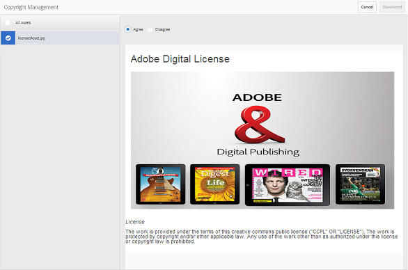

     
     >[!NOTE]
     >
     >Ensure to select all the required asset renditions while downloading them from the asset details page, and click **[!UICONTROL Download]**. The selected renditions are downloaded to your local machine.
     > 
     >Once you download, the **[!UICONTROL Download]** button is disabled to avoid creating duplicate copies of the downloaded renditions. To download more (missing or another copy of renditions), refresh the browser to re-enable the download button.

     If any of the **[!UICONTROL Custom Renditions]** or **[!UICONTROL System Renditions]** configuration is enabled in the **[!UICONTROL Download Settings]**, the **[!UICONTROL Download]** dialog appears with the **[!UICONTROL Asset(s)]** check box selected by default. If the **[!UICONTROL Fast Download]** configuration is enabled, the **[!UICONTROL Enable download acceleration]** check box is selected by default.

     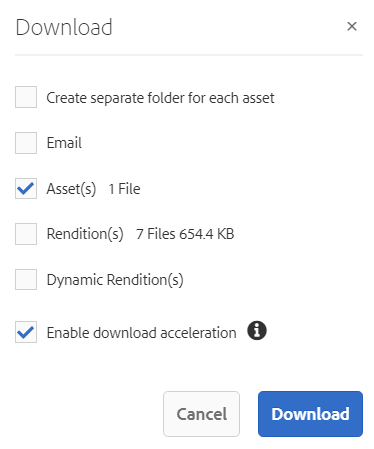

     >[!NOTE]
     >
     >If the downloading assets are image files, and you select only the **[!UICONTROL Asset(s)]** check box in the **[!UICONTROL Download]** dialog but are not [authorized by the administrator to have access to the original renditions of image files](../using/brand-portal-adding-users.md#main-pars-procedure-202029708) then no image files are downloaded and a notification appears, stating that you have been restricted by the administrator to access original renditions.

     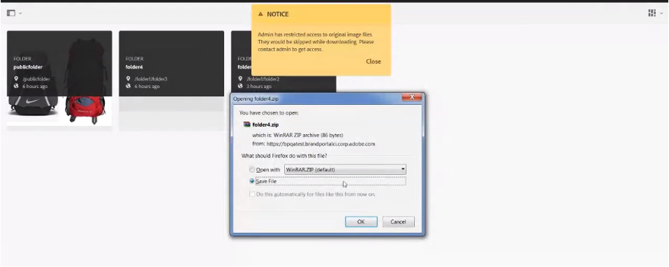

1. To download the renditions in addition to the original assets, select the **[!UICONTROL Rendition(s)]** check box. However, if you want to download the system-generated renditions along with the custom renditions, clear the **[!UICONTROL Exclude System Renditions]** check box.

   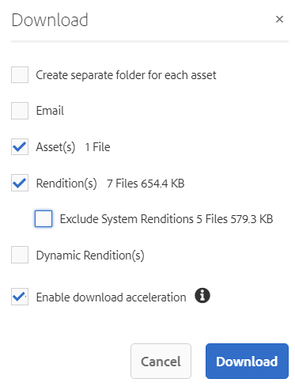

   * To download only the renditions, clear the **[!UICONTROL Asset(s)]** check box.

     >[!NOTE]
     >
     >By default, only the assets are downloaded. However, original renditions of image files are not downloaded if you are not [authorized by the administrator to have access to the original renditions of image files](../using/brand-portal-adding-users.md#main-pars-procedure-202029708).

    * To share the selected assets with other users through a link, select the **[!UICONTROL Email]** check box. An email notification is sent to the users with the download link. To know how to download assets from shared links, see [downloading assets from shared links](../using/brand-portal-link-share.md#main-pars-header-1703469193).  

      

      >[!NOTE]
      >
      >The download link on email notification expires after 45 days.
      >
      >The administrators can customize email messages, that is, logo, description, and footer, using the [Branding](../using/brand-portal-branding.md) feature.

    * You can select a predefined image preset or create a custom dynamic rendition from the **[!UICONTROL Download]** dialog box. 

      To apply a [custom image preset to the asset and its renditions](../using/brand-portal-image-presets.md#applyimagepresetswhendownloadingimages), select the **[!UICONTROL Dynamic Rendition(s)]** check box. Specify the image preset properties (such as size, format, color space, resolution, and image modifier) to apply the custom image preset while downloading the asset and its renditions. To download only the dynamic renditions, clear the **[!UICONTROL Asset(s)]** check box.

      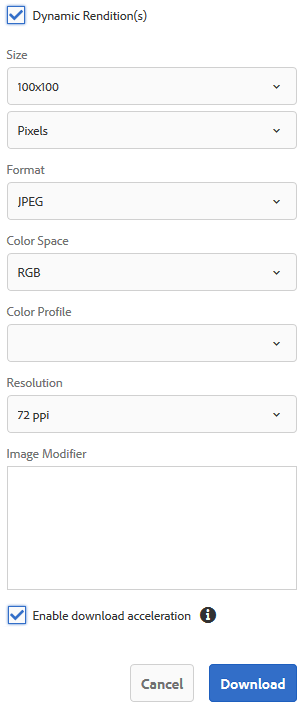

      >[!NOTE]
      >
      >Brand Portal supports configuring Dynamic Media in both - Hybird and Scene 7 mode. 
      >
      >(*If AEM author instance is running on **Dynamic Media Hybrid mode***)
      >
      >To preview or download dynamic renditions of an asset, ensure that the dynamic media is enabled and the asset's Pyramid tiff rendition exists at the AEM Assets author instance from where the assets have been published. When an asset is published to Brand Portal, its Pyramid tiff rendition is also published.
      
  
    * To preserve the Brand Portal folder hierarchy while downloading assets, select the **[!UICONTROL Create separate folder for each asset]** check box. By default, the Brand Portal folder hierarchy is ignored and all the assets are downloaded in one folder in your local system.

1. Click **[!UICONTROL Download]**.

   The assets (and renditions if selected) are downloaded as a zip file to your local folder. However, no zip file is created if a single asset is downloaded without any of the renditions. 

   If you are not [authorized by the administrator to have access to the original renditions](../using/brand-portal-adding-users.md#main-pars-procedure-202029708), the original renditions of the selected assets are not downloaded. 

   >[!NOTE]
   >
   >Assets that are individually downloaded are visible in the assets download report. However, if a folder containing assets is downloaded, the folder and assets are not displayed in the assets download report.
-->

## Hämtningsprestanda förväntades {#expected-download-performance}

Filhämtningen kan variera för användare på olika platser på klienten, beroende på faktorer som lokal Internetanslutning och serverfördröjning. Den förväntade hämtningsprestandan för 2-GB-filer som observeras på olika klientplatser är följande, med Brand Portal-servern på Oregon i USA:

| Klientplats | Latens mellan klient och server | Förväntad hämtningshastighet | Tidsåtgång för att hämta en 2 GB-fil |
|-------------------------|-----------------------------------|-------------------------|------------------------------------|
| Västra USA (N) Kalifornien) | 18 millisekunder | 7,68 MB/s | 4 minuter |
| Västra USA (Oregon) | 42 millisekunder | 3,84 MB/s | 9 minuter |
| Östra USA (N) Virginia) | 85 millisekunder | 1,61 MB/s | 21 minuter |
| APAC (Tokyo) | 124 millisekunder | 1,13 MB/s | 30 minuter |
| Noida | 275 millisekunder | 0,5 MB/s | 68 minuter |
| Sydney | 175 millisekunder | 0,49 MB/s | 69 minuter |
| London | 179 millisekunder | 0,32 MB/s | 106 minuter |
| Singapore | 196 millisekunder | 0,5 MB/s | 68 minuter |

>[!NOTE]
>
>Citerade data observeras under testförhållanden, som kan variera för användare på olika platser där olika fördröjningar och bandbredd kan förekomma.

