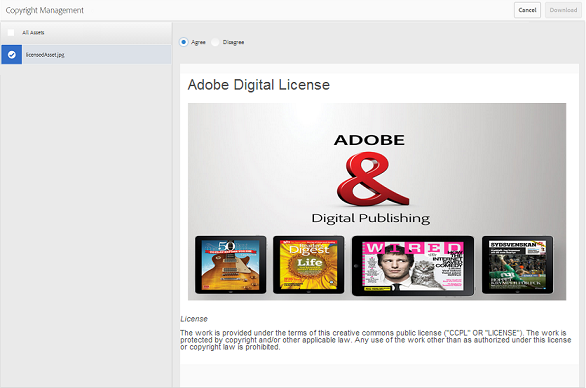

# Hämta resurser {#download-assets}

Alla användare kan samtidigt hämta flera resurser och mappar som är tillgängliga för dem från varumärkesportalen. På så sätt kan godkända varumärkesresurser distribueras säkert för användning offline. Läs vidare för att lära dig hur du hämtar godkända resurser från Brand Portal och vad du kan förvänta dig av [hämtningsprestanda](../using/brand-portal-download-users.md#main-pars-header).

>[!NOTE]
>
>Endast administratörer kan hämta utgångna resurser. Mer information om utgångna resurser finns i [Hantera digitala rättigheter för resurser](../using/manage-digital-rights-of-assets.md).

## Steg för att hämta resurser {#steps-to-download-assets}

Så här hämtar du resurser eller mappar som innehåller resurser för varumärkesportalen:

1. I gränssnittet för varumärkesportalen gör du något av följande:

   * Markera de mappar eller resurser som du vill hämta. Klicka på **[!UICONTROL Download]** ikonen i verktygsfältet överst.

   

   * Om du vill hämta en enskild mapp eller en resurs håller du pekaren över mappen eller resursen. Klicka på **[!UICONTROL Download]** ikonen bland de tillgängliga miniatyrbilderna för snabbåtgärder.

   

   >[!NOTE]
   >
   >Om de mediefiler du hämtar också innehåller licensierade mediefiler omdirigeras du till **[!UICONTROL Copyright Management]** sidan. På den här sidan markerar du resurserna, klickar **[!UICONTROL Agree]** och sedan på **[!UICONTROL Download]**. Om du inte håller med hämtas inte licensierade mediefiler.\
   >Licensskyddade mediefiler har [licensavtal som är kopplade](https://helpx.adobe.com/experience-manager/6-5/assets/using/drm.html#DigitalRightsManagementinAssets) till dem, vilket görs genom att ställa in objektets [metadataegenskap](https://helpx.adobe.com/experience-manager/6-5/assets/using/drm.html#DigitalRightsManagementinAssets) i AEM Assets.

   

   Dialogrutan **[!UICONTROL Download]** visas med **[!UICONTROL Asset(s)]** alternativet markerat som standard.

   

   >[!NOTE]
   >
   >Om de resurser som du hämtar är bildfiler, och du bara väljer alternativet **[!UICONTROL Asset(s)]** i dialogrutan Hämta, men inte har [behörighet av administratören att ha tillgång till de ursprungliga återgivningarna av bildfiler](../using/brand-portal-adding-users.md#main-pars-procedure-202029708) , hämtas inga bildfiler och ett meddelande visas om att administratören har begränsat åtkomsten till de ursprungliga återgivningarna.

   

1. Om du vill hämta återgivningar av resurser förutom resurserna väljer du **[!UICONTROL Rendition(s)]**. Om du vill tillåta att automatiskt genererade återgivningar hämtas tillsammans med anpassade återgivningar, avmarkerar du **[!UICONTROL Exclude Auto Generated Renditions]** det som är markerat som standard.

   

   Om du bara vill hämta renderingarna avmarkerar du **[!UICONTROL Asset(s)]**.

   >[!NOTE]
   >
   >Som standard hämtas bara resurserna. Originalåtergivningar av bildfiler hämtas dock inte om du inte har [behörighet av administratören att ha tillgång till de ursprungliga återgivningarna av bildfiler](../using/brand-portal-adding-users.md#main-pars-procedure-202029708).

   * Om du vill snabba upp hämtningen av resursfiler från varumärkesportalen väljer du **[!UICONTROL Enable download acceleration]** alternativet och [följer guiden](../using/accelerated-download.md#main-pars-header-405749062). Om du vill veta mer om snabbare nedladdning av resurser kan du läsa [guiden för att snabba upp nedladdningarna från Brand Portal](../using/accelerated-download.md).

   * Om du vill använda en [anpassad bildförinställning på resursen och dess återgivningar](../using/brand-portal-image-presets.md#applyimagepresetswhendownloadingimages)väljer du **[!UICONTROL Dynamic Rendition(s)]**. Ange anpassade förinställda bildegenskaper (storlek, format, färgrymd, upplösning och bildmodifiering) för att använda den anpassade bildförinställningen när resursen och dess återgivningar hämtas. Om du bara vill hämta de dynamiska återgivningarna avmarkerar du **[!UICONTROL Asset(s)]**.

   

   >[!NOTE]
   >
   >Om du vill förhandsgranska (eller hämta) dynamiska återgivningar av en resurs kontrollerar du att det dynamiska mediet är aktiverat och att resursens Pyramid-återgivning finns i AEM-författarinstansen, där resurserna har publicerats. När en resurs publiceras på varumärkesportalen publiceras även dess Pyramid-återgivning. Det finns inget sätt att generera Pyramids tiff-rendering från Brand Portal.

   * Om du vill bevara mapphierarkin för varumärkesportalen när du hämtar resurser väljer du **[!UICONTROL Create separate folder for each asset]**. Som standard ignoreras mapphierarkin för varumärkesportalen och alla resurser hämtas i en mapp på det lokala systemet.

   * Om du vill skicka ett e-postmeddelande till användare med en länk för att hämta resurserna väljer du **[!UICONTROL Email]**.

   

   >[!NOTE]
   >
   >Hämtningslänken i e-postmeddelanden upphör efter 45 dagar.
   >
   >Administratörer kan anpassa e-postmeddelanden, d.v.s. logotyp, beskrivning och sidfot, med hjälp av funktionen [Varumärke](../using/brand-portal-branding.md) .

1. Klicka på **[!UICONTROL Download]**.

   Resurserna (och återgivningarna om de är markerade) hämtas som en ZIP-fil till din lokala mapp. Ingen zip-fil skapas emellertid om en enskild resurs hämtas utan någon av renderingarna, vilket ger snabb hämtning.

   De ursprungliga återgivningarna av de markerade resurserna hämtas inte om du inte har [behörighet av administratören att ha åtkomst till de ursprungliga återgivningarna](../using/brand-portal-adding-users.md#main-pars-procedure-202029708).

   >[!NOTE]
   >
   >Resurser som har valts individuellt och hämtats visas i den hämtade rapporten. Om en mapp som innehåller resurser däremot hämtas visas varken mappen eller resurserna i den hämtade rapporten.

   Om du vill veta hur du hämtar resurser från delade länkar kan du läsa [ned resurser från delade länkar](../using/brand-portal-link-share.md#main-pars-header-1703469193).

## Hämtningsprestanda förväntades {#expected-download-performance}

Filhämtningen kan variera för användare på olika platser på klienten, beroende på faktorer som lokal Internetanslutning och serverfördröjning. Den förväntade hämtningsprestandan för 2 GB-filer som observeras på olika klientplatser är följande, med Brand Portal-servern på Oregon i USA:

| Klientplats | Latens mellan klient och server | Förväntad hämtningshastighet | Tidsåtgång för nedladdning av en 2 GB-fil |
|-------------------------|-----------------------------------|-------------------------|------------------------------------|
| Västra USA (N) Kalifornien) | 18 millisekunder | 7,68 MB/s | 4 minuter |
| Västra USA (Oregon) | 42 millisekunder | 3,84 MB/s | 9 minuter |
| Östra USA (N) Virginia) | 85 millisekunder | 1,61 MB/s | 21 minuter |
| APAC (Tokyo) | 124 millisekunder | 1,13 MB/s | 30 minuter |
| Noida | 275 millisekunder | 0,5 MB/s | 68 minuter |
| Sydney | 175 millisekunder | 0,49 MB/s | 69 minuter |
| London | 179 millisekunder | 0,32 MB/s | 106 minuter |
| Singapore | 196 millisekunder | 0,5 MB/s | 68 minuter |

**Obs**: Citerade data observeras under testförhållanden, som kan variera för användare på olika platser där olika fördröjningar och bandbredd kan förekomma.
