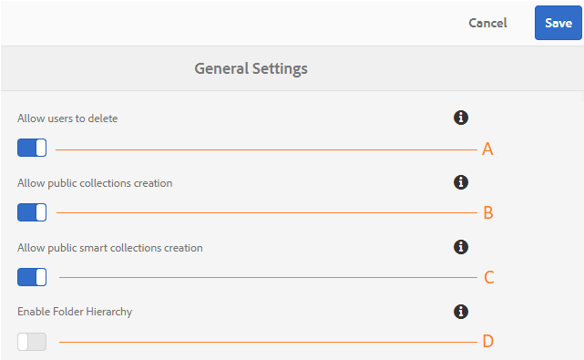

# Administrera allmänna klientkonfigurationer {#administer-general-tenant-configurations}

Med AEM Assets Brand Portal kan organisationer konfigurera följande funktioner för specifika innehavare:

* Borttagning av resurser av administratörer
* Skapande av offentlig samling av icke-adminanvändare
* Skapande av offentlig smart samling av icke-adminanvändare
* Överordnad hierarki för delade mappar som är synliga för användare som inte är administratörer

Dessa konfigurationer har tillhandahållits som **[!UICONTROL General Settings]** konfigurationer på panelen Administrationsverktyg.

**En** konfiguration som gör att administratörer kan ta bort resurser från varumärkesportalen. (Standard är aktiverat)

**B** Configuration som tillåter att icke-adminanvändare skapar offentliga samlingar. (Standard är aktiverat)

**C** Configuration som tillåter att icke-admin-användare skapar publika smarta samlingar. (Standard är aktiverat)

**D** Configuration för att visa mapphierarkin (från roten) för delade mappar till icke-adminanvändare (redigerare, visningsprogram, gästanvändare). (Standard är inaktiverat)

## Aktivera/inaktivera allmänna konfigurationer {#enable-disable-general-configurations}

Så här aktiverar/inaktiverar du dessa konfigurationer:

1. Logga in med administratörsbehörighet.
1. Välj AEM logotyp för att öppna administrationsverktygen i verktygsfältet högst upp.
1. Öppna **[!UICONTROL General]** sidan genom **[!UICONTROL General Settings]** att markera på panelen Administrationsverktyg.
1. Använd respektive växlingsknapp för att aktivera/inaktivera någon av de allmänna konfigurationerna.
1. **[!UICONTROL Save]** ändringarna.
1. Logga ut för att ändringarna ska börja gälla.

## Tillåt administratörsanvändare att ta bort resurser från varumärkesportalen {#allow-admin-users-to-delete-assets-from-brand-portal}

**[!UICONTROL Allow users to delete]** kan organisationer tillåta (eller begränsa) användare med administratörsbehörighet att ta bort resurser och mappar från varumärkesportalen.

## Tillåt att offentliga samlingar skapas av icke-administratörer {#allow-public-collections-creation-by-non-admins}

[[!UICONTROL Allow public collections creation]](../using/brand-portal-share-collection.md#main-pars-text-1915052376) konfigurationkontrollerar om icke-administratörer kan skapa offentliga samlingar på varumärkesportalen. Konfigurationen är aktiverad som standard. Genom att inaktivera konfigurationsorganisationerna kan de förhindra att det finns många offentliga samlingar på portalen så att systemutrymmet kan sparas.

## Tillåt att icke-administratörer skapar publika smarta samlingar {#allow-public-smart-collections-creation-by-non-admins}

[[!UICONTROL Allow public smart collections creation]](../using/brand-portal-searching.md#main-pars-header-500620467) konfigurationkontrollerar om icke-administratörer kan spara sina sökningar som smarta samlingar och göra dem offentliga för den klienten. Konfigurationen är aktiverad som standard. Genom att inaktivera konfigurationsorganisationerna kan du förhindra att det finns ett stort antal publika smarta samlingar som skapats av icke-adminanvändare på organisationens varumärkesportal.

<!-- 
## Allow download acceleration {#allow-download-acceleration}

[[!UICONTROL Allow download acceleration]](../using/accelerated-download.md) configuration lets the organizations to allow accelerated downloads of assets from Brand Portal and shared links, by integrating with IBM Aspera Connect that is an install-on-demand application. The application uses proprietary technology to remove TCP overheads.
-->

## Aktivera mapphierarki {#enable-folder-hierarchy}

[[!UICONTROL Enable Folder Hierarchy]](../using/brand-portal-sharing-folders.md#non-admin-user-access-to-shared-folders) gör att administratörer kan styra hur icke-adminanvändare (redigerare, visningsprogram och gästanvändare) ser de delade mapparna efter inloggning.
