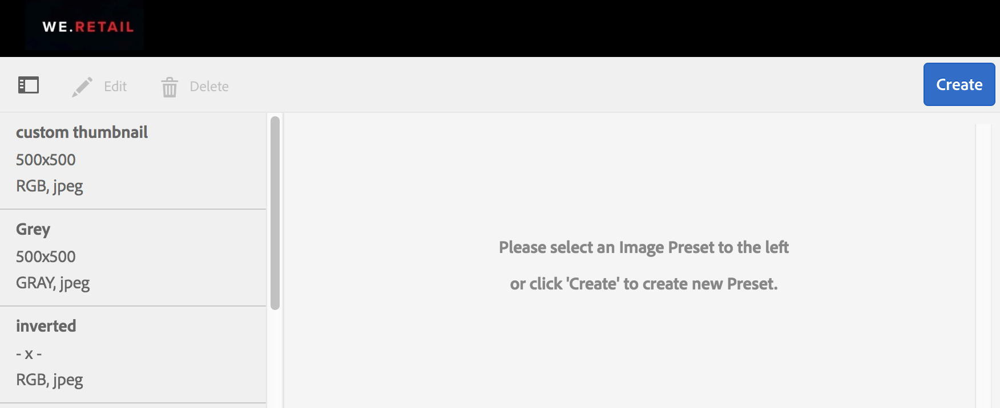
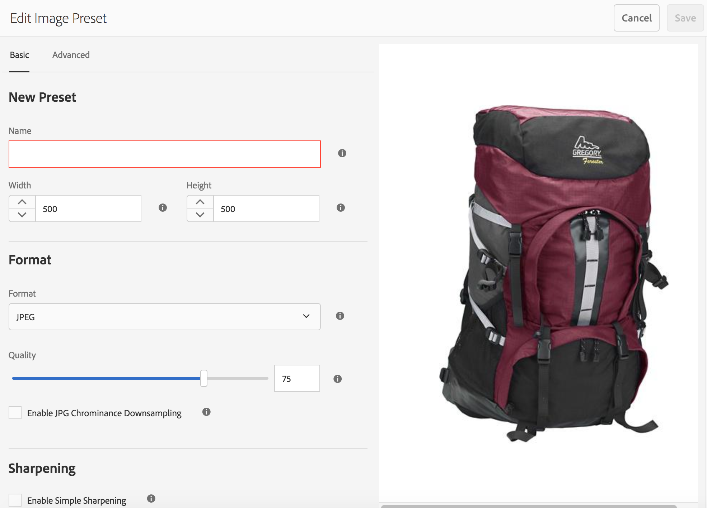
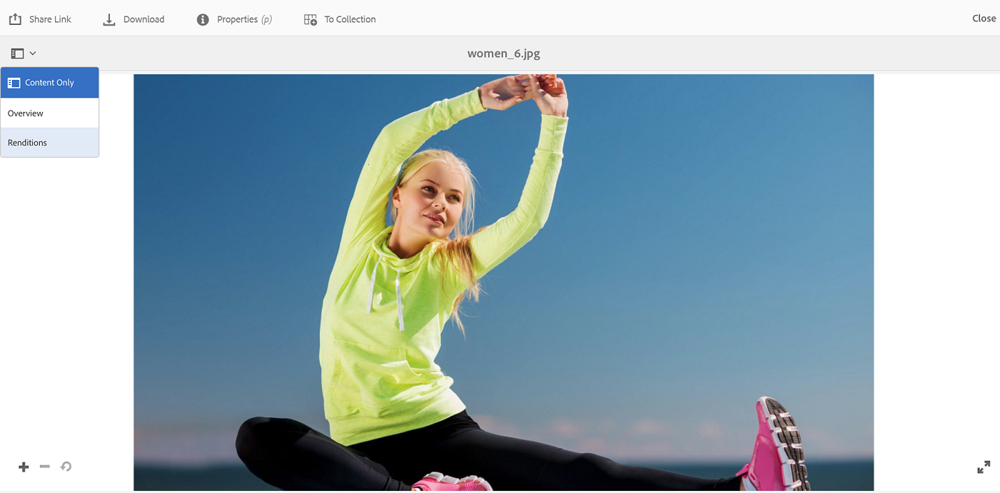
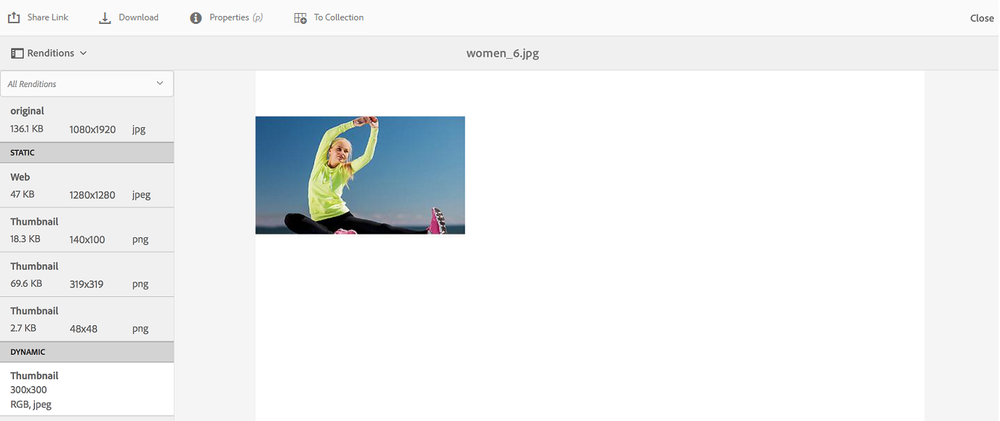
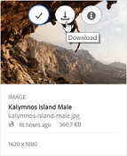
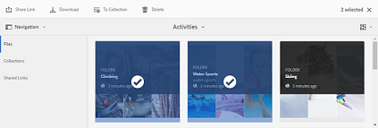
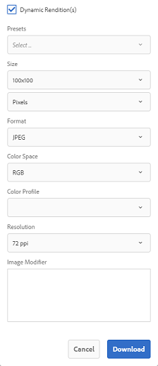

# Använda bildförinställningar eller dynamiska återgivningar {#apply-image-presets-or-dynamic-renditions}

Precis som ett makro är en bildförinställning en fördefinierad samling kommandon för storleksändring och formatering som sparats under ett namn. Med bildförinställningar kan AEM Assets Brand Portal dynamiskt leverera bilder i olika storlekar, format och egenskaper.

En bildförinställning används för att generera dynamiska återgivningar av bilder som kan förhandsvisas och hämtas. När du förhandsgranskar bilder och deras återgivningar kan du välja en förinställning för att formatera om bilder enligt de specifikationer som angetts av administratören.

(*Om AEM författarinstans körs i **läget***Dynamic Media Hybrid) Om du vill visa dynamiska återgivningar av en resurs i varumärkesportalen kontrollerar du att dess Pyramid-återgivning finns i den AEM författarinstansen från vilken du publicerar på varumärkesportalen. När du publicerar resursen publiceras även dess PTIFF-återgivning på varumärkesportalen.

>[!NOTE]
>
>När du hämtar bilder och återgivningar av dem finns det inget alternativ att välja bland de befintliga förinställningarna. Du kan i stället ange egenskaper för en anpassad bildförinställning. Mer information finns i [Använda bildförinställningar vid hämtning av bilder](../using/brand-portal-image-presets.md#main-pars-text-1403412644).

Mer information om de parametrar som krävs när du skapar bildförinställningar finns i [Hantera bildförinställningar](https://docs.adobe.com/docs/en/AEM/6-0/administer/integration/dynamic-media/image-presets.html).

## Skapa en bildförinställning {#create-an-image-preset}

AEM administratörer kan skapa bildförinställningar som visas som dynamiska återgivningar på resursdetaljsidan. Du kan skapa en bildförinställning från grunden eller spara en befintlig med ett nytt namn. När du skapar en bildförinställning väljer du en storlek för bildleverans och formateringskommandona. När en bild levereras för visning optimeras dess utseende enligt de valda kommandona.

>[!NOTE]
>
>Dynamiska återgivningar av en bild skapas med hjälp av Pyramid TIFF. Om Pyramid TIFF inte är tillgänglig för någon resurs går det inte att hämta dynamiska återgivningar för den resursen i varumärkesportalen.
>
>Om AEM författarinstans körs i läget **** Dynamic Media Hybrid skapas och sparas Pyramid TIFF-återgivningar av bildresurser i AEM.
>
>Om AEM författarinstans körs i läget **** Dynamic Media Scene 7 finns Pyramid TIFF-återgivningar av bildresurser på Scene 7-servern.
>
>När sådana resurser publiceras på varumärkesportalen används bildförinställningar och dynamiska återgivningar visas.

1. Klicka på Adobe-logotypen AEM verktygsfältet överst för att öppna administrationsverktygen.

1. Klicka på panelen Administrationsverktyg **[!UICONTROL Image Presets]**.

   

1. Klicka på på sidan med bildförinställningar **[!UICONTROL Create]**.

   

1. In the **[!UICONTROL Edit Image Preset]** page, enter values into the **[!UICONTROL Basic]** and **[!UICONTROL Advanced]** tabs as appropriate, including a name. The options are outlined in [Image Preset options](https://docs.adobe.com/docs/en/AEM/6-0/administer/integration/dynamic-media/image-presets.html#Image%20preset%20options). Förinställningarna visas i den vänstra rutan och kan användas direkt tillsammans med andra resurser.

   

   >[!NOTE]
   >
   >Du kan också använda **[!UICONTROL Edit Image Preset]** sidan för att redigera egenskaperna för en befintlig bildförinställning. Om du vill redigera en bildförinställning markerar du den på sidan med bildförinställningar och klickar på **[!UICONTROL Edit]**.

1. Klicka på **[!UICONTROL Save]**. Bildförinställningen skapas och visas på sidan med bildförinställningar.
1. Om du vill ta bort en bildförinställning markerar du den på sidan med bildförinställningar och klickar på **[!UICONTROL Delete]**. Bekräfta borttagningen genom **[!UICONTROL Delete]** att klicka på på bekräftelsesidan. Bildförinställningen tas bort från sidan med bildförinställningar.

## Använda bildförinställningar vid förhandsvisning av bilder  {#apply-image-presets-when-previewing-images}

När du förhandsgranskar bilder och deras återgivningar kan du välja bland de befintliga förinställningarna för att formatera om bilderna enligt de specifikationer som angetts av administratören.

1. Öppna en bild genom att klicka på den i gränssnittet för varumärkesportalen.
1. Klicka på övertäckningsikonen till vänster och välj **[!UICONTROL Renditions]**.

   

1. I **[!UICONTROL Renditions]** listan väljer du lämplig dynamisk återgivning, till exempel **[!UICONTROL Thumbnail]**. Förhandsvisningsbilden återges baserat på vad du väljer för återgivningen.

   

## Använda bildförinställningar vid hämtning av bilder {#apply-image-presets-when-downloading-images}

När du hämtar bilder och deras återgivningar från varumärkesportalen kan du inte välja bland de befintliga bildförinställningarna. Du kan dock anpassa förinställda bildegenskaper baserat på vilka du vill formatera om bilder.

1. I gränssnittet för varumärkesportalen gör du något av följande:

   * Håll pekaren över bilden som du vill hämta. Klicka på **[!UICONTROL Download]** ikonen bland de tillgängliga miniatyrbilderna för snabbåtgärder.

   

   * Markera den bild som du vill hämta. Klicka på **[!UICONTROL Download]** ikonen i verktygsfältet överst.

   

1. Välj önskade alternativ i **[!UICONTROL Download]** dialogrutan beroende på om du vill hämta resursen med eller utan dess återgivningar.

   

1. Om du vill hämta dynamiska återgivningar av resursen väljer du **[!UICONTROL Dynamic Rendition(s)]** alternativet.
1. Anpassa egenskaper för bildförinställningar utifrån vilka du vill formatera om bilden och dess återgivningar dynamiskt under hämtningen. Ange storlek, format, färgrymd, upplösning och bildmodifiering.

   

1. Klicka på **[!UICONTROL Download]**. De anpassade dynamiska återgivningarna hämtas i en ZIP-fil tillsammans med bilden och de återgivningar som du valde att hämta. Ingen zip-fil skapas emellertid om en enskild resurs hämtas, vilket gör att hämtningen går snabbt.
