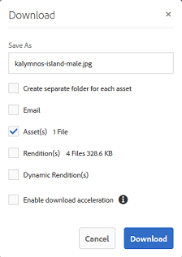

# Använda bildförinställningar eller dynamiska återgivningar {#apply-image-presets-or-dynamic-renditions}

Precis som ett makro är en bildförinställning en fördefinierad samling kommandon för storleksändring och formatering som sparats under ett namn. Med bildförinställningar kan Experience Manager Assets Brand Portal dynamiskt leverera bilder i olika storlekar, format och egenskaper.

En bildförinställning används för att generera dynamiska återgivningar av bilder som kan förhandsvisas och hämtas. När du förhandsgranskar bilder och deras återgivningar kan du välja en förinställning för att formatera om bilder enligt de specifikationer som angetts av administratören.

(*Om författarinstansen för Experience Manager Assets körs på&#x200B;**Dynamic Media hybridläge***) Om du vill visa dynamiska återgivningar av en resurs i Brand Portal kontrollerar du att dess Pyramid tiff-återgivning finns på författarinstansen för Experience Manager Assets från vilken du publicerar till Brand Portal. När du publicerar resursen publiceras även dess PTIFF-återgivning till Brand Portal.

>[!NOTE]
>
>När du hämtar bilder och återgivningar av dem finns det inget alternativ att välja bland de befintliga förinställningarna. Du kan i stället ange egenskaper för en anpassad bildförinställning. Mer information finns i [Använda bildförinställningar vid hämtning av bilder](../using/brand-portal-image-presets.md#main-pars-text-1403412644).

Mer information om de parametrar som krävs när du skapar bildförinställningar finns i [Hantera bildförinställningar](../using/brand-portal-image-presets.md).

## Skapa en bildförinställning {#create-an-image-preset}

Administratören för Experience Manager Assets kan skapa bildförinställningar som visas som dynamiska återgivningar på resursinformationssidan. Du kan skapa en bildförinställning från grunden eller spara en befintlig med ett nytt namn. När du skapar en bildförinställning väljer du en storlek för bildleverans och formateringskommandona. När en bild levereras för visning optimeras dess utseende enligt de valda kommandona.

>[!NOTE]
>
>Dynamiska återgivningar av en bild skapas med Pyramid TIFF. Om Pyramid TIFF inte är tillgänglig för någon resurs går det inte att hämta dynamiska återgivningar för den resursen i varumärkesportalen.
>
>Om författarinstansen för Experience Manager Assets körs på **Dynamic Media hybridläge** skapas Pyramid TIFF-återgivningar av bildresurser och sparas i Experience Manager Assets-databasen.
>
>Om författarinstansen för Experience Manager Assets körs i **Dynamic Media Scene 7-läget** finns Pyramid TIFF-återgivningar av bildresurser på Scene 7-servern.
>
>När sådana resurser publiceras på varumärkesportalen används bildförinställningar och dynamiska återgivningar visas.

1. Klicka på Experience Manager-logotypen i verktygsfältet överst för att öppna administrationsverktygen.

1. Klicka på **[!UICONTROL Image Presets]** på panelen Administrationsverktyg.

   

1. Klicka på **[!UICONTROL Create]** på sidan med bildförinställningar.

   

1. På sidan **[!UICONTROL Edit Image Preset]** anger du värden på flikarna **[!UICONTROL Basic]** och **[!UICONTROL Advanced]**, inklusive ett namn. Förinställningarna visas i den vänstra rutan och kan användas direkt tillsammans med andra resurser.

   

   >[!NOTE]
   >
   >Du kan också använda sidan **[!UICONTROL Edit Image Preset]** för att redigera egenskaperna för en befintlig bildförinställning. Om du vill redigera en bildförinställning markerar du den på sidan med bildförinställningar och klickar på **[!UICONTROL Edit]**.

1. Klicka på **[!UICONTROL Save]**. Bildförinställningen skapas och visas på sidan med bildförinställningar.
1. Om du vill ta bort en bildförinställning markerar du den på sidan med bildförinställningar och klickar på **[!UICONTROL Delete]**. Bekräfta borttagningen genom att klicka på **[!UICONTROL Delete]** på bekräftelsesidan. Bildförinställningen tas bort från sidan med bildförinställningar.

## Använda bildförinställningar vid förhandsvisning av bilder  {#apply-image-presets-when-previewing-images}

När du förhandsgranskar bilder och deras återgivningar kan du välja bland de befintliga förinställningarna för att formatera om bilderna enligt de specifikationer som angetts av administratören.

1. Öppna en bild genom att klicka på den i Brand Portal-gränssnittet.
1. Klicka på övertäckningsikonen till vänster och välj **[!UICONTROL Renditions]**.

   

1. I listan **[!UICONTROL Renditions]** väljer du lämplig dynamisk återgivning, till exempel **[!UICONTROL Thumbnail]**. Förhandsvisningsbilden återges baserat på vad du väljer för återgivningen.

   

## Använda bildförinställningar vid hämtning av bilder {#apply-image-presets-when-downloading-images}

När du hämtar bilder och deras återgivningar från Brand Portal kan du inte välja bland de befintliga bildförinställningarna. Du kan dock anpassa förinställda bildegenskaper baserat på vilka du vill formatera om bilder.

1. Gör något av följande i Brand Portal-gränssnittet:

   * Håll pekaren över bilden som du vill hämta. Klicka på ikonen **[!UICONTROL Download]** i miniatyrbilderna för snabbåtgärder som är tillgängliga.

   

   * Markera den bild som du vill hämta. Klicka på ikonen **[!UICONTROL Download]** i verktygsfältet överst.

   

1. I dialogrutan **[!UICONTROL Download]** väljer du önskade alternativ beroende på om du vill hämta resursen med eller utan dess renderingar.

   

1. Om du vill hämta dynamiska återgivningar av resursen väljer du alternativet **[!UICONTROL Dynamic Rendition(s)]**.
1. Anpassa egenskaper för bildförinställningar utifrån vilka du vill formatera om bilden och dess återgivningar dynamiskt under hämtningen. Ange storlek, format, färgrymd, upplösning och bildmodifiering.

   

1. Klicka på **[!UICONTROL Download]**. De anpassade dynamiska återgivningarna hämtas i en ZIP-fil tillsammans med bilden och de återgivningar som du valde att hämta. Ingen zip-fil skapas emellertid om en enskild resurs hämtas, vilket gör att hämtningen går snabbt.
