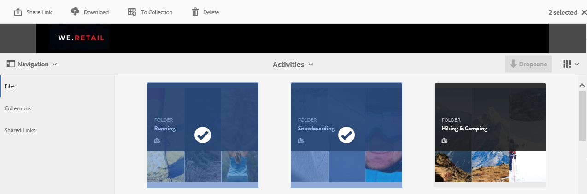
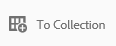
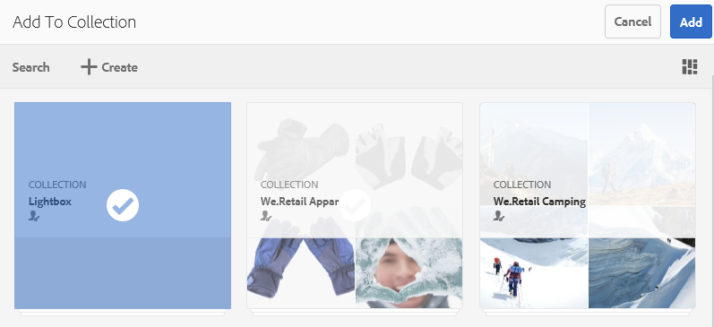
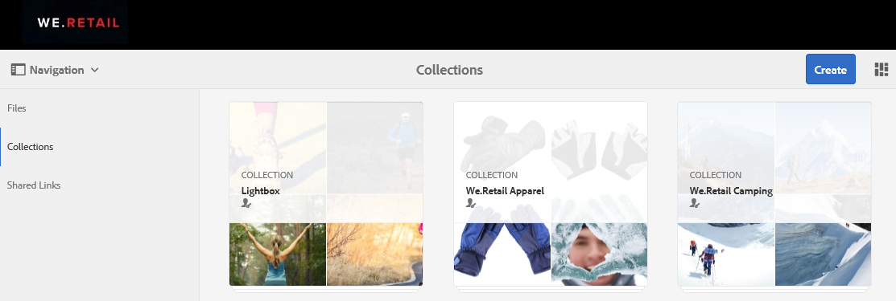
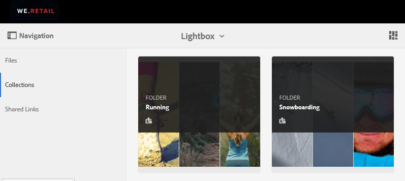
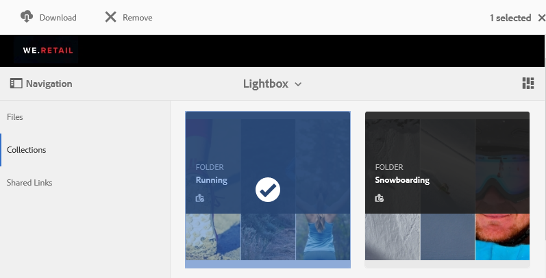

# Hantera ljuslådesamlingen {#manage-the-lightbox-collection}

**[!UICONTROL Lightbox]** är en särskild typ av samling som ger enkel åtkomst till resurser. Varje användare har en exklusiv **[!UICONTROL Lightbox]** som skapas automatiskt första gången de loggar in på varumärkesportalen. Det går inte att ta bort samlingen **[!UICONTROL Lightbox]**.

## Lägg till resurser i ljuslådan {#add-assets-to-lightbox}

Så här lägger du till resurser i **[!UICONTROL Lightbox]**:

1. Navigera till platsen för resurserna som du vill lägga till i **[!UICONTROL Lightbox]** och markera resurserna.

   

1. Klicka på ikonen Lägg till i samling i verktygsfältet längst upp.

   

1. På sidan **[!UICONTROL Add To Collection]** är samlingen **[!UICONTROL Lightbox]** markerad som standard.

   Klicka på **[!UICONTROL Add]**. De valda resurserna läggs till i **[!UICONTROL Lightbox]**.

   

1. Om du vill granska de resurser som lagts till i **[!UICONTROL Lightbox]** klickar du på **[!UICONTROL Collections]** till vänster och sedan på samlingen **[!UICONTROL Lightbox]**.

   

   Resurserna som läggs till i **[!UICONTROL Lightbox]** visas på sidan **[!UICONTROL Lightbox]**.

   

## Ta bort resurser från ljuslådan {#remove-assets-from-lightbox}

1. Om du vill granska resurserna i [!UICONTROL Lightbox] klickar du på **[!UICONTROL Collections]** på den vänstra listen och sedan på samlingen [!UICONTROL Lightbox].

   

1. Markera mappen som du vill ta bort från samlingen och klicka sedan på **[!UICONTROL Remove]** i verktygsfältet högst upp.

   

1. Klicka på **[!UICONTROL Remove]** i varningsmeddelanderutan för att bekräfta borttagningen.

Mappen tas bort från samlingen **[!UICONTROL Lightbox]**.
