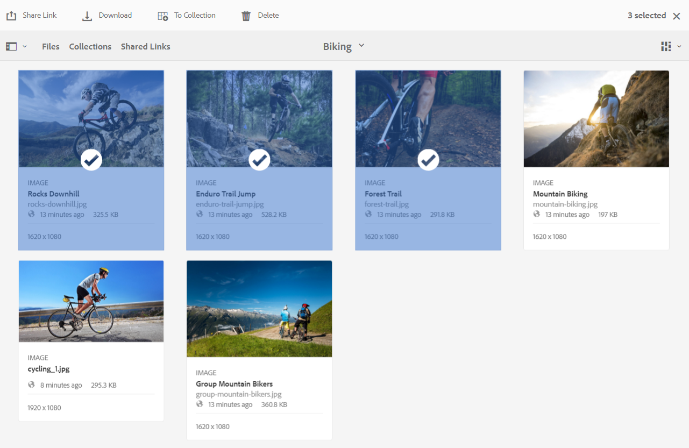

# Dela resurser som en länk {#share-assets-as-a-link}

Adobe Experience Manager Assets Brand Portal-administratörer kan dela länkar mellan olika resurser med auktoriserade interna användare och externa enheter, inklusive partners och leverantörer. Redigerare kan bara visa och dela resurser som delas med dem.

Att dela resurser via en länk är ett bekvämt sätt att göra dem tillgängliga för externa parter eftersom mottagarna inte behöver logga in på Brand Portal för att få tillgång till resurserna.

<!-- Link sharing access is restricted to editors and administrators. 
-->

Mer information finns i [Hantera användare, grupper och användarroller](../using/brand-portal-adding-users.md#manage-user-roles).

Så här delar du resurser som en länk:

1. Logga in på din Brand Portal-klient. Som standard är **[!UICONTROL Files]** öppnas som innehåller alla publicerade resurser och mappar.

1. Välj de resurser eller mappar som du vill dela, eller navigera till **[!UICONTROL Collections]** för att dela de samlingar du har skapat.

   

1. Klicka på knappen **[!UICONTROL Share Link]** ikon.

   The **[!UICONTROL Link Sharing]** visas.

   

   * I rutan E-postadress skriver du e-post-ID för den användare som du vill dela länken med. Du kan dela länken med flera användare. Om användaren är medlem i din organisation väljer du användarens e-post-ID bland förslagen som visas i listrutan. Om användaren är extern skriver du det fullständiga e-post-ID:t och trycker på **[!UICONTROL Enter]**; e-post-ID:t läggs till i listan över användare.

      

   * I **[!UICONTROL Subject]** anger du ett ämne för resursen som du vill dela.
   * I **[!UICONTROL Message]** skriver du ett meddelande om det behövs.
   * I **[!UICONTROL Expiration]** använder du datumväljaren för att ange ett förfallodatum och en förfallotid för länken. Som standard är förfallodatumet 7 dagar från det datum då du delar länken.
   * Aktivera **[!UICONTROL Allow downlod of original file]** om du vill tillåta mottagarna att hämta den ursprungliga återgivningen.

   Resurserna som delas via länken går ut efter att ha passerat det datum och den tid som anges i **[!UICONTROL Expiration]** fält. Mer information om beteendet för utgångna mediefiler och förändringar i tillåtna aktiviteter baserat på användarroller i Brand Portal finns i [Hantera digitala rättigheter för resurser](../using/manage-digital-rights-of-assets.md#asset-expiration).

   >[!NOTE]
   >
   >Länkens standardförfallotid är 7 dagar. Länken måste skickas med e-post till användarna som använder **[!UICONTROL Link Sharing]** ska du inte kopiera och dela länken separat.

1. Klicka på **[!UICONTROL Share]**. Ett meddelande bekräftar att länken delas med användarna. Användarna får ett e-postmeddelande med den delade länken.

   

   >[!NOTE]
   >
   >Administratörer kan anpassa e-postmeddelanden, som bland annat anpassar logotyp, beskrivning och sidfot med [Varumärke](../using/brand-portal-branding.md) -funktion.

## Hämta resurser från delade länkar {#download-assets-from-shared-links}

Klicka på länken i e-postmeddelandet för att komma åt den delade resursen. Sidan AEM länkdelning öppnas.

Så här hämtar du de delade resurserna:

1. Klicka på resurserna eller mapparna och klicka sedan på **[!UICONTROL Download]** -ikonen i verktygsfältet.

   

   >[!NOTE]
   >
   >För närvarande kan du bara generera en förhandsvisning och en miniatyrbild för vissa resurser, beroende på filformatet. Mer information om vilka filformat som stöds finns i [Stöd för förhandsgranskning och miniatyrbilder för resursformat](#preview-thumbnail-support).

1. The **[!UICONTROL Download]** visas.

   

1. Som standard är **[!UICONTROL Fast Download]** inställningen är aktiverad i **[!UICONTROL Download Settings]**. Därför visas en bekräftelseruta där hämtningen med IBM Aspera Connect kan fortsätta.

   För att fortsätta använda **[!UICONTROL Fast Download]**, klicka **[!UICONTROL Allow]**.

   Alla valda återgivningar hämtas i en ZIP-mapp som innehåller en separat mapp för varje resurs.

   >[!NOTE]
   >
   >En separat mapp skapas för varje resurs när resurserna hämtas från en delad länk.
   >
   >Om en mapp, en samling eller fler än 20 resurser har valts för nedladdning visas **[!UICONTROL Download]** dialogrutan hoppas över och alla resursåtergivningar som är tillgängliga för användaren, förutom de dynamiska återgivningarna, hämtas i en zip-mapp som innehåller en separat mapp för varje resurs.

   >[!NOTE]
   >
   >Ursprungliga återgivningar hämtas inte med den delade länken om användaren som delade resurserna som en länk inte är det [som administratören har behörighet att ha tillgång till de ursprungliga återgivningarna](../using/brand-portal-adding-users.md#manage-group-roles-and-privileges).

>[!NOTE]
>
>Brand Portal begränsar nedladdningen av mappar eller resurser som är större än 5 GB med hjälp av länkdelning.

<!--
1. The **[!UICONTROL Download]** dialog box appears.

   

    * To speed up the download of asset files shared as the link, select **[!UICONTROL Enable download acceleration]** option and [follow the wizard](../using/accelerated-download.md#download-workflow-using-file-accelerator). To know more about the fast download of assets on Brand Portal refer [Guide to accelerate downloads from Brand Portal](../using/accelerated-download.md).
    
1. To download the renditions of assets in addition to the assets from the shared link, select **[!UICONTROL Rendition(s)]** option. When you do so, **[!UICONTROL Exclude System Renditions]** option appears that is selected by default. This prevents the download of out-of-the-box renditions along with approved assets or their custom renditions.

   However, to allow auto-generated renditions to download along with custom renditions, deselect the **[!UICONTROL Exclude System Renditions]** option.

   >[!NOTE]
   >
   >Original renditions are not downloaded using the shared link if the user who shared the assets as a link is not [authorized by the administrator to have access to the original renditions](../using/brand-portal-adding-users.md#manage-group-roles-and-privileges).

   

1. Click **[!UICONTROL Download]**. The assets (and renditions if selected) are downloaded as a ZIP file to your local folder. However, no zip file is created if a single asset is downloaded without any of the renditions, thereby ensuring speedy download.

-->

## Stöd för förhandsgranskning och miniatyrbilder för resursformat {#preview-thumbnail-support}

I följande matris visas de resursformat som Brand Portal stöder miniatyrbilder och förhandsvisning för:

| Resursformat | Stöd för miniatyrbilder | Stöd för förhandsgranskning |
|--------------|-------------------|-----------------|
| PNG | ✓ | ✓ |
| GIF | ✓ | ✓ |
| TIFF | ✓ | ✕ |
| JPEG | ✓ | ✓ |
| BMP | ✓ | ✕ |
| PNM* | NA | NA |
| PGM* | NA | NA |
| PBM* | NA | NA |
| PPM* | NA | NA |
| PSD | ✓ | ✕ |
| EPS | NA | ✕ |
| DNG | ✓ | ✕ |
| PICT | ✓ | ✕ |
| PSB* | ✓ | ✕ |
| JPG | ✓ | ✓ |
| AI | ✓ | ✕ |
| DOC | ✕ | ✕ |
| DOCX | ✕ | ✕ |
| ODT* | ✕ | ✕ |
| PDF | ✓ | ✕ |
| HTML | ✕ | ✕ |
| RTF | ✕ | ✕ |
| TXT | ✓ | ✕ |
| XLS | ✕ | ✕ |
| XLSX | ✕ | ✕ |
| ODS | ✕ | ✕ |
| PPT | ✓ | ✕ |
| PPTX | ✕ | ✕ |
| ODP | ✕ | ✕ |
| INDD | ✓ | ✕ |
| PS | ✕ | ✕ |
| QXP | ✕ | ✕ |
| ePub | ✓ | ✕ |
| AAC | ✕ | ✕ |
| MIDI | ✕ | ✕ |
| 3GP | ✕ | ✕ |
| MP3 | ✕ | ✕ |
| MP4 | ✕ | ✕ |
| OGA | ✕ | ✕ |
| OGG | ✕ | ✕ |
| RA | ✕ | ✕ |
| WAV | ✕ | ✕ |
| WMA | ✕ | ✕ |
| DVI | ✕ | ✕ |
| FLV | ✕ | ✕ |
| M4V | ✕ | ✕ |
| MPG | ✕ | ✕ |
| OGV | ✕ | ✕ |
| MOV | ✕ | ✕ |
| WMV | ✕ | ✕ |
| SWF | ✕ | ✕ |
| TGZ | NA | ✕ |
| JAR | ✓ | ✕ |
| RAR | NA | ✕ |
| TAR | NA | ✕ |
| ZIP | ✓ | ✕ |

I följande förklaring förklaras symbolerna som används i matrisen:

| Symbol | Betydelse |
|---|---|
| ✓ | Det här filformatet stöder den här funktionen |
| ✕ | Det här filformatet stöder inte den här funktionen |
| NA | Den här funktionen gäller inte för det här filformatet |
| &#42; | Den här funktionen kräver tilläggsstöd för det här filformatet AEM författarinstansen men inte på Brand Portal efter att resurserna har publicerats i Brand Portal |

## Dela inte resurser som delas som en länk {#unshare-assets-shared-as-a-link}

Så här tar du bort delning av tidigare delade resurser som en länk:

1. När du loggar in på Brand Portal **[!UICONTROL File]** visas som standard. Om du vill visa de resurser du har delat som länkar går du till **[!UICONTROL Shared Links]** vy.

1. Granska länkarna som du delade från den lista som visas.

   

1. Om du vill ta bort delningen av en länk från listan markerar du den och klickar på knappen **[!UICONTROL Unshare]** ikonen i verktygsfältet överst.

   

   >[!NOTE]
   >
   >Visningen av delade länkar är användarspecifik. Den här funktionen visar inte alla länkar som delas av alla användare av en klientorganisation.

1. Klicka på **[!UICONTROL Continue]** för att bekräfta att du inte vill dela. Posten för länken tas bort från listan med delade länkar.
