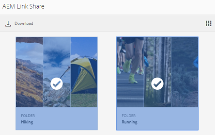
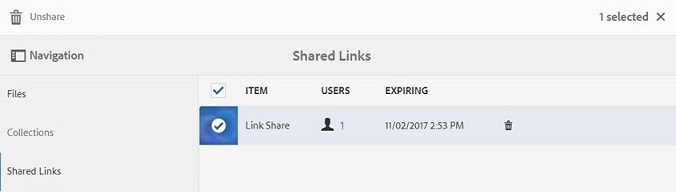

# Dela resurser som en länk {#share-assets-as-a-link}

AEM Assets Brand Portal-administratörer kan dela länkar mellan olika resurser med auktoriserade interna användare och externa enheter, inklusive partners och leverantörer. Redigerare kan bara visa och dela resurser som delas med dem.

Att dela resurser via en länk är ett bekvämt sätt att göra dem tillgängliga för externa parter eftersom mottagarna inte behöver logga in på varumärkesportalen för att få tillgång till resurserna.

Länkdelningsåtkomst är begränsad till redigerare och administratörer.

Mer information finns i [Hantera användare, grupper och användarroller](../using/brand-portal-adding-users.md#manage-user-roles).

>[!NOTE]
>
>Upp till 5 GB ZIP-nedladdning är tillåtet med hjälp av länkdelningsfunktionen i varumärkesportalen.

Så här delar du resurser som en länk:

1. Klicka på övertäckningsikonen till vänster och välj **[!UICONTROL Navigation]**.

   

1. Klicka i sidofältet till vänster för **[!UICONTROL Files]** att dela mappar eller bilder. Om du vill dela samlingar klickar du på **[!UICONTROL Collections]**.

   

1. Markera de mappar eller samlingar som du vill dela som en länk.

   

1. Klicka på **[!UICONTROL Share Link]** ikonen i verktygsfältet överst.

   The **[!UICONTROL Link Sharing]** dialog box appears.

   

   >[!NOTE]
   >
   >I **[!UICONTROL Share Link]** fältet visas en automatiskt skapad resurslänk. Standardförfallotiden för den här länken är 7 dagar. Du kan kopiera länken och dela den separat med användare eller dela den från **[!UICONTROL Link Sharing]** dialogrutan.

1. I rutan E-postadress skriver du e-post-ID för den användare som du vill dela länken med. Du kan dela länken med flera användare.

   Om användaren är medlem i din organisation väljer du användarens e-post-ID bland förslagen som visas i listrutan. Om användaren är extern skriver du det fullständiga e-post-ID:t och trycker på **[!UICONTROL Enter]**; e-post-ID:t läggs till i listan över användare.

   

1. I **[!UICONTROL Subject]** rutan anger du ett ämne för resursen som du vill dela.
1. Skriv ett meddelande i **[!UICONTROL Message]** rutan om det behövs.
1. I **[!UICONTROL Expiration]** fältet använder du datumväljaren för att ange ett förfallodatum och en förfallotid för länken. Som standard är förfallodatumet 7 dagar från det datum då du delar länken.

   Resurserna som delas via länken går ut efter att ha passerat det datum och den tid som anges i **[!UICONTROL Expiration]** fältet. Mer information om beteendet hos tillgångar som gått ut och ändringar i de tillåtna aktiviteterna baserat på användarroller i varumärkesportalen finns i [Hantera digitala rättigheter för resurser](../using/manage-digital-rights-of-assets.md#asset-expiration).

1. Klicka på **[!UICONTROL Share]**. Ett meddelande bekräftar att länken delas med användarna. Användarna får ett e-postmeddelande med länken.

   

   >[!NOTE]
   >
   >Administratörer kan anpassa e-postmeddelanden, som bland annat kan anpassas efter logotyp, beskrivning och sidfot med [funktionen Varumärkning](../using/brand-portal-branding.md) .

## Hämta resurser från delade länkar {#download-assets-from-shared-links}

Klicka på länken i e-postmeddelandet för att visa den delade resursen. Sidan AEM Link Share (Dela) öppnas.

Så här hämtar du de delade resurserna:

1. Klicka på resurserna och sedan på **[!UICONTROL Download]** ikonen i verktygsfältet.

   

   >[!NOTE]
   >
   >För närvarande kan du bara generera en förhandsvisning och en miniatyrbild för vissa resurser, beroende på filformatet. Mer information om vilka filformat som stöds finns i [Förhandsvisa och miniatyrstöd för resursformat](#preview-thumbnail-support).

   >[!NOTE]
   >
   >Om de mediefiler du hämtar också innehåller licensierade mediefiler omdirigeras du till **[!UICONTROL Copyright Management]** sidan. På den här sidan väljer du de licensierade resurserna, klickar på **[!UICONTROL Agree]** och sedan på **[!UICONTROL Download]**. Om du inte håller med hämtas bara de olicensierade resurserna.\
   >Licensskyddade mediefiler har ett [licensavtal som är kopplat](https://helpx.adobe.com/experience-manager/6-5/assets/using/drm.html#DigitalRightsManagementinAssets) till dem, vilket görs genom att objektets [metadataegenskap](https://helpx.adobe.com/experience-manager/6-5/assets/using/drm.html#DigitalRightsManagementinAssets) ställs in i [!DNL AEM Assets].

   

   The **[!UICONTROL Download]** dialog box appears.

   

   * Om du vill snabba upp hämtningen av resursfiler som delas som länk väljer du **[!UICONTROL Enable download acceleration]** alternativet och [följer guiden](../using/accelerated-download.md#download-workflow-using-file-accelerator). Om du vill veta mer om den snabba hämtningen av resurser på varumärkesportalen kan du läsa [Guide för att snabba upp hämtningarna från varumärkesportalen](../using/accelerated-download.md).

1. Om du vill hämta återgivningar av resurser utöver resurserna från den delade länken väljer du **[!UICONTROL Rendition(s)]** . När du gör det visas ett **[!UICONTROL Exclude System Renditions]** alternativ som är markerat som standard. Detta förhindrar att färdiga återgivningar laddas ned tillsammans med godkända resurser eller anpassade återgivningar av dem.

   Om du vill tillåta att automatiskt genererade återgivningar hämtas tillsammans med anpassade återgivningar avmarkerar du **[!UICONTROL Exclude System Renditions]** alternativet.

   >[!NOTE]
   >
   >Originalåtergivningar hämtas inte med den delade länken om användaren som delade resurserna som en länk inte har [behörighet av administratören att ha åtkomst till de ursprungliga återgivningarna](../using/brand-portal-adding-users.md#manage-group-roles-and-privileges).

   

1. Tryck/klicka på **[!UICONTROL Download]**. Resurserna (och återgivningarna om de är markerade) hämtas som en ZIP-fil till din lokala mapp. Ingen zip-fil skapas emellertid om en enskild resurs hämtas utan någon av renderingarna, vilket ger snabb hämtning.

>[!NOTE]
>
>Brand Portal begränsar nedladdningen av resurser som är större än 5 GB per filstorlek.

## Stöd för förhandsgranskning och miniatyrbilder för resursformat {#preview-thumbnail-support}

I följande matris visas de resursformat som Brand Portal har stöd för miniatyrbilder och förhandsvisning för:

| Resursformat | Stöd för miniatyrbilder | Stöd för förhandsgranskning |
|--------------|-------------------|-----------------|
| PNG | ✓ | ✓ |
| GIF | ✓ | ✓ |
| TIFF | ✓ | ✕ |
| JPEG | ✓ | ✓ |
| BMP | ✓ | ✕ |
| PNM* | NA | NA |
| PGM* | NA | NA |
| PBM* | NA | NA |
| PPM* | NA | NA |
| PSD | ✓ | ✕ |
| EPS | NA | ✕ |
| DNG | ✓ | ✕ |
| PICT | ✓ | ✕ |
| PSB* | ✓ | ✕ |
| JPG | ✓ | ✓ |
| AI | ✓ | ✕ |
| DOC | ✕ | ✕ |
| DOCX | ✕ | ✕ |
| ODT* | ✕ | ✕ |
| PDF | ✓ | ✕ |
| HTML | ✕ | ✕ |
| RTF | ✕ | ✕ |
| TXT | ✓ | ✕ |
| XLS | ✕ | ✕ |
| XLSX | ✕ | ✕ |
| ODS | ✕ | ✕ |
| PPT | ✓ | ✕ |
| PPTX | ✕ | ✕ |
| ODP | ✕ | ✕ |
| INDD | ✓ | ✕ |
| PS | ✕ | ✕ |
| QXP | ✕ | ✕ |
| EPUB | ✓ | ✕ |
| AAC | ✕ | ✕ |
| MIDI | ✕ | ✕ |
| 3GP | ✕ | ✕ |
| MP3 | ✕ | ✕ |
| MP4 | ✕ | ✕ |
| OGA | ✕ | ✕ |
| OGG | ✕ | ✕ |
| RA | ✕ | ✕ |
| WAV | ✕ | ✕ |
| WMA | ✕ | ✕ |
| DVI | ✕ | ✕ |
| FLV | ✕ | ✕ |
| M4V | ✕ | ✕ |
| MPG | ✕ | ✕ |
| OGV | ✕ | ✕ |
| MOV | ✕ | ✕ |
| WMV | ✕ | ✕ |
| SWF | ✕ | ✕ |
| TGZ | NA | ✕ |
| JAR | ✓ | ✕ |
| RAR | NA | ✕ |
| TAR | NA | ✕ |
| ZIP | ✓ | ✕ |

I följande förklaring förklaras symbolerna som används i matrisen:

| Symbol | Betydelse |
|---|---|
| ✓ | Det här filformatet stöder den här funktionen |
| ✕ | Det här filformatet stöder inte den här funktionen |
| NA | Den här funktionen gäller inte för det här filformatet |
| * | Den här funktionen kräver tilläggsstöd för det här filformatet på AEM-författarinstansen, men inte på varumärkesportalen, när resurserna har publicerats på varumärkesportalen |

## Dela inte resurser som delas som en länk {#unshare-assets-shared-as-a-link}

Så här tar du bort delning av tidigare delade resurser som en länk:

1. Om du vill visa de resurser du har delat som länkar klickar du på övertäckningsikonen till vänster och väljer **[!UICONTROL Navigation]**.

   

1. From the siderail, click **[!UICONTROL Shared Links]**.

   

1. Granska länkarna som du delade från den lista som visas.
1. Om du vill ta bort delningen av en länk från listan markerar du den och klickar på papperskorgsikonen bredvid länkposten, eller så klickar du på **[!UICONTROL Unshare]** ikonen i verktygsfältet längst upp.

   

   >[!NOTE]
   >
   >Visningen av delade länkar är användarspecifik. Den här funktionen visar inte alla länkar som delas av alla användare av en klientorganisation.

1. Klicka i varningsmeddelanderutan på **[!UICONTROL Continue]** för att bekräfta att du inte vill dela. Posten för länken tas bort från listan med delade länkar.
