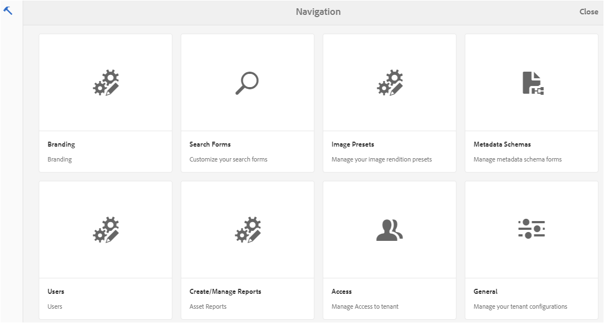
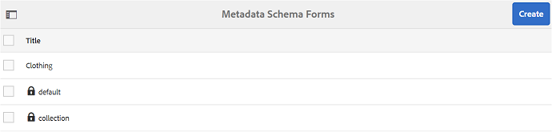
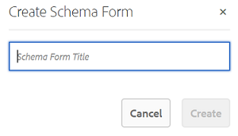
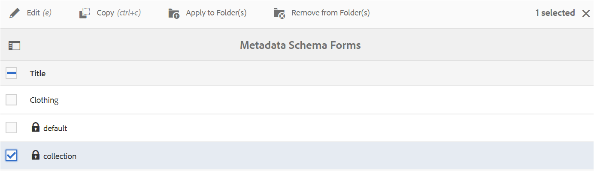
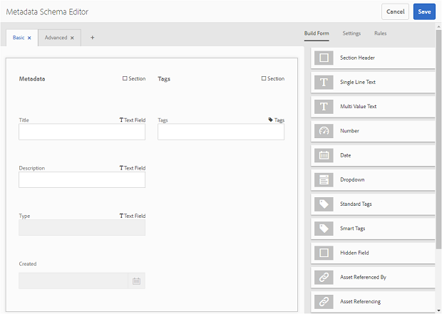
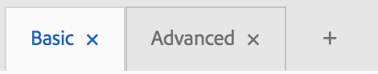
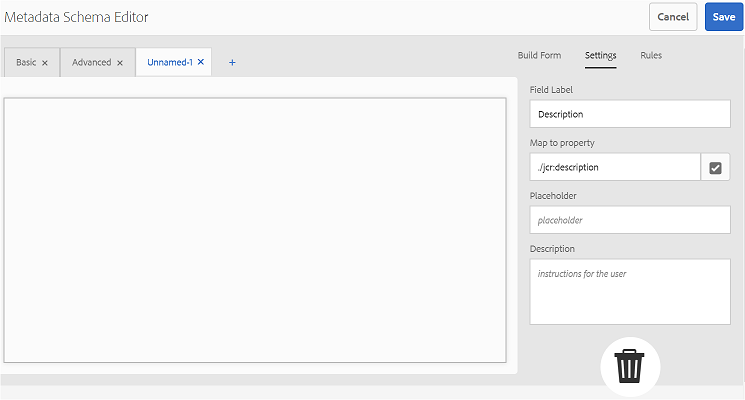
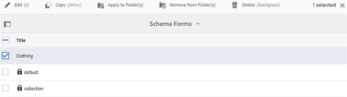
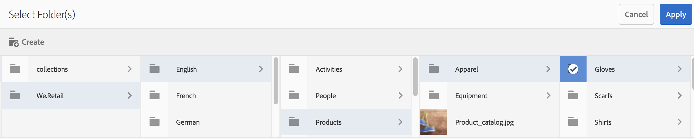
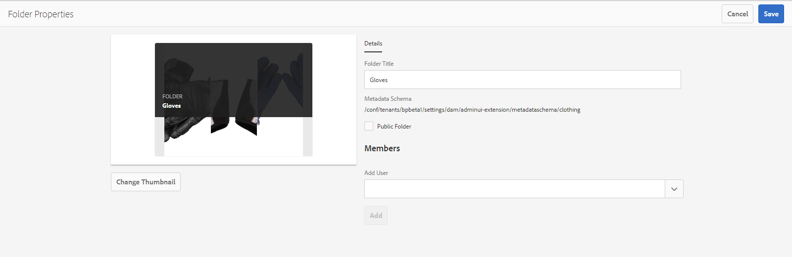

# Använd metadatamatchformuläret {#use-the-metadata-schema-form}

Ett metadatamatema beskriver layouten på egenskapssidan och de metadataegenskaper som visas för resurser som använder det aktuella schemat. Schemat som du tillämpar på en resurs avgör vilka metadatafält som visas på sidan Egenskaper.

The **[!UICONTROL Properties]** sidan för varje resurs innehåller standardmetadataegenskaper beroende på resursens MIME-typ. Administratörer kan använda metadatarameditor för att ändra befintliga scheman eller lägga till anpassade metadatamatcheman. Experience Manager Assets Brand Portal innehåller standardformulär för resurser av olika MIME-typer. Du kan också lägga till anpassade formulär för sådana resurser.

## Lägg till ett metadatamatchformulär {#add-a-metadata-schema-form}

Så här skapar du ett nytt metadataschemaformulär:

1. Klicka på Experience Manager-logotypen i verktygsfältet överst för att öppna administrationsverktygen.

   

1. På panelen Administrationsverktyg klickar du på **[!UICONTROL Metadata Schemas]**.

   

1. På sidan **[!UICONTROL Metadata Schema Forms]** klickar du på **[!UICONTROL Create]**.

   

1. I **[!UICONTROL Create Schema Form]** anger du rubriken för schemaformuläret och klickar sedan på **[!UICONTROL Create]** för att slutföra formulärskapandet.

   

## Redigera ett metadataschemaformulär {#edit-a-metadata-schema-form}

Du kan redigera ett nyligen tillagt eller befintligt metadatchemaformulär. Metadatchemaformuläret innehåller innehåll som härletts från dess överordnade objekt, inklusive flikar och formulärobjekt på flikar. Du kan mappa eller konfigurera dessa formulärobjekt till ett fält i en metadatanod.

Du kan lägga till nya flikar eller formulärobjekt i metadatchemaformuläret. De härledda flikarna och formulärobjekten (från det överordnade objektet) är låsta. Du kan inte ändra dem på underordnad nivå.

Så här redigerar du ett metadatamatchemaformulär:

1. Klicka på Experience Manager-logotypen i verktygsfältet överst för att öppna administrationsverktygen.

   

1. På panelen Administrationsverktyg klickar du på **[!UICONTROL Metadata Schemas]**.
1. Från **[!UICONTROL Metadata Schema Forms]** väljer du ett schemaformulär för att redigera dess egenskaper, till exempel **[!UICONTROL collection]**.

   

   >[!NOTE]
   >
   >Oredigerade mallar har en låssymbol före sig. Om du anpassar någon av mallarna försvinner låssymbolen innan mallen visas.

1. Klicka på i verktygsfältet högst upp **[!UICONTROL Edit]**.

   The **[!UICONTROL Metadata Schema Editor]** sidan öppnas med **[!UICONTROL Basic]** tabben till vänster och **[!UICONTROL Build Form]** -fliken öppnas till höger.

1. I **[!UICONTROL Metadata Schema Editor]** sida, anpassa **[!UICONTROL Properties]** sidan med resursen genom att dra en eller flera komponenter från en lista med komponenttyper i **[!UICONTROL Build Form]** till **[!UICONTROL Basic]** -fliken.

   

1. Om du vill konfigurera en komponent markerar du den och ändrar dess egenskaper i **[!UICONTROL Settings]** -fliken.

### Komponenter på fliken Skapa formulär {#components-in-the-build-form-tab}

The **[!UICONTROL Build Form]** På -fliken visas objekt som du kan använda i schemaformuläret. The **[!UICONTROL Settings]** -fliken innehåller attributen för varje objekt som du väljer i **[!UICONTROL Build Form]** -fliken. I följande tabell visas de formulärobjekt som är tillgängliga i **[!UICONTROL Build Form]** tab:

| Komponentnamn | Beskrivning |
|---------------------|--------------------------------------------------------------------------------------------------------------------------------------------------------------------------------------------------------------------------------------------------------------------------------------------|
| **[!UICONTROL Section Header]** | Lägg till en avsnittsrubrik för en lista med gemensamma komponenter. |
| **[!UICONTROL Single Line Text]** | Lägg till en textegenskap för en rad. Den lagras som en sträng. |
| **[!UICONTROL Multi ValueText]** | Lägg till en textegenskap med flera värden. Den lagras som en strängarray. |
| **[!UICONTROL Number]** | Lägg till en sifferkomponent. |
| **[!UICONTROL Date]** | Lägg till en datumkomponent. |
| **[!UICONTROL Dropdown]** | Lägg till en listruta. |
| **[!UICONTROL Standard Tags]** | Lägg till en tagg. **Obs!** Administratörer kan behöva ändra sökvägsvärdet, till exempel `/etc/tags/mac/<tenant_id>/<custom_tag_namespace>`, om de publicerar metadataschemaformuläret från Experience Manager Assets, där sökvägen till exempel inte innehåller klientinformation, `/etc/tags/<custom_tag_namespace>`. |
| **[!UICONTROL Smart Tags]** | Automatiskt identifierade taggar om du har köpt och konfigurerat tillägget Experience Manager Assets smarta taggar. |
| **[!UICONTROL Hidden Field]** | Lägg till ett dolt fält. Den skickas som en POST-parameter när resursen sparas. |
| **[!UICONTROL Asset Referenced By]** | Lägg till den här komponenten för att visa en lista över resurser som resursen refererar till. |
| **[!UICONTROL Asset Referencing]** | Lägg till om du vill visa en lista med resurser som refererar till resursen. |
| **[!UICONTROL Asset Rating]** | Genomsnittlig värdering av en tillgång som lagts till från Experience Manager Assets innan den publiceras till Brand Portal. |
| **[!UICONTROL Contextual Metadata]** | Lägg till för att styra visningen av andra metadataflikar på egenskapssidan för resurser. |

>[!NOTE]
>
>Använd inte **[!UICONTROL Product References]**, eftersom det inte fungerar.

#### Redigera metadatakomponenten {#edit-the-metadata-component}

Om du vill redigera egenskaperna för en metadatakomponent i formuläret klickar du på komponenten och redigerar dess egenskaper i dialogrutan **[!UICONTROL Settings]** -fliken.

* **[!UICONTROL Field Label]**: Namnet på metadataegenskapen som visas på objektets egenskapssida.

* **[!UICONTROL Map to Property]**: Värdet för den här egenskapen anger den relativa sökvägen/namnet till resursnoden där den sparas i CRX-databasen. Det börjar med &quot;**./**&quot; eftersom sökvägen är under objektets nod.

Följande är giltiga värden för den här egenskapen:

-- `./jcr:content/metadata/dc:title`: Lagrar värdet vid resursens metadatanod som egenskapen [!UICONTROL `dc:title`].

-- `./jcr:created`: Visar jcr-egenskapen vid resursens nod. Om du konfigurerar de här egenskaperna för visning bör du markera dem som Inaktivera redigering, eftersom de är skyddade. Annars inträffar felet ”Det gick inte att ändra resurserna” när du sparar resursens egenskaper.

* **[!UICONTROL Placeholder]**: Använd den här egenskapen för att ge användaren relevant information om metadataegenskapen.
* **[!UICONTROL Required]**: Använd den här egenskapen för att markera en metadataegenskap som obligatorisk på sidan Egenskaper.
* **[!UICONTROL Disable Edit]**: Använd den här egenskapen för att göra en metadataegenskap icke-redigerbar på sidan Egenskaper.
* **[!UICONTROL Show Empty Field In Read Only]**: Markera den här egenskapen om du vill visa en metadataegenskap på egenskapssidan även om den inte har något värde. Om en metadataegenskap inte har något värde visas den inte som standard på sidan Egenskaper.
* **[!UICONTROL Description]**: Använd den här egenskapen om du vill lägga till en kort beskrivning för metadatakomponenten.
* **[!UICONTROL Delete icon]**: Klicka på den här ikonen om du vill ta bort en komponent från schemaformuläret.

>[!NOTE]
>
>Alla metadatafält är skrivskyddade i metadataredigeringsformuläret för en resurs. Eftersom metadata för resursen måste redigeras i Experience Manager Assets innan en resurs publiceras i Brand Portal.

#### Lägga till eller ta bort en flik i schemaformuläret {#add-or-delete-a-tab-in-the-schema-form}

Standardschemaformuläret innehåller **[!UICONTROL Basic]** och **[!UICONTROL Advanced]** -tabbar. Med schemaredigeraren kan du lägga till eller ta bort en flik.

* Om du vill lägga till en ny flik i ett schemaformulär klickar du på **[!UICONTROL +]**. Som standard har den nya fliken namnet &quot;Namnlös-1&quot;. Du kan ändra namnet på **[!UICONTROL Settings]** -fliken.

* Om du vill ta bort en flik klickar du på **[!UICONTROL x]**. Klicka **[!UICONTROL Save]** för att spara ändringarna.

## Tillämpa ett metadatamatchema på en mapp {#apply-a-metadata-schema-to-a-folder}

Med Brand Portal kan du anpassa och styra metadataschemat så att **[!UICONTROL Properties]** sidan med en resurs visar bara den specifika information du väljer att visa. Styr vilka metadata som visas i dialogrutan **[!UICONTROL Properties]** tar du bort de metadata som krävs från schemaformuläret för metadata och använder dem på den specifika mappen.

Så här använder du ett metadatamatchemaformulär för en mapp:

1. Klicka på Experience Manager-logotypen i verktygsfältet överst för att öppna administrationsverktygen.

   

1. På panelen Administrationsverktyg klickar du på **[!UICONTROL Metadata Schemas]**.

1. Från **[!UICONTROL Metadata Schema Forms]** väljer du schemaformuläret som du vill tillämpa på en resurs, till exempel **[!UICONTROL clothing]**.

   

1. Klicka på i verktygsfältet högst upp **[!UICONTROL Apply to Folder(s)]**.

1. Från **[!UICONTROL Select Folder(s)]** bläddra till den mapp som du vill använda **[!UICONTROL clothing]** metadata-schema, till exempel **[!UICONTROL Gloves]**.

   

1. Klicka **[!UICONTROL Apply]** om du vill använda metadataschemaformuläret för mappen.

   Tillgängliga metadata i **[!UICONTROL clothing]** metadata-schemaformuläret används på **[!UICONTROL Gloves]** och visas i **[!UICONTROL Properties]** sidan i mappen.

   

>[!NOTE]
>
>Om du använder ett schema som innehåller kapslade scheman i en mapp som innehåller videofiler, kanske videofilernas metadataegenskaper inte återges korrekt. För att metadataegenskaperna ska återges korrekt tar du bort kapslade scheman och använder bara det överordnade schemat på mappen.

## Ta bort ett metadataschemaformulär {#delete-a-metadata-schema-form}

Med Brand Portal kan du bara ta bort anpassade schemaformulär. Du kan inte ta bort standardschemaformulär/-mallar. Du kan dock ta bort anpassade ändringar i dessa formulär.

Om du vill ta bort ett formulär markerar du det och klickar på knappen **[!UICONTROL Delete]** ikon.

>[!NOTE]
>
>När du har tagit bort de anpassade ändringarna i ett standardformulär **[!UICONTROL Lock]** symbolen visas igen före formulärnamnet i metadataschemagränssnittet för att ange att formuläret återställs till standardläget.

## Schemaformulär för MIME-TYPER {#schema-forms-for-mime-types}

### Lägga till nya formulär för MIME-typer {#adding-new-forms-for-mime-types}

Förutom standardformulären kan du lägga till anpassade formulär för resurser av olika MIME-typer eller skapa ett nytt formulär under en lämplig formulärtyp. Om du till exempel vill lägga till en ny mall för undertypen **[!UICONTROL image/png]** skapar du formuläret som ett bildformulär. Schemaformulärets titel är undertypsnamnet. I det här fallet är rubriken&quot;png&quot;.

#### Använda en befintlig schemamall för olika MIME-typer {#using-an-existing-schema-template-for-various-mime-types}

Du kan använda en befintlig mall för en annan MIME-typ. Använd till exempel **image/jpeg** formulär för resurser av MIME-typ **bild/png**.

I det här fallet skapar du en ny nod på [!UICONTROL `/etc/dam/metadataeditor/mimetypemappings`] i CRX-databasen. Ange ett namn för noden och definiera följande egenskaper:

| **Namn** | **Typ** | **Värde** |
|---|---|---|
| exponposedmimype | Sträng | image/jpeg |
| mimetypes | Sträng[] | bild/png |

* **exponposedmimype**: Namnet på det befintliga formulär som ska mappas
* **mimetypes**: Lista över MIME-typer som använder formuläret som definierats i **exponposedmimype** attribute

Brand Portal mappar följande MIME-typer och schemaformulär:

| **Schemaformulär** | **MIME-typer** |
|---|---|
| image/jpeg | image/pjpeg |
| bild/tiff | image/x-tiff |
| application/pdf | application/postscript |
| application/x-ImageSet | Multipart/Related. type=application/x-ImageSet |
| application/x-SpinSet | Multipart/Related. type=application/x-SpinSet |
| application/x-MixedMediaSet | Multipart/Related. type=application/x-MixedMediaSet |
| video/quicktime | video/x-quicktime |
| video/mpeg4 | video/mp4 |
| video/avi | video/avi, video/msvideo, video/x-msvideo |
| video/wmv | video/x-ms-wmv |
| video/flv | video/x-flv |

Nedan följer en lista över standardmetadataegenskaper:

* jcr:content/metadata/cq:taggar
* jcr:content/metadata/dc:format
* jcr:content/metadata/dam:status
* jcr:content/metadata/videoCodec
* jcr:content/metadata/audioCodec
* jcr:content/metadata/dc:title
* jcr:content/metadata/dc:description
* jcr:content/metadata/xmpMM:InstanceID
* jcr:content/metadata/xmpMM:DocumentID
* jcr:content/metadata/dam:sha1
* jcr:content/metadata/dam:solutionContext
* jcr:content/metadata/videoBithastighet
* jcr:content/metadata/audioBitrate
* jcr:content/usages/usedBy
* jcr:content/jcr:lastModified
* jcr:content/metadata/prism:expirationDate
* jcr:content/onTime
* jcr:content/offTime
* jcr:content/metadata/dam:size
* jcr:content/metadata/tiff:ImageWidth
* jcr:content/metadata/tiff:ImageLength
