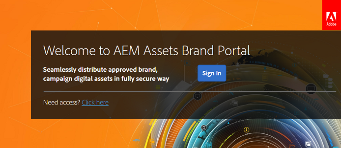

# Första gången du loggar in {#first-time-login-experience}

Första gången du loggar in är detsamma för alla nya användare av AEM Assets Brand Portal, inklusive administratörer. När en administratör har lagt till dig i organisationens varumärkesportalkonto behöver du inte acceptera inbjudningar, du läggs till automatiskt. Du får ett välkomstmeddelande som innehåller en länk till din organisations varumärkesportalkonto.

Följande steg ska utföras för användare som loggar in på varumärkesportalen för första gången:

1. Öppna välkomstmeddelandet och klicka på **[!UICONTROL Get Started]**.

1. Ange dina uppgifter på registreringssidan (inklusive förnamn, efternamn, lösenord och land/region).
   >[!NOTE]
   >
   >Om du är en befintlig Adobe Marketing Cloud-användare visas en inloggningssida i stället för registreringssidan. Om du vill logga in på Adobe Marketing Cloud anger du ditt Adobe ID och lösenord.

   >[!NOTE]
   >
   >Om din organisation använder Enterprise ID:n dirigeras du i stället för att visa den här registreringssidan till inloggningssidan för företag. Mer information finns i [Hjälp om Enterprise ID, inloggning och konto](https://helpx.adobe.com/in/enterprise/kb/enterprise-id-faq.html).

1. Klicka på **[!UICONTROL Continue]** för att gå vidare till din organisations varumärkesportalsida.
1. På inloggningssidan för varumärkesportalen klickar du på **[!UICONTROL Sign In]** för att logga in på varumärkesportalen.

   

   >[!NOTE]
   >
   >Du har inte åtkomst till varumärkesportalen om du inte är kopplad till någon produktprofil. För att kunna logga in på varumärkesportalen måste du vara kopplad till minst en AEM produktprofil.
