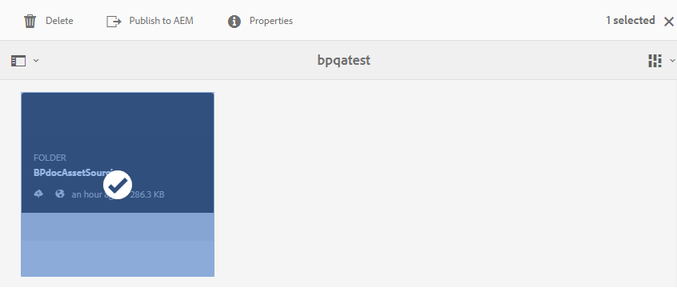

# Publicera mapp för bidrag till AEM Assets {#publish-contribution-folder-to-aem}

Användare av varumärkesportalen kan publicera bidragsmappen till AEM Assets utan att behöva ha tillgång till AEM-författarinstansen.

Se till att du har gått igenom [resurskraven](brand-portal-download-asset-requirements.md) och överfört de nyskapade resurserna i mappen **NEW** i mappen för bidrag. Se [Överför resurser till mappen](brand-portal-upload-assets-to-contribution-folder.md)för bidrag.

**Så här publicerar du bidragsmappen:**

1. Logga in på din Brand Portal-instans.
1. Välj mapp för bidrag från kontrollpanelen för varumärkesportalen.
1. Klicka på **[!UICONTROL Publish to AEM]** .
   

Ett e-post-/pulsmeddelande skickas till Brand Portal-användaren och AEM-administratören i olika stadier av publiceringsarbetsflödet:
1. **Köad** - Ett meddelande skickas till användaren i varumärkesportalen när ett publiceringsarbetsflöde utlöses i varumärkesportalen.

1. **Fullständigt** - Ett meddelande skickas till Brand Portal-användaren och AEM-administratören när publiceringsarbetsflödet är klart, dvs. bidragsmappen publiceras till AEM Assets.

