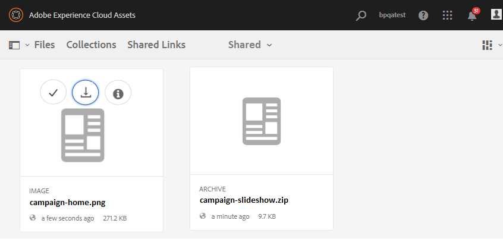
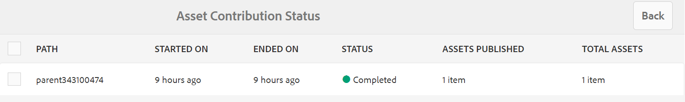
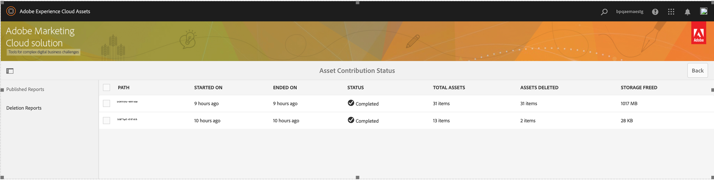
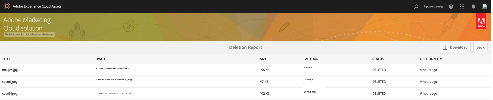

# Publicera bidragsmapp till Experience Manager Assets {#using-asset-souring-in-bp}

Brand Portal-användare med lämplig behörighet kan överföra flera resurser, eller mappar som innehåller flera resurser, till bidragsmappen. Brand Portal-användare kan dock bara överföra resurser till **NYHET** mapp. The **DELAD** är avsedd för distribution av baslinjeresurser (referensinnehåll) som kan användas av Brand Portal-användare när nya resurser skapas för bidrag.

Brand Portal-användare som har behörighet att komma åt mappen för bidrag kan utföra följande åtgärder:

* [Hämta resurskrav](#download-asset-requirements)
* [Överför nya resurser till mappen för bidrag](#uplad-new-assets-to-contribution-folder)
* [Publicera bidragsmapp till Experience Manager Assets](#publish-contribution-folder-to-aem)

## Hämta resurskrav {#download-asset-requirements}

Brand Portal-användare får automatiskt e-post-/pulsmeddelanden varje gång en avgiftsbelagda mapp delas av Experience Manager Assets-användare, så att de kan hämta det korta (resurskrav) dokumentet samt hämta basresurserna (referensinnehåll) från **DELAD** för att säkerställa att de förstår vad som krävs.

Brand Portal-användare utför följande åtgärder för att ladda ned mediefiler:

* **Ladda ned i korthet**: Ladda ned översikten (tillgångskravsdokument) som är bifogad till mappen för bidrag och som innehåller resursrelaterad information som typ av resurser, syfte, format som stöds, maximal storlek på mediefilen osv.
* **Hämta baslinjeresurser**: Hämta baslinjeresurser som kan användas för att förstå vilka typer av resurser som krävs. Brand Portal-användare kan använda dessa resurser som referens för att skapa nya resurser som kan bidra.

Brand Portal Dashboard visar alla befintliga mappar som är tillåtna för Brand Portal-användaren tillsammans med den nyligen delade bidragsmappen. I det här exemplet har Brand Portal-användaren bara åtkomst till den nyligen skapade mappen för bidrag, ingen annan befintlig mapp delas med användaren.

**Så här hämtar du resurskrav:**

1. Logga in på din Brand Portal-instans.
1. Välj mapp för bidrag från Brand Portal Dashboard.
1. Klicka på **[!UICONTROL Properties]**. Fönstret Egenskap som innehåller informationen om bidragsmappen öppnas.

   

   

1. Klicka på **[!UICONTROL Download Brief]** om du vill hämta tillgångskravsdokumentet på den lokala datorn.

   

1. Gå tillbaka till Brand Portal Dashboard.
1. Klicka för att öppna mappen för bidrag, du kan se två undermappar **[!UICONTROL SHARED]** och **[!UICONTROL NEW]** i bidragsmappen. Mappen SHARED innehåller alla baslinjeresurser (referensinnehåll) som delas av administratörerna.
1. Du kan ladda ned **[!UICONTROL SHARED]** mapp som innehåller alla baslinjeresurser på den lokala datorn.
Du kan också öppna **[!UICONTROL SHARED]** och klickar på **Hämta** om du vill hämta enskilda filer/mappar.

   

   

Gå igenom översikten (tillgångskravsdokument) och hänvisa till bastillgångarna för att förstå tillgångskraven. Nu kan du skapa nya resurser för bidrag och överföra dem till mappen för bidrag.

## Överför resurser till mappen för bidrag {#upload-new-assets-to-contribution-folder}

Efter att ha gått igenom resurskraven kan Brand Portal-användare skapa nya resurser för bidrag och överföra dem till mappen NEW i mappen för bidrag. En användare kan överföra flera resurser till en resursavgiftsmapp. Det går dock bara att skapa en mapp åt gången.

>[!NOTE]
>
>Brand Portal-användare kan överföra resurser (max **2** GB per filstorlek) till mappen NEW.
>
>Den maximala överföringsgränsen för alla Brand Portal-klienter är **10** GB som kumulativt tillämpas på alla bidragsmappar.
>
>Resurserna som överförs till Brand Portal bearbetas inte för återgivningar och innehåller inte förhandsgranskningar.

>[!NOTE]
>
>Vi rekommenderar att du frigör överföringsutrymmet när du har publicerat avgiftsbelagda mappar till Experience Manager Assets så att de är tillgängliga för övriga Brand Portal-användare.
>
>Om du behöver utöka överföringsgränsen för din Brand Portal-klient **10** GB, kontakta kundsupport och specificera kraven.

**Så här överför du nya resurser:**

1. Logga in på din Brand Portal-instans.
På Brand Portal-kontrollpanelen visas alla befintliga mappar som är tillåtna för Brand Portal-användaren tillsammans med den nyligen delade bidragsmappen.

1. Markera mappen för bidrag och klicka för att öppna den. Mappen för bidrag innehåller två undermappar - **[!UICONTROL SHARED]** och **[!UICONTROL NEW]**.

1. Klicka på **[!UICONTROL NEW]** mapp.

   

1. Klicka **[!UICONTROL Create]** > **[!UICONTROL Files]** om du vill överföra enskilda filer eller mappar (.zip) som innehåller flera resurser.

   

1. Bläddra och överföra resurser (filer eller mappar) till **[!UICONTROL NEW]** mapp.

   

När du har överfört alla resurser eller mappar till mappen NEW publicerar du mappen för bidrag till Experience Manager Assets.

## Publicera bidragsmapp till Experience Manager Assets {#publish-contribution-folder-to-aem}

Brand Portal-användare kan publicera bidragsmappen till Experience Manager Assets utan att ha tillgång till författarinstansen i Experience Manager.

Se till att du har gått igenom resurskraven och överfört de nyskapade resurserna i **NYHET** i mappen för bidrag.

**Så här publicerar du bidragsmappen:**

1. Logga in på din Brand Portal-instans.

1. Välj mapp för bidrag från Brand Portal Dashboard.
1. Klicka på **[!UICONTROL Publish to AEM]**.

   

   

Ett e-post-/pulsmeddelande skickas till Brand Portal-användare och -administratörer i olika stadier av publiceringsarbetsflödet:

1. **Köad** - Ett meddelande skickas till Brand Portal-användare och Brand Portal-administratörer när ett publiceringsarbetsflöde utlöses i Brand Portal.

1. **Slutförd** - Ett meddelande skickas till Brand Portal-användare och Brand Portal-administratörer när bidragsmappen har publicerats till Experience Manager Assets.

När de nyskapade resurserna har publicerats till Experience Manager Assets kan Brand Portal-användare ta bort dem från mappen NEW. Brand Portal-administratören kan ta bort resurserna från både NYTT och Delat.

När målet att skapa bidragsmappen är uppfyllt kan Brand Portal-administratören ta bort bidragsmappen och frigöra överföringsutrymmet för andra användare.

## Status för publiceringsjobb {#publishing-job-status}

Det finns två rapporter som administratörer kan använda för att visa statusen för resursavgiftsmapparna som publicerats från Brand Portal till Experience Manager Assets.

* I Brand Portal navigerar du till **[!UICONTROL Tools]** > **[!UICONTROL Asset Contribution Status]**. Den här rapporten visar statusen för alla publiceringsjobb i olika faser av publiceringsarbetsflödet.

   

* I Experience Manager Assets (lokal eller hanterad tjänst) går du till **[!UICONTROL Assets]** > **[!UICONTROL Jobs]**. Den här rapporten visar det slutliga tillståndet (Slutfört eller Fel) för alla publiceringsjobb.

   

* I Experience Manager Assets as a Cloud Service går du till **[!UICONTROL Assets]** > **[!UICONTROL Jobs]**.

   Du kan också navigera direkt till **[!UICONTROL Jobs]** från den globala navigeringen.

   Den här rapporten visar det slutliga läget (Slutfört eller Fel) för alla publiceringsjobb, inklusive import av resurser från Brand Portal till Experience Manager Assets as a Cloud Service.

   

<!--
>[!NOTE]
>
>Currently, no report is generated in AEM Assets as a Cloud Service for the Asset Sourcing workflow. 
-->

## Automatisk borttagning av resurser som publicerats till Experience Manager Assets från Contribute-mappen {#automatically-delete-published-assets-from-contribution-folder}

Brand Portal kör nu automatiska jobb var tolfte timme för att skanna alla Contribute-mappar och ta bort alla resurser som publicerats till AEM. Därför behöver du inte ta bort resurserna i Contribute-mappen manuellt för att behålla mappstorleken under mappen [tröskelvärde](#upload-new-assets-to-contribution-folder). Du kan också övervaka status för de borttagningsjobb som har körts automatiskt under de senaste sju dagarna. Rapporten för ett jobb innehåller följande information:

* Jobbstarttid
* Jobbsluttid
* Jobbstatus
* Totalt antal tillgångar som ingår i ett jobb
* Totalt antal resurser som tagits bort i ett jobb
* Totalt lagringsutrymme som gjorts tillgängligt som ett resultat av jobbkörningen

   

Du kan även gå vidare och visa information om varje resurs som ingår i ett borttagningsjobb. I rapporten finns information om exempelvis objektets titel, storlek, författare, borttagningsstatus och borttagningstid.

>[!NOTE]
>
> * Kunder kan begära att Adobe kundsupport inaktiverar och återaktiverar den automatiska borttagningsjobbfunktionen eller ändrar hur ofta den ska köras.
> * Den här funktionen är tillgänglig i Experience Manager 6.5.13.0 och senare versioner.

### Visa och hämta borttagningsrapporter {#view-delete-jobs}

Så här visar och hämtar du rapporter för ett borttagningsjobb:

1. I Brand Portal navigerar du till **[!UICONTROL Tools]**>**[!UICONTROL Asset Contribution Status]**>**[!UICONTROL Deletion Reports]** alternativ.

1. Välj ett jobb och klicka på **[!UICONTROL View]** för att visa rapporten.

   Visa information om varje resurs som ingår i ett borttagningsjobb. I rapporten finns information om exempelvis objektets titel, storlek, författare, borttagningsstatus och borttagningstid. Klicka **[!UICONTROL Download]** för att hämta rapporten för jobbet i CSV-format.

   Borttagningsstatusen för en resurs i rapporten kan ha följande värden:

   * **Borttagen** - Resursen har tagits bort från Contribute-mappen.

   * **Hittades inte** - Brand Portal kunde inte hitta resursen i Contribute-mappen. Resursen har redan tagits bort från mappen manuellt.

   * **Överhoppad** - Brand Portal hoppade över borttagningen av resurser eftersom det finns en ny version tillgänglig för resursen i Contribute-mappen, som ännu inte har publicerats för Experience Manager.

   * **Misslyckades** - Brand Portal kunde inte ta bort resursen. Det finns tre nya försök att ta bort en resurs med en `Failed` borttagningsstatus. Om resursen inte kan tas bort från det tredje försöket måste du ta bort resursen manuellt.

### Ta bort en rapport

I Brand Portal kan du även välja en eller flera rapporter och ta bort dem manuellt.

Så här tar du bort en rapport:

1. Navigera till **[!UICONTROL Tools]**>**[!UICONTROL Asset Contribution Status]**>**[!UICONTROL Deletion Reports]** alternativ.

1. Markera en eller flera rapporter och klicka på **[!UICONTROL Delete]**.

