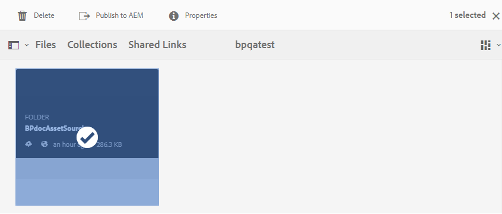

# Publicera bidragsmapp till AEM Assets {#using-asset-souring-in-bp}

Brand Portal-användare med lämplig behörighet kan överföra flera resurser, eller mappar som innehåller flera resurser, till mappen för bidrag. Användare av varumärkesportalen kan dock bara överföra resurser till mappen **NEW**. Mappen **SHARED** är avsedd för distribution av baslinjeresurser (referensinnehåll) som kan användas av Brand Portal-användare när nya resurser skapas för bidrag.

Användare av varumärkesportalen som har behörighet att komma åt mappen för bidrag kan utföra följande åtgärder:

* [Hämta resurskrav](#download-asset-requirements)
* [Överför nya resurser till mappen för bidrag](#uplad-new-assets-to-contribution-folder)
* [Publicera bidragsmapp till AEM Assets](#publish-contribution-folder-to-aem)

## Hämta resurskrav {#download-asset-requirements}

Brand Portal-användare får automatiskt e-post-/pulsmeddelanden varje gång en avgiftsmapp delas av den AEM användaren, så att de kan hämta det korta (resurskrav) dokumentet samt hämta basresurserna (referensinnehåll) från mappen **SHARED** för att vara säkra på att de förstår vad som krävs för mediefilen.

Användare av varumärkesportalen utför följande aktiviteter för att hämta tillgångskrav:

* **Ladda ned i korthet**: Ladda ned översikten (tillgångskravsdokument) som är bifogad till mappen för bidrag och som innehåller resursrelaterad information som typ av resurser, syfte, format som stöds, maximal storlek på mediefilen osv.
* **Hämta baslinjeresurser**: Hämta baslinjeresurser som kan användas för att förstå vilka typer av resurser som krävs. Användare av varumärkesportalen kan använda dessa resurser som referens för att skapa nya resurser som bidrag.

Kontrollpanelen för varumärkesportalen innehåller alla befintliga mappar som är tillåtna för användaren på varumärkesportalen tillsammans med den nyligen delade mappen för bidrag. I det här exemplet har Brand Portal-användaren bara åtkomst till den nyligen skapade mappen för bidrag, ingen annan befintlig mapp delas med användaren.

**Så här hämtar du resurskrav:**

1. Logga in på din Brand Portal-instans.
1. Välj mapp för bidrag från kontrollpanelen för varumärkesportalen.
1. Klicka på **[!UICONTROL Properties]**. Fönstret Egenskap som innehåller informationen om bidragsmappen öppnas.

   

   

1. Klicka på alternativet **[!UICONTROL Download Brief]** om du vill hämta tillgångskravsdokumentet på den lokala datorn.

   

1. Gå tillbaka till kontrollpanelen för varumärkesportalen.
1. Klicka för att öppna mappen för bidrag, du kan se två undermappar -**[!UICONTROL SHARED]** och **[!UICONTROL NEW]** i mappen för bidrag. Mappen SHARED innehåller alla baslinjeresurser (referensinnehåll) som delas av administratörerna.
1. Du kan hämta mappen **[!UICONTROL SHARED]** som innehåller alla baslinjeresurser på den lokala datorn.
Du kan också öppna mappen **[!UICONTROL SHARED]** och klicka på ikonen **Hämta** för att hämta enskilda filer/mappar.

   

   

Gå igenom översikten (tillgångskravsdokument) och hänvisa till bastillgångarna för att förstå tillgångskraven. Nu kan du skapa nya resurser för bidrag och överföra dem till mappen för bidrag.

## Överför resurser till avgiftsmappen {#uplad-new-assets-to-contribution-folder}

Efter att ha gått igenom tillgångskraven kan Brand Portal-användarna skapa nya resurser för bidrag och överföra dem till mappen NEW i mappen för bidrag.

>[!NOTE]
>
>Användare av varumärkesportalen kan bara överföra resurser till mappen NEW.
>
>Den maximala överföringsgränsen för alla innehavare av varumärkesportaler är **10** GB, som tillämpas kumulativt på alla bidragsmappar.

>[!NOTE]
>
>Vi rekommenderar att du frigör överföringsutrymmet när du har publicerat avgiftsbelagda mappar till AEM Assets så att de är tillgängliga för övriga Brand Portal-användare.
>
>Om du behöver utöka din varumärkesportaltenants överföringsgräns utöver **10** GB kontaktar du Adobe Support och anger kraven.

**Så här överför du nya resurser:**

1. Logga in på din Brand Portal-instans.
Kontrollpanelen för varumärkesportalen innehåller alla befintliga mappar som är tillåtna för användaren av varumärkesportalen tillsammans med den nyligen delade mappen för bidrag.

1. Markera mappen för bidrag och klicka för att öppna den. Mappen för bidrag innehåller två undermappar - **[!UICONTROL SHARED]** och **[!UICONTROL NEW]**.

1. Klicka på mappen **[!UICONTROL NEW]**.

   

1. Klicka på **[!UICONTROL Create]** > **[!UICONTROL Files]** om du vill överföra enskilda filer eller mappar (.zip) som innehåller flera resurser.

   

1. Bläddra och överför resurser (filer eller mappar) till mappen **[!UICONTROL NEW]**.

   

När du har överfört alla resurser eller mappar till mappen NEW publicerar du mappen för bidrag till AEM Assets.

## Publicera bidragsmapp till AEM Assets {#publish-contribution-folder-to-aem}

Användare av varumärkesportalen kan publicera bidragsmappen till AEM Assets utan att behöva ha tillgång till AEM författarinstans.

Se till att du har gått igenom resurskraven och överför de nyskapade resurserna i mappen **NEW** i mappen för bidrag.

**Så här publicerar du bidragsmappen:**

1. Logga in på din Brand Portal-instans.

1. Välj mapp för bidrag från kontrollpanelen för varumärkesportalen.
1. Klicka på **[!UICONTROL Publish to AEM]**.

   

   

Ett e-post-/pulsmeddelande skickas till Brand Portal-användare och -administratörer i olika stadier av publiceringsarbetsflödet:
1. **Köad**  - Ett meddelande skickas till användaren och administratören för varumärkesportalen när ett publiceringsarbetsflöde utlöses i varumärkesportalen.

1. **Fullständigt**  - Ett meddelande skickas till Brand Portal-användaren och Brand Portal-administratörerna när mappen för bidrag har publicerats i AEM Assets.

När de nyskapade resurserna har publicerats till AEM Assets kan Brand Portal-användarna ta bort dem från mappen NEW. Administratören för varumärkesportalen kan ta bort resurserna både från mappen NEW och SHARED.

När målet att skapa bidragsmappen är uppnått kan administratören för varumärkesportalen ta bort bidragsmappen och frigöra överföringsutrymmet för andra användare.

## Status för publiceringsjobb {#publishing-job-status}

Det finns två rapporter som administratörer kan använda för att visa statusen för resursavgiftsmapparna som publicerats från Brand Portal till AEM Assets.

* Gå till **[!UICONTROL Tools]** > **[!UICONTROL Asset Contribution Status]** i varumärkesportalen. Den här rapporten visar statusen för alla publiceringsjobb i olika faser av publiceringsarbetsflödet.

   

* I AEM Assets (lokal eller hanterad tjänst) går du till **[!UICONTROL Assets]** > **[!UICONTROL Jobs]**. Den här rapporten visar det slutliga tillståndet (Slutfört eller Fel) för alla publiceringsjobb.

   

* I AEM Assets som Cloud Service går du till **[!UICONTROL Assets]** > **[!UICONTROL Jobs]**.

   Du kan också navigera direkt till **[!UICONTROL Jobs]** från den globala navigeringen.

   Den här rapporten visar det slutliga läget (Slutfört eller Fel) för alla publiceringsjobb, inklusive import av resurser från Brand Portal till AEM Assets som Cloud Service.

   

<!--
>[!NOTE]
>
>Currently, no report is generated in AEM Assets as a Cloud Service for the Asset Sourcing workflow. 
-->

