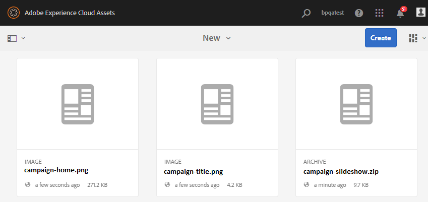

# Konfigurera bidragsmappen i Experience Manager Assets {#configure-contribution-folder}

För samverkansbaserad resurskälla kan Experience Manager Assets-användare (administratörer och icke-adminanvändare med behörighet) skapa nya mappar av typen **Resursbidrag**, och se till att den nya mappen som skapas är öppen för att skickas in av Brand Portal-användare.  Detta utlöser automatiskt ett arbetsflöde som skapar ytterligare två undermappar, som kallas **DELAD** och **NYHET** i den nya **Bidrag** mapp.

Experience Manager Assets-användare definierar sedan tillgångskraven genom att ladda upp en översikt över vilka typer av resurser som ska läggas till i bidragsmappen samt en uppsättning baslinjeresurser till **DELAD** för att säkerställa att Brand Portal-användare har den information de behöver. Administratören kan sedan ge aktiva Brand Portal-användare åtkomst till bidragsmappen innan den nya Contribute-mappen publiceras på Brand Portal.

I följande video visas hur du konfigurerar en Contribute-mapp i Experience Manager Assets:

>[!VIDEO](https://video.tv.adobe.com/v/30547)

Experience Manager Assets-användare utför följande åtgärder när de konfigurerar en mapp för bidrag:

* [Skapa avgiftsmapp](#create-contribution-folder)
* [Överför tillgångskrav och tilldela medverkande](#configure-contribution-folder-properties)
* [Överför baslinjeresurser](#uplad-new-assets-to-contribution-folder)
* [Publicera en mapp för bidrag från Experience Manager Assets till Brand Portal](#publish-contribution-folder-to-brand-portal)

## Skapa avgiftsmapp {#create-contribution-folder}

Experience Manager Assets-administratörer och icke-adminanvändare som har behörighet att skapa en ny mapp kan skapa en mapp för bidrag i Experience Manager Assets.
Om du vill skapa en mapp för bidrag skapar du en ny mapp av typen Resursbidrag, som ser till att den nya mappen som skapas är öppen för överföring av resurser från Brand Portal-användare.  Detta utlöser automatiskt ett arbetsflöde som skapar ytterligare två undermappar, som kallas DELAD och NYTT, i bidragsmappen.

>[!NOTE]
>
>Administratörerna kan skapa flera resursavgiftsmappar i en mapp.
>
>En mapp för tillgångsavgifter innehåller mapparna NEW och SHARED för resursernas distribution och bidrag. Skapa inte en resurs-, mapp- eller bidragsmapp i en bidragsmapp.

Du kan konfigurera bidragsmappens egenskaper separat och samtidigt som du skapar bidragsmappen. I det här exemplet konfigurerar vi egenskaperna separat.

**Så här skapar du en bidragsmapp:**

1. Logga in på din Experience Manager Assets-instans.

1. Navigera till **[!UICONTROL Assets]** > **[!UICONTROL Files]**. Den visar alla befintliga mappar i Experience Manager Assets-databasen.

1. Klicka **[!UICONTROL Create]** för att skapa en ny mapp. **[!UICONTROL Create Folder]** öppnas.

1. Retur **[!UICONTROL Title]** och **[!UICONTROL Name]** i mappen och välj **[!UICONTROL Asset Contribution]** kryssruta.
Vi rekommenderar att du använder gemener utan blanksteg för att namnge mappen.

1. Klicka på **[!UICONTROL Create]**. Du kan se bidragsmappen i Experience Manager Assets-databasen.

   >[!NOTE]
   >
   >En icke-admin-användare kan skapa och dela en resursavgiftsmapp, men kan inte ändra eller ta bort den.

   

1. Klicka för att öppna mappen för bidrag, du kan se två undermappar **[!UICONTROL SHARED]** och **[!UICONTROL NEW]** skapas automatiskt i avgiftsmappen.

   

## Konfigurera egenskaper för bidragsmapp {#configure-contribution-folder-properties}

Experience Manager Assets-administratören utför följande åtgärder när egenskaperna för en avgiftsmapp konfigureras.

* **Lägg till beskrivning**: Ange en beskrivning av bidragsmappen på hög nivå.
* **Överför i korthet**: Överför tillgångskravsdokument som innehåller resursrelaterad information.
* **Lägg till medverkande**: Lägg till Brand Portal-användare för att ge dem åtkomst till mappen för bidrag.

Resurskravet avser den information som administratörer tillhandahåller för att hjälpa medverkande (Brand Portal-användare) att förstå behovet och kraven av bidragsmappen. Administratören överför ett tillgångskravsdokument som innehåller en sammanfattning om vilken typ av resurser som ska läggas till i avgiftsmappen och resursrelaterad information, till exempel syfte, typ av bilder, maxstorlek osv.

**Så här konfigurerar du bidragsmappens egenskaper:**

1. Logga in på din Experience Manager Assets-instans.

1. Navigera till **[!UICONTROL Assets > Files]** och hitta mappen för bidrag.
1. Välj mapp för bidrag och klicka på **[!UICONTROL Properties]** för att öppna fönstret Mappegenskaper.

   

   

1. Navigera till **[!UICONTROL Asset Contribution]** -fliken.
1. Ange hög nivå **[!UICONTROL Description]** av mappen för bidrag.
1. Klicka **[!UICONTROL Upload Brief]** för att bläddra från din lokala dator och överföra en **Dokument för tillgångskrav**.

   

1. I **[!UICONTROL Add User]** lägger du till Brand Portal-användare som du vill dela mappen för bidrag med. Dessa användare kan komma åt och överföra innehåll till bidragsmappen via Brand Portal gränssnitt.
1. Klicka på **[!UICONTROL Save]**.

   

>[!NOTE]
>
>Sökresultaten baseras på Brand Portal användarlista som konfigurerats i Experience Manager Assets. Kontrollera att du har den uppdaterade Brand Portal-användarlistan.

Administratörerna kan hämta `user.csv` fil från [!DNL Admin Console] och använda den som basmall för att lägga till Brand Portal-användare. Gå till [!UICONTROL Users] och klicka på [!UICONTROL Export users list to csv] möjlighet att ladda ned `users.csv` -fil. Följande exempelanvändare visar vilka attribut som krävs för att lägga till användarna. Det enda obligatoriska attributet för en användarpost är `Email` och alla andra attribut är valfria.

[Hämta fil](assets/users.csv)

## Överför resurser till mappen för bidrag {#uplad-new-assets-to-contribution-folder}

Experience Manager Assets-användare överför en uppsättning baslinjeresurser till **DELAD** för att säkerställa att Brand Portal-användare har den information de behöver.

**Så här överför du baslinjeresurser:**

1. Logga in på din Experience Manager Assets-instans.

1. Navigera till **[!UICONTROL Assets > Files]** och hitta mappen för bidrag.

1. Markera mappen för bidrag och klicka för att öppna den.

1. Klicka på **[!UICONTROL NEW]** mapp.

   

1. Klicka **[!UICONTROL Create]** > **[!UICONTROL Files]** om du vill överföra enskilda filer eller mappar (.zip) som innehåller flera resurser.

   

1. Bläddra och överföra resurser (filer eller mappar) till **[!UICONTROL NEW]** mapp.

   

När du har överfört alla resurser eller mappar till mappen NEW publicerar du mappen för bidrag till Experience Manager Assets.

## Publicera bidragsmapp till Brand Portal {#publish-contribution-folder-to-brand-portal}

När bidragsmappen har konfigurerats kan Experience Manager Assets-användare (administratör/icke-admin-användare) publicera bidragsmappen från Experience Manager Assets till Brand Portal. Brand Portal-användare som har behörighet att komma åt bidragsmappen får ett meddelande via e-post/puls när publiceringsåtgärden har slutförts.

**Så här publicerar du bidragsmappen:**

1. Logga in på din Experience Manager Assets-instans.

1. Navigera till **[!UICONTROL Assets > Files]** och hitta den mapp där du vill publicera ditt bidrag till Brand Portal.
1. Välj mapp för bidrag och klicka på **[!UICONTROL Quick Publish]** > **[!UICONTROL Publish to Brand Portal]**.

   

   Du får ett meddelande när bidragsmappen har publicerats till Brand Portal.

Ett e-post-/pulsmeddelande skickas till de Brand Portal-användare som är tilldelade bidragsmappen. Brand Portal-användare har åtkomst till mappen för bidrag och kan börja bidra. Se, [Överför resurser till bidragsmappen och publicera till Experience Manager Assets](brand-portal-publish-contribution-folder-to-aem-assets.md).
