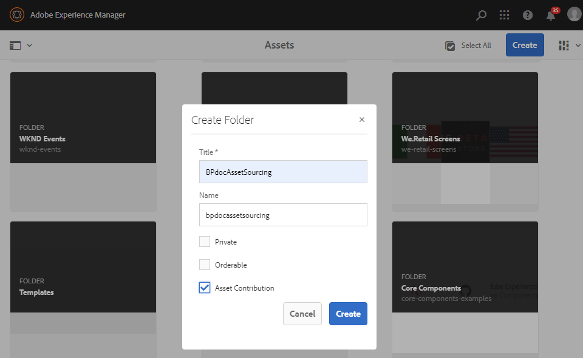

# Konfigurera bidragsmappen i AEM Assets {#configure-contribution-folder}

För samverkansbaserad resurskälla kan AEM användare (administratörer och icke-adminanvändare med behörighet) skapa nya mappar av typen **Resursbidrag** och säkerställa att den nya mappen som skapas är öppen för att skickas av Brand Portal-användare.  Detta utlöser automatiskt ett arbetsflöde som skapar ytterligare två undermappar, som kallas **DELAD** och **NYTT**, i den nyligen skapade **Contribute**-mappen.

AEM användare definierar sedan tillgångskraven genom att ladda upp en översikt över vilka typer av resurser som ska läggas till i bidragsmappen, samt en uppsättning baslinjeresurser, till mappen **SHARED** för att säkerställa att Brand Portal-användarna har den information de behöver. Administratören kan sedan ge aktiva Brand Portal-användare åtkomst till mappen för bidrag innan den nya Contribute-mappen publiceras på varumärkesportalen.

I följande video visas hur du konfigurerar en Contribute-mapp i AEM Assets:

>[!VIDEO](https://video.tv.adobe.com/v/30547)

AEM utför följande åtgärder när en avgiftsmapp konfigureras:

* [Skapa avgiftsmapp](#create-contribution-folder)
* [Överför tillgångskrav och tilldela medverkande](#configure-contribution-folder-properties)
* [Överför baslinjeresurser](#uplad-new-assets-to-contribution-folder)
* [Publicera mapp för bidrag från AEM Assets till varumärkesportalen](#publish-contribution-folder-to-brand-portal)

## Skapa avgiftsmapp {#create-contribution-folder}

AEM administratörer och icke-adminanvändare som har behörighet att skapa en ny mapp kan skapa en mapp för bidrag i AEM Assets.
Om du vill skapa en mapp för bidrag skapar du en ny mapp av typen Resursbidrag, som ser till att den nya mappen som skapas är öppen för att skickas in av Brand Portal-användare.  Detta utlöser automatiskt ett arbetsflöde som skapar ytterligare två undermappar, som kallas DELAD och NYTT, i bidragsmappen.

>[!NOTE]
>
>Du kan skapa flera bidragsmappar i en mapp. Skapa inte en mapp för bidrag i en annan mapp för bidrag.

**Så här skapar du en bidragsmapp:**
1. Logga in på din AEM Assets-instans.

1. Navigera till **[!UICONTROL Assets]** > **[!UICONTROL Files]**. Den visar alla befintliga mappar i AEM Assets-databasen.

1. Klicka på **[!UICONTROL Create]** för att skapa en ny mapp. **[!UICONTROL Create Folder]** öppnas.

1. Ange **[!UICONTROL Title]** och **[!UICONTROL Name]** för mappen och markera kryssrutan **[!UICONTROL Asset Contribution]**.
Vi rekommenderar att du använder gemener utan blanksteg för att namnge mappen.

1. Klicka på **[!UICONTROL Create]**. Du kan se bidragsmappen i AEM Assets-databasen.

   >[!NOTE]
   >
   >En icke-admin-användare kan skapa och dela en resursavgiftsmapp, men kan inte ändra eller ta bort den.

   

1. Klicka för att öppna mappen för bidrag så ser du att två undermappar -**[!UICONTROL SHARED]** och **[!UICONTROL NEW]** skapas automatiskt i mappen för bidrag.

   

Du kan nu konfigurera egenskaperna för bidragsmappen.

## Konfigurera egenskaper för bidragsmapp {#configure-contribution-folder-properties}

AEM utför följande åtgärder när du konfigurerar egenskaperna för en avgiftsmapp.

* **Lägg till beskrivning**: Ange en beskrivning av bidragsmappen på hög nivå.
* **Överför i korthet**: Överför tillgångskravsdokument som innehåller resursrelaterad information.
* **Lägg till medverkande**: Lägg till Brand Portal-användare för att ge dem åtkomst till mappen för bidrag.

Resurskravet avser den information som administratörer tillhandahåller för att hjälpa medverkande (varumärkesportalanvändare) att förstå behovet och kraven av bidragsmappen. Administratören överför ett tillgångskravsdokument som innehåller en sammanfattning om vilken typ av resurser som ska läggas till i avgiftsmappen och resursrelaterad information, till exempel syfte, typ av bilder, maxstorlek osv.

**Så här konfigurerar du bidragsmappens egenskaper:**

1. Logga in på din AEM Assets-instans.

1. Navigera till **[!UICONTROL Assets > Files]** och leta upp mappen för bidrag.
1. Välj mapp för bidrag och klicka på **[!UICONTROL Properties]** för att öppna fönstret Mappegenskaper.

   

   

1. Navigera till fliken **[!UICONTROL Asset Contribution]**.
1. Ange den höga nivån **[!UICONTROL Description]** i mappen för bidrag.
1. Klicka på **[!UICONTROL Upload Brief]** om du vill bläddra från den lokala datorn och överföra ett **dokument för tillgångskrav**.

   

1. I fältet **[!UICONTROL Add User]** lägger du till Brand Portal-användare som du vill dela mappen för bidrag med. Dessa användare kan komma åt och överföra innehåll till mappen för bidrag via gränssnittet för varumärkesportalen.
1. Klicka på **[!UICONTROL Save]**.

   

>[!NOTE]
>
>Sökresultaten baseras på användarlistan i varumärkesportalen som konfigurerats i AEM Assets. Se till att du har den uppdaterade användarlistan för varumärkesportalen.

## Överför resurser till avgiftsmappen {#uplad-new-assets-to-contribution-folder}

Brand Portal-användarna kan hämta tillgångskraven för att förstå behovet av bidrag.
De kan sedan skapa nya resurser för bidrag och överföra dem till mappen NYTT i mappen för bidrag.

>[!NOTE]
>
>Användare av varumärkesportalen kan bara överföra resurser till mappen NEW.
>
>Den maximala överföringsgränsen för alla innehavare av varumärkesportaler är **10** GB, som tillämpas kumulativt på alla bidragsmappar.

När de nyskapade resurserna har publicerats till AEM Assets kan Brand Portal-användarna ta bort dem från mappen NEW. Administratören för varumärkesportalen kan ta bort resurserna både från mappen NEW och SHARED.

När målet att skapa bidragsmappen är uppnått kan administratören för varumärkesportalen ta bort bidragsmappen och frigöra överföringsutrymmet för andra användare.

>[!NOTE]
>
>Vi rekommenderar att du frigör överföringsutrymmet när du har publicerat avgiftsbelagda mappar till AEM Assets så att de är tillgängliga för övriga Brand Portal-användare.
>
>Om du behöver utöka din varumärkesportaltenants överföringsgräns utöver **10** GB kontaktar du Adobe Support och anger kraven.

**Så här överför du nya resurser:**

1. Logga in på din Brand Portal-instans.
Kontrollpanelen för varumärkesportalen innehåller alla befintliga mappar som är tillåtna för användaren av varumärkesportalen tillsammans med den nyligen delade mappen för bidrag.

1. Markera mappen för bidrag och klicka för att öppna den. Mappen för bidrag innehåller två undermappar - **[!UICONTROL SHARED]** och **[!UICONTROL NEW]**.

1. Klicka på mappen **[!UICONTROL NEW]**.

   

1. Klicka på **[!UICONTROL Create]** > **[!UICONTROL Files]** om du vill överföra enskilda filer eller mappar (.zip) som innehåller flera resurser.

   

1. Bläddra och överför resurser (filer eller mappar) till mappen **[!UICONTROL NEW]**.

   

När du har överfört alla resurser eller mappar till mappen NEW publicerar du mappen för bidrag till AEM Assets.

## Publicera mapp för bidrag till varumärkesportalen {#publish-contribution-folder-to-brand-portal}

När bidragsmappen har konfigurerats kan AEM användare (administratör/icke-admin-användare) publicera bidragsmappen från AEM Assets till varumärkesportalen. Användare av varumärkesportalen som har behörighet att komma åt bidragsmappen får ett meddelande via e-post/puls när publiceringsåtgärden har slutförts.

**Så här publicerar du bidragsmappen:**

1. Logga in på din AEM Assets-instans.

1. Navigera till **[!UICONTROL Assets > Files]** och leta reda på mappen där du vill publicera till varumärkesportalen.
1. Välj mapp för bidrag och klicka på **[!UICONTROL Quick Publish]** > **[!UICONTROL Publish to Brand Portal]**.

   

   Du får ett meddelande när mappen för bidrag har publicerats på varumärkesportalen.

Ett e-post-/pulsmeddelande skickas till de Brand Portal-användare som är tilldelade till mappen för bidrag. Brand Portal-användare har åtkomst till mappen för bidrag och kan börja bidra. Se [Överför resurser till mappen för bidrag och publicera till AEM Assets](brand-portal-publish-contribution-folder-to-aem-assets.md).
