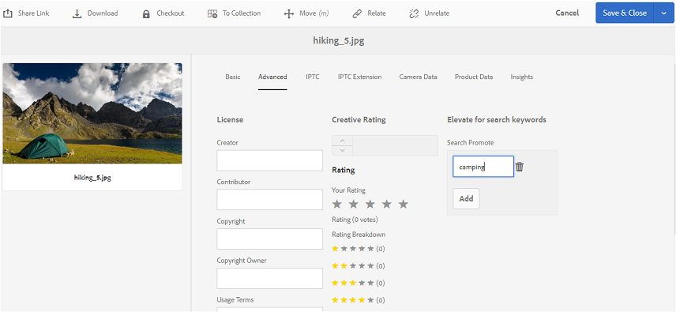

# Publicera taggar i varumärkesportalen {#publish-tags-to-brand-portal}

Lär dig hur du publicerar taggar från AEM Assets till varumärkesportalen.

Taggar är användbara när du vill ordna resurser och förbättra sökbarheten för resurser som de är kopplade till. Taggar kan ses som nyckelord eller etiketter (metadata) som bifogas med resurser, och gör att resurser snabbt kan hittas som ett resultat av en sökning. Om du vill veta hur du tilldelar taggar till resurser i AEM Resurser kan du läsa [use-taggar för att ordna resurser](https://helpx.adobe.com/experience-manager/6-5/assets/using/organize-assets.html#Usetagstoorganizeassets).

Taggar (som är kopplade till resurser och samlingar i AEM) publiceras automatiskt på varumärkesportalen när resurser (och samlingar) med associerade taggar publiceras på varumärkesportalen. De publicerade taggarna är användbara när du vill göra det möjligt att söka efter associerade resurser.

>[!NOTE]
>
>Vi rekommenderar dock att du exklusivt publicerar taggar i varumärkesportalen innan du publicerar de resurser (och samlingar) som taggarna är kopplade till. Detta ger snabbare publicering av materialet (och samlingarna) på varumärkesportalen.

## Hantera taggar {#manage-tags}

Du kan använda befintliga taggar för att bifoga till en resurs eller skapa nya taggar från AEM Tags Console (**[!UICONTROL Tools | Tagging | AEM Tags]**). I båda scenarierna måste du först publicera taggarna på varumärkesportalen och sedan associera dem med lämpliga resurser.

Så här skapar du taggar på AEM, publicerar taggarna på varumärkesportalen och associerar taggarna med lämpliga resurser (eller samlingar):

1. **Skapa taggar** Logga in på AEM Author-instansen med administratörsbehörighet och få åtkomst till **[!UICONTROL AEM Tags]** konsolen via global navigering:

   1. Välj **[!UICONTROL Tools]**

   1. Välj **[!UICONTROL General]**

   1. Välj **[!UICONTROL Tagging]**

1. Markera **[!UICONTROL Create]** och välj sedan **[!UICONTROL Create Tag]** alternativ.
1. Ange:

   * **[!UICONTROL Title]**
      *(obligatoriskt)* En visningsrubrik för taggen.
   * **[!UICONTROL Name]**
      *(obligatoriskt)* Ett namn för taggen. Om inget anges skapas ett giltigt nodnamn från titeln. Se [TaggID](https://helpx.adobe.com/experience-manager/6-5/sites/developing/using/framework.html#TagID).
   * **Beskrivning**
      *(valfritt)* En beskrivning av taggen.
   * **Taggens JCR-sökväg för taggsökvägen**.

1. Välj **[!UICONTROL Submit]** för att skapa taggen.

   När du har skapat en tagg på AEM-instansen är taggen tillgänglig för att bifogas till en resurs (med egenskapsavsnittet eller avsnittet Hantera taggar för resursen).

1. **Publicera taggen på varumärkesportalen**.

   Gå till **[!UICONTROL AEM Tags]** konsolen ([!UICONTROL Tools | Tagging | AEM Tags]), markera önskad tagg och publicera på varumärkesportalen.

1. **Koppla taggen till en resurs (eller samling)**.

   Markera en resurs (eller samling) och bifoga den önskade taggen med egenskapssektionen eller avsnittet Hantera taggar för den resursen. Mer information om hur du tilldelar taggar till resurser i AEM Resurser finns i [Använda taggar för att ordna resurser](https://helpx.adobe.com/experience-manager/6-5/assets/using/organize-assets.html#Usetagstoorganizeassets).

1. **Publicera resurser (eller samlingar) på varumärkesportalen**.\
   När du publicerar en resurs (eller samling) på varumärkesportalen är den bifogade taggen också tillgänglig på varumärkesportalen.

   Om du vill se den bifogade taggen för respektive resurs (eller samling) i varumärkesportalen loggar du in på Varumärkeportal och väljer resursen, under Egenskaper ser du den bifogade taggen.

## Search Promote {#search-promote}

Med AEM Assets Brand Portal kan du få specifika resurser att bli det främsta resultatet för sökningar baserat på en nyckelordstagg.

Så här utökar du en resurs för ett söknyckelord:

1. Öppna **[!UICONTROL Properties]** sidan för en resurs på AEM-författarinstansen.
1. Gå till **[!UICONTROL Advanced]** fliken.
1. I **[!UICONTROL Search Promote]** det **[!UICONTROL Elevate for search keywords]** här avsnittet väljer du **[!UICONTROL Add]** att lägga till söknyckelorden eller -taggarna.

   

1. Spara ändringarna.
1. Publicera resursen på varumärkesportalen.
1. Logga in på varumärkesportalen. Visa **[!UICONTROL Advanced]** fliken i **[!UICONTROL Properties]** avsnittet av resursen.
Observera att **[!UICONTROL Search Promote]** nyckelordet också visas i Egenskaper för resursen.
