# Arbeta med rapporter {#work-with-reports}

Rapporteringsfunktionen är avgörande vid bedömning av Brand Portal användning och för att veta hur interna och externa användare interagerar med godkända resurser. Administratörer kan visa Brand Portal användningsrapport, som alltid är tillgänglig på sidan Resursrapporter. Rapporter om användarinloggningar och resurser som hämtats, gått ut, publicerats och delats via länkar kan dock genereras och visas från sidan Resursrapporter. Dessa rapporter är till hjälp när det gäller att analysera resursdistributionen, vilket gör att ni kan ta fram viktiga framgångsmått för att mäta användningen av godkända resurser inom och utanför organisationen.

Rapporthanteringsgränssnittet är intuitivt och innehåller detaljerade alternativ och kontroller för att komma åt sparade rapporter. Du kan visa, hämta eller ta bort rapporter från sidan Resursrapporter, där alla tidigare genererade rapporter listas.

## Visa rapporter {#view-reports}

Så här visar du en rapport:

1. Tryck/klicka på Experience Manager-logotypen i verktygsfältet överst för att öppna administrationsverktygen.

   

1. På panelen Administrationsverktyg klickar du på **[!UICONTROL Create/Manage Reports]** att öppna **[!UICONTROL Asset Reports]** sida.

   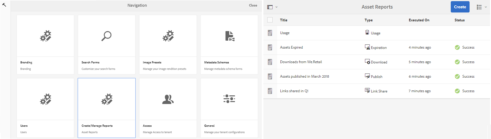

1. Åtkomst **[!UICONTROL Usage]** rapport och andra genererade rapporter från sidan Resursrapporter.

   >[!NOTE]
   >
   >Användningsrapport är en standardrapport som genereras i Brand Portal. Den kan inte skapas eller tas bort. Du kan dock skapa, hämta och ta bort rapporterna Hämta, Förfallotid, Publicera, Länkdelning och Användarinloggning.

   Om du vill visa en rapport klickar du på rapportlänken. Du kan också markera rapporten och trycka/klicka på ikonen Visa i verktygsfältet.

   **[!UICONTROL Usage Report]** visar information om antalet aktiva Brand Portal-användare, det lagringsutrymme som används av alla resurser och det totala antalet mediefiler i Brand Portal. De användare på varumärkesportalen som inte är tilldelade någon produktprofil i Admin Console betraktas som inaktiva användare och återspeglas inte i **[!UICONTROL Usage Report]**.
Rapporten visar även tillåten kapacitet för var och en av dessa informationsmått.

   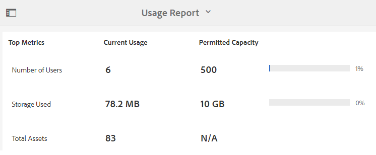

   **[!UICONTROL User Logins]** rapporten innehåller information om de användare som loggade in på Brand Portal. Rapporten innehåller visningsnamn, e-post-ID:n, profiler (admin, visningsprogram, redigerare, gäst), grupper, senaste inloggning, aktivitetsstatus och antal inloggningar för varje användare från distributionen av Brand Portal 6.4.2 fram till rapportgenereringen.

   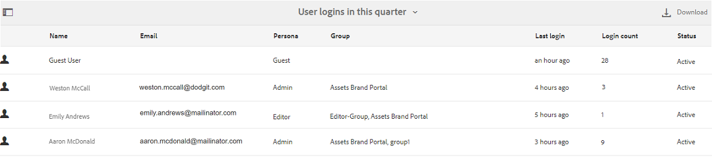

   **[!UICONTROL Download]** rapportlistor och detaljer om alla resurser som hämtats inom ett visst datum- och tidsintervall.

   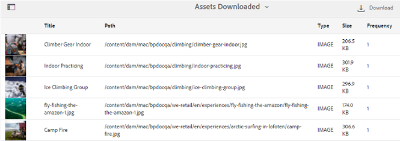

   >[!NOTE]
   >
   >Resurserna **[!UICONTROL Download]** rapporten visar endast de resurser som har valts ut separat och hämtats från Brand Portal. Om en användare har hämtat en mapp som innehåller resurser visas inte mappen eller resurserna i mappen i rapporten.

   **[!UICONTROL Expiration]** rapporten innehåller en lista med och information om alla resurser som har gått ut inom en viss tidsram.

   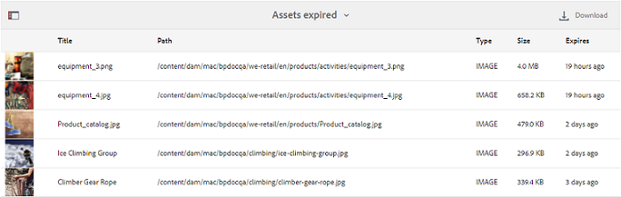

   **[!UICONTROL Publish]** rapporterar och ger information om alla resurser som publiceras från Experience Manager Assets till Brand Portal inom en viss tidsperiod.

   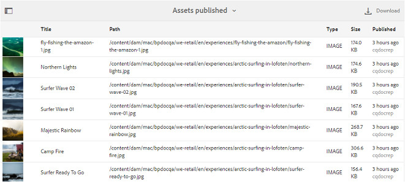

   >[!NOTE]
   >
   >Publiceringsrapport visar ingen information om innehållsfragment eftersom innehållsfragmenten inte kan publiceras till Brand Portal.

   **[!UICONTROL Link Share report]** visar alla resurser som delas via länkar från Brand Portal-gränssnittet inom en viss tidsram. Rapporten innehåller också information om när resursen delades via en länk, med vilken användare, när upphör länken och antalet delade länkar för innehavaren (och användare som resurslänken delades med). Det går inte att anpassa kolumnerna i länkdelningsrapporten.

   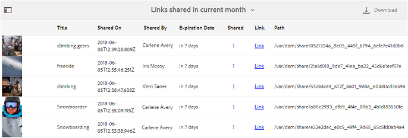

   >[!NOTE]
   >
   >I länkdelningsrapporten visas inte användare som har åtkomst till resursen som delas via länken eller som har hämtat resursen via länken.
   >
   >För att spåra nedladdningar via den delade länken måste du generera en nedladdningsrapport när du har valt **[!UICONTROL Only Link Share Downloads]** alternativ på **[!UICONTROL Create Report]** sida. Användaren (hämtas av) är dock anonym i det här fallet.

## Generera rapporter {#generate-reports}

Administratörerna kan generera och hantera följande standardrapporter som de sparar för att [använd](../using/brand-portal-reports.md#main-pars-header) senare:

* Användarinloggningar
* Hämta
* Förfaller
* Publicera
* Länkdelning

Kolumnerna i rapporten Download, Expiration, and Publish kan anpassas för visning. Så här skapar du en rapport:

1. Tryck/klicka på Experience Manager-logotypen i verktygsfältet överst för att öppna administrationsverktygen.

1. Tryck/klicka på panelen Administrationsverktyg **[!UICONTROL Create/Manage Reports]** att öppna **[!UICONTROL Asset Reports]** sida.

   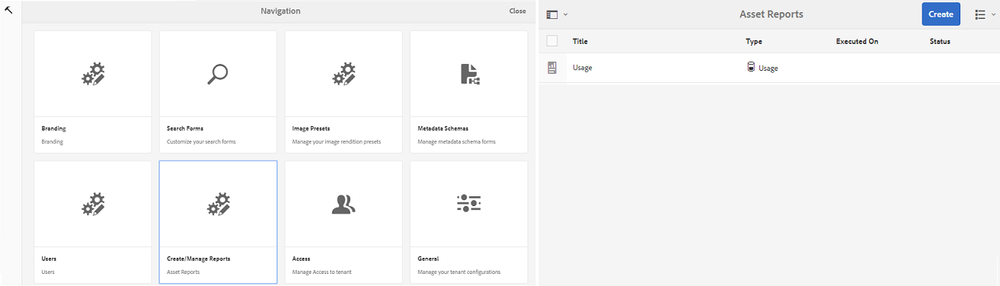

1. Tryck/klicka på knappen Resursrapporter på sidan Resursrapporter **[!UICONTROL Create]**.
1. Från **[!UICONTROL Create Report]** väljer du en rapport att skapa och trycker/klickar på **[!UICONTROL Next]**.

   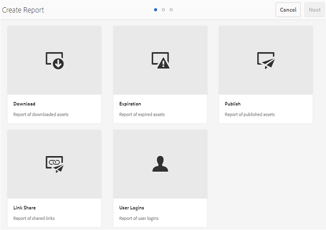

1. Konfigurera rapportinformation. Ange titel, beskrivning, mappstruktur (där rapporten måste köras och generera statistik) och datumintervall för **[!UICONTROL Download]**, **[!UICONTROL Expiration]** och **[!UICONTROL Publish]** rapporter.

   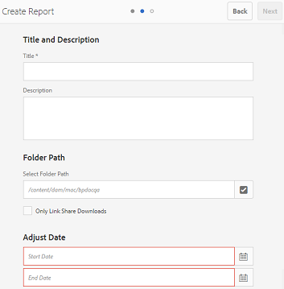

   med beaktande av följande: **[!UICONTROL Link Share Report]** behöver bara parametrarna för titel, beskrivning och datumintervall.

   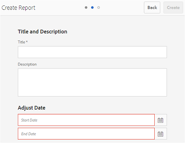

   >[!NOTE]
   >
   >Specialtecknen # och % i rapportrubriken ersätts med ett bindestreck (-) i rapportgenereringen.

1. Tryck/klicka **[!UICONTROL Next]**, för att konfigurera kolumnerna för hämtnings-, förfallodatum- och publiceringsrapporter.
1. Markera eller avmarkera kryssrutorna efter behov. Om du till exempel vill visa namn på användare (som hämtade resurser) i **[!UICONTROL Download]** rapport, välja **[!UICONTROL Downloaded By]**. Följande bild visar hur du väljer standardkolumner i hämtningsrapporten.

   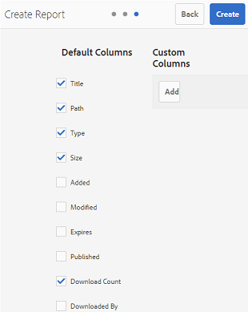

   Du kan också lägga till anpassade kolumner i dessa rapporter för att visa mer data för dina anpassade behov.

   Så här lägger du till anpassade kolumner i rapporten Hämta, Publicera eller Förfallotid:

   1. Visa en anpassad kolumn genom att trycka/klicka **[!UICONTROL Add]** inom [!UICONTROL Custom Columns].
   1. Ange namnet på kolumnen i **[!UICONTROL Column Name]** fält.
   1. Välj den egenskap som kolumnen ska kopplas till med hjälp av egenskapsväljaren.

      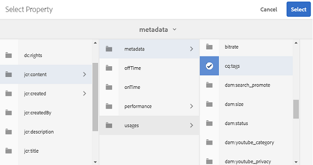
Du kan också skriva sökvägen i fältet för egenskapssökväg.

      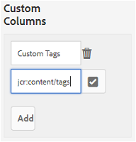

      Om du vill lägga till fler anpassade kolumner trycker du/klickar **Lägg till** och upprepa steg 2 och 3.

1. Tryck/klicka på **[!UICONTROL Create]**. Ett meddelande meddelar att rapportgenereringen har initierats.

## Hämta rapporter {#download-reports}

Om du vill spara och hämta en rapport som en CSV-fil gör du något av följande:

* Välj en rapport på sidan Resursrapporter och tryck/klicka på **[!UICONTROL Download]** i verktygsfältet högst upp.

* Öppna en rapport på sidan Resursrapporter. Välj **[!UICONTROL Download]** överst på rapportsidan.

## Ta bort rapporter {#delete-reports}

Om du vill ta bort en befintlig rapport väljer du rapporten från **[!UICONTROL Asset Reports]** sida och knacka/klicka **[!UICONTROL Delete]** i verktygsfältet högst upp.

>[!NOTE]
>
>**[!UICONTROL Usage]** kan inte tas bort.
