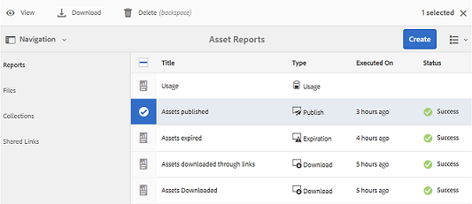

# Arbeta med rapporter {#work-with-reports}

Rapporteringsfunktionen är avgörande för att bedöma användningen av varumärkesportalen och för att veta hur interna och externa användare interagerar med godkända resurser. Administratörer kan visa användningsrapporten för varumärkesportalen, som alltid är tillgänglig på sidan Resursrapporter. Rapporter om användarinloggningar och resurser som hämtats, gått ut, publicerats och delats via länkar kan dock genereras och visas från sidan Resursrapporter. Dessa rapporter är till hjälp när det gäller att analysera resursdistributionen, vilket gör att ni kan ta fram viktiga framgångsmått för att mäta användningen av godkända resurser inom och utanför organisationen.

Rapporthanteringsgränssnittet är intuitivt och innehåller detaljerade alternativ och kontroller för att komma åt sparade rapporter. Du kan visa, hämta eller ta bort rapporter från sidan Resursrapporter, där alla tidigare genererade rapporter listas.

## Visa rapporter {#view-reports}

Så här visar du en rapport:

1. Tryck/klicka på AEM-logotypen i verktygsfältet överst för att öppna administrationsverktygen.

   

1. Öppna en sida genom **[!UICONTROL Create/Manage Reports]** att klicka på **[!UICONTROL Asset Reports]** den på panelen Administrationsverktyg.

   

1. Få åtkomst till **[!UICONTROL Usage]** rapporter och andra genererade rapporter från sidan Resursrapporter.

   >[!NOTE]
   >
   >Användningsrapport finns som standard i varumärkesportalen. Den kan inte skapas eller tas bort. Du kan dock skapa, hämta och ta bort rapporterna Hämta, Förfallotid, Publicera, Länkdelning och Användarinloggning.

   Om du vill visa en rapport trycker/klickar du på rapportlänken. Du kan också markera rapporten och trycka/klicka på ikonen Visa i verktygsfältet.

   **[!UICONTROL Usage Report]** visar information om antalet aktuella Brand Portal-användare, det lagringsutrymme som används av alla resurser och det totala antalet resurser i Brand Portal. Rapporten visar även tillåten kapacitet för var och en av dessa informationsmått.

   

   **[!UICONTROL User Logins]** rapporten innehåller information om de användare som loggade in på varumärkesportalen. Rapporten innehåller visningsnamn, e-post-ID:n, profiler (admin, visningsprogram, redigerare, gäst), grupper, senaste inloggning, aktivitetsstatus och antal inloggningar för varje användare från distributionen av Brand Portal 6.4.2 fram till tidpunkten för rapportgenereringen.

   

   **[!UICONTROL Download]** rapportlistor och detaljer om alla resurser som hämtats inom ett visst datum- och tidsintervall.

   

   >[!NOTE]
   >
   >Resurserna **[!UICONTROL Download]** visas endast de resurser som har valts separat och hämtats från varumärkesportalen. Om en användare har hämtat en mapp som innehåller resurser visas inte mappen eller resurserna i mappen i rapporten.

   **[!UICONTROL Expiration]** rapporten innehåller en lista med och information om alla resurser som har gått ut inom en viss tidsram.

   

   **[!UICONTROL Publish]** rapporterar och ger information om alla resurser som publiceras från AEM till varumärkesportalen inom en viss tidsperiod.

   

   >[!NOTE]
   >
   >Publiceringsrapport visar inte information om innehållsfragment eftersom innehållsfragmenten inte kan publiceras på varumärkesportalen.

   **[!UICONTROL Link Share report]** visar alla resurser som delas via länkar från gränssnittet för varumärkesportalen inom en viss tidsram. Rapporten innehåller också information om när resursen delades via en länk, med vilken användare, när upphör länken och antalet delade länkar för innehavaren (och användare som resurslänken delades med). Det går inte att anpassa kolumnerna i länkdelningsrapporten.

   

   >[!NOTE]
   >
   >I länkdelningsrapporten visas inte användare som har åtkomst till resursen som delas via länken eller som har hämtat resursen via länken.
   >
   >
   >Om du vill spåra nedladdningar via den delade länken måste du generera en nedladdningsrapport när du har valt **[!UICONTROL Only Link Share Downloads]** alternativ på **[!UICONTROL Create Report]** sidan. Användaren (hämtas av) är dock anonym i det här fallet.

## Generera rapporter {#generate-reports}

Administratörer kan generera och hantera följande standardrapporter som sedan genereras och som sedan [kan öppnas](../using/brand-portal-reports.md#main-pars-header) :

* Användarinloggningar
* Hämta
* Förfaller
* Publicera
* Länkdelning

Kolumnerna i rapporten Download, Expiration och Publish kan anpassas för visning. Så här skapar du en rapport:

1. Tryck/klicka på AEM-logotypen i verktygsfältet överst för att öppna administrationsverktygen.

   

1. Tryck/klicka på panelen Administrationsverktyg **[!UICONTROL Create/Manage Reports]** för att öppna **[!UICONTROL Asset Reports]** sidan.

   

1. Tryck/klicka på på sidan Resursrapporter **[!UICONTROL Create]**.
1. På **[!UICONTROL Create Report]** sidan väljer du en rapport som du vill skapa och trycker/klickar på **[!UICONTROL Next]**.

   

1. Konfigurera rapportinformation. Ange titel, beskrivning, mappstruktur (där rapporten måste köras och generera statistik) och datumintervall för **[!UICONTROL Download]**, **[!UICONTROL Expiration]** och **[!UICONTROL Publish]** rapporter.

   

   Det är **[!UICONTROL Link Share Report]** bara parametrarna för titel, beskrivning och datumintervall som behövs.

   

   >[!NOTE]
   >
   >Specialtecknen # och % i rapportrubriken ersätts med ett bindestreck (-) i rapportgenereringen.

1. Tryck/klicka **[!UICONTROL Next]** om du vill konfigurera kolumnerna för hämtnings-, förfallo- och publiceringsrapporter.
1. Markera eller avmarkera kryssrutorna efter behov. Om du till exempel vill visa namn på användare (som hämtade resurser) i **[!UICONTROL Download]** rapporten väljer du **[!UICONTROL Downloaded By]**. Följande bild visar hur du väljer standardkolumner i hämtningsrapporten.

   

   Du kan också lägga till anpassade kolumner i dessa rapporter för att visa mer data för dina anpassade behov.

   Så här lägger du till anpassade kolumner i rapporten Hämta, Publicera eller Förfallotid:

   1. Om du vill visa en anpassad kolumn trycker/klickar du **[!UICONTROL Add]** inuti [!UICONTROL Custom Columns].
   1. Ange namnet på kolumnen i **[!UICONTROL Column Name]** fältet.
   1. Välj den egenskap som kolumnen ska kopplas till med hjälp av egenskapsväljaren.

      
Du kan också skriva sökvägen i fältet för egenskapssökväg.

      

      Om du vill lägga till fler anpassade kolumner trycker/klickar du på **Lägg till** och upprepar steg 2 och 3.

1. Tryck/klicka på **[!UICONTROL Create]**. Ett meddelande meddelar att rapportgenereringen har initierats.

## Hämta rapporter {#download-reports}

Om du vill spara och hämta en rapport som en CSV-fil gör du något av följande:

* Välj en rapport på sidan Resursrapporter och tryck/klicka på **[!UICONTROL Download]** i verktygsfältet högst upp.

* Öppna en rapport på sidan Resursrapporter. Välj ett **[!UICONTROL Download]** alternativ högst upp på rapportsidan.

## Ta bort rapporter {#delete-reports}

Om du vill ta bort en befintlig rapport markerar du rapporten från **[!UICONTROL Asset Reports]** sidan och trycker/klickar på **[!UICONTROL Delete]** i verktygsfältet högst upp.

>[!NOTE]
>
>**[!UICONTROL Usage]** kan inte tas bort.
