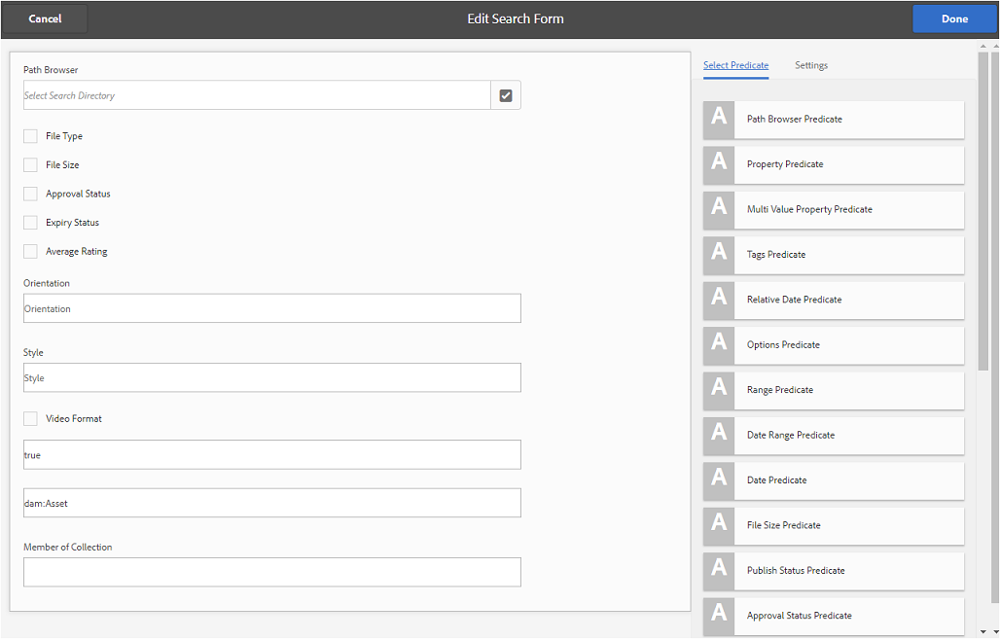
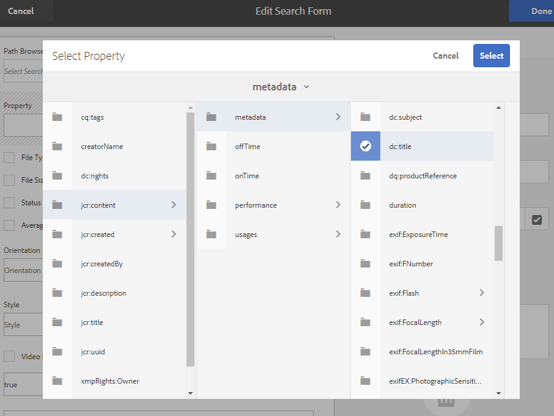

# Använda anpassade sökfaktorer {#use-custom-search-facets}

Administratörer kan lägga till sökpredikat i [!UICONTROL Filters] för att anpassa sökningen och göra sökfunktionen flexibel.

Brand Portal stöder [facetterad sökning](../using/brand-portal-searching.md#search-using-facets-in-filters-panel) för detaljerade sökningar av godkända varumärkestillgångar, vilket är möjligt på grund av [**Filter** panel](../using/brand-portal-searching.md#search-using-facets-in-filters-panel). Sökfaktorer är tillgängliga på filterpanelen via **[!UICONTROL Search Form]** i administrationsverktygen. Det finns ett standardsökformulär med namnet Resursadministratörens sökväg på Forms-sidan Sök i administrationsverktygen. Administratörer kan dock anpassa standardpanelen för filter genom att redigera standardsökformuläret (Resursadministratörens sökspår) genom att lägga till, ändra eller ta bort sökpredikt, vilket gör sökfunktionen mångsidig.

Du kan använda olika sökpredikat för att anpassa **[!UICONTROL Filters]** -panelen. Lägg till exempel till egenskapspredikatet för att söka efter resurser som matchar en enda egenskap som du anger i det här predikatet. Lägg till alternativpredikatet för att söka efter resurser som matchar ett eller flera värden som du anger för en viss egenskap. Lägg till datumintervallpredikatet för att söka efter resurser som skapats inom ett angivet datumintervall.

>[!NOTE]
>
>Experience Manager Assets ger företag möjlighet att [publicera anpassade sökformulär från AEM Author](../using/publish-schema-search-facets-presets.md#publish-search-facets-to-brand-portal) till Brand Portal i stället för att återskapa samma formulär på Brand Portal.

## Lägg till ett sökpredikat {#add-a-search-predicate}

Lägga till ett sökpredikat i **[!UICONTROL Filters]** panel:

1. Klicka på Experience Manager-logotypen i verktygsfältet högst upp för att öppna administrationsverktygen.

   

1. På panelen Administrationsverktyg klickar du på **[!UICONTROL Search Forms]**.

   

1. I **[!UICONTROL Search Forms]** sida, markera **[!UICONTROL Assets Admin Search Rail]**.

   

1. I verktygsfältet som visas överst klickar du på **[!UICONTROL Edit]** för att öppna redigeringssökformuläret.

   

1. I [!UICONTROL Edit Search Form] drar du ett predikat från [!UICONTROL Select Predicate] till huvudfönstret. Dra till exempel **[!UICONTROL Property Predicate]**.

   The **[!UICONTROL Property]** fältet visas i huvudrutan och **[!UICONTROL Settings]** till höger visar egenskapspredikat.

   

   >[!NOTE]
   >
   >Rubriketiketten i **[!UICONTROL Settings]** identifierar vilken typ av predikat du väljer.

1. I **[!UICONTROL Settings]** anger du en etikett, platshållartext och beskrivning för egenskapspredikatet.

   * Välj **[!UICONTROL Partial Search]** om du vill tillåta partiell frassökning (och jokerteckenssökning) av resurser baserat på det angivna egenskapsvärdet. Som standard har predikatet stöd för fulltextsökning.
   * Välj **[!UICONTROL Ignore Case]** om du vill att resurssökningen baserat på egenskapsvärdet ska vara skiftlägeskänslig. Som standard är sökningen efter egenskapsvärden i sökfiltret skiftlägeskänslig.

   >[!NOTE]
   >
   >Vid markering **[!UICONTROL Partial Search]** kryssruta, **[!UICONTROL Ignore Case]** är markerat som standard.

1. I **[!UICONTROL Property Name]** öppnar du egenskapsväljaren och väljer den egenskap som sökningen baseras på. Du kan också ange ett namn för egenskapen. Skriv till exempel `jcr :content/metadata/dc:title` eller `./jcr:content/metadata/dc:title`.

   >[!NOTE]
   >
   >I Brand Portal gäller alla String-egenskaper (utom de som börjar med `xmp`) i `jcrcontent/metadata` av `dam:asset` indexeras som standard.
   >
   >Alla egenskaper som är indexerade kan användas när ett egenskapsprediat skapas. Om en egenskap som inte är indexerad är konfigurerad kanske sökfrågan för en egenskap som inte är indexerad inte ger något sökresultat.

   

1. Klicka **[!UICONTROL Done]** för att spara inställningarna.
1. Från [!UICONTROL Assets] klickar du på överläggsikonen och väljer **[!UICONTROL Filter]** navigera till **[!UICONTROL Filters]** -panelen. Predikatet **[!UICONTROL Property]** läggs till på panelen.

   

1. Ange en rubrik för resursen som ska genomsökas i **[!UICONTROL Property]** textruta. Exempel: &quot;Adobe&quot;. När du gör en sökning visas resurser med titeln &quot;Adobe&quot; i sökresultatet.

## Lista med sökpredikt {#list-of-search-predicates}

Liknar hur du lägger till en **[!UICONTROL Property]** kan du lägga till följande predikat i **[!UICONTROL Filters]** panel:

| **Predikatnamn** | **Beskrivning** | **Egenskaper** |
|-------|-------|----------|
| **[!UICONTROL Path Browser]** | Sök på predikatet för att söka efter resurser på en viss plats. **Obs!** *För en inloggad användare visar sökvägsläsaren på filtret endast innehållsstrukturen för de mappar (och deras överordnade) som delas med användaren.*   Administratörsanvändare kan söka efter resurser i vilken mapp som helst genom att navigera till den mappen med hjälp av Sökväg i webbläsaren.   Användare som inte är administratörer kan söka efter resurser i en mapp (som är tillgänglig för dem) genom att navigera till den mappen i Sökvägsläsaren. | <ul><li>Fältetikett</li><li>Bana</li><li>Beskrivning</li></ul> |
| **[!UICONTROL Property]** | Sök efter resurser baserat på en viss metadataegenskap. **Obs!** *Om du väljer Delvis sökning är Ignorera skiftläge valt som standard*. | <ul><li>Fältetikett</li><li>Platshållare</li><li>Egenskapsnamn</li><li>Delvis sökning</li><li>Ignorera skiftläge</li><li> Beskrivning</li></ul> |
| **[!UICONTROL Multi-Value Property]** | Liknar egenskapsprediat men tillåter flera indatavärden, avgränsade med en avgränsare (standardvärdet är COMMA)[,]) resurser som matchar något av indatavärdena returneras i resultatet. | <ul><li>Fältetikett</li><li>Platshållare</li><li>Egenskapsnamn</li><li>Stöd för avgränsare</li><li>Ignorera skiftläge</li><li>Beskrivning</li></ul> |
| **[!UICONTROL Tags]** | Sök efter predikatorn för att söka efter resurser baserat på taggar. Du kan konfigurera egenskapen Path så att den fyller i olika taggar i listan Taggar. *Obs! Administratörer kan behöva ändra sökvägsvärdet, till exempel [!UICONTROL `/etc/tags/mac/<tenant_id>/<custom_tag_namespace>`], om de publicerar sökformuläret från AEM, där sökvägen inte innehåller information om t.ex. innehavare [!UICONTROL `/etc/tags/<custom_tag_namespace>`]. | <ul><li>Fältetikett</li><li>Egenskapsnamn</li><li>Bana</li><li>Beskrivning</li></ul> |
| **[!UICONTROL Path]** | Sök på predikatet för att söka efter resurser på en viss plats. | <ul><li>Fältetikett</li><li>Bana</li><li>Beskrivning</li></ul> |                                                     |
| **[!UICONTROL Relative Date]** | Sökpredikatet för att söka efter resurser baserat på det relativa datumet då de skapades. | <ul><li>Fältetikett</li><li>Egenskapsnamn</li><li>Relativt datum</li></ul> |
| **[!UICONTROL Range]** | Sök på predikatet för att söka efter resurser som ligger inom ett angivet intervall med egenskapsvärden. På panelen Filter kan du ange lägsta och högsta egenskapsvärden för intervallet. | <ul><li>Fältetikett</li><li>Egenskapsnamn</li><li>Beskrivning</li></ul> |
| **[!UICONTROL Date Range]** | Sökpredikatet för att söka efter resurser som skapats inom ett angivet intervall efter en datumegenskap. På panelen Filter kan du ange start- och slutdatum. | <ul><li>Fältetikett</li><li>Platshållare</li><li>Egenskapsnamn</li><li>Intervalltext (från)</li><li>Intervalltext (till)</li><li>Beskrivning</li></ul> |
| **[!UICONTROL Date]** | Sökpredikatet för en skjutreglagebaserad sökning efter resurser baserat på en date-egenskap. | <ul><li>Fältetikett</li><li>Egenskapsnamn</li><li>Beskrivning</li></ul> |
| **[!UICONTROL File Size]** | Sök efter predikatorn för att söka efter resurser baserat på deras storlek. | <ul><li>Fältetikett</li><li>Egenskapsnamn</li><li>Bana</li><li>Beskrivning</li></ul> |
| **[!UICONTROL Asset Last Modified]** | Sökpredikatet om du vill söka efter resurser baserat på det senaste ändringsdatumet. | <ul><li>Fältetikett</li><li>Egenskapsnamn</li><li>Beskrivning</li></ul> |
| **[!UICONTROL Approval Status]** | Sökpredikatet om du vill söka efter resurser baserat på metadataegenskapen för godkännande. Standardegenskapsnamnet är **dam:status**. | <ul><li>Fältetikett</li><li>Egenskapsnamn</li><li>Beskrivning</li></ul> |
| **[!UICONTROL Checkout Status]** | Sök på predikatet för att söka efter resurser baserat på utcheckningsstatusen för en resurs när den publicerades från AEM Assets. | <ul><li>Fältetikett</li><li>Egenskapsnamn</li><li>Beskrivning</li></ul> |
| **[!UICONTROL Checked Out By]** | Sökpredikatet för att söka efter resurser baserat på den användare som har checkat ut resursen. | <ul><li>Fältetikett</li><li>Egenskapsnamn</li><li>Beskrivning</li></ul> |
| **[!UICONTROL Expiry Status]** | Sök på predikatet för att söka efter resurser baserat på förfallostatusen. | <ul><li>Fältetikett</li><li>Egenskapsnamn</li><li>Beskrivning</li></ul> |
| **[!UICONTROL Member of collection]** | Sök efter predikatorn för att söka efter resurser baserat på om en resurs är en del av en samling eller inte. | Beskrivning |
| **[!UICONTROL Hidden]** | Det här predikatet är inte synligt för slutanvändarna och används för dolda begränsningar som vanligtvis begränsar sökresultatstypen till **dam:Asset**. | <ul><li>Fältetikett</li><li>Egenskapsnamn</li><li>Beskrivning</li></ul> |

>[!NOTE]
>
>* Använd inte **[!UICONTROL Options Predicate]**, **[!UICONTROL Publish Status Predicate]** och **[!UICONTROL Rating Predicate]** eftersom dessa predikat inte fungerar i Brand Portal.
>* Mapptypspredikat `(nt:folder type)` stöds inte på Brand Portal och kan orsaka prestandaproblem. Om det finns i ett publicerat anpassat sökformulär kan det tas bort genom att du redigerar sökformuläret.

## Ta bort ett sökpredikat {#delete-a-search-predicate}

Så här tar du bort ett sökpredikat:

1. Klicka på Adobe-logotypen för att komma åt administrationsverktygen.

   

1. På panelen Administrationsverktyg klickar du på **[!UICONTROL Search Forms]**.

   

1. I **[!UICONTROL Search Forms]** sida, markera **[!UICONTROL Assets Admin Search Rail]**.

   

1. I verktygsfältet som visas överst klickar du på **[!UICONTROL Edit]** för att öppna redigeringssökformuläret.

   

1. I [!UICONTROL Edit Search Form] väljer du det predikat du vill ta bort från huvudrutan. Välj till exempel **[!UICONTROL Property Predicate]**.

   The **[!UICONTROL Settings]** till höger visar egenskapspredikatsfält.

1. Klicka på bin-ikonen om du vill ta bort egenskapspredikatet. På **[!UICONTROL Delete Field]** klickar du på **[!UICONTROL Delete]** för att bekräfta borttagningsåtgärden.

   The **[!UICONTROL Property Predicate]** fältet tas bort från huvudrutan och **[!UICONTROL Settings]** tabben blir tom.

   

1. Klicka på **[!UICONTROL Done]** i verktygsfältet.
1. Från **[!UICONTROL Assets]** klickar du på överläggsikonen och väljer **[!UICONTROL Filter]** navigera till **[!UICONTROL Filters]** -panelen. The **[!UICONTROL Property]** predikatet tas bort från panelen.

   
