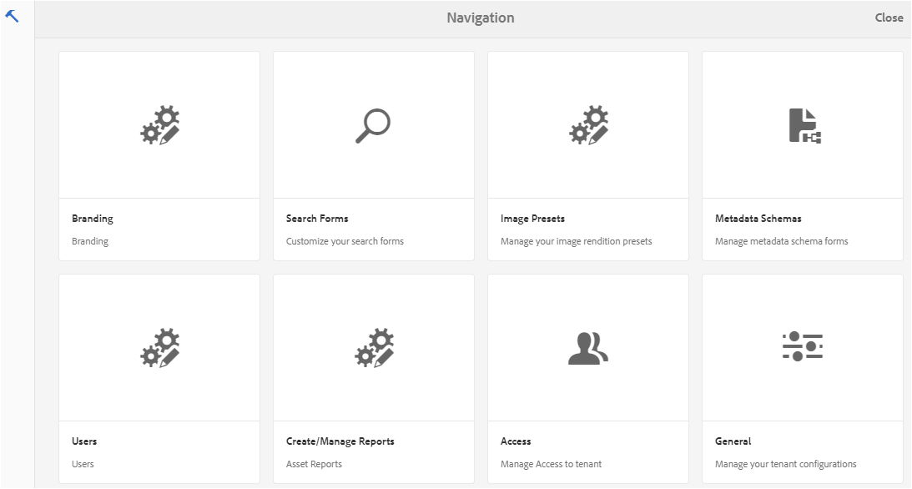
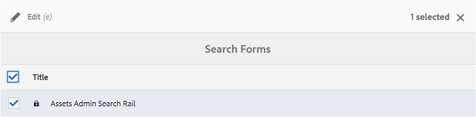
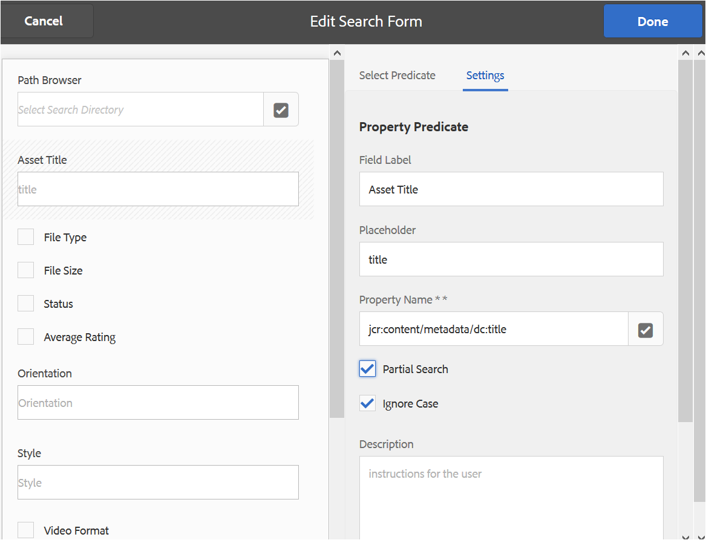
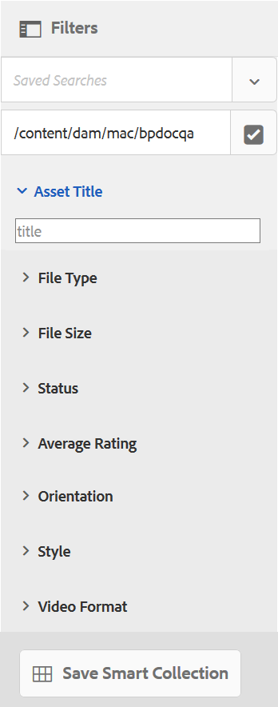
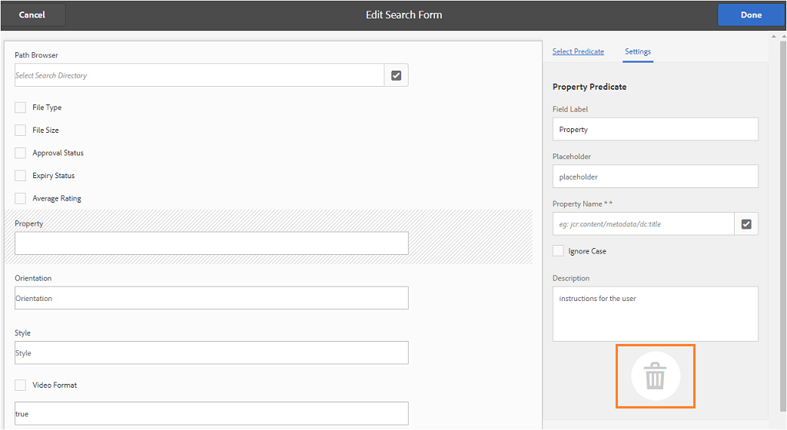

# Använd anpassade sökfaktorer {#use-custom-search-facets}

Administratörer kan lägga till sökpredikat i panelen [!UICONTROL Filters] för att anpassa sökningen och göra sökfunktionen flexibel.

Varumärkesportalen stöder [fasetterad sökning](../using/brand-portal-searching.md#search-using-facets-in-filters-panel) för detaljerade sökningar efter godkända varumärkesresurser, vilket är möjligt på grund av panelen [**Filter**](../using/brand-portal-searching.md#search-using-facets-in-filters-panel). Sökfaktorer är tillgängliga på panelen Filter via **[!UICONTROL Search Form]** i administrationsverktygen. Det finns ett standardsökformulär med namnet Resursadministratörens sökväg på Forms-sidan Sök i administrationsverktygen. Administratörer kan dock anpassa standardpanelen för filter genom att redigera standardsökformuläret (Resursadministratörens sökspår) genom att lägga till, ändra eller ta bort sökpredikt, vilket gör sökfunktionen mångsidig.

Du kan använda olika sökpredikat för att anpassa panelen **[!UICONTROL Filters]**. Lägg till exempel till egenskapspredikatet för att söka efter resurser som matchar en enda egenskap som du anger i det här predikatet. Lägg till alternativpredikatet för att söka efter resurser som matchar ett eller flera värden som du anger för en viss egenskap. Lägg till datumintervallpredikatet för att söka efter resurser som skapats inom ett angivet datumintervall.

>[!NOTE]
>
>Med AEM kan organisationer [publicera anpassade sökformulär från AEM Author](../using/publish-schema-search-facets-presets.md#publish-search-facets-to-brand-portal) till varumärkesportalen i stället för att återskapa samma formulär på varumärkesportalen.

## Lägg till ett sökpredikat {#add-a-search-predicate}

Så här lägger du till ett sökpredikat på panelen **[!UICONTROL Filters]**:

1. Om du vill öppna administrationsverktygen klickar du på AEM logotyp i verktygsfältet högst upp.

   

1. Klicka på **[!UICONTROL Search Forms]** på panelen Administrationsverktyg.

   

1. Välj **[!UICONTROL Assets Admin Search Rail]** på sidan **[!UICONTROL Search Forms]**.

   

1. Klicka på **[!UICONTROL Edit]** i det övre verktygsfältet för att öppna redigeringssökformuläret.

   

1. På sidan [!UICONTROL Edit Search Form] drar du ett predikat från fliken [!UICONTROL Select Predicate] till huvudrutan. Dra till exempel **[!UICONTROL Property Predicate]**.

   Fältet **[!UICONTROL Property]** visas i huvudrutan och fliken **[!UICONTROL Settings]** till höger visar egenskapspredikat.

   

   >[!NOTE]
   >
   >Rubriketiketten på fliken **[!UICONTROL Settings]** identifierar vilken typ av predikat du väljer.

1. På fliken **[!UICONTROL Settings]** anger du en etikett, platshållartext och beskrivning för egenskapspredikatet.

   * Välj **[!UICONTROL Partial Search]** om du vill tillåta partiell frassökning (och jokerteckenssökning) av resurser baserat på det angivna egenskapsvärdet. Som standard har predikatet stöd för fulltextsökning.
   * Välj **[!UICONTROL Ignore Case]** om du vill att resurssökningen baserat på egenskapsvärdet ska vara skiftlägeskänslig. Som standard är sökningen efter egenskapsvärden i sökfiltret skiftlägeskänslig.

   >[!NOTE]
   >
   >När du markerar kryssrutan **[!UICONTROL Partial Search]** är **[!UICONTROL Ignore Case]** markerat som standard.

1. Öppna egenskapsväljaren i fältet **[!UICONTROL Property Name]** och välj den egenskap som sökningen baseras på. Du kan också ange ett namn för egenskapen. Skriv till exempel `  jcr :content/metadata/dc:title` eller `./jcr:content/metadata/dc:title`.

   

1. Klicka på **[!UICONTROL Done]** för att spara inställningarna.
1. Klicka på överläggsikonen i [!UICONTROL Assets]-användargränssnittet och välj **[!UICONTROL Filter]** för att navigera till panelen **[!UICONTROL Filters]**. Predikatet **[!UICONTROL Property]** läggs till på panelen.

   

1. Ange en rubrik för resursen som ska sökas igenom i textrutan **[!UICONTROL Property]**. Exempel: &quot;Adobe&quot;. När du gör en sökning visas resurser med titeln &quot;Adobe&quot; i sökresultatet.

## Lista med sökpredikt {#list-of-search-predicates}

På samma sätt som du lägger till ett **[!UICONTROL Property]**-predikat kan du lägga till följande predikat på panelen **[!UICONTROL Filters]**:

| **Predikatnamn** | **Beskrivning** | **Egenskaper** |
|-------|-------|----------|
| **[!UICONTROL Path Browser]** | Sök på predikatet för att söka efter resurser på en viss plats. **Obs!** *För en inloggad användare visar sökvägsläsaren på filtret endast innehållsstrukturen i de mappar (och deras överordnade) som delas med användaren.*   Administratörsanvändare kan söka efter resurser i vilken mapp som helst genom att navigera till den mappen med hjälp av Sökväg i webbläsaren.   Användare som inte är administratörer kan söka efter resurser i en mapp (som är tillgänglig för dem) genom att navigera till den mappen i Sökvägsläsaren. | <ul><li>Fältetikett</li><li>Bana</li><li>Beskrivning</li></ul> |
| **[!UICONTROL Property]** | Sök efter resurser baserat på en viss metadataegenskap. **Obs!** *Om du väljer Delvis sökning väljs Ignorera skiftläge som standard*. | <ul><li>Fältetikett</li><li>Platshållare</li><li>Egenskapsnamn</li><li>Delvis sökning</li><li>Ignorera skiftläge</li><li> Beskrivning</li></ul> |
| **[!UICONTROL Multi-Value Property]** | Liknar egenskapsprediate men tillåter flera indatavärden, avgränsade med en avgränsare (standardvärdet är COMMA[,]), som matchar något av indatavärdena returneras i resultat. | <ul><li>Fältetikett</li><li>Platshållare</li><li>Egenskapsnamn</li><li>Stöd för avgränsare</li><li>Ignorera skiftläge</li><li>Beskrivning</li></ul> |
| **[!UICONTROL Tags]** | Sök efter predikatorn för att söka efter resurser baserat på taggar. Du kan konfigurera egenskapen Path så att den fyller i olika taggar i listan Taggar. *Obs! Administratörer kan behöva ändra sökvägsvärdet, till exempel [!UICONTROL `/etc/tags/mac/<tenant_id>/<custom_tag_namespace>`], om de publicerar sökformuläret från AEM, där sökvägen inte innehåller klientinformation, till exempel [!UICONTROL `/etc/tags/<custom_tag_namespace>`]. | <ul><li>Fältetikett</li><li>Egenskapsnamn</li><li>Bana</li><li>Beskrivning</li></ul> |
| **[!UICONTROL Path]** | Sök på predikatet för att söka efter resurser på en viss plats. | <ul><li>Fältetikett</li><li>Bana</li><li>Beskrivning</li></ul> |  |
| **[!UICONTROL Relative Date]** | Sökpredikatet för att söka efter resurser baserat på det relativa datumet då de skapades. | <ul><li>Fältetikett</li><li>Egenskapsnamn</li><li>Relativt datum</li></ul> |
| **[!UICONTROL Range]** | Sök på predikatet för att söka efter resurser som ligger inom ett angivet intervall med egenskapsvärden. På panelen Filter kan du ange lägsta och högsta egenskapsvärden för intervallet. | <ul><li>Fältetikett</li><li>Egenskapsnamn</li><li>Beskrivning</li></ul> |
| **[!UICONTROL Date Range]** | Sökpredikatet för att söka efter resurser som skapats inom ett angivet intervall efter en datumegenskap. På panelen Filter kan du ange start- och slutdatum. | <ul><li>Fältetikett</li><li>Platshållare</li><li>Egenskapsnamn</li><li>Intervalltext (från)</li><li>Intervalltext (till)</li><li>Beskrivning</li></ul> |
| **[!UICONTROL Date]** | Sökpredikatet för en skjutreglagebaserad sökning efter resurser baserat på en date-egenskap. | <ul><li>Fältetikett</li><li>Egenskapsnamn</li><li>Beskrivning</li></ul> |
| **[!UICONTROL File Size]** | Sök efter predikatorn för att söka efter resurser baserat på deras storlek. | <ul><li>Fältetikett</li><li>Egenskapsnamn</li><li>Bana</li><li>Beskrivning</li></ul> |
| **[!UICONTROL Asset Last Modified]** | Sökpredikatet om du vill söka efter resurser baserat på det senaste ändringsdatumet. | <ul><li>Fältetikett</li><li>Egenskapsnamn</li><li>Beskrivning</li></ul> |
| **[!UICONTROL Approval Status]** | Sökpredikatet för att söka efter resurser baserat på metadataegenskapen för godkännande. Standardegenskapsnamnet är **dam:status**. | <ul><li>Fältetikett</li><li>Egenskapsnamn</li><li>Beskrivning</li></ul> |
| **[!UICONTROL Checkout Status]** | Sök på predikatet för att söka efter resurser baserat på utcheckningsstatusen för en resurs när den publicerades från AEM Assets. | <ul><li>Fältetikett</li><li>Egenskapsnamn</li><li>Beskrivning</li></ul> |
| **[!UICONTROL Checked Out By]** | Sökpredikatet för att söka efter resurser baserat på den användare som har checkat ut resursen. | <ul><li>Fältetikett</li><li>Egenskapsnamn</li><li>Beskrivning</li></ul> |
| **[!UICONTROL Expiry Status]** | Sök på predikatet för att söka efter resurser baserat på förfallostatusen. | <ul><li>Fältetikett</li><li>Egenskapsnamn</li><li>Beskrivning</li></ul> |
| **[!UICONTROL Member of collection]** | Sök efter predikatorn för att söka efter resurser baserat på om en resurs är en del av en samling. | Beskrivning |
| **[!UICONTROL Hidden]** | Det här predikatet är inte explicit synligt för slutanvändarna och används för eventuella dolda begränsningar som vanligtvis begränsar sökresultatstypen till **dam:Asset**. | <ul><li>Fältetikett</li><li>Egenskapsnamn</li><li>Beskrivning</li></ul> |

>[!NOTE]
>
>Använd inte **[!UICONTROL Options Predicate]**, **[!UICONTROL Publish Status Predicate]** och **[!UICONTROL Rating Predicate]** eftersom dessa predikat inte fungerar i varumärkesportalen.

## Ta bort ett sökpredikat {#delete-a-search-predicate}

Så här tar du bort ett sökpredikat:

1. Klicka på Adobe-logotypen för att komma åt administrationsverktygen.

   

1. Klicka på **[!UICONTROL Search Forms]** på panelen Administrationsverktyg.

   

1. Välj **[!UICONTROL Assets Admin Search Rail]** på sidan **[!UICONTROL Search Forms]**.

   

1. Klicka på **[!UICONTROL Edit]** i det övre verktygsfältet för att öppna redigeringssökformuläret.

   

1. På sidan [!UICONTROL Edit Search Form] väljer du det predikat du vill ta bort från huvudrutan. Välj till exempel **[!UICONTROL Property Predicate]**.

   Fliken **[!UICONTROL Settings]** till höger visar egenskapspredikatsfält.

1. Klicka på bin-ikonen om du vill ta bort egenskapspredikatet. Klicka på **[!UICONTROL Delete]** i dialogrutan **[!UICONTROL Delete Field]** för att bekräfta borttagningsåtgärden.

   Fältet **[!UICONTROL Property Predicate]** tas bort från huvudrutan och fliken **[!UICONTROL Settings]** blir tom.

   

1. Spara ändringarna genom att klicka på **[!UICONTROL Done]** i verktygsfältet.
1. Klicka på överläggsikonen i **[!UICONTROL Assets]**-användargränssnittet och välj **[!UICONTROL Filter]** för att navigera till panelen **[!UICONTROL Filters]**. **[!UICONTROL Property]**-predikatet har tagits bort från panelen.

   
