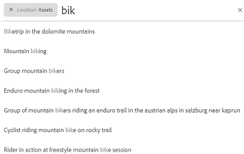
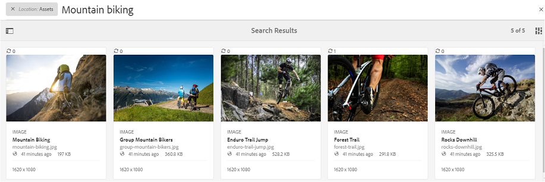
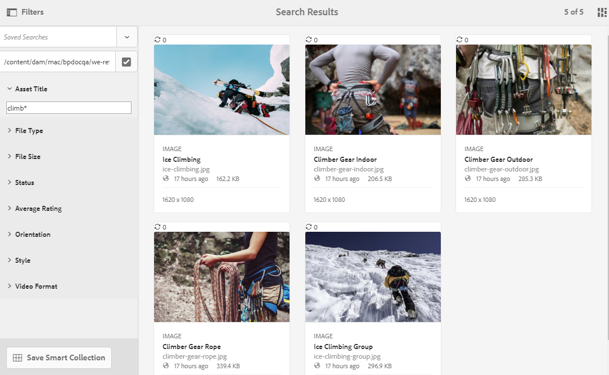
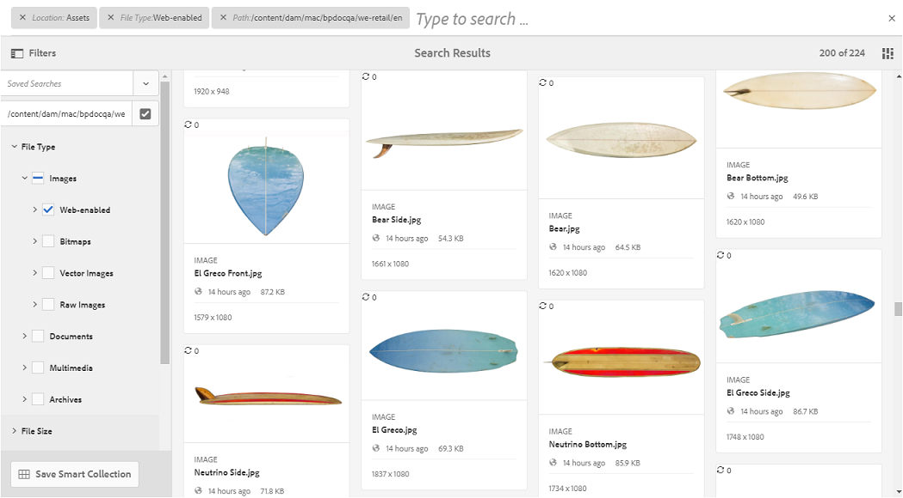
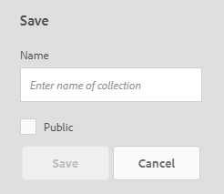
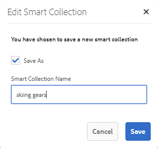
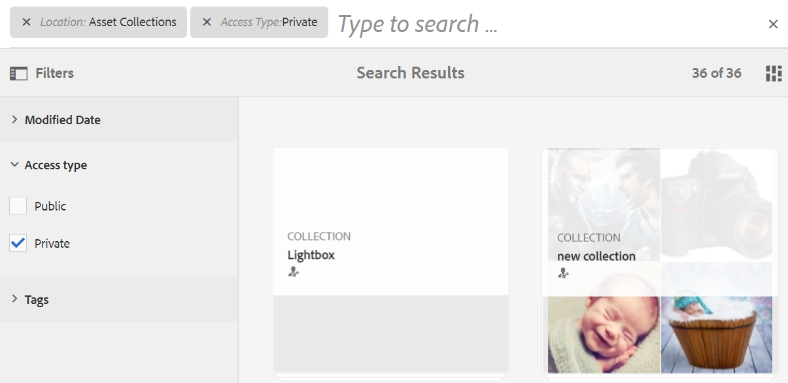

# Sök efter resurser på Brand Portal {#search-assets-on-brand-portal}

Med Brand Portal sökfunktion kan du snabbt söka efter relevanta resurser med hjälp av sökning och ansiktssökning som använder filter för att ytterligare begränsa sökningen. Du kan söka efter resurser på fil- eller mappnivå och spara sökresultaten som smarta samlingar.

>[!NOTE]
>
>Brand Portal har inte stöd för sökning i samlingar med omnissearch.
>
>Du kan dock använda [sökfilter för att få en lista över relevanta samlingar](#search-collection).

## Söka efter resurser med Omnissearch {#search-assets-using-omnisearch}

Så här söker du efter resurser på Brand Portal:

1. I verktygsfältet klickar du på **[!UICONTROL Search]** eller tryck på&#x200B;**[!UICONTROL /]** för att starta Omnissearch.

   

1. Skriv ett nyckelord för de resurser du vill söka efter i sökrutan.

   

   >[!NOTE]
   >
   >Minst tre tecken krävs i sökningen för att sökförslagen ska visas.

1. Välj bland de relaterade förslag som visas i listrutan för att snabbt komma åt relevanta resurser.

   

   *Resurssökning med omnissearch*

Mer information om sökbeteenden med smarta taggade resurser finns i [förstå sökresultat och beteende](https://experienceleague.adobe.com/docs/experience-manager-65/assets/using/search-assets.html).

## Söka med ansikten på panelen Filter {#search-using-facets-in-filters-panel}

Sökfaktorer på panelen Filter ger en mer detaljerad sökupplevelse och gör sökfunktionen effektiv. Sökfacets använder flera dimensioner (predikatfärger) som gör att du kan utföra komplexa sökningar. Du kan enkelt gå ned till önskad detaljnivå för en mer fokuserad sökning.

Om du till exempel söker efter en bild kan du välja om du vill ha en bitmapp eller en vektorbild. Du kan begränsa sökningen ytterligare genom att ange MIME-typen för bilden i sökaspekten Filtyp. På samma sätt kan du ange formatet, t.ex. PDF eller MS® Word, när du söker efter dokument.

The **[!UICONTROL Filters]** panelen innehåller några standardaspekter, till exempel **[!UICONTROL Path Browser]**, **[!UICONTROL File Type]**, **[!UICONTROL File Size]**, **[!UICONTROL Status]** och **[!UICONTROL Orientation]**. Du kan dock [lägga till anpassade sökfaktorer](../using/brand-portal-search-facets.md) eller ta bort specifika sökfaktorer från **[!UICONTROL Filters]** genom att lägga till eller ta bort predikat i det underliggande sökformuläret. Se listan över tillgängliga och användbara [sökpredikat på Brand Portal](../using/brand-portal-search-facets.md#list-of-search-predicates).

Tillämpa filter på sökningen med hjälp av de tillgängliga [sökfack](../using/brand-portal-search-facets.md):

1. Klicka på övertäckningsikonen och välj **[!UICONTROL Filter]**.

   

1. Från **[!UICONTROL Filters]** till vänster väljer du lämpliga alternativ för att använda relevanta filter.
Använd till exempel följande standardfilter:

   * **[!UICONTROL Path Browser]** om du vill söka efter resurser i en viss katalog. Standardsöksökvägen för predikatet för Bandläsaren är `/content/dam/mac/<tenant-id>/`som kan konfigureras genom att redigera standardsökformuläret.
   >[!NOTE]
   >
   >Till icke-adminanvändare, [!UICONTROL Path Browser] in [!UICONTROL Filter] På panelen visas endast innehållsstrukturen för de mappar (och deras överordnade mappar) som delas med dem.\
   >Om du vill administrera användare kan du navigera till valfri mapp i Brand Portal med hjälp av Path Browser.

   * **[!UICONTROL File Type]** för att ange typ (bild, dokument, multimedia, arkiv) av resursfilen som du söker efter. Du kan dessutom begränsa omfattningen av sökningen, till exempel ange MIME-typen (TIFF, Bitmapp, GIMP-bilder) för bilden eller formatet (PDF eller MS® Word) för dokumenten.
   * **[!UICONTROL File Size]** om du vill söka efter resurser baserat på deras storlek. Du kan ange de nedre och övre gränserna för storleksintervallet för att begränsa sökningen och ange vilken måttenhet som ska sökas igenom.
   * **[!UICONTROL Status]** om du vill söka efter resurser baserat på tillgångsstatus, t.ex. Godkännande (Godkänd, Ändringar Begärd, Avvisad, Väntande) och Förfallotid.
   * **[!UICONTROL Average Rating]** för att söka efter resurser baserat på tillgångarnas värdering.
   * **[!UICONTROL Orientation]** om du vill söka efter resurser baserat på orienteringen (vågrät, lodrät, kvadratisk) för resurserna.
   * **[!UICONTROL Style]** om du vill söka efter resurser baserat på resursernas stil (färgad, monokrom).
   * **[!UICONTROL Video Format]** om du vill söka efter videoresurser baserat på deras format (DVI, Flash, MPEG4, MPEG, OGG Theora, QuickTime, Windows Media, WebM).

   Du kan använda [anpassade sökfaktorer](../using/brand-portal-search-facets.md) på panelen Filter genom att redigera det underliggande sökformuläret.

   * **[!UICONTROL Property Predicate]** om det används i sökformuläret kan du söka efter resurser som matchar en metadataegenskap som predikatet är mappat till.\
      Om egenskapspredikatet till exempel är mappat till [!UICONTROL `jcr:content /metadata/dc:title`]kan du söka efter resurser baserat på deras titel.\
      The [!UICONTROL Property Predicate] har stöd för textsökningar för:

      **Delfraser**
Om du vill tillåta resurssökning med partiella fraser i egenskapspredikatet aktiverar du **[!UICONTROL Partial Search]** i sökformuläret. På så sätt kan du söka efter de önskade resurserna även om du inte anger de exakta ord/fraser som används i metadata för resursen.

      >[!NOTE]
      >
      > Brand Portal har stöd för följande fält för partiell sökning:
      >* jcr:content/metadata/dc:title
      >* jcr:content/jcr:title
      >* jcr:content/metadata/dam:search_Promote
      >* jcr:content/metadata/dc:format

      Du kan:
      * Ange ett ord som förekommer i din sökfras i ansiktet på panelen Filter. Om du t.ex. söker efter termen **klättra** (och Egenskapspredikatet mappas till [!UICONTROL `dc:title`] egenskapen), sedan alla resurser med ordet **klättra** i sin namnfras returneras.
      * Ange en del av ordet, som finns i den sökta frasen, tillsammans med jokertecken (&#42;) för att fylla luckorna.
Om du till exempel söker efter:
         * **klättra&#42;** returnerar alla resurser som har ord som börjar med tecknen &quot;klättra&quot; i titelfrasen.
         * **&#42;klättra** returnerar alla resurser med ord som slutar med tecknen &quot;klättra&quot; i titelfrasen.
         * **&#42;klättra&#42;** returnerar alla resurser som har ord som innehåller tecknen &quot;klättra&quot; i titelfrasen.

Aktivera alternativet       **Ej skiftlägeskänslig text**
Aktivera alternativet **[!UICONTROL Ignore Case]** i sökformuläret. Som standard är textsökningen på egenskapspredikatet skiftlägeskänslig.
   >[!NOTE]
   >
   >Vid markering **[!UICONTROL Partial Search]** kryssruta, **[!UICONTROL Ignore Case]** är markerat som standard.

   

   Sökresultaten visas enligt de filter som används, tillsammans med antalet sökresultat.

   

   Resultat av resurssökning med antal sökresultat.

1. Du kan enkelt navigera till ett objekt från sökresultatet och gå tillbaka till samma sökresultat med bakåtknappen i webbläsaren utan att behöva köra sökfrågan igen.

## Spara dina sökningar som en smart samling {#save-your-searches-as-smart-collection}

Du kan spara sökinställningarna som en smart samling för att snabbt kunna upprepa samma sökning utan att behöva göra om samma inställningar senare. Du kan dock inte använda sökfilter i en samling.

Så här sparar du sökinställningarna som en smart samling:

1. Tryck/klicka **[!UICONTROL Save Smart Collection]** och ange ett namn för den smarta samlingen.

   Om du vill göra den smarta samlingen tillgänglig för alla användare väljer du **[!UICONTROL Public]**. Ett meddelande bekräftar att den smarta samlingen skapades och lades till i listan över dina sparade sökningar.

   >[!NOTE]
   >
   >Användare som inte är administratörer kan begränsas från att göra smarta samlingar offentliga, så att du slipper ha ett stort antal publika smarta samlingar som skapats av användare som inte är administratörer i organisationens Brand Portal. Organisationer kan inaktivera **[!UICONTROL Allow public smart collections creation]** konfiguration från **[!UICONTROL General]** inställningar som är tillgängliga på panelen Administrationsverktyg.

   

1. Spara den smarta samlingen med ett annat namn och markera eller rensa **[!UICONTROL Public]** kryssruta, klicka **[!UICONTROL Edit Smart Collection]**.

   

1. På **[!UICONTROL Edit Smart Collection]** väljer **[!UICONTROL Save As]** och ange ett namn för den smarta samlingen. Klicka på **[!UICONTROL Save]**.

   

## Sök i samling {#search-collection}

Omnissearch stöds inte för samlingar. Du kan dock använda sökfilter för att lista de relevanta samlingarna inifrån [!UICONTROL Collections] gränssnitt.

Från [!UICONTROL Collections] klickar du på övertäckningsikonen för att öppna filterpanelen i den vänstra listen. Använd ett eller flera sökfilter från de tillgängliga filtren (`modified date`, `access type`och `tags`). Här visas de mest relevanta samlingarna baserat på de använda filtren.

