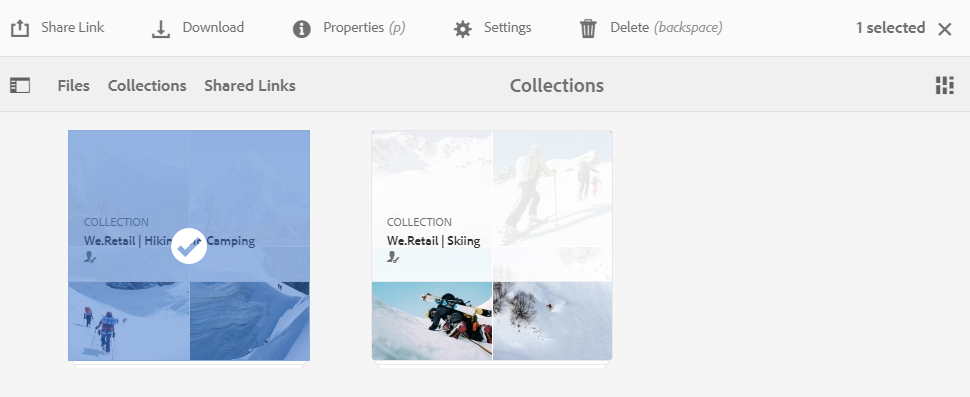
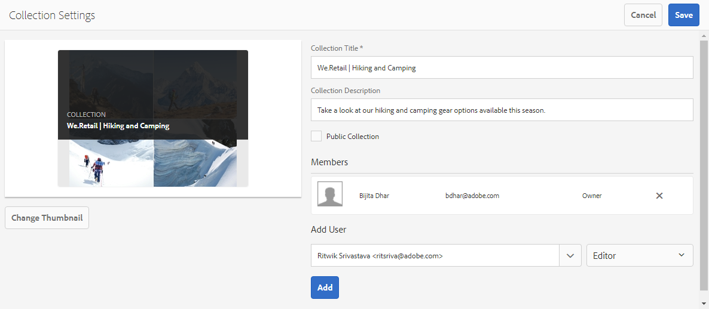
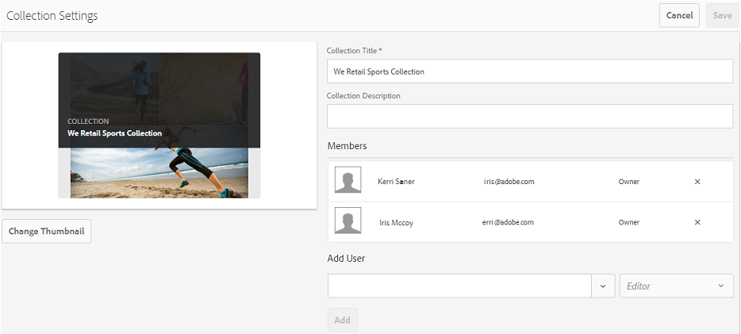
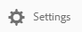
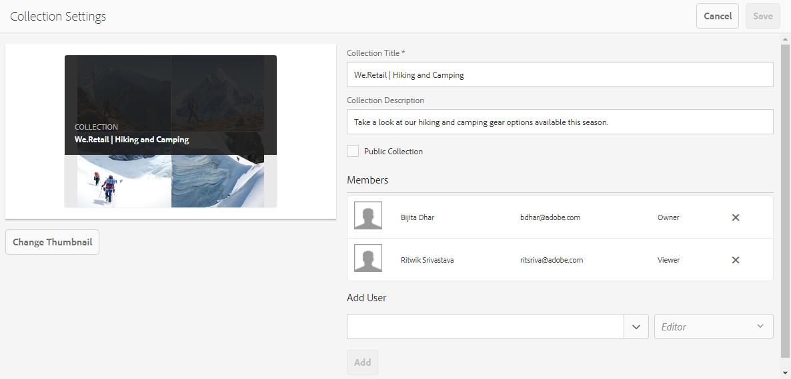
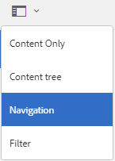
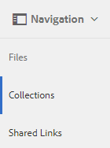

# Dela samlingar {#share-collections}

En samling representerar en grupp relaterade resurser som lagras tillsammans i Adobe Experience Manager Assets Brand Portal. Användarna kan skapa smarta samlingar genom att [använda sökning eller facet-sökning för att filtrera bort relaterade resurser](brand-portal-searching.md) och lagra dem tillsammans för enkel åtkomst och ytterligare dela dem med andra Brand Portal-användare.

Administratörerna kan dela och ta bort delning av en samling med auktoriserade Brand Portal-användare. Redigerare och visningsprogram kan visa och dela samlingar som de skapat, delat med dem och offentliga samlingar.

>[!NOTE]
>
>Redigerare kan inte ändra en offentlig samling till en icke-offentlig samling och har därför inte kryssrutan **[!UICONTROL Public Collection]** tillgänglig i dialogrutan **[!UICONTROL Collection Settings]**.

## Dela en samling {#share-collection}

Följ de här stegen för att dela en samling med auktoriserade Brand Portal-användare:

1. Logga in på din klient för varumärkesportalen. Som standard öppnas vyn **[!UICONTROL Files]** som innehåller alla publicerade resurser och mappar.

1. Klicka på **[!UICONTROL Collections]** i snabbnavigeringarna högst upp.

1. Gör något av följande från **[!UICONTROL Collections]**-konsolen:

   * Håll pekaren över den samling du vill dela. Klicka på ikonen **[!UICONTROL Settings]** från miniatyrbilderna för snabbåtgärder som är tillgängliga för samlingen.

      

   * Markera den samling som du vill dela. Klicka på **[!UICONTROL Settings]** i verktygsfältet överst.

      

1. I dialogrutan **[!UICONTROL Collection Settings]** väljer du de användare som du vill dela samlingen med och väljer rollen som användaren ska matcha sin globala roll. Tilldela till exempel redigerarrollen till en global redigerare, visningsprogramrollen till ett globalt visningsprogram.

   Du kan också göra samlingen tillgänglig för alla användare oavsett deras gruppmedlemskap och roll genom att markera kryssrutan **[!UICONTROL Public Collection]**.

   >[!NOTE]
   >
   >Användare som inte är administratörer kan dock hindras från att skapa offentliga samlingar, så att du slipper ha flera offentliga samlingar så att systemutrymmet kan sparas. Organisationer kan inaktivera **[!UICONTROL Allow public collections creation]**-konfigurationen från **[!UICONTROL General]**-inställningarna som är tillgängliga på panelen Administrationsverktyg.

   

   Redigerarna kan inte ändra en offentlig samling till en icke-offentlig samling och har därför inte kryssrutan **[!UICONTROL Public Collection]** tillgänglig i dialogrutan **[!UICONTROL Collection Settings]**.

   

1. Klicka på knappen **[!UICONTROL Add]** för att lägga till användaren och klicka sedan på **[!UICONTROL Save]**. Samlingen delas med användarna.

   >[!NOTE]
   >
   >En användares roll styr åtkomsten till resurser och mappar i en samling. Om en användare inte har åtkomst till resurser delas en tom samling med användaren. Dessutom styr en användares roll vilka åtgärder som är tillgängliga för samlingar.

## Ta bort delning av samling {#unshare-a-collection}

Så här tar du bort delningen av en tidigare delad samling:

1. Välj den samling du vill ta bort delningen från **[!UICONTROL Collections]**-konsolen.

   Klicka på **[!UICONTROL Settings]** i verktygsfältet överst.

   

1. I dialogrutan **[!UICONTROL Collection Settings]**, under avsnittet **[!UICONTROL Members]**, klickar du på symbolen **[!UICONTROL x]** bredvid användare för att ta bort dem från listan över användare som har åtkomst till samlingen.

   

1. Ett varningsmeddelande visas. Klicka på **[!UICONTROL Confirm]** om du vill ta bort delningen av samlingen.

1. Klicka på **[!UICONTROL Save]** för att tillämpa ändringarna.

   När användaren har tagits bort från den delade listan tas den odelade samlingen bort från användarens **[!UICONTROL Collections]**-konsol.

<!--
1. Click the overlay icon on the left, and choose **[!UICONTROL Navigation]**.

   

1. From the siderail on the left, click **[!UICONTROL Collections]**.

   

1. From the **[!UICONTROL Collections]** console, do one of the following:

    * Hover the pointer over the collection you want to share. From the quick action thumbnails available for the collection, click the **[!UICONTROL Settings]** icon.

   

    * Select the collection you want to share. From the toolbar at the top, click **[!UICONTROL Settings]**.
    
   

1. In the [!UICONTROL Collection Settings] dialog box, select the users or groups with whom you want to share the collection and select the role for a user or a group to match their global role. For example, assign the Editor role to a global editor, the Viewer role to a global viewer.

   Alternatively, to make the collection available to all users irrespective of their group membership and role, make it public by selecting the **[!UICONTROL Public Collection]** check-box.

   >[!NOTE]
   >
   >However, non-admin users can be restricted from creating public collections, to avoid having numerous public collections so that system space can be saved. Organizations can disable the **[!UICONTROL Allow public collections creation]** configuration from [!UICONTROL General] settings available in admin tools panel.

   

   Editors cannot change a public collection to a non-public collection and, therefore, do not have **[!UICONTROL Public Collection]** check-box available in **[!UICONTROL Collection Settings]** dialog.

   

1. Select **[!UICONTROL Add]**, and then **[!UICONTROL Save]**. The collection is shared with the chosen users.

   >[!NOTE]
   >
   >A user's role governs access to the assets and folders inside a collection. If a user does not have access to assets, an empty collection is shared with the user. Also, a user's role governs the actions available for collections.

## Unshare a collection {#unshare-a-collection}

To unshare a previously shared collection, do the following:

1. From the **[!UICONTROL Collections]** console, select the collection you want to unshare.

   In the toolbar, click **[!UICONTROL Settings]**.

   

1. On the **[!UICONTROL Collection Settings]** dialog box, under **[!UICONTROL Members]**, click the **[!UICONTROL x]** symbol next to users or groups to remove them from the list of users you shared the collection with.

   

1. In the warning message box, click **[!UICONTROL Confirm]** to confirm unshare.

   Click **[!UICONTROL Save]**.

1. Log in to Brand Portal with the credentials of the user you removed from the shared list. The collection is removed from the **[!UICONTROL Collections]** console.
-->