# Dela mappar på varumärkesportalen {#share-folders}

Resurser måste publiceras på varumärkesportalen från en förkonfigurerad AEM Author-instans, eftersom varumärkesportalen inte stöder tillgångsintag.

## Arbetsflöde för mappdelning i varumärkesportalen {#folder-sharing-workflow-in-brand-portal}

Nedan beskrivs arbetsflödet för mappdelning och användaråtkomst:

* Som standard visas alla mappar som publiceras från AEM Assets till varumärkesportalen endast för varumärkesportaladministratören, såvida de inte är markerade som offentliga när replikeringen konfigureras.
* Administratören använder konsolen **[!UICONTROL Folder Properties]** för att dela en mapp med selektiva användare eller grupper. Endast de användare eller grupper som mappen delas med kan se mappen efter att de har loggat in på varumärkesportalen. Mappen är inte synlig för andra användare.
* Administratören kan även välja att göra en mapp offentlig genom kryssrutan **[!UICONTROL Public Folder]** i **[!UICONTROL Folder Properties]**-konsolen. En gemensam mapp visas för alla användare.

* Oberoende av användarroller och behörigheter kan användare som loggar in på varumärkesportalen se alla gemensamma mappar och de mappar som delas direkt med dem eller med en grupp som de tillhör. Privata mappar, eller mappar som delas med andra användare, visas inte för alla användare.

### Dela mappar med användargrupper på varumärkesportalen {#sharing-folders-with-user-groups-on-brand-portal}

Åtkomsträttigheter för resurser i en mapp är beroende av åtkomsträttigheterna för den överordnade mappen, oavsett inställningarna för de underordnade mapparna. Det här beteendet styrs av [ACL:er](https://helpx.adobe.com/experience-manager/6-5/sites/administering/using/security.html#PermissionsinAEM) i AEM, eftersom underordnade mappar ärver ACL:er från sina överordnade mappar. Om till exempel en mapp A innehåller mappen B som innehåller mappen C, har en eller flera användargrupper som har behörighet till mappen A även samma åtkomstbehörighet till mappen B och mappen C. Mapp B är underordnad mappen till A ärver åtkomstkontrollistan och mapp C är underordnad mappen till B ärver åtkomstkontrollistan.

På samma sätt har användargrupper (eller användare) som bara har behörighet att komma åt mappen B samma åtkomstbehörighet i mappen C men inte i mappen A. Därför bör organisationer ordna sitt innehåll så att de flesta exponerade resurserna placeras i mappen med underordnade och så att åtkomsten från underordnade till rotmappen kan begränsas.

### Publicera {#public-folder-publish} i en gemensam mapp

Såvida inte alternativet **[!UICONTROL Public Folder Publish]** är markerat när du konfigurerar varumärkesportalreplikering har icke-adminanvändare (som redigerare och visningsprogram) inte åtkomst till resurser som publicerats från AEM Assets till varumärkesportalen.

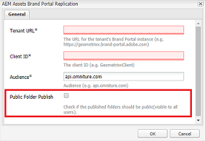

Om alternativet **[!UICONTROL Public Folder Publish]** är inaktiverat måste administratörer dela dessa resurser specifikt med icke-adminanvändare som använder delningsfunktioner.

>[!NOTE]
>
>Alternativet att aktivera **[!UICONTROL Public Folder Publish]** finns i AEM 6.3.2.1 och senare.

## Åtkomst till delade mappar {#access-to-shared-folders}

I följande matris beskrivs åtkomsträttigheter och rättigheter att dela/ta bort delning av resurser för olika användarroller:

|  | Åtkomst till alla mappar som publicerats från AEM Assets till varumärkesportalen | Åtkomst till delade mappar | Dela/ta bort mapprättigheter |
|---------------|-----------|-----------|------------|
| Administratör | Ja | Ja | Ja |
| Redigerare | Nej* | Ja, endast om det delas med dem eller med den grupp de tillhör | Ja, endast för de mappar som delas med dem eller med den grupp som de tillhör |
| Visningsprogram | Nej* | Ja, endast om det delas med dem eller med den grupp de tillhör | Nej |
| Gästanvändare | Nej* | Ja, endast om det delas med dem eller med den grupp de tillhör | Nej |

>[!NOTE]
>
>Som standard är alternativet **[!UICONTROL Public Folder Publish]** inaktiverat när replikering av varumärkesportalen konfigureras med AEM Author. Om alternativet är aktiverat är de mappar som publiceras på varumärkesportalen som standard tillgängliga för alla användare (även icke-adminanvändare).

### Åtkomst från icke-admin-användare till delade mappar {#non-admin-user-access-to-shared-folders}

Användare som inte är administratörer har bara åtkomst till de mappar som delas med dem på varumärkesportalen. Hur dessa mappar visas på portalen när de loggas in beror dock på inställningarna för **[!UICONTROL Enable Folder Hierarchy]**-konfigurationen.

**Om konfigurationen är inaktiverad**

Användare som inte är administratörer ser alla mappar som delas med dem på landningssidan när de loggar in på varumärkesportalen.

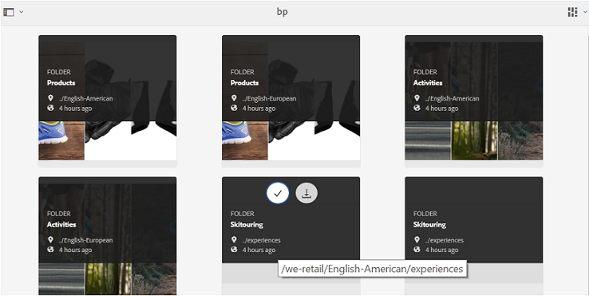

**Om konfigurationen är aktiverad**

Icke-adminanvändare ser mappträdet (från rotmappen) och de delade mapparna i sina respektive överordnade mappar när de loggar in på varumärkesportalen.

De här överordnade mapparna är de virtuella mapparna och inga åtgärder kan utföras på dem. Du känner igen dessa virtuella mappar med en låsikon.

Inga åtgärder visas vid hovring eller markering i **[!UICONTROL Card View]**, till skillnad från delade mappar. **[!UICONTROL Overview]** visas när du väljer en virtuell mapp i  **[!UICONTROL Column View]** och  **[!UICONTROL List View]**.

>[!NOTE]
>
>Observera att standardminiatyrbilden för de virtuella mapparna är miniatyrbilden för den första delade mappen.

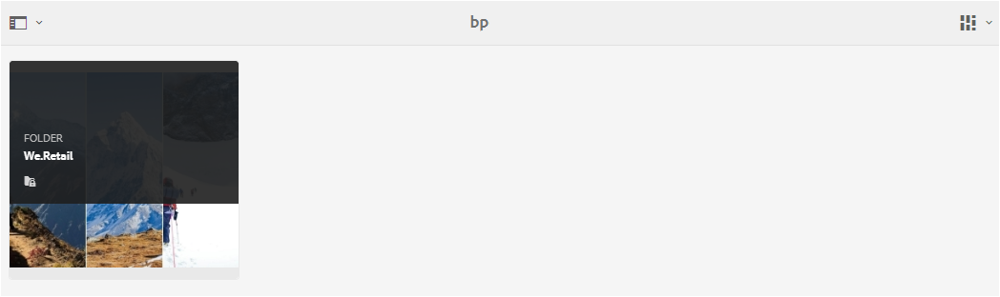 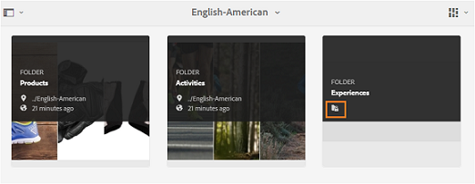 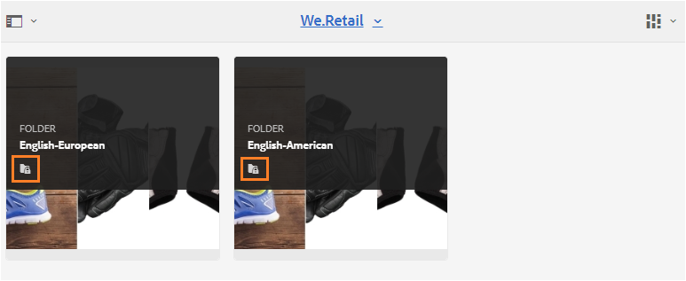 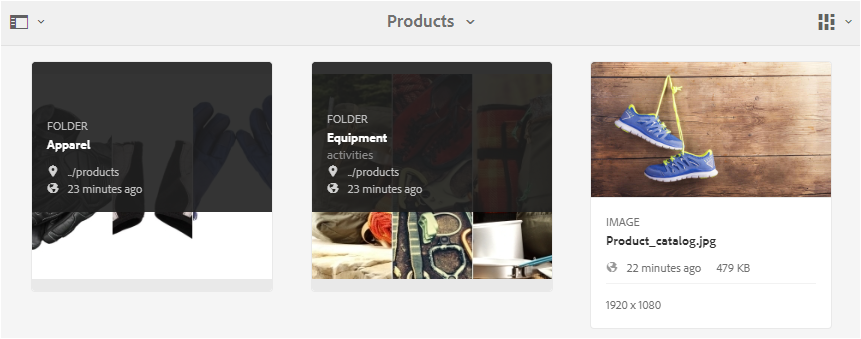

## Dela mappar {#how-to-share-folders}

Så här delar du en mapp med användare på varumärkesportalen:

1. Klicka på övertäckningsikonen till vänster och välj **[!UICONTROL Navigation]**.

   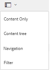

1. Välj **[!UICONTROL Files]** i sidofältet till vänster.

   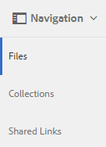

1. I gränssnittet för varumärkesportalen väljer du den mapp du vill dela.

   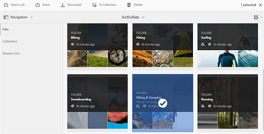

1. Välj **[!UICONTROL Share]** i verktygsfältet överst.

   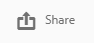

   Konsolen [!UICONTROL Folder Properties] visas.

   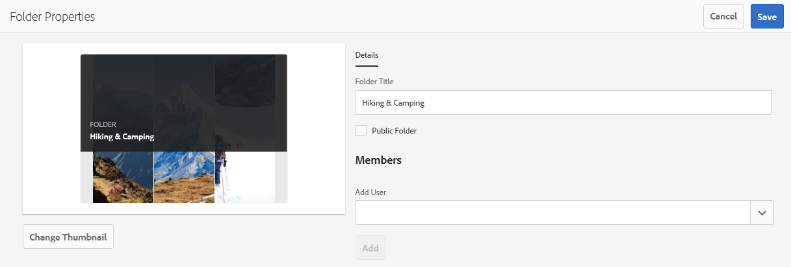

1. I **[!UICONTROL Folder Properties]**-konsolen anger du mapptiteln i fältet **[!UICONTROL Folder Title]** om du inte vill att standardnamnet ska visas för användarna.
1. I listan **[!UICONTROL Add User]** markerar du de användare eller grupper som du vill dela mappen med och klickar på **[!UICONTROL Add]**.
Om du vill dela mappen med endast gästanvändare och inga andra användare väljer du **[!UICONTROL Anonymous Users]** i listrutan **[!UICONTROL Members]**.

   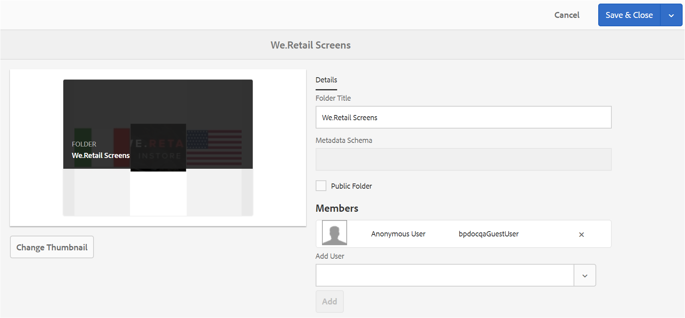

   >[!NOTE]
   >
   >Om du vill göra mappen tillgänglig för alla användare oavsett deras gruppmedlemskap och roll markerar du kryssrutan **[!UICONTROL Public Folder]**.

1. Om det behövs klickar du på **[!UICONTROL Change Thumbnail]** för att ändra miniatyrbilden för mappen.
1. Klicka på **[!UICONTROL Save]**.

1. Om du vill komma åt den delade mappen loggar du in på varumärkesportalen med inloggningsuppgifterna för den användare som du delade mappen med. Granska den delade mappen i gränssnittet.

## Ta bort delning av mappar {#unshare-the-folders}

Så här tar du bort delningen av en tidigare delad mapp:

1. I gränssnittet för varumärkesportalen väljer du den mapp du vill ta bort delningen från.

   

1. Klicka på **[!UICONTROL Share]** i verktygsfältet överst.
1. I **[!UICONTROL Folder Properties]**-konsolen, under **[!UICONTROL Members]**, klickar du på symbolen **[!UICONTROL x]** bredvid en användare för att ta bort dem från listan över användare som du delade mappen med.

   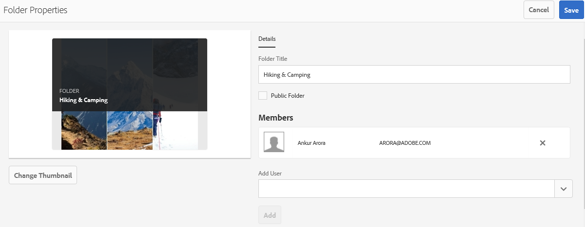

1. Klicka på **[!UICONTROL Confirm]** i varningsmeddelanderutan för att bekräfta att du inte vill dela.
Klicka på **[!UICONTROL Save]**.

1. Logga in på varumärkesportalen med inloggningsuppgifterna för den användare du tog bort från den delade listan. Mappen är inte längre tillgänglig i gränssnittet för varumärkesportalen för användaren.
