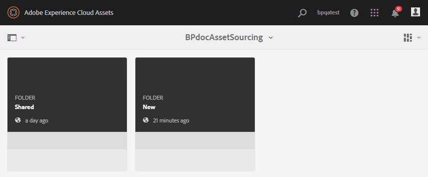
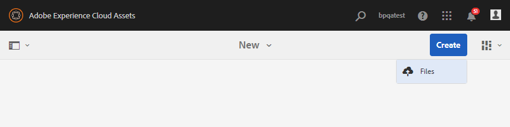

# Överför resurser till mappen för bidrag {#uplad-new-assets-to-contribution-folder}

Brand Portal-användare kan [hämta tillgångskraven](brand-portal-download-asset-requirements.md) för att förstå behovet av bidrag.
De kan sedan skapa nya resurser för bidrag och överföra dem till mappen NYTT i mappen för bidrag.

>[!NOTE]
>
>Användare av varumärkesportalen kan bara överföra resurser till mappen NEW.
>
>Den maximala överföringsgränsen för alla innehavare av varumärkesportaler är **10** GB, som tillämpas kumulativt på alla bidragsmappar.

När de nyskapade resurserna har publicerats till AEM Assets kan Brand Portal-användarna ta bort dem från mappen NEW. Administratören för varumärkesportalen kan ta bort resurserna både från mappen NEW och SHARED.

När målet att skapa bidragsmappen är uppnått kan administratören för varumärkesportalen ta bort bidragsmappen och frigöra överföringsutrymmet för andra användare.

>[!NOTE]
>
>Vi rekommenderar att du frigör överföringsutrymmet när du har publicerat avgiftsbelagda mappar till AEM Assets så att de är tillgängliga för övriga Brand Portal-användare.
>
>Om du behöver utöka din varumärkesportaltenants överföringsgräns med mer än **10** GB kontaktar du Adobe Support och anger kraven.

**Så här överför du nya resurser:**

1. Logga in på din Brand Portal-instans.
Kontrollpanelen för varumärkesportalen innehåller alla befintliga mappar som är tillåtna för användaren av varumärkesportalen tillsammans med den nyligen delade mappen för bidrag.

1. Markera mappen för bidrag och klicka för att öppna den. Mappen för bidrag innehåller två undermappar - **[!UICONTROL SHARED]** och **[!UICONTROL NEW]**.

1. Klicka på **[!UICONTROL NEW]** mappen.

   

1. Klicka **[!UICONTROL Create]** > **[!UICONTROL Files]** för att överföra enskilda filer eller mappar (.zip) som innehåller flera resurser.

   

1. Bläddra och överför resurser (filer eller mappar) till **[!UICONTROL NEW]** mappen.

   

När du har överfört alla resurser eller mappar till mappen NEW publicerar du mappen för bidrag till AEM Assets. Se [Publicera en mapp för bidrag till AEM Assets](brand-portal-publish-contribution-folder-to-aem-assets.md).
