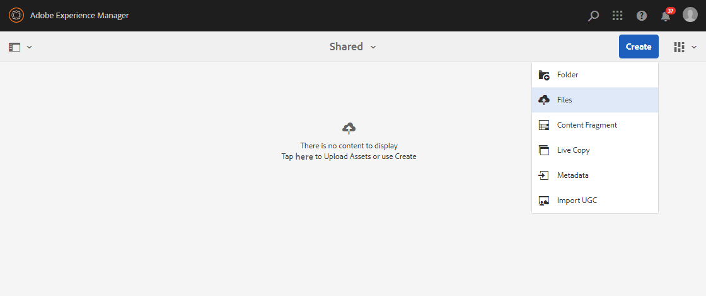

# Överför baslinjeresurser {#upload-baseline-assets}

AEM överför baslinjeresurser i mappen **SHARED** för att hjälpa användare på varumärkesportalen att förstå vilka typer av resurser som krävs under bidraget. Dessa resurser kan användas som referensinnehåll av Brand Portal-användare när nya resurser skapas för bidrag.

**Så här överför du baslinjeresurser:**

1. Logga in på AEM författarinstans.
Standard-URL: http:// localhost:4502/aem/start.html
1. Navigera till **[!UICONTROL Assets > Files]** och leta reda på den avgiftsmapp där du vill överföra baslinjeresurser.
1. Klicka för att öppna mappen för bidrag, du kan se två undermappar -**[!UICONTROL SHARED]** och **[!UICONTROL NEW]** i mappen för bidrag.
1. Klicka på **[!UICONTROL SHARED]**-mappen.
1. Klicka på **[!UICONTROL Create > Files]**  för att överföra enskilda resurser.
Du kan också klicka på **[!UICONTROL Create > Folder]** om du vill överföra en mapp (.zip) som innehåller flera resurser.
   
1. Bläddra och överför baslinjeresurser (filer/mappar) i mappen **[!UICONTROL SHARED]**.
   

När överföringen är klar kan administratörer publicera bidragsmappen på varumärkesportalen. Se [Publicera mapp för bidrag till varumärkesportalen](brand-portal-publish-contribution-folder-to-brand-portal.md).