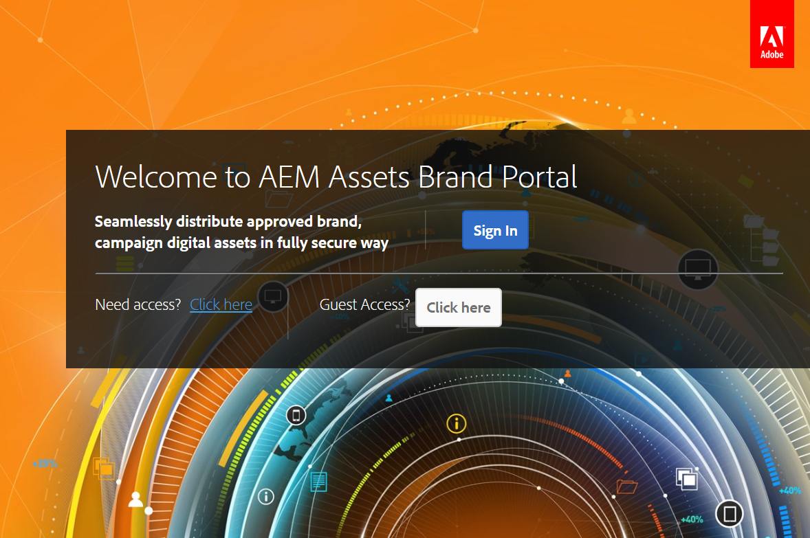
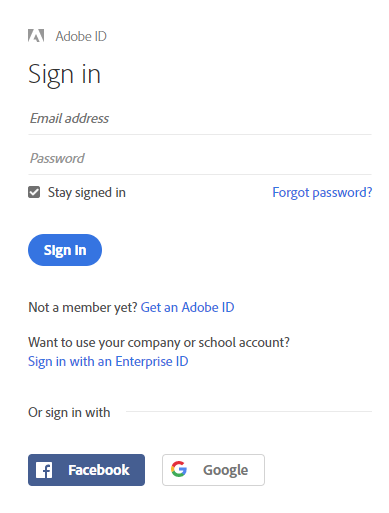
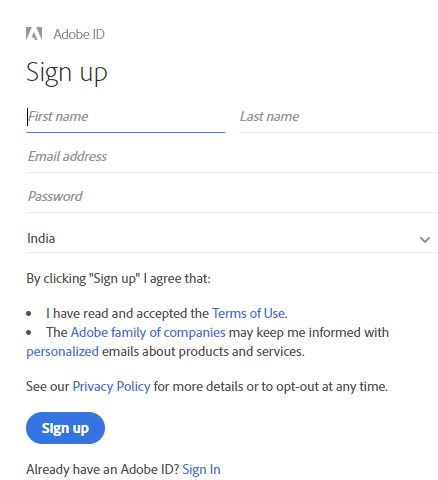
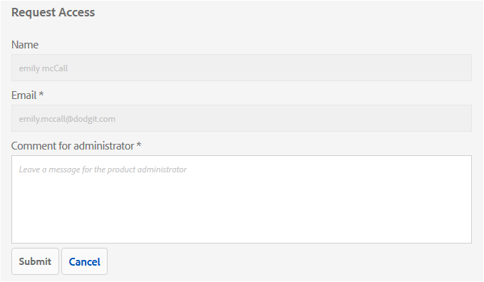
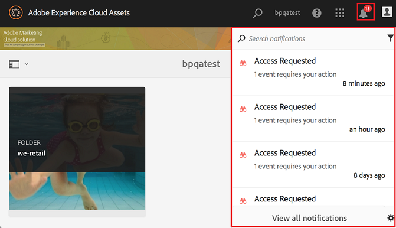
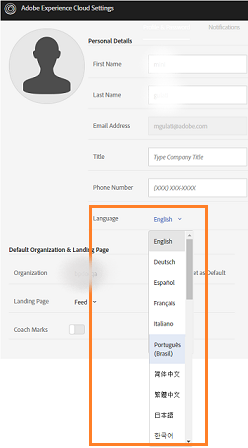
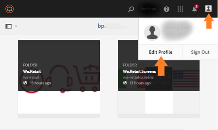
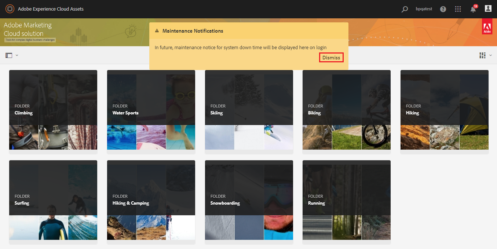

# Översikt över Experience Manager Assets Brand Portal {#overview-of-aem-assets-brand-portal}

Som marknadsförare behöver ni ibland samarbeta med kanalpartners och interna affärsanvändare för att snabbt skapa, hantera och leverera relevant digitalt innehåll till kunder. Snabb leverans av relevant innehåll under hela kundresan är avgörande för att öka efterfrågan, konvertering, engagemang och kundlojalitet.

Det är dock en utmaning att utveckla lösningar som stöder effektiv och säker delning av godkända varumärkeslogotyper, riktlinjer, kampanjresurser eller produktbilder med interna team, partners och återförsäljare.

**Adobe Experience Manager (AEM) Assets Brand Portal** fokuserar på marknadsförarens behov av att samarbeta effektivt med globalt spridda Brand Portal-användare genom att tillhandahålla funktioner för resursdistribution och materialbidrag.

Med mediedistribution kan ni enkelt skaffa, kontrollera och på ett säkert sätt distribuera godkända kreativa resurser till externa parter och interna företagsanvändare på olika enheter. Asset-bidraget gör det möjligt för Brand Portal-användare att överföra mediefiler till Brand Portal och publicera till Experience Manager Assets, utan att de behöver ha tillgång till redigeringsmiljön. Avgiftsfunktionen anropas som **Resurser i Brand Portal**. Dessutom förbättrar det den övergripande Brand Portal-upplevelsen av resursdistribution och bidrag från Brand Portal-användare (externa byråer/team), snabbar upp time-to-market för mediefiler och minskar risken för bristande efterlevnad och obehörig åtkomst.
Se, [Resurshantering i Brand Portal](brand-portal-asset-sourcing.md).

I den webbläsarbaserade portalmiljön kan du enkelt överföra, bläddra bland, söka efter, förhandsgranska och exportera resurser i godkända format.

## Konfigurera Experience Manager Assets med Brand Portal {#configure-brand-portal}

Om du konfigurerar Adobe Experience Manager Assets med Brand Portal kan du publicera resurser, distribuera resurser och bidra med resurser för Brand Portal-användare.

>[!NOTE]
>
>Konfigurering av Experience Manager Assets med Brand Portal stöds på Experience Manager Assets as a Cloud Service, Experience Manager Assets 6.3 och senare.

Experience Manager Assets as a Cloud Service konfigureras automatiskt med Brand Portal genom att Brand Portal aktiveras från Cloud Manager. Aktiveringsarbetsflödet skapar de nödvändiga konfigurationerna i bakänden och aktiverar Brand Portal i samma IMS-organisation som i Experience Manager Assets as a Cloud Service instans.

Experience Manager Assets (lokal och hanterad tjänst) konfigureras manuellt med Brand Portal via Adobe Developer Console, som anskaffar en Adobe Identity Management Services-token (IMS) för godkännande av Brand Portal-klienten.

Mer information finns i [konfigurera Experience Manager Assets med Brand Portal](../using/configure-aem-assets-with-brand-portal.md).

## Användarprofiler i Brand Portal {#Personas}

Brand Portal har stöd för följande användarroller:

* Gästanvändare
* Visningsprogram
* Redigerare
* Administratör

I följande tabell visas de uppgifter som användare i dessa roller kan utföra:

|  | **Bläddra** | **Sökning** | **Hämta** | **Dela mappar** | **Dela en samling** | **Dela resurser som en länk** | **Åtkomst till administratörsverktyg** |
|--- |--- |--- |--- |--- |--- |--- |--- |
| **Gästanvändare** | ✓* | ✓* | ✓* | x | x | x | x |
| **Visningsprogram** | ✓ | ✓ | ✓ | x | x | x | x |
| **Redigerare** | ✓ | ✓ | ✓ | ✓ | ✓ | ✓ | x |
| **Administratör** | ✓ | ✓ | ✓ | ✓ | ✓ | ✓ | ✓ |

>[!NOTE]
>
>Gästanvändare kan bara bläddra bland, komma åt och söka resurser i gemensamma mappar och samlingar.

<!--
&#42; Viewer users can access and download the public assets shared with them, and can add these assets to create their own collections.

>[!NOTE]
>
>There is a known issue that the share link for collections is currently visible to the viewer users. The viewer users does not have the privilege to add users to create a share link. This issue will be fixed in the upcoming release, the option to share link for the collections will not be available to the viewer users.
-->

### Gästanvändare {#guest-user}

Alla användare som har begränsad åtkomst till resurser på Brand Portal utan att behöva utföra autentisering är gästanvändare. Gästsessionen ger användarna åtkomst till gemensamma mappar och samlingar. Som gästanvändare kan du bläddra bland tillgångsinformation och ha en fullständig resursvy över medlemmar i gemensamma mappar och samlingar. Du kan söka efter, hämta och lägga till offentliga resurser i [!UICONTROL Lightbox] samling.

Gästsessionen hindrar dig dock från att skapa samlingar och sparade sökningar och dela dem ytterligare. Användare i en gästsession har inte åtkomst till inställningar för mappar och samlingar och kan inte dela resurser som länkar. Här är en lista över uppgifter som en gästanvändare kan utföra:

* [Bläddra bland och få tillgång till offentliga resurser](browse-assets-brand-portal.md)

* [Sök efter offentliga resurser](brand-portal-searching.md)

* [Hämta offentliga resurser](download-assets.md)

* [Lägg till resurser i [!UICONTROL Lightbox]](brand-portal-light-box.md#add-assets-to-lightbox)

### Visningsprogram {#viewer}

En standardanvändare i Brand Portal är vanligtvis en användare med rollen Viewer. En användare med den här rollen har åtkomst till tillåtna mappar, samlingar och resurser. Användaren kan också bläddra bland, förhandsgranska, hämta och exportera resurser (ursprungliga eller specifika återgivningar), konfigurera kontoinställningar och söka efter resurser. Här är en lista över uppgifter som en visningsprogram kan utföra:

* [Bläddra bland resurser](browse-assets-brand-portal.md)

* [Sök efter resurser](brand-portal-searching.md)

* [Hämta resurser](download-assets.md)

### Redigerare {#editor}

En användare med rollen Redigerare kan utföra alla uppgifter som en visningsprogram kan utföra. Dessutom kan redigeraren visa de filer och mappar som en administratör delar. Användaren som har rollen som redigerare kan även dela innehåll (filer, mappar, samlingar) med andra.

Förutom de uppgifter som en visningsprogram kan utföra kan en redigerare utföra följande ytterligare uppgifter:

* [Dela mappar](brand-portal-sharing-folders.md)

* [Dela en samling](brand-portal-share-collection.md)

* [Dela resurser som en länk](brand-portal-link-share.md)

### Administratör {#administrator}

En administratör har en användare som är markerad som systemadministratör eller Brand Portal produktadministratör i [!UICONTROL Admin Console]. En administratör kan lägga till och ta bort systemadministratörer och användare, definiera förinställningar, skicka e-post till användare och visa portalanvändning och lagringsrapporter.

En administratör kan utföra alla uppgifter som en redigerare kan utföra:

* [Hantera användare, grupper och användarroller](brand-portal-adding-users.md)

* [Anpassa skrivbordsunderlägg, sidhuvuden och e-postmeddelanden](brand-portal-branding.md)

* [Använd anpassade sökfaktorer](brand-portal-search-facets.md)

* [Använd metadatamatchformuläret](brand-portal-metadata-schemas.md)

* [Använda bildförinställningar eller dynamiska återgivningar](brand-portal-image-presets.md)

* [Arbeta med rapporter](brand-portal-reports.md)

Förutom ovanstående uppgifter kan en författare i AEM Assets utföra följande uppgifter:

* [Konfigurera AEM Assets med varumärkesportalen](../using/configure-aem-assets-with-brand-portal.md)

* [Publicera mappar på varumärkesportalen](https://experienceleague.adobe.com/docs/experience-manager-65/assets/brandportal/brand-portal-publish-folder.html)

* [Publicera samlingar på varumärkesportalen](https://experienceleague.adobe.com/docs/experience-manager-65/assets/brandportal/brand-portal-publish-collection.html)

## Alternativt alias för Brand Portal-URL {#tenant-alias-for-portal-url}

Från och med Brand Portal 6.4.3 kan organisationer ha en alternativ (alias) URL för sin Brand Portal-klient. Du kan skapa alias-URL:en genom att ha ett alternativt prefix i URL:en.\
Observera att endast prefixet för Brand Portal URL kan anpassas och inte hela URL:en. En organisation med en befintlig domän `geomettrix.brand-portal.adobe.com` kan få `geomettrixinc.brand-portal.adobe.com` skapad på begäran.

AEM Author-instansen kan dock vara [konfigurerad](../using/configure-aem-assets-with-brand-portal.md) endast med URL:en för klient-ID och inte med URL:en för klientalias (alternativ).

>[!NOTE]
>
>För att få ett alias för innehavarens namn i den befintliga portalwebbadressen måste organisationen kontakta kundsupport med en ny begäran om att skapa klientalias. Denna begäran behandlas genom att först kontrollera om aliaset är tillgängligt och sedan skapa aliaset.
>
>Om du vill ersätta det gamla aliaset eller ta bort det gamla måste samma process följas.

## Begär åtkomst till Brand Portal {#request-access-to-brand-portal}

Användare kan begära åtkomst till Brand Portal från inloggningsskärmen. Dessa förfrågningar skickas till Brand Portal-administratörer som beviljar användare åtkomst via Adobe [!UICONTROL Admin Console]. När åtkomst har beviljats får användarna ett e-postmeddelande.

Så här begär du åtkomst:

1. På inloggningssidan för Brand Portal väljer du **[!UICONTROL Click here]** motsvarar **[!UICONTROL Need Access?]**. Om du vill gå in i gästsessionen väljer du **[!UICONTROL Click here]** motsvarar **[!UICONTROL Guest Access?]**.

   

   The [!UICONTROL Request Access] sidan öppnas.

1. Om du vill begära åtkomst till en organisations Brand Portal måste du ha ett giltigt [!UICONTROL Adobe ID], [!UICONTROL Enterprise ID], eller [!UICONTROL Federated ID].

   I [!UICONTROL Request Access] sida, logga in med ditt ID (scenario 1) eller skapa en [!UICONTROL Adobe ID] (scenario 2):

   ![[!UICONTROL Request access]](assets/bplogin_request_access_2.png)

   **Scenario 1**

   1. Om du har en [!UICONTROL Adobe ID], [!UICONTROL Enterprise ID], eller [!UICONTROL Federated ID], klicka **[!UICONTROL Sign In]**.
The [!UICONTROL Sign in] sidan öppnas.

   1. Ange [!UICONTROL Adobe ID] inloggningsuppgifter och klicka på **[!UICONTROL Sign in]**.

      
   Du omdirigeras till [!UICONTROL Request Access] sida.

   **Scenario 2**

   1. Om du inte har en [!UICONTROL Adobe ID], för att skapa en klickar du på **[!UICONTROL Get an Adobe ID]** från [!UICONTROL Request Access] sida.
The [!UICONTROL Sign in] sidan öppnas.
   1. Klicka på **[!UICONTROL Get an Adobe ID]**.
The [!UICONTROL Sign up] sidan öppnas.
   1. Ange för- och efternamn, e-post-ID och lösenord.
   1. Välj **[!UICONTROL Sign up]**.

      
   Du omdirigeras till [!UICONTROL Request Access] sida.

1. På nästa sida visas ditt namn och e-post-ID som används för att begära åtkomst. Lämna en kommentar till administratören och klicka på **[!UICONTROL Submit]**.

   

## Produktadministratörer ger åtkomst {#grant-access-to-brand-portal}

Brand Portal produktadministratörer får åtkomstbegäranden i sitt meddelandeområde i Brand Portal och via e-post i sin inkorg.

För att bevilja åtkomst måste produktadministratörer klicka på motsvarande meddelande i meddelandefältet i Brand Portal och sedan klicka på **[!UICONTROL Grant Access]**.
Produktadministratörer kan även följa länken i e-postmeddelandet om åtkomstbegäran för att besöka Adobe [!UICONTROL Admin Console] och lägg till användaren i den relevanta produktkonfigurationen.

Du omdirigeras till [Adobe [!UICONTROL Admin Console]](https://adminconsole.adobe.com/enterprise/overview) hemsida. Använd Adobe [!UICONTROL Admin Console] för att skapa användare och tilldela dem till produktprofiler (som tidigare kallades produktkonfigurationer) som visas som grupper i Brand Portal. Mer information om hur du lägger till användare i [!UICONTROL Admin Console], se [Lägg till en användare](brand-portal-adding-users.md#add-a-user) (följ steg 4-7 i proceduren för att lägga till en användare).

## Brand Portal språk {#brand-portal-language}

Du kan ändra Brand Portal-språk från Adobe [!UICONTROL Experience Cloud Settings].

Så här ändrar du språk:

1. Välj [!UICONTROL User] > [!UICONTROL Edit Profile] på den översta menyn.

   

1. På [!UICONTROL Experience Cloud Settings] väljer du ett språk på sidan [!UICONTROL Language] nedrullningsbar meny.

## Underhållsmeddelande för Brand Portal {#brand-portal-maintenance-notification}

Innan Brand Portal är schemalagt att användas för underhåll visas ett meddelande som en banderoll när du har loggat in på Brand Portal. Ett exempelmeddelande:

Du kan stänga meddelandet och fortsätta använda Brand Portal. Det här meddelandet visas i varje ny session.

## Versionsinformation och systeminformation {#release-and-system-information}

* [Nyheter](whats-new.md)
* [Versionsinformation](brand-portal-release-notes.md)
* [Filformat som stöds](brand-portal-supported-formats.md)

## Relaterade resurser {#related-resources}

<!--
* [Adobe Customer Support]()
-->

* [AEM](https://experienceleaguecommunities.adobe.com/t5/adobe-experience-manager/ct-p/adobe-experience-manager-community)
