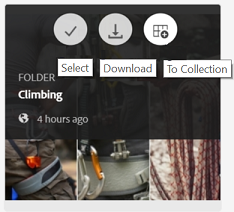
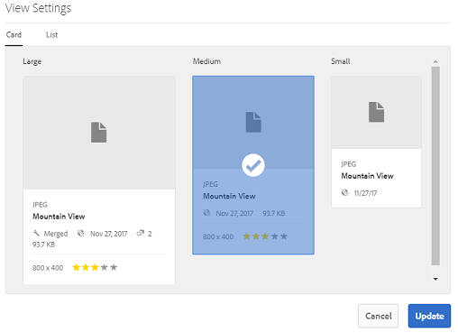

# Bläddra bland resurser på Brand Portal {#browsing-assets-on-brand-portal}

Experience Manager Assets Brand Portal har olika funktioner och användargränssnittselement som gör det enklare att bläddra bland resurser, gå igenom resurshierarkier och söka efter resurser med olika visningsalternativ.

Experience Manager logotyp i verktygsfältet längst upp gör det lättare för administratörsanvändare att komma åt panelen Administrationsverktyg.

 

Rälsväljaren längst upp till vänster i listrutan Brand Portal för att visa alternativ för att navigera i resurshierarkier, effektivisera sökningen och visa resurser.

Du kan visa, navigera genom och välja resurser med någon av de tillgängliga vyerna (kort, kolumn och lista) i vyväljaren längst upp till höger i Brand Portal.

## Visa och välja resurser {#viewing-and-selecting-resources}

Att visa, navigera och markera var och en är begreppsmässigt detsamma i alla vyer, men har små variationer i hur de hanteras, beroende på vilken vy du använder.

Du kan visa, navigera i och välja (för ytterligare åtgärder) resurser med någon av de tillgängliga vyerna:

* Kolumnvy
* Kortvy
* Listvy

### Kortvy

I kortvyn visas informationskort för varje objekt på den aktuella nivån. Dessa kort innehåller följande information:

* En visuell representation av resursen/mappen.
* Typ
* Titel
* Namn
* Datum och tid när resursen publicerades till Brand Portal från AEM
* Storlek
* Dimensioner

Du kan navigera nedåt i hierarkin genom att trycka på/klicka på kort (för att undvika snabbåtgärderna) eller uppåt igen genom att använda [vägbeskrivningar i rubriken](https://experienceleague.adobe.com/docs/experience-manager-65/authoring/essentials/basic-handling.html).

#### Kortvy för icke-adminanvändare

Kort med mappar, i kortvyn, visar mapphierarkiinformation för icke-adminanvändare (Editor, Viewer och Guest User). Med den här funktionen kan användarna se var mapparna finns, de har åtkomst till dem, i förhållande till den överordnade hierarkin.
Mapphierarkiinformation är särskilt användbar när du vill differentiera mappar som har namn som liknar andra mappar som delas från en annan mapphierarki. Om användare som inte är administratörer inte känner till mappstrukturen för de resurser som delas med dem verkar resurser/mappar med liknande namn förvirrande.

* De banor som visas på respektive kort trunkeras för att passa kortstorlekarna. Användarna kan dock se hela sökvägen som en funktionsbeskrivning när de hovrar över den trunkerade banan.

**Översiktsalternativ för att visa resursegenskaper**

Alternativet Översikt är tillgängligt för användare som inte är administratörer (redigerare, visningsprogram, gästanvändare) för att visa resursegenskaper för valda resurser/mappar. Alternativet Översikt visas:

* i verktygsfältet högst upp när du väljer en resurs/mapp.
* i listrutan när du väljer järnvägsväljaren.

När du väljer alternativet **[!UICONTROL Overview]** när en resurs/mapp är markerad kan användarna se titeln, sökvägen och tidpunkten när resursen skapades. Om du väljer alternativet Översikt på sidan med tillgångsinformation kan användarna se metadata för resursen.

#### Visa inställningar i kortvyn

**[!UICONTROL View Settings]** öppnas när du väljer  **[!UICONTROL View Settings]** från vyväljaren. Du kan ändra storlek på miniatyrbilderna för resursen i kortvyn. På så sätt kan du anpassa visningen och styra antalet miniatyrbilder som visas.

### Listvy

I listvyn visas information för varje resurs på den aktuella nivån. I listvyn finns följande information:

* Miniatyrbild av resurser
* Namn
* Titel
* Nat. inst
* Typ
* Dimension
* Storlek
* Klassificering
* Mappsökväg som visar resurshierarki*
* Datum för publicering av resursen på Brand Portal

Med sökvägskolumnen är det enkelt att identifiera resursens plats i mapphierarkin. Du kan navigera nedåt i hierarkin genom att trycka/klicka på resursnamnet och säkerhetskopiera genom att använda [vägbeskrivningar i rubriken](https://experienceleague.adobe.com/docs/experience-manager-65/authoring/essentials/basic-handling.html).

<!--
Comment Type: draft lastmodifiedby="mgulati" lastmodifieddate="2018-08-17T03:12:05.096-0400" type="annotation">Removed:- "Selecting assets in list view To select all items in the list, use the checkbox at the upper left of the list. When all items in the list are selected, this check box appears checked. To deselect all, click or tap the checkbox. When only some items are selected, it appears with a minus sign. To select all, click or tap the checkbox. To deselect all, click or tap the checkbox again. You can change the order of items using the dotted vertical bar at the far right of each item in the list. Tap/click the vertical selection bar and drag the item to a new position in the list."
 -->

### Visa inställningar i listvyn

I listvyn visas resursen **[!UICONTROL Name]** som första kolumn som standard. Ytterligare information, som resurs **[!UICONTROL Title]**, **[!UICONTROL Locale]**, **[!UICONTROL Type]**, **[!UICONTROL Dimensions]**, **[!UICONTROL Size]**, **[!UICONTROL Rating]**, publiceringsstatus visas också. Du kan dock välja vilka kolumner som ska visas med **[!UICONTROL View Settings]**.

### Kolumnvy

Använd kolumnvyn för att navigera i ett innehållsträd genom en serie överlappande kolumner. I den här vyn kan du visualisera och gå igenom resurshierarkin.

Om du väljer en resurs i den första kolumnen (längst till vänster) visas underordnade resurser i den andra kolumnen till höger. Om du väljer en resurs i den andra kolumnen visas underordnade resurser i den tredje kolumnen till höger och så vidare.

Du kan navigera uppåt och nedåt i trädet genom att trycka eller klicka på resursnamnet eller nedåt till höger om resursnamnet.

* Resursnamnet och förvrängningen markeras när användaren knackar på eller klickar på den.
* Om du trycker eller klickar på miniatyrbilden markeras resursen.
* När du väljer det här alternativet läggs en bock över miniatyrbilden och resursnamnet markeras.
* Information om den valda resursen visas i den sista kolumnen.

När en resurs är markerad i kolumnvyn visas en visuell representation av resursen i den sista kolumnen tillsammans med följande information:

* Titel
* Namn
* Dimensioner
* Datum och tid när resursen publicerades till Brand Portal från AEM
* Storlek
* Typ
* Alternativet Mer information, för att gå till detaljsidan för resursen

<!--
Comment Type: draft

<h3>Selecting Resources</h3>
-->

<!--
Comment Type: draft

Selecting a specific resource depends on a combination of the view and the device:

-->

<!--
Comment Type: draft

<table border="1" cellpadding="1" cellspacing="0" width="100%">
<tbody>
<tr>
<td> </td>
<td>Select</td>
<td>Deselect</td>
</tr>
<tr>
<td>Column View  </td>
<td>
<ul>
<li>Desktop:  Mouseover, then use the check mark quick action</li>
<li>Mobile device:  Tap the thumbnail</li>
</ul> </td>
<td>
<ul>
<li>Desktop:  Click the thumbnail</li>
<li>Mobile device:  Tap the thumbnail</li>
</ul> </td>
</tr>
<tr>
<td>Card View  </td>
<td>
<ul>
<li>Desktop:  Mouseover, then use the check mark quick action</li>
<li>Mobile device:  Tap-and-hold the card</li>
</ul> </td>
<td>
<ul>
<li>Desktop:  Click the card</li>
<li>Mobile device:  Tap the card</li>
</ul> </td>
</tr>
<tr>
<td>List View</td>
<td>
<ul>
<li>Desktop:  Mouseover, then use the check mark quick action</li>
<li>Mobile device:  Tap the thumbnail</li>
</ul> </td>
<td>
<ul>
<li>Desktop:  Click the thumbnail</li>
<li>Mobile device:  Tap the thumbnail</li>
</ul> </td>
</tr>
</tbody>
</table>
-->

<!--
Comment Type: draft

Deselecting All
-->

<!--
Comment Type: draft

In all cases, as you select items the count of the items selected is displayed at the upper right of the toolbar.

You can deselect all items and exit selection mode by clicking or tapping the X next to the count.

-->

<!--
Comment Type: draft

In all views, all items can be deselected by tapping escape on the keyboard if you are using a desktop device.

-->

## Innehållsträd {#content-tree}

Förutom dessa vyer använder du trädvyn för att gå nedåt i resurshierarkin samtidigt som du visar och väljer önskade resurser eller mappar.

Om du vill öppna trädvyn trycker/klickar du på rälsväljaren längst upp till vänster och väljer **[!UICONTROL Content tree]** på menyn.

Navigera från innehållshierarkin till önskad resurs.

## Tillgångsinformation {#asset-details}

På sidan med tillgångsinformation kan du visa en resurs, hämta, dela resursens länk, flytta den till en samling eller visa dess egenskapssida. Du kan även navigera på informationssidan för andra resurser i samma mapp i följd.

Om du vill visa resursens metadata, eller visa de olika återgivningarna, använder du spårväljaren på resursdetaljsidan.

Du kan visa alla tillgängliga återgivningar av resursen på sidan med resursinformation och välja en återgivning för att förhandsgranska den.

Om du vill öppna sidan med resursegenskaper använder du alternativet **[!UICONTROL Properties (p)]** i det övre fältet.

Du kan också visa en lista över alla dess relaterade resurser (källresurser eller härledda resurser på AEM) på egenskapssidan för en resurs, eftersom resursrelationen också publiceras från AEM till Brand Portal.
