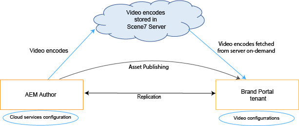
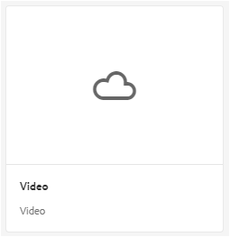
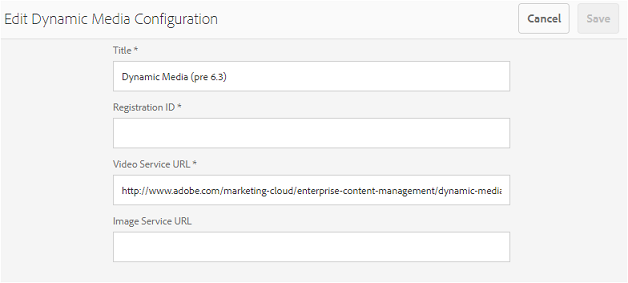
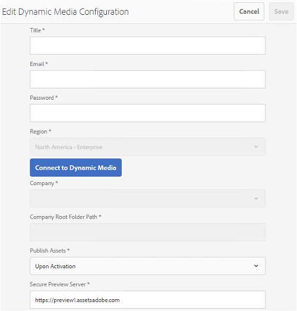

# Dynamiskt videostöd i Brand Portal {#dynamic-video-support-on-brand-portal}

Förgranska och spela upp videor på ett anpassat sätt på Brand Portal med Dynamic Media support. Hämta även dynamiska återgivningar från portalen och delade länkar.
Brand Portal-användare kan:

* Förhandsgranska videoklipp på sidan Resursinformation, i kortvyn och på sidan för förhandsgranskning av länkdelning.
* Spela upp videokodningar på sidan Resursinformation.
* Visa dynamiska återgivningar på fliken Återgivningar på sidan Resursinformation.
* Ladda ned videokoder och mappar med videoklipp.

>[!NOTE]
>
>Om du vill arbeta med videoklipp och publicera dem på Brand Portal kontrollerar du att författarinstansen för Experience Manager är inställd i Dynamic Media Hybrid-läge eller Dynamic Media **[!DNL Scene 7]**-läge.

För att förhandsgranska, spela upp och ladda ned videor visar Brand Portal följande två konfigurationer för administratörer:

* [Dynamic Media Hybrid-](#configure-dm-hybrid-settings)
konfigurationOm Experience Manager Author-instansen körs i läget för dynamisk mediefyllning.
* [Dynamisk  [!DNL Scene 7] ](#configure-dm-scene7-settings)
mediakonfigurationOm Experience Manager Author-instansen körs i dynamiskt **[!DNL Scene 7]** medieläge.
Ange någon av dessa konfigurationer baserat på de konfigurationer som du anger i din Experience Manager Author-instans som Brand Portal-klientorganisationen replikeras med.

>[!NOTE]
>
>Dynamiska videor stöds inte på Brand Portal-klientorganisationer som är konfigurerade med Experience Manager Author som körs i **[!UICONTROL Scene7Connect]**-runmode.

## Hur spelas dynamiska videor upp? {#how-are-dynamic-videos-played}

Om Dynamic Media-konfigurationer ([Hybrid](../using/dynamic-video-brand-portal.md#configure-dm-hybrid-settings) eller [[!DNL Scene 7]](../using/dynamic-video-brand-portal.md#configure-dm-scene7-settings) konfigurationer) har konfigurerats på Brand Portal hämtas de dynamiska återgivningarna från **[!DNL Scene 7]**-servern. Videokodningar förhandsvisas och spelas upp utan fördröjning och kvalitetsförvrängning.

Eftersom videokoderna inte lagras i Brand Portal-databasen och hämtas från **[!DNL Scene 7]**-servern måste du se till att Dynamic Media-konfigurationerna på AEM Author Instance och Brand Portal är desamma.

>[!NOTE]
>
>Videovisningsprogram och visningsförinställningar stöds inte i Brand Portal. Videor förhandsvisas och spelas upp på standardvisningsprogrammen i Brand Portal.

## Förutsättningar {#prerequisites}

Om du vill arbeta med dynamiska videoklipp på Brand Portal måste du se till att:

* **Starta AEM Author i DM-**
läge (Dynamic Media) Starta AEM Author-instansen (med vilken Brand Portal är konfigurerad) antingen i  [Dynamic Media Hybrid-](https://experienceleague.adobe.com/docs/experience-manager-65/assets/dynamic/config-dynamic.html) läge eller i  [Dynamic  [!DNL Scene 7] Mediamode](https://experienceleague.adobe.com/docs/experience-manager-65/assets/dynamic/config-dms7.html).
* **Konfigurera Dynamic Media molntjänster på AEM**
författareBaserat på det Dynamic Media-läge som AEM Author körs på anger du antingen  [Dynamic Media molntjänster ](https://experienceleague.adobe.com/docs/experience-manager-65/assets/dynamic/config-dynamic.html) eller  [[!DNL Scene 7] molntjänster ](https://experienceleague.adobe.com/docs/experience-manager-65/assets/dynamic/config-dms7.html) på AEM Author från  **Verktyg** |  **Cloud Services** |  **** Dynamic Media¥.
* **Konfigurera Dynamic Media på varumärkesportalen**
Baserat på Dynamic Media molnkonfigurationer på AEM Author kan du konfigurera  [Dynamic Media ](#configure-dm-hybrid-settings) inställningar eller  [[!DNL Scene 7] ](#configure-dm-scene7-settings)  inställningar från Brand Portal administrationsverktyg.
Se till att [separata Brand Portal-klientorganisationer](#separate-tenants) används för AEM Author-instanser som konfigurerats med Dynamic Media Hybrid och Dynamic Media **[!UICONTROL Scene7]**-lägen, om du använder funktionerna i Dynamic Media Hybrid och Dynamic Media **[!UICONTROL S7]**.
* **Publicera mappar med videokodning på Brand**
PortalAnvänd  [videokodning ](https://experienceleague.adobe.com/docs/experience-manager-65/assets/dynamic/video-profiles.html) och publicera den mapp som innehåller multimedieresurser från AEM Author-instansen till Brand Portal.
* **Tillåtslista IP-adresser för Edge i SPS om säker förhandsgranskning**
är aktiveratOm du använder Dynamic Media-**[!DNL Scene 7]** (med  [säker förhandsgranskning ](https://experienceleague.adobe.com/docs/dynamic-media-classic/using/upload-publish/testing-assets-making-them-public.html) aktiverad för ett företag) bör  **[!DNL Scene 7]** företagsadministratören  [tillåtslista IP-adressen för offentliga utgångar ](https://experienceleague.adobe.com/docs/dynamic-media-classic/using/upload-publish/testing-assets-making-them-public.html#testing-the-secure-testing-service) för respektive region med hjälp av SPS (**[!UICONTROL Scene 7]** Publishing System) flash UI.
IP-adresserna för Egress är följande:

| **Län** | **IP-adress för ägg** |
|--- |--- |
| NA | 130.248.160.66, 52.151.32.108 |
| EMEA | 185.34.189.1 |
| APAC | 63.140.44.54 |

Om du vill tillåta någon av dessa utgående IP:n läser du [Förbered ditt konto för säker testningstjänst](https://experienceleague.adobe.com/docs/dynamic-media-classic/using/upload-publish/testing-assets-making-them-public.html#testing-the-secure-testing-service).

## Bästa praxis

Följ de här stegen för att se till att dina dynamiska videoresurser förhandsvisas, spelas upp och hämtas från Brand Portal (och delade länkar):

### Separata innehavare för lägena Dynamic Media Hybrid och Dynamic Media Scene 7 {#separate-tenants}

Om du använder både Dynamic Media **[!DNL Scene 7]**- och Dynamic Media Hybrid-funktioner rekommenderar vi att du använder olika Brand Portal-klientorganisationer för AEM Author-instanser som konfigurerats med Dynamic Media Hybrid och Dynamic Media **[!DNL Scene 7]**-lägen.

### Samma konfigurationsinformation på AEM Author-instansen och Brand Portal

Kontrollera att konfigurationsinformationen - som **[!UICONTROL Title]**, **[!UICONTROL Registration ID]**, **[!UICONTROL Video Service URL]** (i **[!UICONTROL Dynamic Media Hybrid]**) och **[!UICONTROL Title]**, autentiseringsuppgifter (**[!UICONTROL Email]** och lösenord), **[!UICONTROL Region]**, **[!UICONTROL Company]** (i Dynamic Media **[!DNL Scene 7]**) - är densamma i Brand Portal och **[!UICONTROL AEM cloud configuration]**.

### Tillåtelselista publika IP-adresser för Dynamic Media Scene 7-läge

Om Dynamic Media **[!UICONTROL Scene 7]**-have [säker förhandsvisning är aktiverat](https://experienceleague.adobe.com/docs/dynamic-media-classic/using/upload-publish/testing-assets-making-them-public.html)-används för att skicka videomaterial till Brand Portal skapar **[!UICONTROL Scene 7]** en dedikerad bildserver för testmiljöer eller interna program. Alla förfrågningar till den här servern kontrollerar den ursprungliga IP-adressen. Om den inkommande begäran inte finns i den godkända listan över IP-adresser returneras ett felsvar.
Företagsadministratören **[!UICONTROL Scene-7]** konfigurerar därför en godkänd lista över IP-adresser för företagets **[!UICONTROL Secure Testing]**-miljö via Flash-gränssnittet **[!UICONTROL SPS]** (Scene-7 Publishing System). Se till att IP-adressen för utgångar för din respektive region (från följande) läggs till i den godkända listan.
Om du vill tillåta någon av dessa utgående IP:n läser du [Förbered ditt konto för säker testningstjänst](https://experienceleague.adobe.com/docs/dynamic-media-classic/using/upload-publish/testing-assets-making-them-public.html#testing-the-secure-testing-service).
IP-adresserna för utgångar är följande:

| **Län** | **IP-adress för ägg** |
|--- |--- |
| NA | 130.248.160.66, 52.151.32.108 |
| EMEA | 185.34.189.1 |
| APAC | 63.140.44.54 |

## Konfigurera inställningar för Dynamic Media (Hybrid) {#configure-dm-hybrid-settings}

Om AEM Author-instansen körs i dynamiskt medihybridläge använder du **[!UICONTROL Video]**-panelen från panelen Administrationsverktyg för att konfigurera inställningarna för Dynamic Media gateway.

>[!NOTE]
>
>[videokodningsprofilerna](https://experienceleague.adobe.com/docs/experience-manager-65/assets/dynamic/video-profiles.html) publiceras inte till Brand Portal, utan hämtas från **[!UICONTROL Scene 7]**-servern. För att videokodningar ska kunna spelas upp i Brand Portal måste därför konfigurationsinformationen vara densamma som [Scene7 molnkonfiguration](https://experienceleague.adobe.com/docs/experience-manager-65/assets/dynamic/config-dms7.html) i din AEM Author-instans.

Så här konfigurerar du Dynamic Media-konfigurationer för Brand Portal-klienter:

1. Välj AEM logotyp för att öppna administrationsverktygen i verktygsfältet högst upp i Brand Portal.
1. Välj plattan **[!UICONTROL Video]** på panelen Administrationsverktyg.

   

   **[!UICONTROL Edit Dynamic Media Configuration]** sidan öppnas.

   

1. Ange **[!UICONTROL Registration ID]** och **[!UICONTROL Video Service URL]** (URL för DM-gateway). Se till att dessa uppgifter är desamma som de i **[!UICONTROL Tools > Cloud Services]** i din AEM Author-instans.
1. Välj **Spara** för att spara konfigurationen.

## Konfigurera inställningar för Dynamic Media Scene7 {#configure-dm-scene7-settings}

Om AEM Author-instansen körs i Dynamic Media- **[!UICONTROL Scene 7]**-läge använder du **[!UICONTROL Dynamic Media Configuration]**-panelen från panelen Administrationsverktyg för att konfigurera serverinställningarna för **[!UICONTROL Scene 7]**.

Så här konfigurerar du Dynamic Media **[!UICONTROL Scene 7]**-konfigurationer för Brand Portal-klienter:

1. Välj AEM logotyp för att öppna administrationsverktygen i verktygsfältet högst upp i Brand Portal.

2. Välj plattan **[!UICONTROL Dynamic Media Configuration]** på panelen Administrationsverktyg.

   ![DM- [!UICONTROL Scene 7] konfiguration på Brand Portal](assets/DMS7-Tile.png)

   **[!UICONTROL Edit Dynamic Media Configuration]** sidan öppnas.

   

3. Ange:

   * **[!UICONTROL Title]**
   * Autentiseringsuppgifter (**[!UICONTROL Email ID]** och **[!UICONTROL Password]**) för att komma åt Scene 7-servern
   * **[!UICONTROL Region]**

   Se till att dessa värden är desamma som i din AEM Author-instans.

4. Välj **[!UICONTROL Connect to Dynamic Media]**.

5. Ange **[!UICONTROL Company name]** och **[!UICONTROL Save]** konfigurationen.
