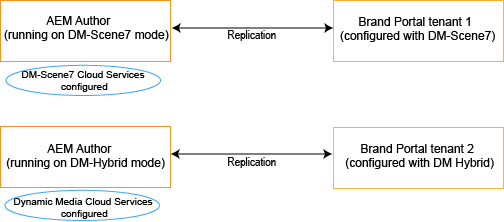

# Dynamic video support on Brand Portal {#dynamic-video-support-on-brand-portal}

Preview and play videos adaptively on Brand Portal with Dynamic Media support. Hämta även dynamiska återgivningar från portalen och delade länkar.
Brand Portal users can:

* Preview videos in Asset Details page, Card View, and link share preview page.
* Play video encodes on Asset Details page.
* Visa dynamiska återgivningar på fliken Återgivningar på sidan Resursinformation.
* Ladda ned videokoder och mappar med videoklipp.

>[!NOTE]
>
>Om du vill arbeta med videoklipp och publicera dem på varumärkesportalen kontrollerar du att AEM Author-instansen är konfigurerad antingen i läget Dynamic Media Hybrid eller i **[!DNL Scene 7]** läget Dynamic Media.

För att förhandsgranska, spela upp och ladda ned videor visar Brand Portal följande två konfigurationer för administratörer:

* [Dynamic Media Hybrid-konfiguration](#configure-dm-hybrid-settings)om AEM Author-instansen körs i läget för dynamisk mediaplys.
* [Konfiguration](#configure-dm-scene7-settings)av Dynamic Media [!DNL Scene 7] Om AEM Author-instansen körs i läget för dynamiska media **[!DNL Scene 7]** .
Ange någon av dessa konfigurationer baserat på de konfigurationer du ställt in i din AEM Author-instans som Brand Portal-klienten replikeras med.

>[!NOTE]
>
>Dynamiska videor stöds inte på innehavare av varumärkesportaler som konfigurerats med AEM Author som körs i **[!UICONTROL Scene7Connect]** runmode.

## Hur spelas dynamiska videor upp? {#how-are-dynamic-videos-played}

Om dynamiska mediekonfigurationer ([Hybrid](../using/dynamic-video-brand-portal.md#configure-dm-hybrid-settings) - eller [[!DNL Scene 7]](../using/dynamic-video-brand-portal.md#configure-dm-scene7-settings) -konfigurationer) har konfigurerats på Brand Portal hämtas de dynamiska återgivningarna från **[!DNL Scene 7]** servern. Videokodningar förhandsvisas och spelas upp utan fördröjning och kvalitetsförvrängning.

Eftersom videokoderna inte lagras i arkivet för varumärkesportaler och hämtas från **[!DNL Scene 7]** servern måste du se till att de dynamiska mediekonfigurationerna på AEM Author Instance och Brand Portal är desamma.

>[!NOTE]
>
>Videovisningsprogram och visningsförinställningar stöds inte i varumärkesportalen. Videoklipp förhandsgranskas och spelas upp på standardvisningsprogrammen i varumärkesportalen.

## Förutsättningar {#prerequisites}

Om du vill arbeta med dynamiska videoklipp på varumärkesportalen ska du se till att:

* **Starta AEM Author i DM-läge (Dynamic Media)** Starta AEM Author-instansen (med vilken Brand Portal är konfigurerad) antingen i [Dynamic Media Hybrid-läge](https://helpx.adobe.com/experience-manager/6-5/assets/using/config-dynamic.html#EnablingDynamicMedia) eller i [Dynamic Media-läge](https://helpx.adobe.com/experience-manager/6-5/assets/using/config-dms7.html#EnablingDynamicMediainScene7mode)[!DNL Scene 7].
* **Konfigurera Dynamic Media-molntjänster på AEM Author** Baserat på det dynamiska medieläget AEM Author körs på, ange antingen [Dynamic Media-molntjänster](https://helpx.adobe.com/experience-manager/6-5/assets/using/config-dynamic.html#ConfiguringDynamicMediaCloudServices) eller [[!DNL Scene 7] molntjänster](https://helpx.adobe.com/experience-manager/6-5/assets/using/config-dms7.html#ConfiguringDynamicMediaCloudServices) på AEM Author från **Tools** | **Cloud-tjänster** | **Dynamic Media**.
* **Konfigurera Dynamic Media on Brand Portal** Baserat på Dynamic Media-molnkonfigurationer på AEM Author, konfigurera [Dynamic Media-inställningar](#configure-dm-hybrid-settings) eller [[!DNL Scene 7]-inställningar](#configure-dm-scene7-settings) från administrationsverktygen för Brand Portal.
Se till att [separata Brand Portal-klientorganisationer](#separate-tenants) används för AEM Author-instanser som konfigurerats med Dynamic Media Hybrid och Dynamic Media- **[!UICONTROL Scene7]** lägen, om du använder funktioner för Dynamic Media Hybrid och Dynamic Media **[!UICONTROL S7]**.
* **Publicera mappar med videokodningar tillämpade på Brand Portal** Använd [videokodningar](https://helpx.adobe.com/experience-manager/6-5/assets/using/video-profiles.html) och publicera mappen med multimedieresurser från AEM Author-instansen till Brand Portal.
* **Whitelist Egress IPs in SPS if secure preview enabled**
If using Dynamic Media-**[!DNL Scene 7]** (with [secure preview enabled](https://docs.adobe.com/content/help/en/dynamic-media-classic/using/upload-publish/testing-assets-making-them-public.html) for a company), then it is advised that **[!DNL Scene 7]** company administrator [whitelists the public egress IPs](https://docs.adobe.com/content/help/en/dynamic-media-classic/using/upload-publish/testing-assets-making-them-public.html#testing-the-secure-testing-service) for respective regions using  SPS (**[!UICONTROL Scene 7]** Publishing System) flash UI.
The Egress IPs are as follows:

| **Län** | **IP-adress för ägg** |
|--- |--- |
| NA | 192.243.237.86 |
| EMEA | 185.34.189.4 |
| APAC | 63.140.44.54 |

Om du vill vitlista någon av de här IP-adresserna för utgångar ska du läsa [Förbered ditt konto för säker testningstjänst](https://docs.adobe.com/content/help/en/dynamic-media-classic/using/upload-publish/testing-assets-making-them-public.html#testing-the-secure-testing-service).

## Bästa praxis

Följ de här stegen för att se till att dina dynamiska videomaterial förhandsvisas, spelas upp och hämtas från varumärkesportalen (och delade länkar):

### Separata innehavare för lägena Dynamic Media Hybrid och Dynamic Media Scene 7 {#separate-tenants}

Om du använder både Dynamic Media **[!DNL Scene 7]** och Dynamic Media Hybrid bör du använda olika Brand Portal-klientorganisationer för AEM Author-instanser som konfigurerats med Dynamic Media Hybrid och Dynamic Media- **[!DNL Scene 7]** lägen. 

### Samma konfigurationsinformation på AEM Author-instansen och varumärkesportalen

Kontrollera att konfigurationsinformationen - som **[!UICONTROL Title]**, **[!UICONTROL Registration ID]**, **[!UICONTROL Video Service URL]** (in **[!UICONTROL Dynamic Media Hybrid]**) och **[!UICONTROL Title]**, autentiseringsuppgifter (**[!UICONTROL Email]** och lösenord), **[!UICONTROL Region]****[!UICONTROL Company]** (i Dynamic Media **[!DNL Scene 7]**) - är densamma i Varumärkeportalen och **[!UICONTROL AEM cloud configuration]**.

### Whitelist public egress IPs for Dynamic Media Scene 7 mode

If Dynamic Media **[!UICONTROL Scene 7]**–having [secure preview enabled](https://docs.adobe.com/content/help/en/dynamic-media-classic/using/upload-publish/testing-assets-making-them-public.html)–is used to serve video assets to Brand Portal, then **[!UICONTROL Scene 7]** establishes a dedicated image server for staging environments or internal applications. Alla förfrågningar till den här servern kontrollerar den ursprungliga IP-adressen. Om den inkommande begäran inte finns i den godkända listan över IP-adresser returneras ett felsvar.
Företagsadministratören **[!UICONTROL Scene-7]** konfigurerar därför en godkänd lista över IP-adresser för företagets **[!UICONTROL Secure Testing]** miljö via **[!UICONTROL SPS]** Flash-gränssnittet (Scene-7 Publishing System). Se till att IP-adressen för utgångar för din respektive region (från följande) läggs till i den godkända listan.
Om du vill vitlista någon av de här IP-adresserna för utgångar ska du läsa [Förbered ditt konto för säker testningstjänst](https://docs.adobe.com/content/help/en/dynamic-media-classic/using/upload-publish/testing-assets-making-them-public.html#testing-the-secure-testing-service).
IP-adresserna för utgångar är följande:

| **Län** | **IP-adress för ägg** |
|--- |--- |
| NA | 192.243.237.86 |
| EMEA | 185.34.189.4 |
| APAC | 63.140.44.54 |

## Konfigurera inställningar för Dynamic Media (Hybrid) {#configure-dm-hybrid-settings}

Om AEM Author-instansen körs i dynamiskt medihybridläge använder du **[!UICONTROL Video]** panelen Administrationsverktyg för att konfigurera inställningarna för Dynamic Media Gateway.
>[!NOTE]
>
>Videokodningsprofilerna [publiceras inte till](https://helpx.adobe.com/experience-manager/6-5/assets/using/video-profiles.html) Varumärkeportalen, utan hämtas från **[!UICONTROL Scene 7]** servern. För att videokodningar ska kunna spelas upp i varumärkesportalen måste därför konfigurationsinformationen vara densamma som [[!UICONTROL Scene7-molnkonfigurationen]](https://helpx.adobe.com/experience-manager/6-5/assets/using/config-dms7.html#ConfiguringDynamicMediaCloudServices) i din AEM Author-instans.
Så här konfigurerar du dynamiska mediekonfigurationer för innehavare av varumärkesportaler:

1. Välj AEM-logotypen för att få åtkomst till administrationsverktygen från verktygsfältet högst upp i varumärkesportalen.

2. Markera **[!UICONTROL Video]** rutan på panelen Administrationsverktyg. 
   
   **[!UICONTROL Edit Dynamic Media Configuration]** sidan öppnas. 
   

3. Specify **[!UICONTROL Registration ID]** and **[!UICONTROL Video Service URL]** (DM-Gateway URL). Se till att dessa uppgifter är desamma som de som finns **[!UICONTROL Tools > Cloud Services]** i din AEM Author-instans.

4. Välj **Spara** för att spara konfigurationen.

## Konfigurera inställningar för Dynamic Media Scene7 {#configure-dm-scene7-settings}

Om AEM Author-instansen körs i läget Dynamic Media- **[!UICONTROL Scene 7]** använder du **[!UICONTROL Dynamic Media Configuration]** panelen Administrationsverktyg för att konfigurera **[!UICONTROL Scene 7]** serverinställningarna.

Så här ställer du in dynamiska mediekonfigurationer **[!UICONTROL Scene 7]** för innehavare av varumärkesportaler:

1. Välj AEM-logotypen för att få åtkomst till administrationsverktygen från verktygsfältet högst upp i varumärkesportalen.

2. Markera **[!UICONTROL Dynamic Media Configuration]** rutan på panelen Administrationsverktyg. 
   ![DM- [!UICONTROL Scene 7] konfiguration på varumärkesportalen](assets/DMS7-Tile.png)
   **[!UICONTROL Edit Dynamic Media Configuration]** sidan öppnas. 
   

3. Ange:
   * **[!UICONTROL Title]**
   * Autentiseringsuppgifter (**[!UICONTROL Email ID]** och **[!UICONTROL Password]**) för att komma åt Scene 7-servern
   * **[!UICONTROL Region]**
Se till att dessa värden är desamma som i din AEM Author-instans.

4. Välj **[!UICONTROL Connect to Dynamic Media]**.

5. Ange **[!UICONTROL Company name]** och **[!UICONTROL Save]** konfigurationen.
