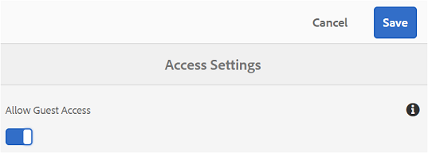
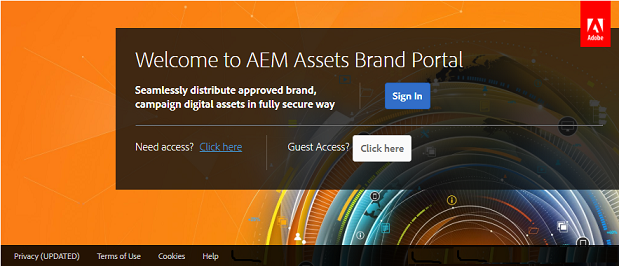
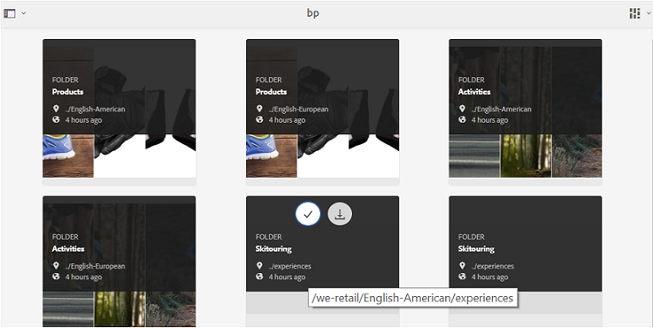
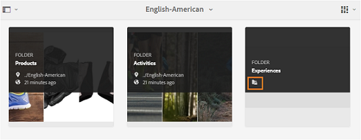
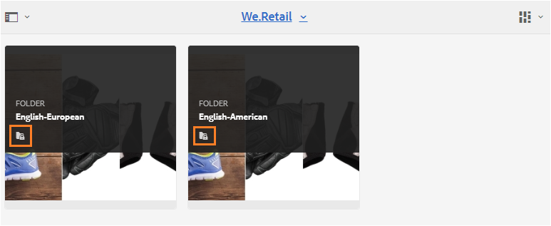
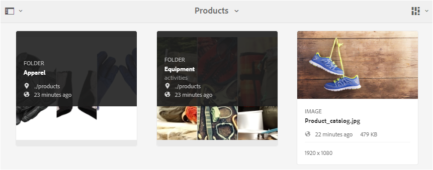
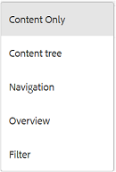
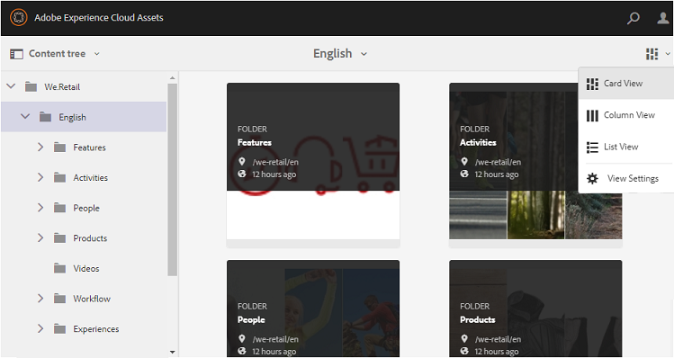
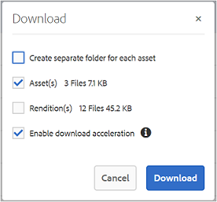
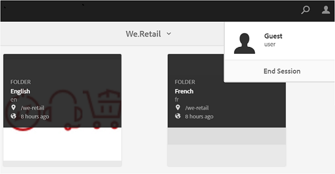

# Gäståtkomst till varumärkesportalen {#guest-access-to-brand-portal}

AEM Brand-portalen ger gäster åtkomst till portalen. En gästanvändare behöver inga autentiseringsuppgifter för att gå in på portalen och har tillgång till de offentliga resurserna (och samlingarna) på portalen. Användare i gästsessionen kan lägga till resurser i sin ljuslåda (privat samling) och hämta samma tills sessionen varar, vilket är två timmar från sessionens början, såvida inte gästanvändaren väljer att göra det [[!UICONTROL End Session]](#exit-guest-session).

Gäståtkomstfunktionen gör det möjligt för organisationer att [snabbt dela godkända resurser](../using/brand-portal-sharing-folders.md#how-to-share-folders) med den avsedda målgruppen i stor skala utan att behöva lägga in dem. Brand Portal 6.4.2 och senare är utrustad för flera samtidiga gästanvändare, vilket är 10 % av den totala användarkvoten per organisation. Genom att ge gäståtkomst sparar du tid när du hanterar och lägger in poäng för användare som behöver använda begränsade funktioner på varumärkesportalen.\
Organisationer kan aktivera (eller inaktivera) gäståtkomst på organisationens varumärkesportalkonto med hjälp av **[!UICONTROL Allow Guest Access]** alternativ från **[!UICONTROL Access]** inställningarna på panelen Administrationsverktyg.

<!--
Comment Type: annotation
Last Modified By: mgulati
Last Modified Date: 2018-08-17T10:42:59.879-0400
Removed the first para: "AEM Assets Brand Portal allows public users to enter the portal anonymously and have restricted access to the allowed public resources as guests. Organization users with guest role need not seek access and authentication from administrators."
-->

## Starta gästsession {#begin-guest-session}

Om du vill ange varumärkesportalen anonymt väljer du **[!UICONTROL Click here]** motsvarande **[!UICONTROL Guest Access?]** på välkomstskärmen i varumärkesportalen. Ange den krypterade säkerhetskontrollen för att ge åtkomst till att använda varumärkesportalen.

## Gästsessionens varaktighet {#guest-session-duration}

En gästanvändarsession är aktiv i 15 minuter.
Det innebär att statusen för **[!UICONTROL Lightbox]** den bevaras i 15 minuter från sessionens starttid, och efter det startas den aktuella gästsessionen om så att ljuslådans läge försvinner.

En gästanvändare loggar till exempel in på Brand Portal vid 1 500 timmar och lägger till resurser **[!UICONTROL Lightbox]** för hämtning kl. 15:05. Om användaren inte hämtar **[!UICONTROL Lightbox]** samlingen (eller dess resurser) före 15:15 timmar (inom 15 minuter efter inloggningen) måste användaren starta om sessionen. Det **[!UICONTROL Lightbox]** är tomt, vilket innebär att de överförda resurserna inte längre är tillgängliga om sessionen förlorades.

## Tillåtna samtidiga gästsessioner {#concurrent-guest-sessions-allowed}

Antalet samtidiga gästsessioner är begränsat till 10 % av den totala användarkvoten per organisation. Det innebär att högst 20 gästanvändare kan arbeta samtidigt i en organisation med en användarkvot på 200. Den 21:a användaren nekas åtkomst och kan bara komma åt som gäst om sessionen för någon av de 20 aktiva gästanvändarna avslutas.

## Gästanvändarinteraktion med Brand Portal {#guest-user-interaction-with-brand-portal}

### Navigering för gästanvändargränssnitt

När användaren anger Brand Portal som gäst kan användaren se alla [resurser och mappar som delas](../using/brand-portal-sharing-folders.md#sharefolders) offentligt eller enbart med gästanvändare. Den här vyn är endast innehållsvyn, som visar resurser på ett av kort-, list- eller kolumnlayouterna.

Gästanvändarna ser dock mappträdet (från rotmappen) och de delade mapparna i sina respektive överordnade mappar när de loggar in på varumärkesportalen, om administratörerna har aktiverat konfigurationen [Aktivera mapphierarki](../using/brand-portal-general-configuration.md#main-pars-header-1621071021) .

De här överordnade mapparna är de virtuella mapparna och inga åtgärder kan utföras på dem. Du känner igen dessa virtuella mappar med en låsikon.

Till skillnad från delade mappar visas inga åtgärder när du hovrar eller markerar dem i **[!UICONTROL Card View]**. **[!UICONTROL Overview]** visas när du väljer en virtuell mapp i **[!UICONTROL Column View]** och **[!UICONTROL List View]**.

>[!NOTE]
>
>Standardminiatyrbilden för de virtuella mapparna är miniatyrbilden för den första delade mappen.

   

**[!UICONTROL View Settings]** gör att gästanvändare kan justera kortstorlekar i **[!UICONTROL Card View]** eller kolumner att visa i **[!UICONTROL List View]**.

Med **[!UICONTROL Content tree]** den kan du gå igenom resurshierarkin.

Med varumärkesportalen kan gästanvändare **[!UICONTROL Overview]** visa **[!UICONTROL Asset Properties]** valda resurser/mappar. Alternativet **[!UICONTROL Overview]** är synligt:

* I verktygsfältet högst upp när du väljer en resurs/mapp.
* I listrutan när du väljer Järnvägsväljaren.
När användaren väljer **[!UICONTROL Overview]** alternativet när en resurs/mapp är markerad kan han eller hon se titeln, sökvägen och tidpunkten när resursen skapades. När användaren väljer **[!UICONTROL Overview]** alternativet för tillgångsinformation kan användaren se metadata för resursen.

 

**[!UICONTROL Navigation]** till vänster kan du navigera från filer till samlingar och tillbaka i gästsessionen så att användarna kan bläddra bland resurser i filer och samlingar.

**[!UICONTROL Filter]** gör att gästanvändare kan filtrera resursfiler och mappar med hjälp av sökpredikat som angetts av administratören.

### Gästanvändarfunktioner

Gästanvändare har åtkomst till offentliga resurser på varumärkesportalen och har också få begränsningar som beskrivs närmare.

**Gästanvändare kan**:

* Få tillgång till alla gemensamma mappar och samlingar som är avsedda för alla användare på varumärkesportalen.
* Bläddra bland medlemmar, detaljsidor och ha en fullständig resursvy över medlemmarna i alla gemensamma mappar och samlingar.
* Sök resurser i gemensamma mappar och samlingar.
* Lägg till resurser i ljuslådesamlingen. Dessa ändringar i samlingen kvarstår under sessionen.
* Ladda ned material direkt eller via en ljuslådesamling.

**Gästanvändare kan inte**:

* Skapa samlingar och sparade sökningar, eller dela dem ytterligare.
* Få åtkomst till inställningar för mappar och samlingar.
* Dela resurser som länkar.

### Hämta resurser i gästsession

Gästanvändare kan direkt hämta resurser som delas offentligt eller exklusivt med gästanvändare på varumärkesportalen. Gästanvändare kan också lägga till resurser i **[!UICONTROL Lightbox]** (offentlig samling) och hämta samlingen innan deras session upphör **[!UICONTROL Lightbox]** .

Om du vill hämta resurser och samlingar använder du hämtningsikonen från:

* Miniatyrbilder för snabbåtgärd, som visas när du håller pekaren över resursen eller samlingen
* Verktygsfältet längst upp, som visas när du väljer en resurs eller samling

Om du väljer **[!UICONTROL Enable download acceleration]** i [!UICONTROL Download] dialogrutan kan du [förbättra hämtningsprestanda](../using/accelerated-download.md).

## Avsluta gästsession {#exit-guest-session}

Om du vill avsluta en gästsession använder du **[!UICONTROL End Session]** alternativen i sidhuvudet. Om webbläsarfliken som används för gästsessionen är inaktiv upphör sessionen automatiskt efter två timmars inaktivitet.

## Övervaka gästanvändaraktiviteter {#monitoring-guest-user-activities}

Administratörer kan övervaka gästanvändarinteraktionen med varumärkesportalen. Rapporter som genereras i varumärkesportalen kan ge viktiga insikter om gästanvändaraktiviteter. Rapporten kan till exempel **[!UICONTROL Download]** användas för att spåra antalet resurser som hämtats av gästanvändaren. **[!UICONTROL User Logins]** kan informera om när gästanvändaren senast loggade in på portalen och hur ofta inloggningar ska ske under en viss tid.
