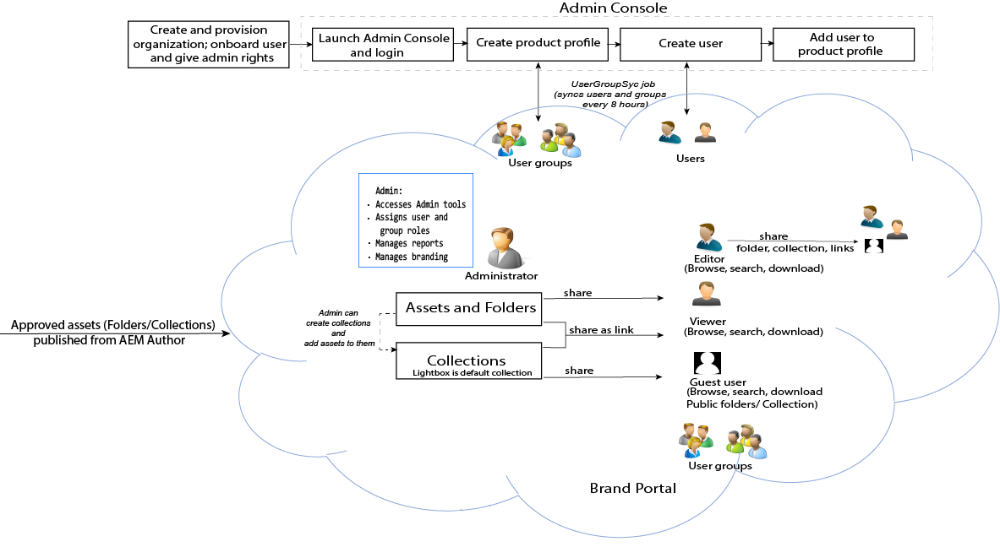

# Introduktion

Varumärkesportalen hjälper organisationer att tillgodose sina marknadsföringsbehov genom att på ett säkert sätt distribuera godkänt varumärkes- och produktmaterial till externa byråer, partners, interna team och återförsäljare för nedladdning.

Avsaknaden av en säker lösning för resursdelning kan leda till:

* Manuell resursdelning via e-post eller moln
* Problem med varumärkesefterlevnad
* Brist på kontroll över resursanvändningen
* Förseningar i kampanjer och produktlanseringar
* Duplicering av innehåll över olika geografiska platser och organisationer
* Osäker lagring av resurser före lansering

Med Brand Portal kan man säkerställa varumärkets överensstämmelse genom att låta marknadsförarna samarbeta med kanalpartners och interna företagsanvändare för att snabbt skapa, hantera och leverera de senaste riktlinjerna, logotyperna, kampanjerna och produktresurserna till intressenterna.
Brand Portal är ett molnbaserat SAAS-erbjudande. Det finns som ett tillägg till Adobe Experience Manager Assets-produkten (lokal eller hanterad tjänst).

Arbetsflödet i varumärkesportalen illustreras i följande bild.

## Användarhandbok för Adobe Experience Manager Brand Portal

Den här användarhandboken ger dokumentinsikter om erbjudanden på varumärkesportalen och viktiga arbetsflöden. Använd den vänstra listen för att navigera i olika funktioner och fördjupa dig i för att se hur olika personer interagerar med portalen.

### Se även

| Användarhandbok | Beskrivning |
|--- |---|
| [Nyheter](whats-new.md) | Vilka ändringar och de senaste erbjudandena i varumärkesportalen har gjorts i tidigare versioner. |
| [Versionsinformation](brand-portal-release-notes.md) | Förbättringar, åtgärdade kritiska problem och kända fel i den aktuella versionen. |
| [Konfigurera AEM Assets med varumärkesportalen](../using/configure-aem-assets-with-brand-portal.md) | Så här replikerar du varumärkesportalen med AEM Assets för att publicera resurser. |
| [Felsöka problem vid parallell publicering](troubleshoot-parallel-publishing.md) | Felsöka replikering mellan varumärkesportalen och AEM Assets. |
| [Filformat som stöds](brand-portal-supported-formats.md) | Filformat som stöds i varumärkesportalen för förhandsgranskning och hämtning. |
| [Publicera resurser på varumärkesportalen](brand-portal-sharing-folders.md) | Publicera mappar, samlingar, länkar, förinställningar, schema, ansikten och taggar i varumärkesportalen. |
| [Resurshantering i varumärkesportalen](brand-portal-asset-sourcing.md) | Så här konfigurerar du Resurser i AEM Resurser, överför resurser i varumärkesportalen och publicerar bidragsmappen tillbaka till AEM Resurser. |

### Användbara resurser

* [Förstå varumärkesportalen med AEM Assets](https://docs.adobe.com/content/help/en/experience-manager-brand-portal/using/home.html)
