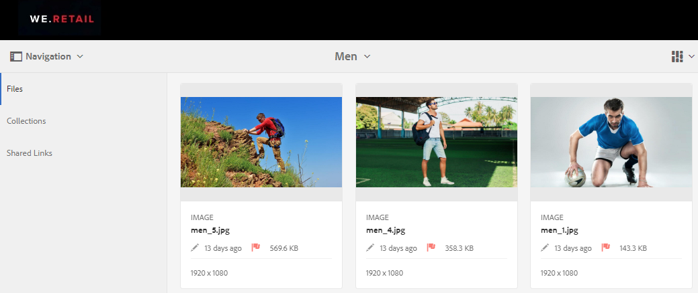
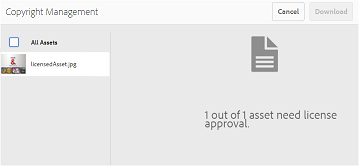
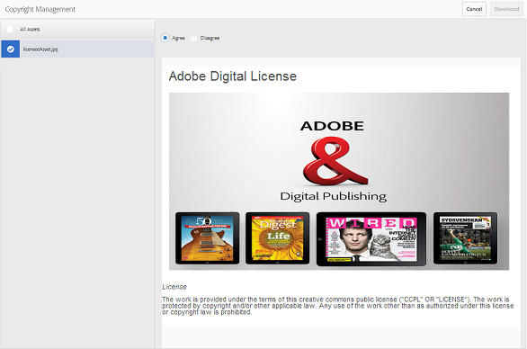
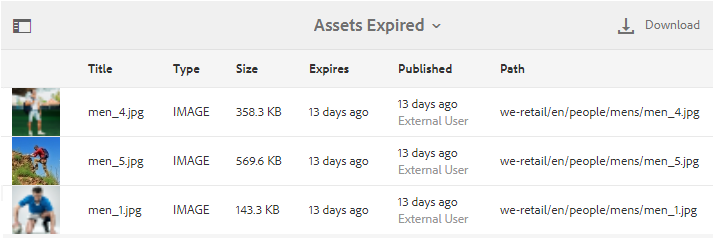

# Hantera digitala rättigheter för resurser {#manage-digital-rights-of-assets}

För att skydda ert varumärke är det viktigt att säkerställa säker distribution och användning av kreativa tillgångar och varumärkesmaterial. Detta kan tillämpas både inom och utanför organisationen genom att ett förfallodatum (och en förfallotid) kopplas till godkända resurser som publiceras från AEM till varumärkesportalen, eller genom att dessa mediefiler licensieras för villkorlig användning. Dessutom kan du i varumärkesportalen ange ett förfallodatum för länkar till resurser som delas från varumärkesportalen.

Läs vidare för att lära dig hur resurserna skyddas på varumärkesportalen och förstå de associerade användningsbehörigheterna.

## Resursens förfallodatum {#asset-expiration}

Förfallotid är ett effektivt sätt att kontrollera användningen av godkända resurser på varumärkesportalen i en organisation. Alla mediefiler som publiceras från AEM Assets till varumärkesportalen kan ha ett förfallodatum, vilket begränsar användningen av dessa mediefiler för olika användarroller.

### Användningsbehörigheter för utgångna resurser {#usage-permissions-expired-assets}

I varumärkesportalen kan administratörer visa, hämta och lägga till utgångna resurser i samlingar. Redigerare och visningsprogram kan bara visa och lägga till utgångna resurser i samlingar.

Administratörer kan publicera material som gått ut från AEM Assets till varumärkesportalen. Utgångna resurser kan dock inte delas via bläck från varumärkesportalen. Om du väljer en resurs som har gått ut i en mapp som innehåller både förfallna och icke-utgångna resurser är åtgärden **[!UICONTROL Share Link]** inte tillgänglig. Men om du väljer en mapp som innehåller resurser som har gått ut och som inte gått ut är åtgärderna [!UICONTROL Share] och **[!UICONTROL Share Link]** tillgängliga.

>[!NOTE]
>
>En mapp kan fortfarande delas som en länk, även om den innehåller resurser som har gått ut. I det här fallet listar länken inte resurser som har gått ut och bara resurser som inte har gått ut delas.

I följande tabell visas användningsbehörigheterna för utgångna resurser:

|  | **[!UICONTROL Link share]** | **[!UICONTROL Download]** | **[!UICONTROL Properties]** | **[!UICONTROL Add to collection]** | **[!UICONTROL Delete]** |
|---|---|---|---|---|---|
| **[!UICONTROL Administrator]** | Otillgänglig | Tillgänglig | Tillgänglig | Tillgänglig | Tillgänglig |
| **[!UICONTROL Editor]** | Otillgänglig | Otillgänglig | Tillgänglig | Tillgänglig | Otillgänglig |
| **[!UICONTROL Viewer]** | Otillgänglig | Otillgänglig | Tillgänglig | Tillgänglig | Otillgänglig |
| **[!UICONTROL Guest user]** | Otillgänglig | Otillgänglig | Tillgänglig | Tillgänglig | Otillgänglig |

>[!NOTE]
>
>Om visningsprogram och redigerare hämtar en mapp med resurser som har upphört att gälla och som inte har gått ut, hämtas endast de resurser som inte har gått ut. Om en mapp bara innehåller resurser som har gått ut hämtas en tom mapp.

### Utgångsstatus för resurser {#expiration-status-of-assets}

Du kan visa förfallostatusen för resurser i deras **[!UICONTROL Card View]**. En röd flagga på kortet anger att resursen har gått ut.

>[!NOTE]
>
>I list- och kolumnvyer visas inte tillgångarnas förfallostatus.

## Resurslänkens förfallodatum {#asset-link-expiration}

När du delar resurser via länkar kan administratörer och redigerare ange ett datum och en tid när de ska förfalla med fältet **[!UICONTROL Expiration]** i dialogrutan **[!UICONTROL Link Sharing]**. Länkens standardförfallodatum är sju dagar från det datum då länken delas.

Det ser till att resurser som delas som länkar förfaller vid det datum och den tidpunkt som anges av varumärkesportaladministratörer och redigerare, och inte längre kan visas och hämtas efter förfallodatumet. Eftersom resurser som delas via länkar också kan visas av externa användare som inte är en del av organisationen, kan du genom att ange förfallodatum se till att dina godkända resurser är skyddade och inte exponerade för okända enheter längre än en angiven tid.

Mer information om länkdelning finns i [Dela resurser som en länk](../using/brand-portal-link-share.md).

## Licensierade resurser {#licensed-assets}

Licensierade mediefiler regleras av ett licensavtal som måste godkännas innan de kan hämtas från varumärkesportalen. Det här avtalet för licensierade mediefiler levereras när du hämtar mediefilen direkt från varumärkesportalen eller via en delad länk. Licensskyddade resurser kan visas av alla användare, oavsett om de har gått ut eller inte. Hämtningen och användningen av licensierade mediefiler som upphört att gälla är dock begränsad. Om du vill veta mer om hur licensierade resurser och tillåtna aktiviteter som har upphört att gälla baserat på användarroller kan du läsa [användningsbehörigheter för utgångna resurser](../using/manage-digital-rights-of-assets.md#usage-permissions-expired-assets).

Licensskyddade resurser har [licensavtal som är kopplade](https://helpx.adobe.com/experience-manager/6-5/assets/using/drm.html#DigitalRightsManagementinAssets) till sig, vilket görs genom att ställa in resursens [metadataegenskap](https://helpx.adobe.com/experience-manager/6-5/assets/using/drm.html#DigitalRightsManagementinAssets) i AEM Assets.

Om du väljer att hämta licensskyddade mediefiler omdirigeras du till sidan **[!UICONTROL Copyright Management]**.

Här måste du välja resursen för att hämta och godkänna det associerade licensavtalet. Om du inte godkänner licensavtalet är knappen **[!UICONTROL Download]** inte aktiverad.

Om markeringen innehåller flera skyddade resurser markerar du en resurs i taget, godkänner licensavtalet och fortsätter att hämta resursen.

## Generera en rapport över utgångna resurser {#generate-report-about-expired-assets}

Administratörer kan generera och ladda ned en rapport med en lista över alla mediefiler som gått ut inom en viss tidsram. Den här rapporten innehåller detaljerad information - som storlek, typ, sökväg som anger resursens placering i resurshierarkin, när tillgången förföll och när den publicerades - om de förfallna tillgångarna. Kolumnerna i den här rapporten kan anpassas för att visa mer data baserat på användarkrav.

Mer information om rapportfunktionen finns i [Arbeta med rapporter](../using/brand-portal-reports.md#work-with-reports).
