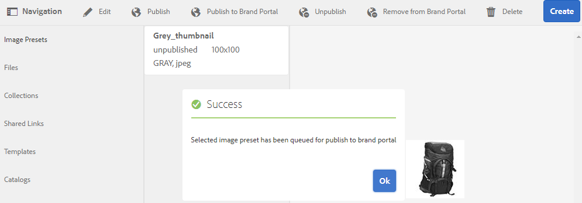
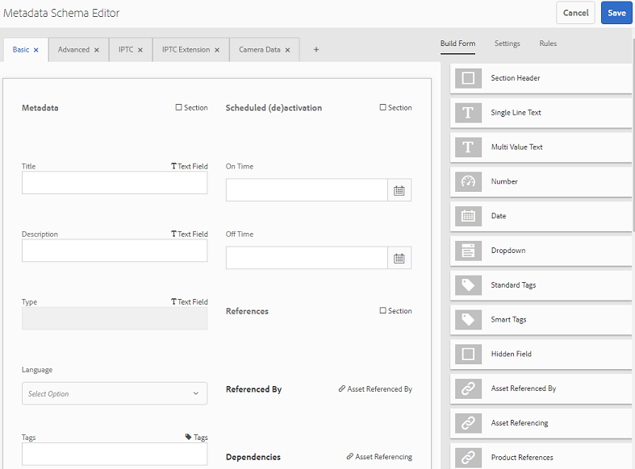
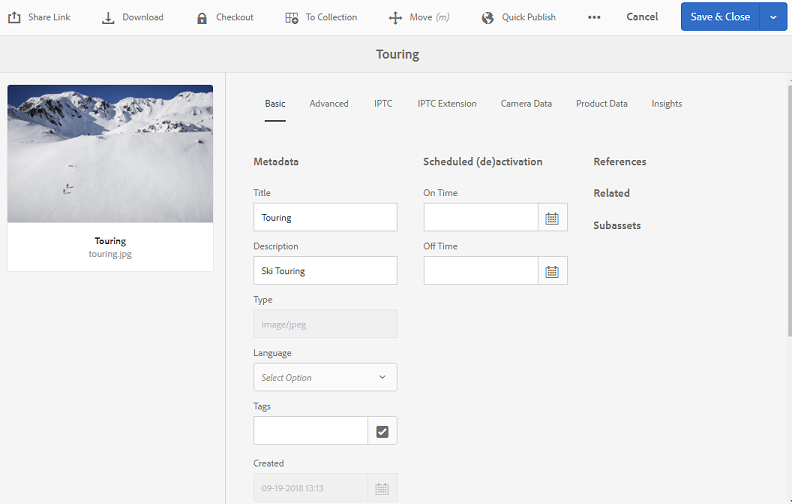
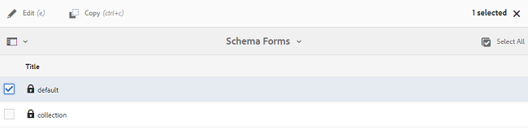
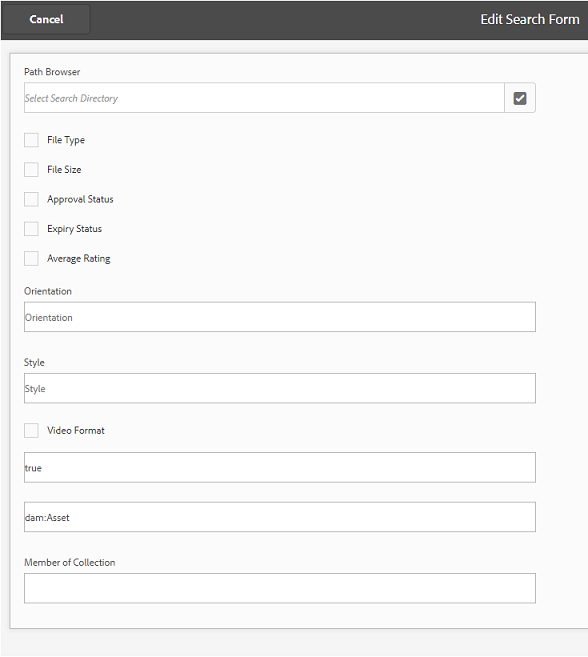
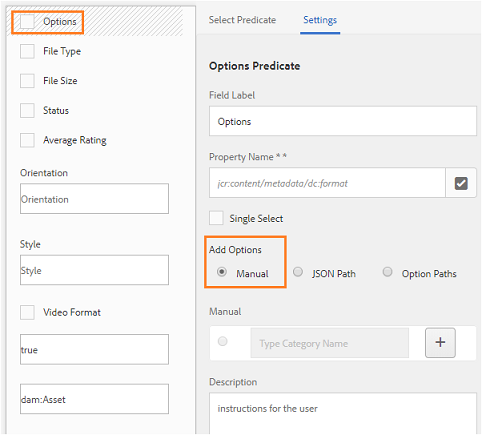

# Publicera förinställningar, schema och ansikten på varumärkesportalen {#publish-presets-schema-and-facets-to-brand-portal}

Artikeln innehåller information om hur du publicerar bildförinställningar, metadatamaterial och anpassade sökfaktorer från AEM Author-instansen till varumärkesportalen. Med publiceringsfunktionen kan organisationer återanvända bildförinställningar, metadatamatcheman och sökfaktorer som skapats/ändrats i AEM Author-instansen, vilket minskar dubbelarbetet.

>[!NOTE]
>
>Möjligheten att publicera bildförinställningar, metadataram och sökfaktorer från AEM Author-instansen till varumärkesportalen är tillgänglig från och med AEM 6.2 SP1-CFP7 och AEM 6.3 SP 1-CFP 1 (6.3.1.1).

## Publicera bildförinställningar på varumärkesportalen {#publish-image-presets-to-brand-portal}

Bildförinställningar är en uppsättning kommandon för storleksändring och formatering som används på bilden när bilden levereras. Du kan skapa och ändra bildförinställningar på Varumärkesportalen. Om AEM Author-instansen körs i dynamiskt medieläge kan användarna skapa förinställningar hos AEM Author och publicera dem på AEM Assets Brand Portal, och undvika att återskapa samma förinställningar på Brand Portal.\
När förinställningen har skapats visas den som en dynamisk återgivning på resursdetaljåtergivningsfältet och i dialogrutan för hämtning.

>[!NOTE]
>
>Om AEM Author-instansen inte körs i **[!UICONTROL Dynamic Media Mode]** (kunden har inte köpt Dynamic Media) skapas inte **[!UICONTROL Pyramid TIFF]** återgivningen av resurserna när överföringen görs. Bildförinställningar eller dynamiska återgivningar fungerar på **[!UICONTROL Pyramid TIFF]** en resurs, så om den inte **[!UICONTROL Pyramid TIFF]** är tillgänglig på AEM Author-instansen är den inte heller tillgänglig på varumärkesportalen. Därför finns det inga dynamiska återgivningar i återgivningsfältet på sidan med resursinformation och i dialogrutan för hämtning.

Så här publicerar du bildförinställningar på varumärkesportalen:

1. I AEM Author-instansen trycker/klickar du på AEM-logotypen för att komma åt den globala navigeringskonsolen och trycker/klickar på verktygsikonen och navigerar till **[!UICONTROL Assets > Image Presets]**.
1. Välj bildförinställningen eller flera bildförinställningar i listan med bildförinställningar och klicka/tryck **[!UICONTROL Publish to Brand Portal]**.

>[!NOTE]
>
>När användarna klickar på **[!UICONTROL Publish to Brand Portal]** bildförinställningarna köas för publicering. Användarna uppmanas att övervaka loggen för replikeringsagenterna för att bekräfta om publiceringen lyckades.

Så här avpublicerar du en bildförinställning från varumärkesportalen:

1. I AEM Author-instansen trycker/klickar du på AEM-logotypen för att komma åt den globala navigeringskonsolen, trycker/klickar på **[!UICONTROL Tools]** ikonen och navigerar till **[!UICONTROL Assets > Image Presets]**.
1. Välj en bildförinställning och välj **[!UICONTROL Remove from Brand Portal]** bland de tillgängliga alternativen högst upp.

## Publicera metadatamatchemat till varumärkesportalen {#publish-metadata-schema-to-brand-portal}

Metadata-schemat beskriver layouten och egenskaperna som visas på egenskapssidan för resurser/samlingar.

 

Om användare har redigerat standardschemat på AEM Author-instansen och är villiga att använda samma schema som standardschemat på varumärkesportalen, kan de helt enkelt publicera metadatamappningsformulären på varumärkesportalen. I ett sådant fall åsidosätts standardschemat på varumärkesportalen av standardscheman som publiceras från AEM Author-instansen.

Om användare har skapat ett anpassat schema på en AEM Author-instans kan de publicera det anpassade schemat på varumärkesportalen i stället för att återskapa det anpassade schemat där. Användarna kan sedan använda det här anpassade schemat för alla mappar/samlingar i varumärkesportalen.

>[!NOTE]
>
>Standardscheman kan inte publiceras till varumärkesportalen om de är låsta vid AEM-instansen (d.v.s. de är oredigerade).

>[!NOTE]
>
>Om en mapp har ett schema tillämpat på en AEM Author-instans måste samma schema också finnas på varumärkesportalen för att upprätthålla enhetligheten på sidan för resursegenskaper på AEM Author och Brand Portal.

Så här publicerar du ett metadataschema från AEM Author-instansen till varumärkesportalen:

1. I AEM Author-instansen trycker/klickar du på AEM-logotypen för att komma åt den globala navigeringskonsolen, trycker/klickar på verktygsikonen och navigerar till **[!UICONTROL Assets > Metadata Schemas]**.
1. Välj ett metadatamatchema och välj **[!UICONTROL Publish to Brand Portal]** bland de tillgängliga alternativen högst upp.

>[!NOTE]
>
>När användarna klickar **[!UICONTROL Publish to Brand Portal]** köas metadatamappningarna för publicering. Användarna uppmanas att övervaka loggen för replikeringsagenterna för att bekräfta om publiceringen lyckades.

Så här avpublicerar du ett metadataschema från varumärkesportalen:

1. I AEM Author-instansen trycker/klickar du på AEM-logotypen för att komma åt den globala navigeringskonsolen, trycker/klickar på verktygsikonen och navigerar till **[!UICONTROL Assets > Metadata Schemas]**.
1. Välj ett metadatamatchema och välj **[!UICONTROL Remove from Brand Portal]** bland de tillgängliga alternativen högst upp.

## Publicera sökfaktorer på varumärkesportalen {#publish-search-facets-to-brand-portal}

Med sökformulären kan användare [söka](../using/brand-portal-search-facets.md) efter fasetterade objekt på varumärkesportalen. Sökfacets ger större detaljrikedom åt sökningar på varumärkesportalen. Alla [predikat som läggs till](https://helpx.adobe.com/experience-manager/6-5/assets/using/search-facets.html#AddingaPredicate) i sökformuläret är tillgängliga för användare som sökfaktorer i sökfilter.

Om du vill använda ett anpassat sökformulär **[!UICONTROL Assets Admin Search Rail]** från AEM Author-instansen kan du publicera det anpassade sökformuläret från AEM Author-instansen till Varumärksportal i stället för att återskapa samma formulär på varumärkesportalen.

>[!NOTE]
>
>Låst sökformulär **[!UICONTROL Assets Admin Search Rail]** på AEM Resurser kan inte publiceras till varumärkesportalen om det inte redigeras. När sökformuläret har redigerats och publicerats på varumärkesportalen åsidosätter det sökformuläret på varumärkesportalen.

Så här publicerar du den redigerade sökaspekten från AEM Author-instansen till varumärkesportalen:

1. Tryck/klicka på AEM-logotypen och gå sedan till **[!UICONTROL Tools > General > Search Forms]**.
1. Markera det redigerade sökformuläret och välj **[!UICONTROL Publish to Brand Portal]**.

   >[!NOTE]
   >
   >När användare klickar **[!UICONTROL Publish to Brand Portal]** ställs sökfunktionerna i kö för publicering. Användarna uppmanas att övervaka loggen för replikeringsagenterna för att bekräfta om publiceringen lyckades.

Så här avpublicerar du sökformulär från varumärkesportalen:

1. I AEM Author-instansen trycker/klickar du på AEM-logotypen för att komma åt den globala navigeringskonsolen, trycker/klickar på verktygsikonen och navigerar till **[!UICONTROL General > Search Forms]**.
1. Markera sökformuläret och välj **[!UICONTROL Remove from Brand Portal]** bland de tillgängliga alternativen högst upp.

>[!NOTE]
>
>Åtgärden lämnar **[!UICONTROL Unpublish from Brand Portal]** standardsökformuläret på varumärkesportalen och återställer inte det sökformulär som användes före publiceringen.

### Begränsningar {#limitations}

1. Ett fåtal sökpredikat kan inte användas för sökfilter på varumärkesportalen. När dessa sökpredikat publiceras som en del av sökformuläret från AEM Author-instansen till Brand Portal filtreras de bort. Användarna ser därför färre antal predikt i det publicerade formuläret på varumärkesportalen. Se [sökpredikat som gäller filter på varumärkesportalen](../using/brand-portal-search-facets.md#list-of-search-predicates).

1. Om [!UICONTROL Options Predicate]en användare använder en anpassad sökväg för att läsa alternativ på AEM Author-instansen fungerar den inte på varumärkesportalen. Dessa ytterligare sökvägar och alternativ publiceras inte på varumärkesportalen tillsammans med sökformuläret. I det här fallet kan användarna välja alternativet **[!UICONTROL Manual]** i **[!UICONTROL Add Options]** för **[!UICONTROL Options Predicate]** att lägga till dessa alternativ manuellt på Varumärkeportal.

