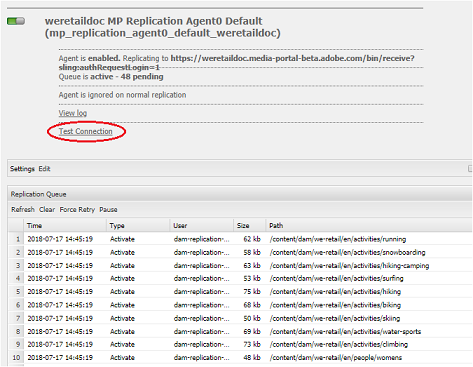

# Felsöka problem vid parallell publicering till varumärkesportalen {#troubleshoot-issues-in-parallel-publishing-to-brand-portal}

Varumärkesportalen är konfigurerad med AEM Assets för att innehålla godkända varumärkesresurser som sömlöst importerats (eller publicerats) från AEM Assets författarinstans. När den har [konfigurerats](../using/configure-aem-assets-with-brand-portal.md)använder AEM Author en replikeringsagent för att replikera de markerade resurserna till molntjänsten Brand Portal för godkänd användning av Brand Portal-användare. Flera replikeringsagenter används från och med AEM 6.2 SP1-CFP5, AEM CFP 6.3.0.2 för parallell publicering med hög hastighet.

>[!NOTE]
>
>Adobe rekommenderar att du uppgraderar till AEM 6.4.1.0 för att säkerställa att AEM Assets Brand Portal konfigureras med AEM Assets. En begränsning i AEM 6.4 ger ett fel när AEM Assets konfigureras med varumärkesportalen och replikeringen misslyckas.

När du konfigurerar molntjänsten för varumärkesportalen under **[!UICONTROL /etc/cloudservice]** genereras alla nödvändiga användare och token automatiskt och sparas i databasen. Molntjänstkonfigurationen skapas. Tjänstanvändare som krävs för replikerings- och replikeringsagenter för att replikera innehåll skapas också. Detta skapar fyra replikeringsagenter. När du publicerar flera resurser från AEM till Brand Portal står de i kö och distribueras bland dessa replikeringsagenter via Round Robin.

Publiceringen kan emellertid misslyckas ibland på grund av stora snedningsjobb, utökat nätverk och **[!UICONTROL Disk I/O]** på AEM Author-instansen eller långsammare prestanda för AEM Author-instansen. Därför rekommenderas att du testar anslutningen till replikeringsagenterna innan publiceringen påbörjas.

## Felsöka fel vid förstagångspublicering: validera din publiceringskonfiguration {#troubleshoot-failures-in-first-time-publishing-validating-your-publish-configuration}

Så här validerar du dina publiceringskonfigurationer:

1. Kontrollera felloggarna
1. Kontrollera om replikeringsagenten har skapats
1. Testanslutning

**Slutloggar när Cloud Service skapas**

Kontrollera slutloggar. Kontrollera om replikeringsagenten har skapats eller inte. Om det inte går att skapa replikeringsagenten kan du redigera molntjänsten genom att göra mindre ändringar i molntjänsten. Validera och kontrollera igen om replikeringsagenten har skapats eller inte. Om inte kan du redigera tjänsten igen.

Om molntjänsten inte konfigureras korrekt upprepade gånger ska du rapportera en dagis-biljett.

**Testa anslutningen till replikeringsagenter**

Visa logg, om fel påträffas i replikeringsloggen:

1. Kontakta Adobes support.

1. Försök [rensa upp](../using/troubleshoot-parallel-publishing.md#clean-up-existing-config) igen och skapa publiceringskonfigurationen igen.

<!--
Comment Type: remark
Last Modified By: Mini Gulati (mgulati)
Last Modified Date: 2018-06-21T22:56:21.256-0400

?? check and compare public key. At times public key is different

?? another thing to check in /useradmin

-->

### Rensa befintliga Brand Portal-publiceringskonfigurationer {#clean-up-existing-config}

De flesta tillfällen när publiceringen inte fungerar kan det bero på att användaren som publicerar (till exempel: `mac-<tenantid>-replication` saknar den senaste privata nyckeln och publiceringen misslyckas därför med felet&quot;401 unauthorized&quot; och inga andra fel rapporteras i replikeringsagentloggarna. Du kanske vill undvika felsökning och skapa en ny konfiguration i stället. För att den nya konfigurationen ska fungera på rätt sätt bör du rensa följande från AEM-författarkonfigurationen:

1. Gå till `localhost:4502/crx/de/` (med tanke på att du kör författarinstansen på localhost:4502:\
   i. delete `/etc/replication/agents.author/mp_replication`ii. delete 
`/etc/cloudservices/mediaportal/<config_name>`

1. Gå till localhost:4502/useradmin:\
   i. sök efter användare `mac-<tenantid>replication`ii. ta bort den här användaren

Nu är systemet städat. Nu kan du försöka skapa en ny molntjänstkonfiguration och fortfarande använda det befintliga JWT-programmet i [https://legacy-oauth.cloud.adobe.io/](https://legacy-oauth.cloud.adobe.io/). Du behöver inte skapa något nytt program, utan bara den offentliga nyckeln behöver uppdateras från den nya molnkonfigurationen.

## Problem med klientsynlighet för JWT-program för utvecklaranslutning {#developer-connection-jwt-application-tenant-visibility-issue}

Om du väljer [https://legacy-oauth.cloud.adobe.io/](https://legacy-oauth.cloud.adobe.io/)visas alla organ (innehavare) som de aktuella användarna har systemadministratör för. Om du inte hittar organisationsnamnet här eller om du inte kan skapa ett program för en nödvändig klient här, kontrollerar du om du har tillräcklig behörighet (systemadministratör) för att göra detta.

Det finns ett känt fel i det här användargränssnittet som innebär att för alla klientprogram visas endast de 10 populära programmen. När du skapar programmet ska du stanna kvar på sidan och bokmärka URL-adressen. Du behöver inte gå till programmets listsida och hitta det program du har skapat. Du kan trycka på den här bokmärkesadressen direkt och uppdatera/ta bort programmet vid behov.

JWT-programmet kanske inte visas korrekt. Du bör därför anteckna/bokmärka URL-adressen när du skapar ett JWT-program.

## Konfigurationen som körs slutar fungera {#running-configuration-stops-working}

<!--
Comment Type: draft

If the running configuration stops working, either of the following two possibilities
<g class="gr_ gr_15 gr-alert gr_gramm gr_inline_cards gr_run_anim Grammar multiReplace" data-gr-id="15" id="15" style="font-size: 12px;">
are
</g> there:

1.
<g class="gr_ gr_14 gr-alert gr_gramm gr_inline_cards gr_run_anim Grammar only-ins doubleReplace replaceWithoutSep" data-gr-id="14" id="14">
Connection
</g> has failed, or

2. Publish has failed with permission to dam-replication-service denied, while connection has passed 

If the connection has failed [1], the
<g class="gr_ gr_10 gr-alert gr_spell gr_inline_cards gr_run_anim ContextualSpelling ins-del multiReplace" data-gr-id="10" id="10">
fail safe
</g> way to fix it is to <a href="../using/troubleshoot-parallel-publishing.md#main-pars-header-1664955658">clean up</a> the existing Brand Portal publish configuration and recreate a publish configuration. 

However, if the
<g class="gr_ gr_18 gr-alert gr_spell gr_inline_cards gr_run_anim ContextualSpelling" data-gr-id="18" id="18">
publish
</g> has failed with
<g class="gr_ gr_16 gr-alert gr_gramm gr_inline_cards gr_run_anim Grammar only-ins doubleReplace replaceWithoutSep" data-gr-id="16" id="16">
permission
</g> denied to dam-replication-service, raise a support ticket.

-->

Om en replikeringsagent (som publicerades på en varumärkesportal helt okej) slutar bearbeta publiceringsjobb bör du kontrollera replikeringsloggarna. AEM har automatisk återförsöksinstallation, så om en viss resurspublicering misslyckas provas den automatiskt igen. Om det uppstår något tillfälligt problem, t.ex. ett nätverksfel, kan det lyckas under ett nytt försök.

Om det finns kontinuerliga publiceringsfel och kön är blockerad bör du kontrollera **[!UICONTROL test connection]** och försöka lösa de fel som rapporteras.

Beroende på felen rekommenderar vi att du loggar en supportanmälan så att konstruktörerna på Brand Portal kan hjälpa dig att lösa problem.

## Konfigurera replikeringsagenter för att undvika timeoutfel i anslutningen {#connection-timeout}

**Problem**: Jag kan inte publicera resurser från AEM Assets till varumärkesportalen. Replikeringsloggen anger att anslutningen gjorde timeout.

**Upplösning**: Publiceringen misslyckas vanligtvis med ett timeout-fel om det finns flera väntande begäranden i replikeringskön. Kontrollera att replikeringsagenterna är konfigurerade för att undvika timeout för att lösa problemet.

Utför följande steg för att konfigurera replikeringsagenten:
1. Logga in på AEM Assets författarinstans.
1. From the **Tools** panel, navigate to **[!UICONTROL Deployment]** > **[!UICONTROL Replication]**.
1. Klicka på på sidan Replikering **[!UICONTROL Agents on author]**. Du kan se de fyra replikeringsagenterna för din Brand Portal-klient.
1. Klicka på replikeringsagentens URL för att öppna agentinformationen.
1. Klicka **[!UICONTROL Edit]** för att ändra inställningarna för replikeringsagenten.
1. Klicka på fliken **[!UICONTROL Extended]** i Agentinställningar.
1. Aktivera **[!UICONTROL Close Connection]** kryssrutan.
1. Upprepa steg 4 till 7 för att konfigurera alla fyra replikeringsagenterna.
1. Starta om servern.