# Nyheter i AEM Assets Brand Portal {#what-s-new-in-aem-assets-brand-portal}

Adobe Experience Manager Assets Brand Portal (AEM) hjälper er att enkelt skaffa, kontrollera och på ett säkert sätt distribuera godkända kreativa resurser till externa parter och interna företagsanvändare på olika enheter. Det bidrar till att effektivisera resursdelning, snabbar upp time-to-market för tillgångar och minskar risken för bristande efterlevnad och obehörig åtkomst. Adobe arbetar för att förbättra den övergripande varumärkesportalupplevelsen. Här får du en smygtitt på de nya funktionerna och förbättringarna.

## Vad har ändrats i 6.4.6 {#what-changed-in-646}

Brand Portal 6.4.6 är en förbättrad version där auktoriseringskanalen mellan AEM Assets och Brand Portal ändras. Tidigare konfigurerades varumärkesportalen i Classic UI via äldre OAuth Gateway, som använder JWT-tokenutbyte för att erhålla en IMS Access-token för auktorisering. AEM Assets har nu konfigurerats med Brand Portal via Adobe I/O, som anskaffar en IMS-token för auktorisering av din klient för varumärkesportalen.

<!-- The steps to configure integration are different depending on your AEM version, and whether you are configuring for the first-time, or upgrading the existing integration:
-->

<!--
  
   | **AEM Version** |**New Integration** |**Upgrade Integration** |
|---|---|---|
| **AEM 6.5** |[Create new integration](../using/brand-portal-configure-integration-65.md) |[Upgrade existing integration](../using/brand-portal-configure-integration-65.md#upgrade-integration-65) | 
| **AEM 6.4** |[Create new integration](../using/brand-portal-configure-integration-64.md) |[Upgrade existing integration](../using/brand-portal-configure-integration-64.md#upgrade-integration-64) | 
| **AEM 6.3** |[Create new integration](../using/brand-portal-configure-integration-63.md) |[Upgrade existing integration](../using/brand-portal-configure-integration-63.md#upgrade-integration-63) | 
| **AEM 6.2** |Contact Support |Contact Support | 

   -->

Stegen för att konfigurera AEM Assets med Brand Portal är olika beroende på din AEM-version, om du konfigurerar för första gången eller uppgraderar befintliga konfigurationer:

<!--| **AEM Version** |**New Configuration** |**Upgrade Configuration** |
|---|---|---|
| **AEM 6.5 (6.5.4.0 and above)** |[Create configuration](../using/brand-portal-configure-integration-65.md) |[Upgrade configuration](../using/brand-portal-configure-integration-65.md#upgrade-integration-65) | 
| **AEM 6.4 (6.4.8.0 and above)** |[Create configuration](../using/brand-portal-configure-integration-64.md) |[Upgrade configuration](../using/brand-portal-configure-integration-64.md#upgrade-integration-64) | 
| **AEM 6.3 (6.3.3.8 and above)** |[Create configuration](../using/brand-portal-configure-integration-63.md) |[Upgrade configuration](../using/brand-portal-configure-integration-63.md#upgrade-integration-63) | 
| **AEM 6.2** |Contact Support |Contact Support | 
-->

<!-- AEM Assets configuration with Brand Portal on Adobe I/O is supported on:
* AEM 6.5.4.0 and above
* AEM 6.4.8.0 and above
* AEM 6.3.3.8 and above -->

| **AEM-version** | **Ny konfiguration** | **Uppgraderingskonfiguration** |
|---|---|---|
| **AEM 6.5 (6.5.4.0 och senare)** | [Skapa konfiguration](https://docs.adobe.com/content/help/en/experience-manager-65/assets/brandportal/configure-aem-assets-with-brand-portal.html) | [Uppgraderingskonfiguration](https://docs.adobe.com/content/help/en/experience-manager-65/assets/brandportal/configure-aem-assets-with-brand-portal.html#upgrade-integration-65) |
| **AEM 6.4 (6.4.8.0 och senare)** | [Skapa konfiguration](https://docs.adobe.com/content/help/en/experience-manager-64/assets/brandportal/configure-aem-assets-with-brand-portal.html) | [Uppgraderingskonfiguration](https://docs.adobe.com/content/help/en/experience-manager-64/assets/brandportal/configure-aem-assets-with-brand-portal.html#upgrade-integration-64) |
| **AEM 6.3 (6.3.3.8 och senare)** | [Skapa konfiguration](https://helpx.adobe.com/experience-manager/6-3/assets/using/brand-portal-configuring-integration.html) | [Uppgraderingskonfiguration](https://helpx.adobe.com/experience-manager/6-3/assets/using/brand-portal-configuring-integration.html#Upgradeconfiguration) |
| **AEM 6.2** | Kontakta supporten | Kontakta supporten |

>[!NOTE]
>
>Vi rekommenderar att du uppdaterar din AEM-instans till det senaste Service Pack-versionen.

Se de senaste versionskommentarerna [för varumärkesportalen](brand-portal-release-notes.md).

Se Vanliga frågor om [varumärkesportalen](brand-portal-faqs.md).

## Vad har ändrats i 6.4.5 {#what-changed-in-645}

Brand Portal 6.4.5 är en funktionsrelease som fokuserar på att ge användare av varumärkesportalen (externa byråer/team) möjlighet att överföra innehåll till varumärkesportalen och publicera till AEM Assets, utan att behöva ha tillgång till författarmiljön. Den här funktionen kallas **[Resurser i varumärkesportalen](brand-portal-asset-sourcing.md)**och förbättrar kundupplevelsen genom att erbjuda en tvåvägsfunktion för användare som både bidrar och delar resurser med andra globalt distribuerade Brand Portal-användare.

### Resurshantering i varumärkesportalen {#asset-sourcing-in-bp}

Med Resurshantering kan AEM-användare (administratörer/icke-admin-användare) skapa nya mappar med en extra **Asset Contribution** -egenskap, vilket säkerställer att den nya mappen som skapas är öppen för att skickas från Brand Portal-användare. Detta utlöser automatiskt ett arbetsflöde som skapar ytterligare två undermappar, som kallas NYTT och DELAT, i den nyligen skapade **Contribute** -mappen.

AEM-användaren definierar sedan behovet genom att [ladda upp en översikt](brand-portal-configure-contribution-folder-properties.md) över de typer av resurser som ska läggas till i bidragsmappen samt [överföra baslinjeresurser](brand-portal-upload-baseline-assets.md)till **SHARED** -mappen för att säkerställa att BP-användarna har den referensinformation de behöver. Administratören kan sedan ge aktiva Brand Portal-användare åtkomst till mappen för bidrag innan den nya **Contribute** -mappen publiceras på varumärkesportalen.

När användaren är klar med att lägga till innehåll i mappen **NEW** kan han eller hon publicera mappen för bidrag i AEM-redigeringsmiljön. Observera att det kan ta några minuter att slutföra importen och återspegla det nya publicerade innehållet i AEM Assets.

Dessutom ändras inte alla befintliga funktioner. Användare av varumärkesportalen kan visa, söka efter och hämta resurser från bidragsmappen samt från andra tillåtna mappar. Administratörer kan dessutom dela mappen för bidrag ytterligare, ändra egenskaper och lägga till resurser i samlingar.

>[!NOTE]
>
>Resurshantering i varumärkesportalen stöds i AEM 6.5.2.0 och senare.
>
>Funktionen stöds inte i tidigare versioner - AEM 6.3 och AEM 6.4.

### Överför resurser till mappen för bidrag {#upload-assets-in-bp}

Brand Portal-användare med rätt behörigheter kan [hämta tillgångskraven](brand-portal-download-asset-requirements.md) för att förstå behovet av bidrag och överföra flera resurser eller mappar som innehåller flera resurser till bidragsmappen. Observera dock att användare av varumärkesportalen endast kan överföra resurser till undermappen **NEW** . Mappen **DELAD** är avsedd för distribution av krav och baslinjeresurser. Se, [Överför resurser till mappen för bidrag](brand-portal-upload-assets-to-contribution-folder.md)

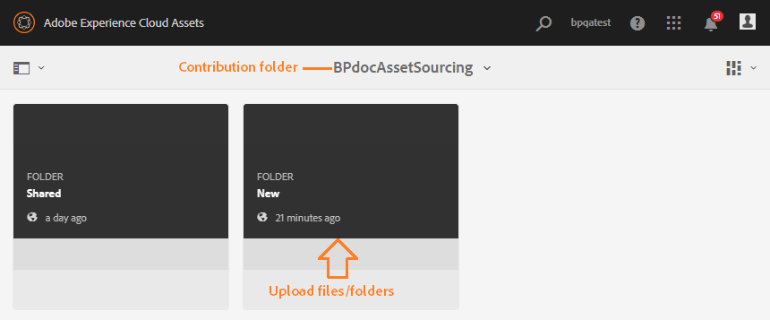

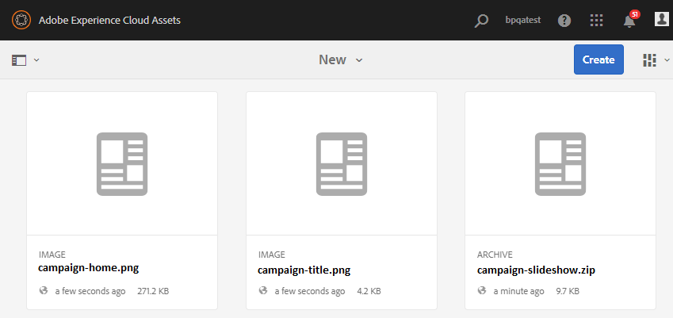

### Publicera mapp för bidrag till AEM Resurser {#publish-assets-to-aem}

När överföringen är klar till mappen **NEW** kan Brand Portal-användare sedan publicera bidragsmappen tillbaka till AEM. Det kan ta några minuter att importera och spegla det publicerade innehållet/resurserna i AEM Assets. Se, [Publicera mapp för bidrag till AEM Resurser](brand-portal-publish-contribution-folder-to-aem-assets.md)

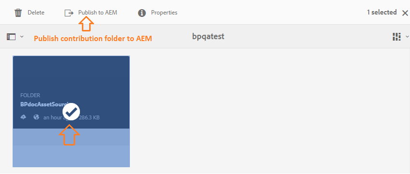

## Vad har ändrats i 6.4.4 {#what-changed-in-644}

Utgåvan av varumärkesportalen 6.4.4 fokuserar på förbättringar av textsökning och de vanligaste kundförfrågningarna. Se de senaste versionskommentarerna [för varumärkesportalen](brand-portal-release-notes.md).

### Förbättrade sökfunktioner {#search-enhancements}

Från och med varumärkesportalen 6.4.4 stöds partiell textsökning på egenskapsprediat i filtreringsrutan. Om du vill tillåta partiell textsökning måste du aktivera **partiell sökning** i egenskapspredikatet i sökformuläret.

Läs vidare om du vill veta mer om partiell textsökning och jokerteckensökning.

#### Sökning efter delvis fras {#partial-phrase-search}

Nu kan du söka efter resurser genom att endast ange en del - det vill säga ett eller två - av den sökda frasen i filtreringsrutan.

**Använd skiftlägeskänslig** frassökning är användbart när du är osäker på den exakta kombinationen av ord som förekommer i den sökta frasen.

Om ditt sökformulär i Varumärkeportal till exempel använder egenskapspredikatet för partiell sökning efter resurstitel, kommer alla resurser med ordet läger att returneras när du anger termen **läger** .

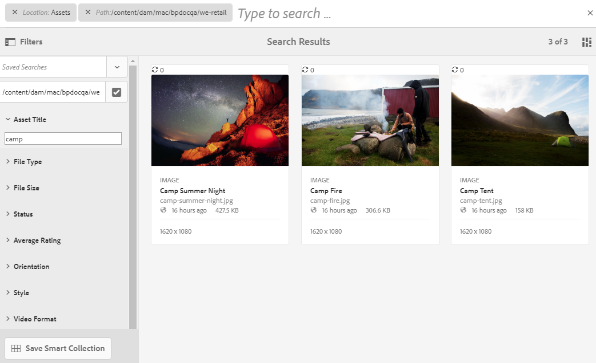

#### Sökning med jokertecken {#wildcard-search}

På varumärkesportalen kan du använda asterisken (*) i sökfrågan tillsammans med en del av ordet i den sökbara frasen.

**Använd skiftläge** Om du inte är säker på exakt vilka ord som förekommer i den sökda frasen kan du använda en jokerteckenssökning för att fylla i luckorna i sökfrågan.

Om du till exempel anger **klättb*** returneras alla resurser som har ord som börjar med tecknen **klättra** i titelfrasen om sökformuläret i varumärkesportalen använder egenskapspredikatet för partiell sökning på resurstiteln.

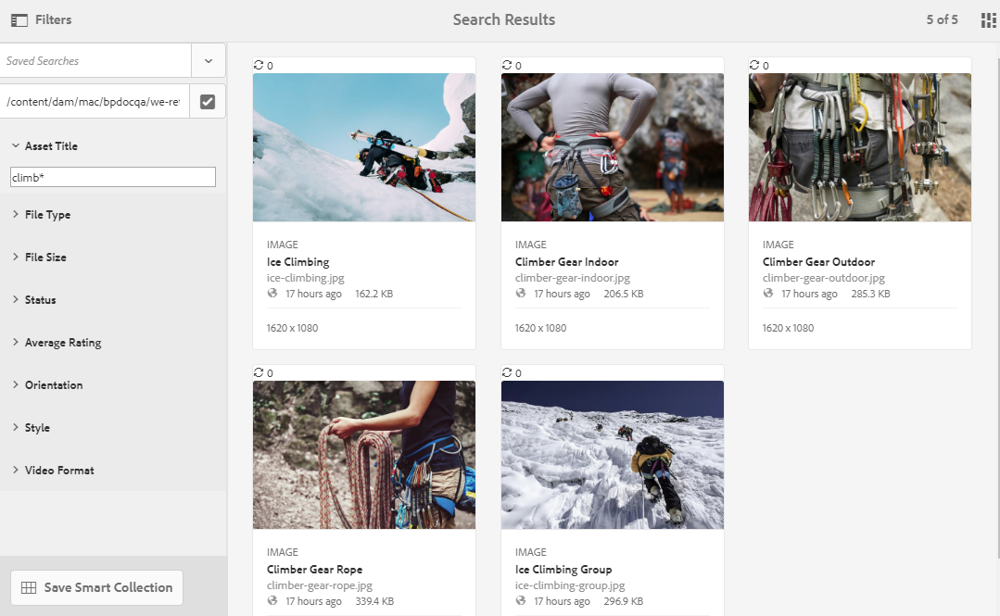

På samma sätt kan du ange:

* ***klättb** returnerar alla resurser med ord som slutar med tecken som **klättrar** i sin titelfras.

* ***klättb*** returnerar alla resurser med ord som innehåller tecknen **klättra** i sin titelfras.

>[!NOTE]
>
>Om du markerar kryssrutan **Delvis sökning** är **Ignorera skiftläge** markerat som standard.

## Vad har ändrats i 6.4.3 {#what-changed-in}

Brand Portal 6.4.3 fokuserar på - att ge organisationer ett alternativt alias utöver sitt klient-ID i Brand Portal-URL:en, ny mapphierarkikonfiguration, bättre videosupport, schemalagd publicering från AEM Author-instansen till Brand Portal, förbättringar av verksamheten samt att tillgodose kundernas önskemål.

### Mapphierarkinavigering för icke-administratörer

Administratörer kan nu konfigurera hur mapparna visas för icke-adminanvändare (redigerare, visningsprogram och gästanvändare) vid inloggning. [Konfigurationen Aktivera mapphierarki](../using/brand-portal-general-configuration.md) har lagts till i **Allmänna inställningar** på panelen Administrationsverktyg. Om konfigurationen är:

* **aktiverat**&#x200B;är mappträdet som börjar från rotmappen synligt för icke-admin-användare. Det innebär att de får en navigeringsupplevelse som liknar administratörerna.
* **inaktiverat** visas endast de delade mapparna på landningssidan.

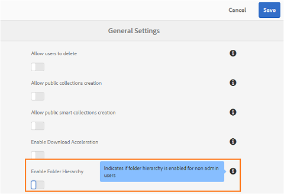
**Användningsexempel**

Funktionen [Aktivera mapphierarki](../using/brand-portal-general-configuration.md) (när den är aktiverad) hjälper dig att särskilja mappar med samma namn som delas från olika hierarkier. När du loggar in kan användare som inte är administratörer nu se de virtuella överordnade (och överordnade) mapparna för de delade mapparna.
 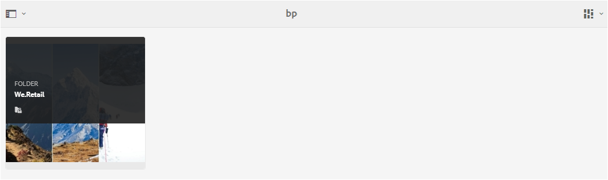

De delade mapparna ordnas i respektive katalog i virtuella mappar. Du känner igen dessa virtuella mappar med en låsikon.

Observera att standardminiatyrbilden för de virtuella mapparna är miniatyrbilden för den första delade mappen.

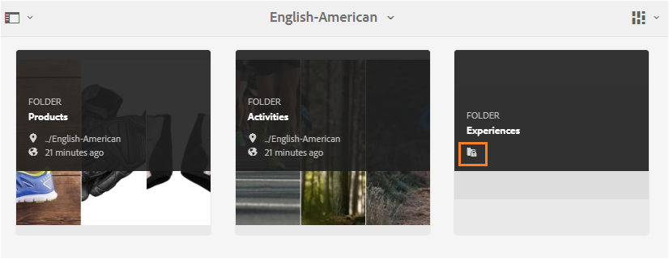

### Sök i en viss mapphierarki eller sökväg

**Predikatet för sökvägsläsare** introducerades i sökformuläret för att tillåta sökning av resurser i en viss katalog. Standardsöksökvägen för sökpredikatet för sökvägsläsaren är `/content/dam/mac/<tenant-id>/`, som kan konfigureras genom att du redigerar standardsökformuläret.

* Administratörsanvändare kan använda Sökvägsläsaren för att navigera till valfri mappkatalog på varumärkesportalen.
* Användare som inte är administratörer kan bara använda Sökväg för att navigera till de mappar (och gå tillbaka till de överordnade mapparna) som de har delat med sig av.
Delas till exempel `/content/dam/mac/<tenant-id>/folderA/folderB/folderC` med en icke-admin-användare. Användaren kan söka efter resurser i mappen C med hjälp av Sökvägsläsaren. Den här användaren kan även navigera till folderB och folderA (eftersom de är överordnade för den folderC som delas med användaren).

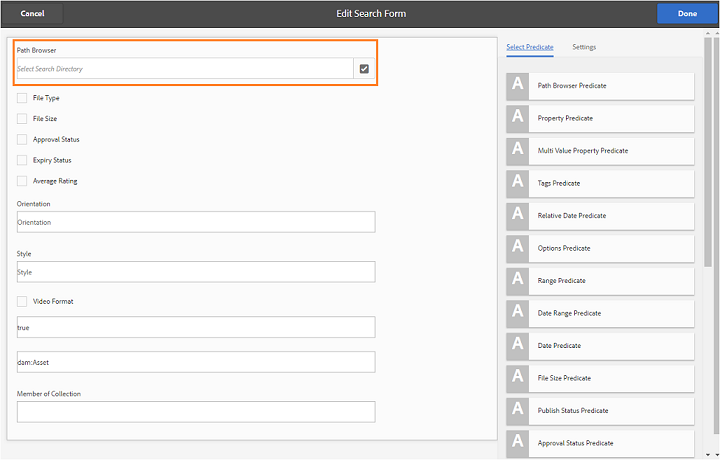

**Användningsexempel**

Du kan nu begränsa resurssökningen i en viss mapp som du har bläddrat till i stället för att börja i rotmappen.

Observera att sökningar under dessa mappar endast returnerar resultat från resurser som har delats med användaren.

### Stöd för videoåtergivningar i Dynamic Media

Användare vars AEM Author-instans är i läget Dynamic Media kan förhandsgranska och hämta de dynamiska medieåtergivningarna, utöver de ursprungliga videofilerna.

För att tillåta förhandsgranskning och hämtning av dynamiska medierenderingar på specifika innehavarkonton måste administratörer ange **Dynamic Media Configuration** (URL för videotjänst (DM-Gateway URL) och registrerings-ID för att hämta den dynamiska videon) i **Video** -konfigurationen från administratörsverktygspanelen.

**Användningsexemplet** Dynamic Media-videor kan förhandsvisas på:

* Sidan Resursinformation
* Resursvy
* Förhandsgranska länkdelning

Dynamic Media Video-kodningar kan hämtas från:

* Varumärkesportal
* Delad länk

### Schemalagd publicering på varumärkesportalen

Arbetsflödet för publicering av resurser (och mappar) från [AEM (6.4.2.0)](https://helpx.adobe.com/experience-manager/6-4/release-notes/sp-release-notes.html#main-pars_header_9658011) Author instance till Brand Portal kan schemaläggas för ett senare datum och tid.

Publicerade resurser kan också tas bort från portalen vid ett senare datum (tid) genom att schemalägga arbetsflödet för att avpublicera från varumärkesportalen.

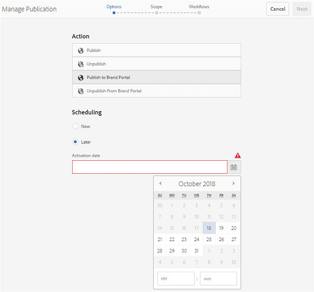
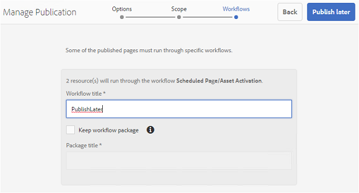

### Konfigurerbart klientalias i URL

Organisationer kan anpassa sin portal-URL genom att ha ett alternativt prefix i URL:en. För att få ett alias för innehavarens namn i den befintliga portalwebbadressen måste organisationen kontakta Adobes support.

Observera att bara prefixet för varumärksportal-URL:en kan anpassas och inte hela URL:en.\
En organisation med befintlig domän **geomettrix.brand-portal.adobe.com** kan till exempel få **geomettrixinc.brand-portal.adobe.com** som skapats på begäran.

AEM Author-instansen kan dock bara [konfigureras](https://helpx.adobe.com/experience-manager/6-5/assets/using/brand-portal-configuring-integration.html) med URL:en för klient-ID och inte med URL:en för klientalias (alternativ).

**Man kan anpassa portalens URL i stället för att följa Adobes webbadress (URL).**

### Bättre nedladdningsupplevelser

Versionen ger en förenklad nedladdningsupplevelse med ett reducerat antal klick och varningar:

* välja att bara hämta återgivningarna (och inte de ursprungliga resurserna).
* hämta resurserna när åtkomsten till de ursprungliga återgivningarna är begränsad.

## Vad har ändrats i 6.4.2 {#what-changed-in-1}

Brand Portal 6.4.2 innehåller en rad funktioner för att hantera resursdistributionsbehov i organisationer och hjälpa dem att nå ut till ett stort antal användare globalt via Gäst-åtkomst och få en optimal upplevelse vid snabbare nedladdningar. Varumärkesportalen ger också bättre kontroll till organisationer genom nya konfigurationer för administratörer, nytillagda rapporter och tar hänsyn till kundförfrågningar.

### Gäståtkomst

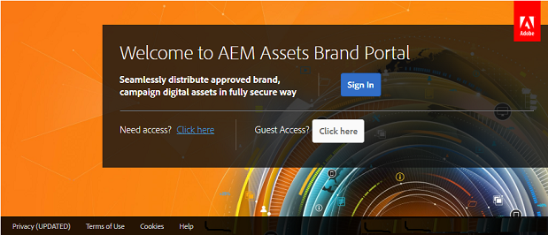

AEM Brand-portalen ger gäster åtkomst till portalen. En gästanvändare behöver inga autentiseringsuppgifter för att gå in på portalen och kan komma åt och hämta alla gemensamma mappar och samlingar. Gästanvändare kan lägga till resurser i sin ljuslåda (privat samling) och hämta samma. De kan även visa smarta taggsöknings- och sökpredikat som angetts av administratörer. Gästsessionen tillåter inte användare att skapa samlingar och sparade sökningar eller dela dem ytterligare, få åtkomst till inställningar för mappar och samlingar och dela resurser som länkar.

I en organisation tillåts flera samtidiga gästsessioner, vilket är begränsat till 10 % av den totala användarkvoten per organisation.

En gästsession är aktiv i två timmar. Ljuslådans tillstånd bevaras därför även fram till två timmar efter sessionens starttid. Efter två timmar måste gästsessionen startas om, så ljuslådeläget går förlorat.

### Snabbare nedladdningar

Brand Portal-användare kan utnyttja de snabba nedladdningarna i IBM Aspera Connect för att få upp till 25 gånger snabbare och smidigt ladda ned oavsett var i världen de befinner sig. Om du vill hämta resurserna snabbare från varumärkesportalen eller den delade länken måste du välja alternativet **Aktivera hämtningsacceleration** i hämtningsdialogrutan, förutsatt att hämtningsacceleration är aktiverat i organisationen.

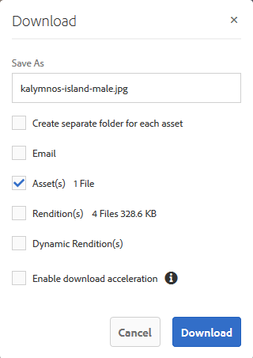

Om du vill aktivera IBM Aspera-baserad accelererad hämtning för organisationen **aktiverar administratörerna alternativet Download Acceleration** (som är inaktiverat som standard) i [Allmänna inställningar](brand-portal-general-configuration.md#allow-download-acceleration) på panelen Administrationsverktyg. Om du vill veta mer om krav och felsökningssteg för att hämta resursfiler snabbare från varumärkesportalen och delade länkar kan du läsa [Handbok för att snabba upp hämtningar från varumärkesportalen](../using/accelerated-download.md#main-pars-header).

### Rapport om användarinloggningar

En ny rapport om att spåra användarinloggningar har lagts till. Rapporten **Användarinloggningar** kan vara avgörande för att organisationer ska kunna granska och kontrollera delegerade administratörer och andra användare av varumärkesportalen.

Rapporten loggar visningsnamn, e-post-ID:n, profiler (admin, visningsprogram, redigerare, gäst), grupper, senaste inloggning, aktivitetsstatus och antal inloggningar för varje användare från distributionen av Brand Portal 6.4.2 fram till tidpunkten för rapportgenereringen. Administratörer kan exportera rapporten som .csv. Tillsammans med andra rapporter möjliggör rapporten om användarinloggning att organisationer bättre kan övervaka användarinteraktioner med de godkända varumärkesresurserna och därigenom säkerställa att företagets efterlevnadskontor följs.

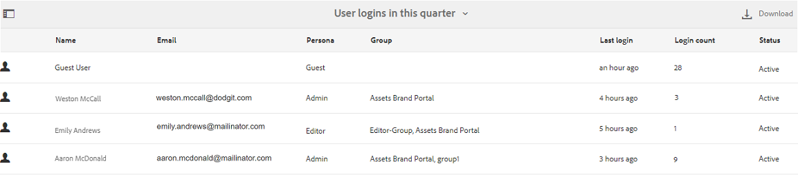

### Åtkomst till ursprungliga återgivningar

Administratörer kan begränsa användarnas åtkomst till originalbildfiler (.jpeg, .tiff, .png, .bmp, .gif, .pjpeg, x-portable-anymap, x-portable-bitmap, x-portable-graymap, x-portable-pixmap, x-rgb, x-xbitmap, x-pixmap, x-icon, image/photoshop image, /x-photoshop, .psd, image/vnd.adobe.photoshop) och ge åtkomst till lågupplösta renderingar som de hämtar från Brand Portal eller via en delad länk. Åtkomsten kan styras på användargruppnivå på fliken Grupper på sidan Användarroller på panelen Administrationsverktyg.

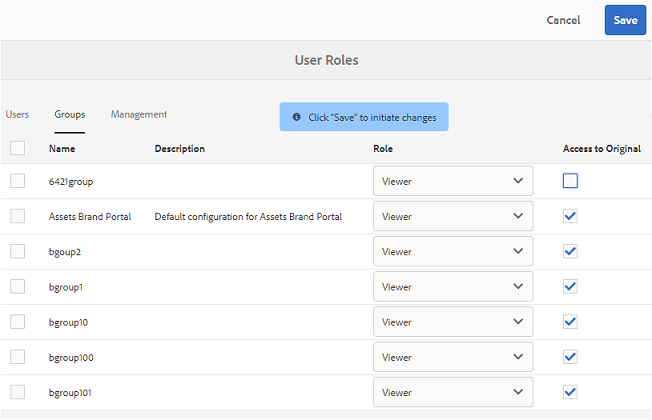

* Som standard kan alla användare hämta ursprungliga återgivningar eftersom Åtkomst till original är aktiverat för alla.
* Administratörer måste avmarkera respektive kryssrutor för att förhindra att en grupp användare får åtkomst till de ursprungliga återgivningarna.
* Om en användare är medlem i flera grupper, men bara en av grupperna har begränsningar, gäller begränsningarna den användaren.
* Begränsningarna gäller inte för administratörer, även om de är medlemmar i begränsade grupper.
* Behörigheterna för den användare som delar resurser som länkar gäller för de användare som hämtar resurser med delade länkar.

### Mapphierarkisökväg i kort- och listvyer

Kort med mappar i kortvyn visar nu mapphierarkiinformation för icke-adminanvändare (Editor, Viewer och Guest User). Med den här funktionen kan användarna se var mapparna finns, de har åtkomst till dem, i förhållande till den överordnade hierarkin.

Mapphierarkiinformation är särskilt användbar när du vill differentiera mappar som har namn som liknar andra mappar som delas från en annan mapphierarki. Om användare som inte är administratörer inte känner till mappstrukturen för de resurser som delas med dem verkar resurser/mappar med liknande namn förvirrande.

* De banor som visas på respektive kort trunkeras för att passa kortstorlekarna. Användarna kan dock se hela sökvägen som en funktionsbeskrivning när de hovrar över den trunkerade banan.

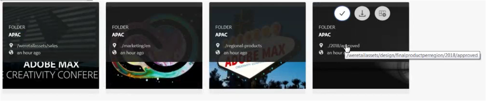

I listvyn visas mappsökväg för resurser i en kolumn till alla användare av varumärkesportalen.

### Översiktsalternativ för att visa resursegenskaper

Med alternativet Varumärksportal kan användare som inte är administratörer (redigerare, visningsprogram, gästanvändare) visa resursegenskaper för valda resurser/mappar. Alternativet Översikt visas:

1. I verktygsfältet högst upp när du väljer en resurs/mapp.
2. I listrutan när du väljer Järnvägsväljaren.

När du väljer alternativet Översikt när en resurs/mapp är markerad kan användarna se titeln, sökvägen och tidpunkten när resursen skapades. Om du väljer alternativet Översikt på sidan med tillgångsinformation kan användarna se metadata för resursen.

## Nya konfigurationer

Sex nya konfigurationer har lagts till för administratörer för att aktivera/inaktivera följande funktioner för specifika innehavare:

* Tillåt gäståtkomst
* Tillåt användare att begära åtkomst till varumärkesportalen
* Tillåt administratörer att ta bort resurser från varumärkesportalen
* Tillåt att offentliga samlingar skapas
* Tillåt skapande av publika smarta samlingar
* Tillåt hämtning av acceleration

Konfigurationerna ovan finns under Åtkomst och Allmänna inställningar på panelen Administrativa verktyg.

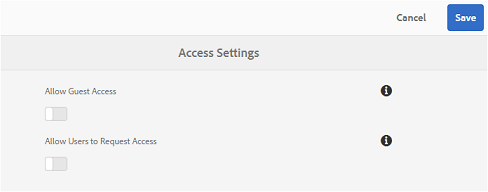
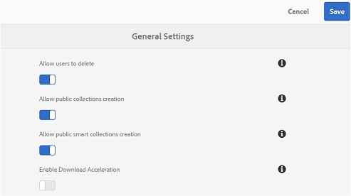

### Adobe.io är värd för användargränssnittet för att konfigurera autentiseringsintegreringar

Från och med varumärkesportalen 6.4.2 används gränssnittet Adobe.io [https://legacy-oauth.cloud.adobe.io/](https://legacy-oauth.cloud.adobe.io/) för att skapa JWT-program, som gör det möjligt att konfigurera autenticeringsintegreringar för att möjliggöra integrering av AEM Assets med varumärkesportalen. Tidigare fanns användargränssnittet för konfigurering av OAuth-integreringar på [https://marketing.adobe.com/developer/](https://marketing.adobe.com/developer/). Mer information om hur du integrerar AEM Assets med varumärkesportalen för publicering av resurser och samlingar på varumärkesportalen finns i [Konfigurera AEM Assets-integrering med varumärkesportalen](https://helpx.adobe.com/in/experience-manager/6-4/assets/using/brand-portal-configuring-integration.html).

## Sökförbättringar

Administratörer kan göra så att egenskapen predikar som inte är skiftlägeskänsliga genom att använda det uppdaterade egenskapspredikatet, som har en check för Ignorera skiftläge. Det här alternativet är tillgängligt för egenskapspredikatet och multivalue-egenskapspredikatet.\
Den icke-skiftlägeskänsliga sökningen är dock relativt långsammare än standardsökningen efter egenskapsprediat. Om sökfiltret innehåller för många predikat som inte är skiftlägeskänsliga kan sökningen gå långsammare. Därför rekommenderas att använda den icke-skiftlägeskänsliga sökningen med omdöme.

## Vad har ändrats i 6.4.1 {#what-changed-in-2}

Brand Portal 6.4.1 är en plattformsuppgraderingsrelease som innehåller flera nya funktioner och viktiga förbättringar, som bläddring, sökning och prestandaförbättringar för att leverera en meningsfull kundupplevelse.

### Bläddra bland förbättringar

* Ny innehållsträd för att snabbt navigera i en resurshierarki.

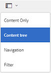

* Nya kortkommandon introducerades, till exempel _(p)_ för navigering till egenskapssidan, _(e)_ för redigering och _(ctrl+c)_ för kopieringsåtgärder.
* Förbättrad rullning, lat inläsningsgränssnitt i kort- och listvyn för att bläddra bland ett stort antal resurser.
* Förbättrad kortvy med stöd för kort i olika storlekar baserat på visningsinställningar.

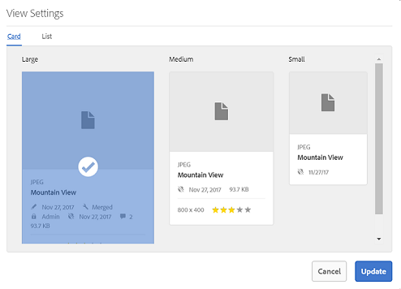

* Kortvyn visar nu datum-/tidsstämpel när du håller markören ovanför datumetiketten.

* Förbättrad kolumnvy med **Mer information** under ögonblicksbilden av resursen, där du kan navigera till detaljsidan för en resurs.

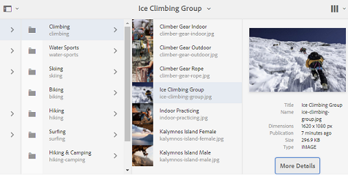

* I listvyn visas nu filnamn för resurser i den första kolumnen som standard, förutom språk, resurstyp, dimensioner, storlek, klassificering och publiceringsinformation. Nya **visningsinställningar** kan användas för att konfigurera mängden detaljer som ska visas i listvyn.

* Förbättrad upplevelse av tillgångsinformation med möjlighet att navigera fram och tillbaka mellan resurser med nya navigeringsknappar och visa antal resurser.

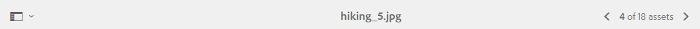

* Ny funktion för att förhandsgranska ljudfiler, överförda från AEM, på objektets informationssida.
* Ny funktion för relaterade resurser som finns i Resursegenskaper. Resurser som är relaterade till andra källor/härledda resurser på AEM och publicerade på varumärkesportalen har nu sin relation intakt i varumärkesportalen, med länkar till relaterade resurser på egenskapssidan.
* En ny konfiguration har införts som begränsar icke-adminanvändare från att skapa offentliga samlingar. Organisationer kan samarbeta med Adobe Support-team för att konfigurera den här funktionen för specifika konton.

### Förbättrade sökfunktioner

* Möjlighet att återgå till samma position i sökresultaten efter att ha navigerat till ett sökobjekt, utan att köra sökfrågan igen.
* Nytt antal sökresultat för att visa antalet sökresultat har angetts.
* Förbättrat filtypssökfilter med möjlighet att filtrera sökresultat baserat på detaljerade MIME-typer som .jpg, .png och .psd jämfört med tidigare bilder, dokument och multimediealternativ.
* Förbättrade sökfilter för samlingar, med korrekta tidsstämplar istället för tidigare tidreglage.
* Nya åtkomsttypsfilter har introducerats för att söka efter samlingar som är offentliga eller icke-offentliga.

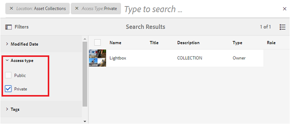

### Ladda ned optimeringar

* En enda stor fil laddas ned direkt, utan att zip-filen skapas, vilket förbättrar hastighet och genomströmning.
* ZIP-hämtningsgränsen för länkdelningsfunktionen har ökat till 5 GB, från 1 GB.

* Användarna kan nu välja att endast hämta anpassade och ursprungliga filer och förhindra färdiga återgivningar, samtidigt som de hämtar resurser från varumärkesportalen eller via funktionen för delade länkar.

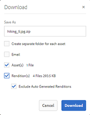

### Prestandaförbättringar

* Upp till 100 % bättre hämtningshastighet för resurser.
* Upp till 40 % bättre söksvar för resurser.
* Upp till 40 % bättre webbläsningsprestanda.

**Obs**: De citerade förbättringarna är de som utförts i labbet.

### Förbättrade rapporteringsfunktioner

**Introducerad länkdelningsrapport** En ny rapport har lagts till för att ge information om delade länkar. I rapporten Länkdelning visas alla URL:er till resurserna som delas med interna och externa användare i organisationen inom den angivna tidsramen. Den informerar också när länken delades, av vem och när upphör den att gälla.

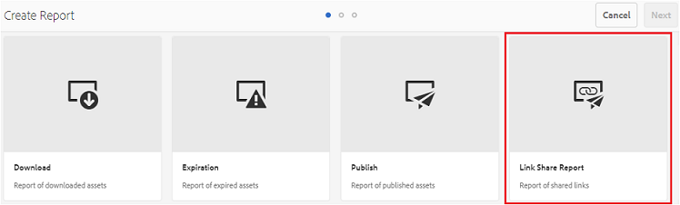

**Ingångspunkten har ändrats så att den får åtkomst till användningsrapporten** Användning har nu konsoliderats med andra rapporter och kan nu visas från konsolen Resursrapporter. Om du vill nå konsolen Resursrapporter går du till **Skapa/hantera rapporter** från panelen Administrationsverktyg.

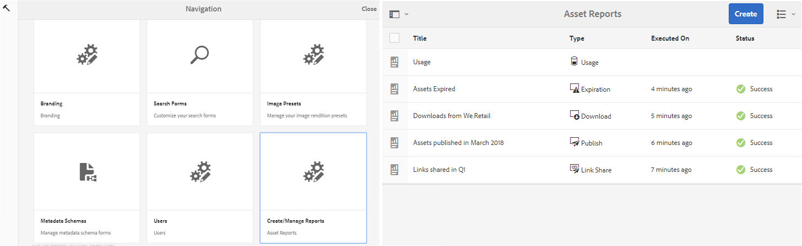

**Förbättrad användarupplevelse med rapportgränssnitt** på varumärkesportalen har blivit mer intuitiv och ger bättre kontroll åt organisationer. Förutom att skapa olika rapporter kan administratörer nu gå tillbaka till de genererade rapporterna och hämta eller ta bort dem, eftersom dessa rapporter sparas i varumärkesportalen.

Var och en av de rapporter som skapas kan anpassas genom att du lägger till eller tar bort standardkolumner. Du kan dessutom lägga till anpassade kolumner i rapporter om hämtning, förfallodatum och publicering för att kontrollera deras detaljrikedom.

### Förbättrade administrationsverktyg

Förbättrad egenskapsväljare i administrationsverktygen för metadata, sökning och rapporter med Type ahead-funktioner och bläddringsfunktioner som förenklar administratörsupplevelsen.

### Andra förbättringar

* Resurser som publicerats på varumärkesportalen från AEM 6.3.2.1 och 6.4 kan nu göras allmänt tillgängliga för användare av varumärkesportalen genom att markera kryssrutan Publicera i offentlig mapp i dialogrutan AEM Assets Brand Portal Replication.

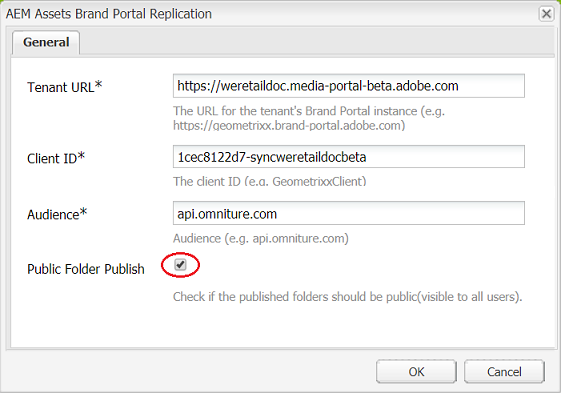

* Administratörer meddelas via e-post om åtkomstbegäran, förutom meddelanden i meddelandefältet i varumärkesportalen, om någon har begärt åtkomst till varumärkesportalen.

## Vad har ändrats i 6.3.2 {#what-changed-in-3}

Brand Portal 6.3.2 innehåller nya och förbättrade funktioner som är inriktade på kundförfrågningar och allmänna prestandaförbättringar.

### Begär åtkomst till varumärkesportalen {#request-access-to-brand-portal}

Användare kan nu begära åtkomst till varumärkesportalen med hjälp av den nya **åtkomstfunktionen** som finns på inloggningsskärmen i varumärkesportalen.

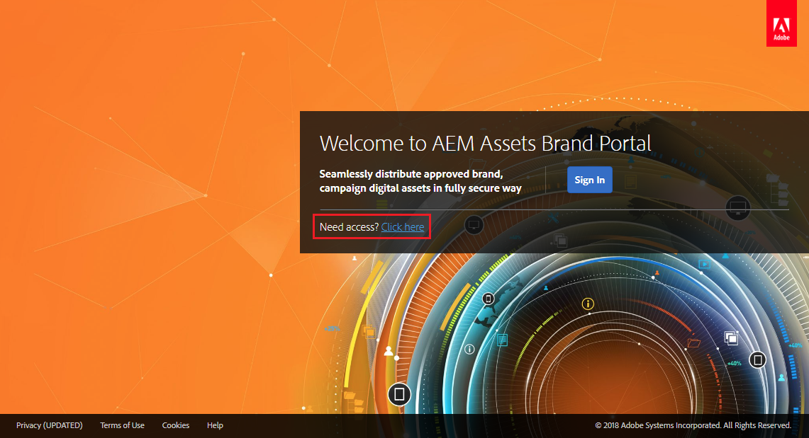

Beroende på om användarna har ett Adobe ID eller behöver skapa ett Adobe ID kan användarna följa det arbetsflöde som krävs för att skicka en förfrågan. Produktadministratörer för varumärkesportalen får sådana förfrågningar i sitt meddelandeområde och beviljar åtkomst via Adobe Admin Console.

Mer information finns i [Begär åtkomst till varumärkesportalen](../using/brand-portal.md#requestaccesstobrandportal).

### Förbättring i rapporten över hämtade resurser {#enhancement-in-the-assets-downloaded-report}

Den hämtade rapporten innehåller nu antalet nedladdade resurser per användare inom det angivna datumet och tidsintervallet. Användare kan hämta den här rapporten i CSV-format och kompilera data som det totala antalet nedladdningar för en licensierad mediefil.

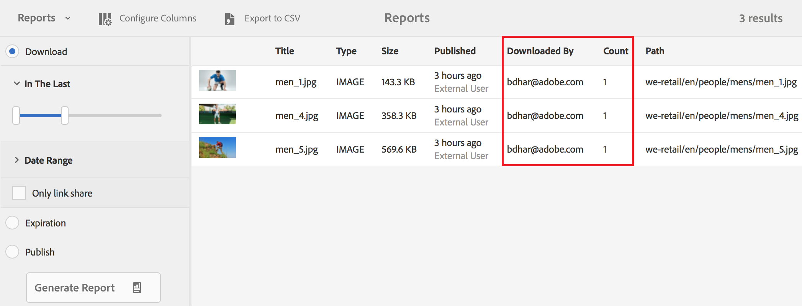

Mer information finns i steg 3 och 6 i [Skapa och hantera ytterligare rapporter](../using/brand-portal-reports.md#createandmanageadditionalreports).

### Underrättelse om varumärkesportalunderhåll {#brand-portal-maintenance-notification}

Brand Portal visar nu en meddelandebanderoll några dagar före en kommande underhållsaktivitet. Ett exempelmeddelande:

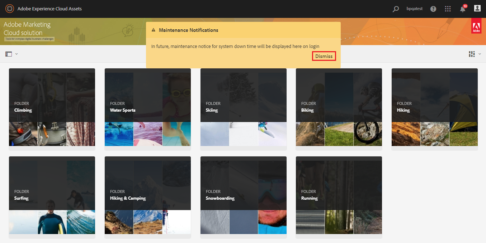

Mer information finns i Underhållsmeddelande [för varumärkesportalen](https://helpx.adobe.com/experience-manager/brand-portal/using/brand-portal.html#BrandPortalmaintenancenotification).

### Förbättring av licensierat material som delas med hjälp av funktionen för länkdelning {#enhancement-for-licensed-assets-shared-using-the-link-share-feature}

När du hämtar licensierade mediefiler med hjälp av funktionen för länkdelning uppmanas du nu att godkänna licensavtalet för dessa mediefiler.

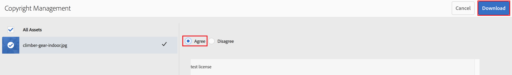

Mer information finns i Steg 12 i [Dela resurser som en länk](../using/brand-portal-link-share.md#shareassetsasalink).

### Förbättrad användarväljare {#user-picker-enhancement}

Prestandan för användarväljaren har förbättrats så att den passar behoven hos kunder med en stor användarbas.

### Byta varumärke i molnet {#experience-cloud-branding-changes}

Varumärkesportalen följer nu den nya varumärkningen i Adobe Experience Cloud.

## Vad har ändrats i 6.3.1 {#what-changed-in-4}

Brand Portal 6.3.1 innehåller nya och förbättrade funktioner som är inriktade på att anpassa varumärkesportalen till AEM.

### Uppgraderat användargränssnitt {#upgraded-user-interface}

För att anpassa användarupplevelsen i Brand Portal till AEM, övergår Adobe till användargränssnittet i Coral 3. Den här ändringen förbättrar den övergripande användbarheten, inklusive navigering och utseende.

#### Förbättrad navigeringsupplevelse {#enhanced-navigational-experience}

* Snabb åtkomst till administrationsverktyg via den nya Adobe-logotypen:

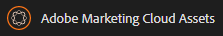

* Produktnavigering genom en övertäckning:

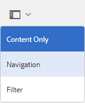

* Snabb navigering till överordnade mappar:

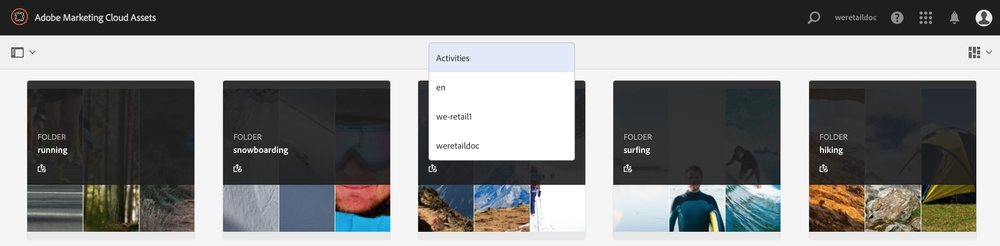

* Snabb sökning och navigering till önskat innehåll och verktyg:

### Förbättrad surfupplevelse {#enhanced-browsing-experience}

* Ny kolumnvy där du kan bläddra igenom kapslade mappar:

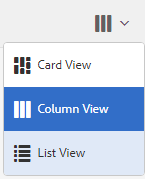 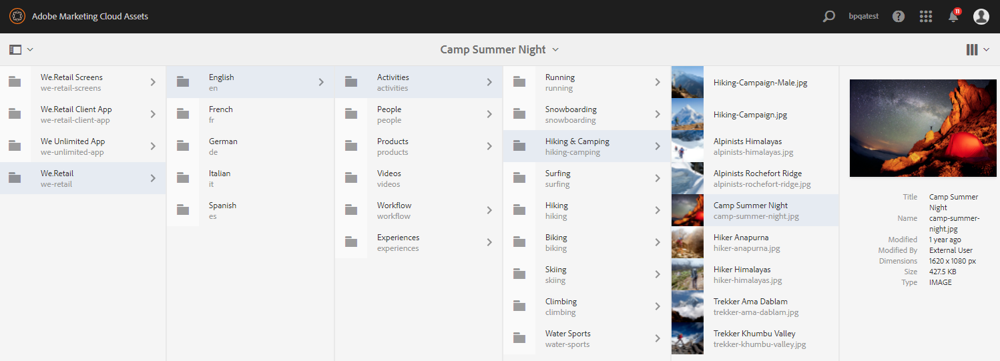

* I listan över resurser i en mapp visas den senaste resursen som överförts högst upp.

### Förbättrade sökfunktioner {#enhanced-search-experience}

* Med den nya Omni-sökfunktionen får du snabb åtkomst till relevant innehåll, funktioner eller taggar genom automatiska förslag när du skriver söknyckelord. Omni-sökning är tillgänglig för alla sökfunktioner.

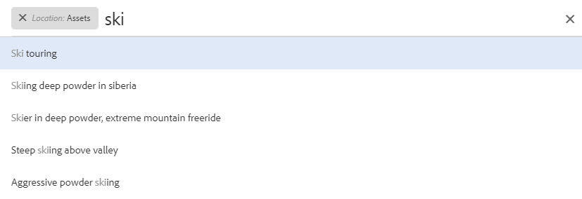

* Du kan också lägga till sökfilter i Omni-sökningar för att begränsa och snabba upp sökningen ytterligare.

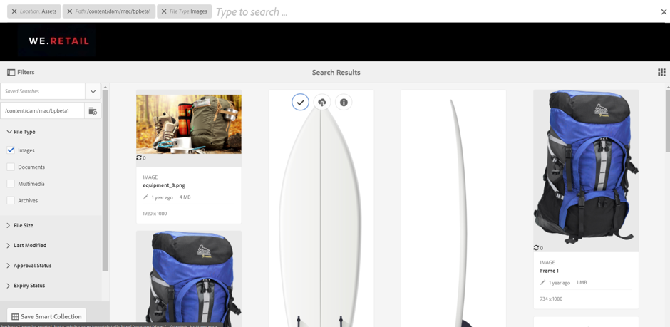

* Med den nya resursklassificeringsbaserade sökningen kan du söka efter resurser med klassificeringar, om de publiceras från AEM Assets.
* Den nya sökfunktionen med flera värden accepterar flera nyckelord med operatorn AND för att snabbare upptäcka resurser.
* Med den nya sökfunktionen kan du förbättra sökrelevansen så att specifika resurser visas högst upp i sökresultaten.
* Med den nya sökvägsbaserade sökfunktionen kan du ange sökvägen till en kapslad mapp för att kunna söka efter resurser i den mappen.

#### Ny smart taggbaserad sökning {#new-smart-tags-based-search}

Om bilder med smarta taggar publiceras från AEM Assets till Brand Portal kan du söka efter de här bilderna i varumärkesportalen med hjälp av smarta taggnamn som söknyckelord. Den här funktionen är bara tillgänglig för filer.

### Förbättrad nedladdning {#enhanced-downloading-experience}

När du har hämtat en kapslad mapp kan du bevara den ursprungliga mapphierarkin. Resurser i en kapslad mapp kan hämtas i en enda mapp i motsats till separata mappar.

### Förbättrade prestanda {#improved-performance}

Förbättringar av funktionerna för bläddring, sökning och hämtning förbättrar prestandan för varumärkesportalen avsevärt.

### New digital rights management for assets {#new-digital-rights-management-for-assets}

Administratörer kan ange förfallodatum och förfallotid för resurser innan de delar dem. När en mediefil har upphört att gälla är den synlig för tittare och redigerare, men kan inte hämtas. När en mediefil förfaller får administratörer ett meddelande.

### Förbättrad resurssortering {#enhanced-asset-sorting}

Resurssorteringen i en mapp i listvyn är inte längre begränsad till antalet resurser som visas på den första sidan. Alla resurser i en mapp sorteras, oavsett om alla är listade på den första sidan eller inte.

### Förbättrad rapportering {#reporting-capabilities}

Administratörer kan skapa och hantera tre typer av rapporter - resurser som hämtats, förfallit och publicerats. Det finns även möjlighet att konfigurera kolumnerna i en rapport och exportera rapporterna till CSV-format.

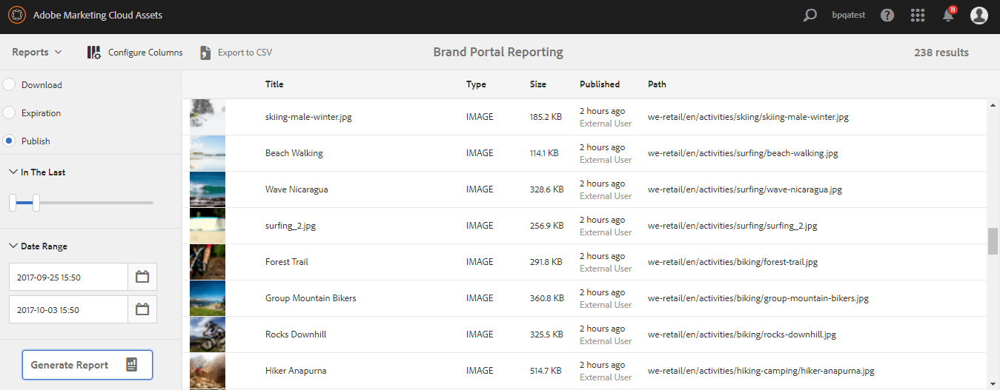

### Ytterligare metadata {#additional-metadata}

I varumärkesportalen 6.3.1 introduceras ytterligare metadata, som är ungefär som i AEM Assets 6.3. Du kan använda formuläret Schemaredigerare för att styra de metadata som ska vara synliga på sidan Resursegenskaper. Resursmetadata är inte synliga för användare med externa länkdelningar, som bara kan förhandsgranska och hämta resurser med hjälp av länkdelningens URL.

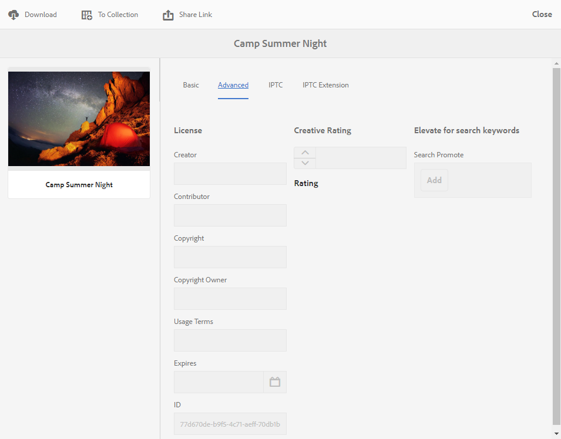

### Ytterligare funktioner för administratörer {#additional-capabilities-for-administrators}

* Innan anpassningarna av inloggningsskärmbilden är klara kan administratören förhandsgranska ändringarna.

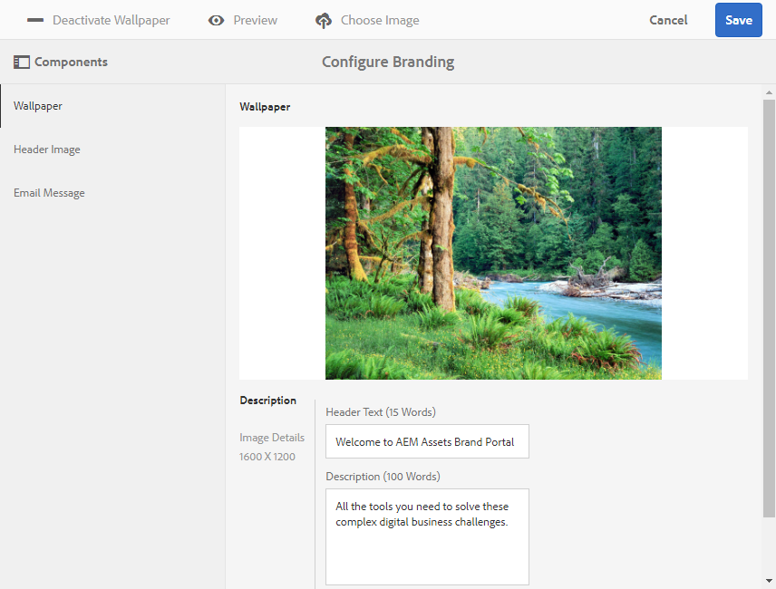

* När en administratör har lagt till nya användare behöver de inte acceptera inbjudningar att lägga till i varumärkesportalen, utan läggs till automatiskt.

### Nya publiceringsfunktioner i AEM Assets 6.3 {#new-publishing-capabilities-in-aem-assets}

* AEM-administratörer kan publicera metadatamatchema från AEM Assets till varumärkesportalen med hjälp av AEM 6.3 SP 1-CFP 1 (6.3.1.1), som kommer att vara tillgänglig under det fjärde kvartalet 2017.

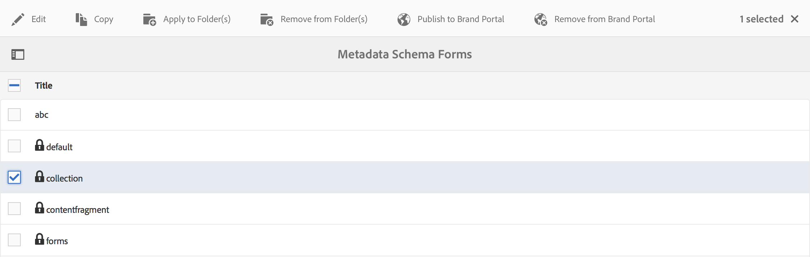

* AEM-administratörer kan publicera alla taggar från AEM Assets till varumärkesportalen med hjälp av AEM 6.2 SP1-CFP7 och AEM 6.3 SP 1-CFP 1 (6.3.1.1).

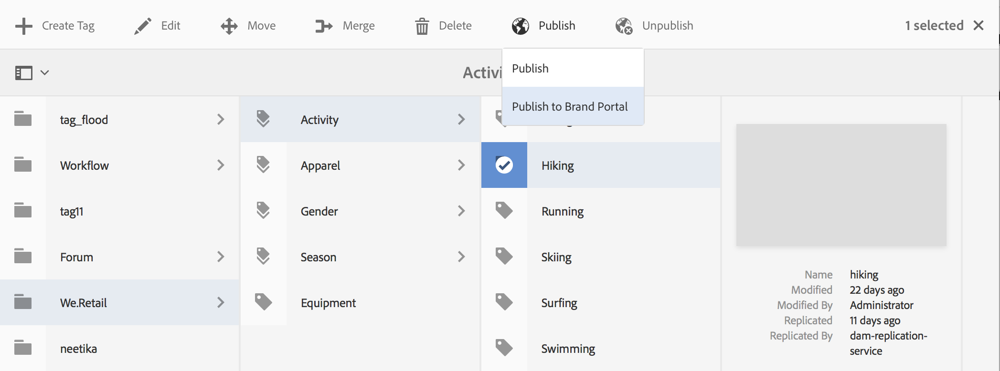

* Från AEM Assets kan du publicera resurser och samlingar som har taggar, inklusive smarta taggar. Du kan sedan söka efter dessa resurser eller samlingar med hjälp av dessa taggar som söknyckelord i Varumärkeportalen.