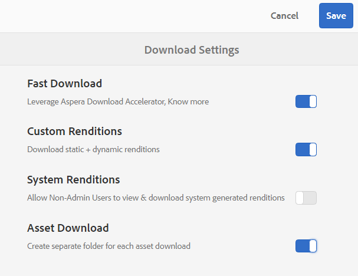
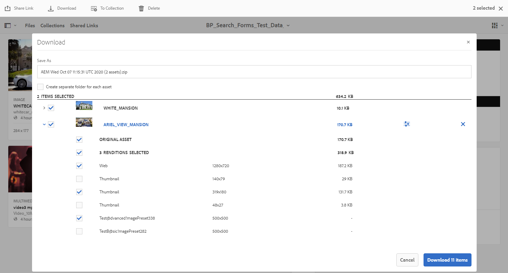
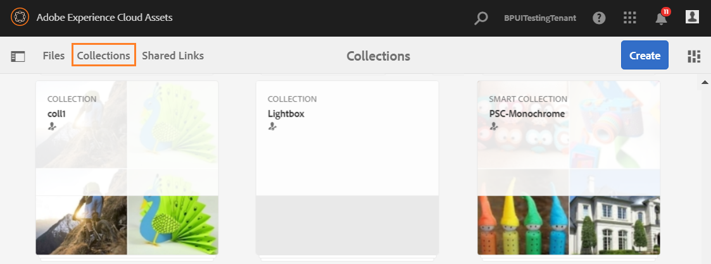
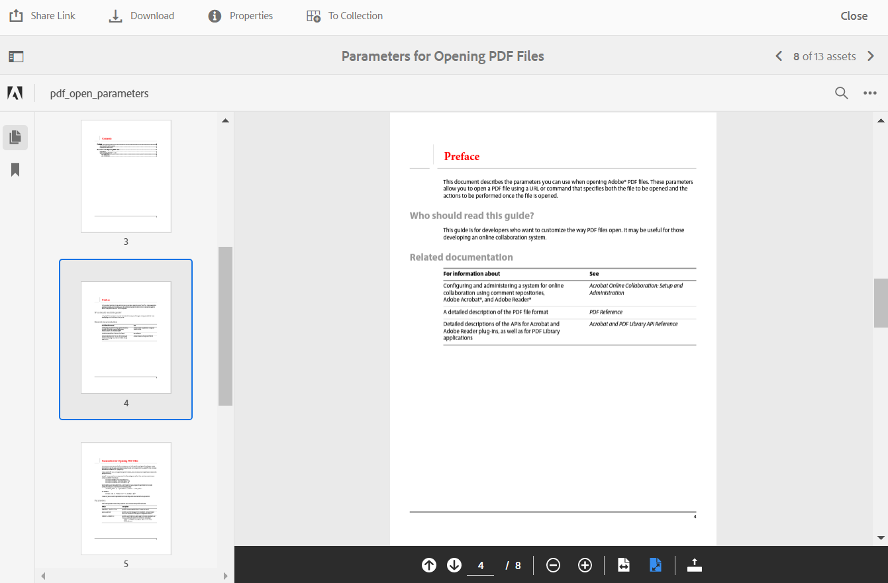
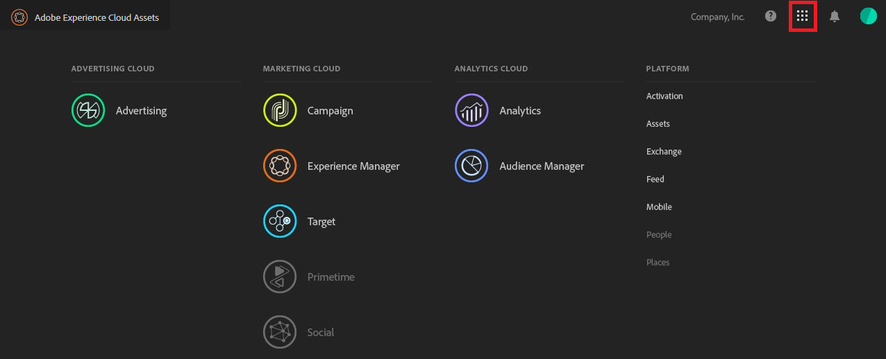

# Nyheter i AEM Assets varumärkesportal {#what-s-new-in-aem-assets-brand-portal}

Adobe Experience Manager (AEM) Assets Brand Portal hjälper er att enkelt skaffa, styra och på ett säkert sätt distribuera godkända kreativa resurser till externa parter och interna företagsanvändare på olika enheter. Det bidrar till att effektivisera resursdelning, snabbar upp time-to-market för tillgångar och minskar risken för bristande efterlevnad och obehörig åtkomst. Adobe arbetar för att förbättra den övergripande varumärkesportalupplevelsen. Här får du en smygtitt på de nya funktionerna och förbättringarna.

## Vad ändrades 2021.02.0 {#what-changed-in-feb-2021}

Brand Portal 2021.02.0 är en förbättringsrelease som innehåller automatiseringsarbetsflödet i varumärkesportalen på AEM Assets som Cloud Service, underlättar funktionen Resurser på AEM Assets som Cloud Service, förbättrar upplevelsen vid nedladdning av resurser samt innehåller viktiga korrigeringar. Det gör det även möjligt för administratörer att konfigurera standardnedladdningsbeteendet för mappar, samlingar och massnedladdning av resurser på klientnivå. Varumärkeportalen **[!UICONTROL Usage Report]** har också ändrats så att den återspeglar de aktiva användarna på Varumärkeportal. Se den senaste [versionsinformationen för varumärkesportalen](brand-portal-release-notes.md).

### Automatisering av varumärkesportalen på AEM Assets som Cloud Service {#bp-automation-on-cloud-service}

AEM Assets som Cloud Service konfigureras automatiskt med varumärkesportalen genom att aktivera varumärkesportalen från Cloud Manager. En Cloud Manager-användare utlöser aktiveringsarbetsflödet som skapar de nödvändiga konfigurationerna i serverdelen och aktiverar Brand Portal i samma IMS-organisation som i AEM Assets som en Cloud Service-instans.

Tidigare konfigurerades AEM Assets som Cloud Service manuellt med Brand Portal med hjälp av Adobe Developer Console, som anskaffar en IMS-token (Adobe Identity Management Services) för godkännande av Brand Portal-klienten.

Se [aktivera varumärksportal på AEM Assets som en Cloud Service](https://experienceleague.adobe.com/docs/experience-manager-cloud-service/assets/brand-portal/configure-aem-assets-with-brand-portal.html?lang=en).

### Resurshantering på AEM Assets som Cloud Service {#asset-sourcing-on-cloud-service}

Funktionen Resurser är nu tillgänglig i AEM Assets som Cloud Service. Funktionen är aktiverad som standard för alla användare av molntjänster. Tillåtna Brand Portal-användare kan bidra till resurskälla genom att överföra nya resurser till bidragsmapparna och publicera bidragsmappen från Brand Portal till AEM Assets som en Cloud Service-instans. Administratörerna kan granska och godkänna varumärkesportalanvändarnas bidrag för att vidaredistribuera dem till andra Brand Portal-användare.

Tidigare var Resurser endast tillgängligt på AEM Assets (lokal och hanterad tjänst).

Se [Resurshantering i varumärkesportalen](https://experienceleague.adobe.com/docs/experience-manager-brand-portal/using/asset-sourcing-in-brand-portal/brand-portal-asset-sourcing.html?lang=en).

### Resurshämtning {#asset-download-setting}

Förutom den befintliga **[!UICONTROL Download Settings]**-inställningen kan administratören för varumärkesportalen nu konfigurera inställningen **[!UICONTROL Asset Download]**. Med den här inställningen kan administratörer styra standardhämtningsbeteendet för mappar, samlingar och masshämtning av resurser (fler än 20 resurser) på klientnivå.

<!--
Earlier, all the asset renditions were directly downloaded in a zip folder in case of folder, collection, and bulk download of assets. As the **[!UICONTROL Download]** dialog is skipped for folders or collections, there was no mechanism to control the downloading behaviour of the assets. Due to this, the users were finding it difficut to search for a particular asset rendition from a folder containing huge bunch of downloaded renditions. 
-->

Tidigare hämtades alla resursåtergivningar direkt i en zip-mapp. Dialogrutan **[!UICONTROL Download]** hoppades över för mappar och samlingar och det fanns ingen metod för att kontrollera hämtningsbeteendet för resurserna, vilket gör det svårt att söka efter en viss återgivning från ett stort antal hämtningar.

**[!UICONTROL Asset Download]** När du anger det finns nu ett alternativ för att skapa en separat mapp för varje resurs när du hämtar mappar, samlingar eller masshämtning av resurser.

Om **[!UICONTROL Asset Download]**-inställningen är inaktiverad hämtas mapparna eller samlingarna i en ZIP-mapp som innehåller alla resursåtergivningar under samma mapp, med undantag för att resurserna hämtas med hjälp av delningslänken.

Logga in som administratör på din varumärkesportal och navigera till **[!UICONTROL Tools]** > **[!UICONTROL Download]**. Administratörerna kan aktivera inställningen **[!UICONTROL Asset Download]** för att skapa en separat mapp för varje resurs när mappar, samlingar och masshämtning av resurser hämtas.

Se [hämta resurser från varumärkesportalen](https://experienceleague.adobe.com/docs/experience-manager-brand-portal/using/download/brand-portal-download-assets.html?lang=en).
<!--
### Download using Share link {#download-using-share-link}

The default behavior of downloading the assets using share link is now independent of the **[!UICONTROL Download Settings]**. A separate folder is created for each asset while downloading the assets using share link. 
-->

### Användningsrapport {#usage-report}

Varumärkesportalen **[!UICONTROL Usage Report]** har ändrats så att den endast speglar de aktiva varumärkesportalanvändarna. De användare på varumärkesportalen som inte är tilldelade någon produktprofil i Admin Console betraktas som inaktiva användare och återspeglas inte i **[!UICONTROL Usage Report]**.

Tidigare visades både aktiva och inaktiva användare i användningsrapporten.

## Vad ändrades 2020.10.0 {#what-changed-in-oct-2020}

Brand Portal 2020.10.0 är en förbättringsrelease som fokuserar på att förenkla nedladdningen av resurser och innehåller viktiga korrigeringar. Förbättringen innefattar ett nytt och förbättrat arbetsflöde för hämtning av resurser, ytterligare alternativ för att exkludera renderingar, direkt hämtning från panelen **[!UICONTROL Renditions]**, konfiguration som tillåter åtkomst och hämtningsrättigheter för en viss grupp användare samt enkel navigering till filer, samlingar och delade länkar från alla sidor på varumärkesportalen. Se den senaste [versionsinformationen för varumärkesportalen](brand-portal-release-notes.md).

### Förenklad nedladdning {#download-dialog}

Tidigare visades dialogrutan **[!UICONTROL Download]** med flera alternativ, som att skapa separata mappar för varje resurs, e-postresurs, välja originalresurs, anpassade återgivningar, dynamiska återgivningar, exkludera systemåtergivningar och aktivera hämtningsacceleration, som var tvetydig för icke-tekniska eller nya användare särskilt när flera resurser eller mappar valdes för hämtning. Dessutom kunde användaren inte se alla resursrenderingar eller exkludera en specifik anpassad eller dynamisk rendering.

Den nya dialogrutan **[!UICONTROL Download]** generaliserar resursmarkerings- och filtreringsprocessen, vilket gör det enklare för Brand Portal-användarna att fatta effektiva beslut när de hämtar resursrenderingarna. Här visas alla markerade resurser och deras återgivningar beroende på [**[!UICONTROL Download]**](brand-portal-download-assets.md)-konfigurationen och **[!UICONTROL Download]**-inställningarna.

>[!NOTE]
>
>Alla användare har nu **[!UICONTROL Fast Download]** aktiverat som standard och kräver [IBM Aspera Connect 3.9.9](https://www.ibm.com/support/knowledgecenter/SSXMX3_3.9.9/kc/connect_welcome.html) installerat i webbläsartillägget innan de hämtar resurserna från Brand Portal.

<!--
If any of the **[!UICONTROL Custom Rendition]** or **[!UICONTROL System Rendition]** is enabled in the [**[!UICONTROL Download]**](brand-portal-download-assets.md) configuration and **[!UICONTROL Download]** settings are enabled for the group users, the new **[!UICONTROL Download]** dialog appears with all the renditions of the selected assets or folders containing assets in a list view. 
-->

I dialogrutan **[!UICONTROL Download]** kan användarna:

* Visa alla tillgängliga återgivningar av alla resurser i hämtningslistan.
* Undanta återgivningar av resurser som inte behövs för hämtning.
* Använd samma uppsättning renderingar för alla liknande resurstyper med ett klick.
* Använd olika uppsättningar återgivningar för olika resurstyper.
* Skapa separata mappar för varje resurs.
* Hämta markerade resurser och deras återgivningar.

Hämtningsarbetsflödet förblir konstant för fristående resurser, flera resurser, mappar som innehåller resurser, licensierade eller olicensierade resurser och för att hämta resurser via länken Dela. Se [steg för att hämta resurser från varumärkesportalen](https://docs.adobe.com/content/help/en/experience-manager-brand-portal/using/download/brand-portal-download-assets.html#download-assets).

### Snabbnavigering {#quick-navigation}

Tidigare var alternativet att visa **[!UICONTROL Files]**, **[!UICONTROL Collections]** och **[!UICONTROL Shared Links]** dolt och flera klick krävdes varje gång användaren ville växla till en annan vy.

I Brand Portal 2020.10.0 kan användarna navigera till **[!UICONTROL Files]**, **[!UICONTROL Collections]** och **[!UICONTROL Shared Links]** från alla sidor i Brand Portal med ett klick via snabblänkarna.

### Förbättrad renderingspanel {#rendition-panel}

Tidigare kunde användarna bara visa den ursprungliga resursen och dess återgivningar på panelen **[!UICONTROL Renditions]** om någon av **[!UICONTROL Custom Rendition]** eller **[!UICONTROL System Rendition]** var aktiverad i konfigurationen **[!UICONTROL Download]**. Användarna var också tvungna att hämta alla resursrenderingar eftersom det inte fanns något filter för att exkludera vissa anpassade eller dynamiska renderingar som inte behövdes.

<!--
Earlier, if any of the custom or system renditions was enabled in the **[!UICONTROL Download]** settings, an additional **[!UICONTROL Download]** dialog appeared on clicking the **[!UICONTROL Download]** button wherein the user had to manually select the set of renditions (original asset, custom renditions, dynamic renditions) to download.
There was no filter to exclude specific custom or dynamic renditions which were not required for download.
-->

I Brand Portal 2020.10.0 kan användarna exkludera specifika återgivningar och direkt [hämta de valda återgivningarna från panelen Återgivningar](brand-portal-download-assets.md#download-assets-from-asset-details-page) på sidan med resursinformation utan att behöva öppna dialogrutan **[!UICONTROL Download]**.

<!-- 
In Brand Portal 2020.10.0, direct download and exclude renditions features are introduced in the **[!UICONTROL Renditions]** panel on the asset details page. All the renditions (original asset, custom renditions, dynamic renditions) under the rendition panel are now associated with a check box and are enabled by default. 

The user can clear the check boxes to exclude the renditions which are not required for download. And can click on the **[!UICONTROL Download]** button in the **[!UICONTROL Renditions]** panel to directly download the selected set of renditions in a zip folder without having to open the **[!UICONTROL Download]** dialog.
-->

### Konfigurera hämtningsinställningar {#download-permissions}

Förutom de befintliga **[!UICONTROL Download]**-konfigurationerna kan administratören för varumärkesportalen även konfigurera inställningar för olika användargrupper så att de kan visa och (eller) hämta den ursprungliga resursen och dess återgivningar från sidan med resursinformation.

Logga in som administratör på din varumärkesportal och navigera till **[!UICONTROL Tools]** > **[!UICONTROL Users]**.

På sidan **[!UICONTROL User Roles]** går du till fliken **[!UICONTROL Groups]** för att konfigurera inställningar för visning och (eller) hämtning för användargrupperna.

Tidigare var inställningarna bara tillgängliga för att hindra gruppanvändarna från att hämta den ursprungliga resursen.

På fliken **[!UICONTROL Groups]** på sidan **[!UICONTROL User Roles]** kan administratörer konfigurera inställningar för visning och hämtning:

* Om både **[!UICONTROL Download Original]**- och **[!UICONTROL Download Renditions]**-inställningarna är aktiverade kan användarna i den valda gruppen visa och hämta de ursprungliga resurserna och deras återgivningar.
* Om båda inställningarna är inaktiverade kan användarna bara visa de ursprungliga resurserna. Resursåtergivningarna är inte synliga för användarna på sidan med resursinformation.
* Om bara **[!UICONTROL Download Original]**-inställningen är aktiverad kan användarna bara visa och hämta de ursprungliga resurserna från sidan med resursinformation.
* Om bara **[!UICONTROL Download Renditions]**-inställningen är aktiverad kan användarna visa den ursprungliga resursen, men de kan inte hämta den. Användaren kan dock visa och hämta resursrenderingarna.

Se [konfigurera hämtning av resurser](https://docs.adobe.com/content/help/en/experience-manager-brand-portal/using/download/brand-portal-download-assets.html#configure-download-permissions).

>[!NOTE]
>
>Om en användare läggs till i flera grupper och om en av grupperna har begränsningar, gäller begränsningarna användaren.

<!--
>Restrictions to access the original asset and their renditions do not apply to administrators even if they are members of restricted groups.
 >
 >The users can always download assets and their renditions from the repository using a `curl` request even if the download configurations are turned-off.
 >
-->

## Vad har ändrats i 6.4.7 {#what-changed-in-647}

Brand Portal 6.4.7-versionen innehåller Document Viewer, förbättrar upplevelsen vid hämtning av resurser och innehåller viktiga korrigeringar. Se den senaste [versionsinformationen för varumärkesportalen](brand-portal-release-notes.md).

<!--
Brand Portal 6.4.7 release brings in the Document Viewer, leverages the Brand Portal administrators to configure asset download, and centers top customer requests. See latest [Brand Portal Release Notes](brand-portal-release-notes.md).
-->

### Document Viewer {#doc-viewer}

Dokumentvisningsprogrammet förbättrar PDF-visningen. Det ger en liknande upplevelse som Adobe Document Cloud när du visar PDF-filerna i varumärkesportalen.

Tidigare fanns det begränsade alternativ för att visa PDF-filerna.

Med Document Viewer har nu användare av varumärkesportalen möjlighet att visa sidor, visa bokmärken, söka i text på sidan, zooma in, zooma ut, navigera till föregående och nästa sida, växla till sida, anpassa till fönster, anpassa till skärmen samt dölja eller visa verktygsfältet.

>[!NOTE]
>
>Visningsfunktionen för andra dokumentformat ändras inte.

### Hämta upplevelsen {#download-configurations}

Nedladdningsprocessen för resurser har moderniserats, vilket ger en förenklad användarupplevelse när [resurser hämtas från varumärkesportalen](brand-portal-download-assets.md).

Det befintliga arbetsflödet för att hämta resurser från varumärkesportalen följs oundvikligen av en **[!UICONTROL Download]**-dialogruta med flera hämtningsalternativ att välja mellan.

I varumärkesportalen 6.4.7 kan administratören konfigurera inställningarna för resursen **[!UICONTROL Download]**. De tillgängliga konfigurationerna är:
* **[!UICONTROL Fast Download]**
* **[!UICONTROL Custom Renditions]**
* **[!UICONTROL System Renditions]**

Administratören för varumärkesportalen kan aktivera valfri kombination för att konfigurera hämtning av resurser.

<!--In Brand Portal 6.4.7, fast download, custom renditions, and system renditions are the three configurations available.-->

* Om både **[!UICONTROL Custom Renditions]**- och **[!UICONTROL System Renditions]**-konfigurationerna är inaktiverade hämtas de ursprungliga återgivningarna av resurserna utan någon ytterligare dialogruta som förenklar hämtningen för Brand Portal-användarna.

* Om någon av **[!UICONTROL Custom Rendition]** eller **[!UICONTROL System Rendition]** är aktiverad visas dialogrutan **[!UICONTROL Download]** och den ursprungliga resursen tillsammans med resursåtergivningarna hämtas. Om du aktiverar **[!UICONTROL Fast Download]**-konfigurationen går hämtningen snabbare.

Beroende på konfigurationen förblir hämtningsarbetsflödet konstant för fristående resurser, flera resurser, mappar som innehåller resurser, licensierade eller olicensierade resurser och för att hämta resurser med hjälp av delningslänken.

## Vad har ändrats i 6.4.6 {#what-changed-in-646}

I varumärkesportalen 6.4.6 ändras behörighetskanalen mellan AEM Assets och varumärkesportalen. Varumärkesportalen stöds nu i AEM Assets som Cloud Service, AEM Assets 6.3 och senare. I AEM Assets 6.3 och senare konfigurerades varumärkesportalen tidigare i Classic UI via äldre OAuth Gateway, som använder JWT-tokenutbyte för att erhålla en IMS Access-token för auktorisering. AEM Assets har nu konfigurerats med Brand Portal via Adobe Developer Console, där en IMS-token för auktorisering av din varumärksportal används.

<!-- The steps to configure integration are different depending on your AEM version, and whether you are configuring for the first-time, or upgrading the existing integration:
-->

<!--
  
   | **AEM Version** |**New Integration** |**Upgrade Integration** |
|---|---|---|
| **AEM 6.5** |[Create new integration](../using/brand-portal-configure-integration-65.md) |[Upgrade existing integration](../using/brand-portal-configure-integration-65.md#upgrade-integration-65) | 
| **AEM 6.4** |[Create new integration](../using/brand-portal-configure-integration-64.md) |[Upgrade existing integration](../using/brand-portal-configure-integration-64.md#upgrade-integration-64) | 
| **AEM 6.3** |[Create new integration](../using/brand-portal-configure-integration-63.md) |[Upgrade existing integration](../using/brand-portal-configure-integration-63.md#upgrade-integration-63) | 
| **AEM 6.2** |Contact Support |Contact Support | 

   -->

Stegen för att konfigurera AEM Assets med varumärkesportalen skiljer sig åt beroende på vilken version du har AEM och om du konfigurerar för första gången eller uppgraderar de befintliga konfigurationerna:

<!--| **AEM Version** |**New Configuration** |**Upgrade Configuration** |
|---|---|---|
| **AEM 6.5 (6.5.4.0 and above)** |[Create configuration](../using/brand-portal-configure-integration-65.md) |[Upgrade configuration](../using/brand-portal-configure-integration-65.md#upgrade-integration-65) | 
| **AEM 6.4 (6.4.8.0 and above)** |[Create configuration](../using/brand-portal-configure-integration-64.md) |[Upgrade configuration](../using/brand-portal-configure-integration-64.md#upgrade-integration-64) | 
| **AEM 6.3 (6.3.3.8 and above)** |[Create configuration](../using/brand-portal-configure-integration-63.md) |[Upgrade configuration](../using/brand-portal-configure-integration-63.md#upgrade-integration-63) | 
| **AEM 6.2** |Contact Support |Contact Support | 
-->

<!-- AEM Assets configuration with Brand Portal on Adobe I/O is supported on:
* AEM 6.5.4.0 and above
* AEM 6.4.8.0 and above
* AEM 6.3.3.8 and above -->

| **AEM** | **Ny konfiguration** | **Uppgraderingskonfiguration** |
|---|---|---|
| **AEM Assets as a Cloud Service** | [Skapa en konfiguration](https://docs.adobe.com/content/help/en/experience-manager-cloud-service/assets/brand-portal/configure-aem-assets-with-brand-portal.html) | - |
| **AEM 6.5 (6.5.4.0 och senare)** | [Skapa en konfiguration](https://docs.adobe.com/content/help/en/experience-manager-65/assets/brandportal/configure-aem-assets-with-brand-portal.html) | [Uppgraderingskonfiguration](https://docs.adobe.com/content/help/en/experience-manager-65/assets/brandportal/configure-aem-assets-with-brand-portal.html#upgrade-integration-65) |
| **AEM 6.4 (6.4.8.0 och senare)** | [Skapa en konfiguration](https://docs.adobe.com/content/help/en/experience-manager-64/assets/brandportal/configure-aem-assets-with-brand-portal.html) | [Uppgraderingskonfiguration](https://docs.adobe.com/content/help/en/experience-manager-64/assets/brandportal/configure-aem-assets-with-brand-portal.html#upgrade-integration-64) |
| **AEM 6.3 (6.3.3.8 och senare)** | [Skapa en konfiguration](https://helpx.adobe.com/experience-manager/6-3/assets/using/brand-portal-configuring-integration.html) | [Uppgraderingskonfiguration](https://helpx.adobe.com/experience-manager/6-3/assets/using/brand-portal-configuring-integration.html#Upgradeconfiguration) |
| **AEM 6.2** | Kontakta supporten | Kontakta supporten |

>[!NOTE]
>
>Vi rekommenderar att du uppdaterar din AEM till den senaste Service Pack-versionen.

Se den senaste [versionsinformationen för varumärkesportalen](brand-portal-release-notes.md).

Se [Vanliga frågor om varumärkesportalen](brand-portal-faqs.md).

## Vad har ändrats i 6.4.5 {#what-changed-in-645}

Brand Portal 6.4.5 är en funktionsrelease som fokuserar på att ge användare av varumärkesportalen (externa byråer/team) möjlighet att ladda upp material till varumärkesportalen och publicera till AEM Assets, utan att behöva ha tillgång till redigeringsmiljön. Den här funktionen kallas **[Resurshantering i varumärkesportalen](brand-portal-asset-sourcing.md)** och kommer att förbättra kundupplevelsen genom att erbjuda en tvåvägsfunktion för användare som både bidrar och delar resurser med andra globalt distribuerade Brand Portal-användare.

### Resurshantering i varumärkesportalen {#asset-sourcing-in-bp}

Med Resurshantering kan AEM användare (administratörer/icke-admin-användare) skapa nya mappar med en extra **Asset Contribution**-egenskap, vilket säkerställer att den nya mappen som skapas är öppen för att skickas in av Brand Portal-användare. Detta utlöser automatiskt ett arbetsflöde som skapar ytterligare två undermappar, som kallas NYTT och DELAT, i den nyligen skapade **Contribute**-mappen.

AEM användare definierar sedan behovet genom att ladda upp en översikt över de typer av resurser som ska läggas till i mappen för bidrag, samt ladda upp baslinjeresurser, till mappen **SHARED** för att säkerställa att BP-användarna har den referensinformation de behöver. Administratören kan sedan ge aktiva Brand Portal-användare åtkomst till mappen för bidrag innan den nyskapade **Contribute**-mappen publiceras på Brand Portal.

När användaren är klar med att lägga till innehåll i mappen **NEW** kan han eller hon publicera bidragsmappen i den AEM författarmiljön. Observera att det kan ta några minuter att slutföra importen och återspegla det nya publicerade innehållet i AEM Assets.

Dessutom ändras inte alla befintliga funktioner. Användare av varumärkesportalen kan visa, söka efter och hämta resurser från bidragsmappen samt från andra tillåtna mappar. Administratörer kan dessutom dela mappen för bidrag ytterligare, ändra egenskaper och lägga till resurser i samlingar.

>[!NOTE]
>
>Resurshantering i varumärkesportalen stöds i AEM 6.5.2.0 och senare.
>
>Funktionen stöds inte i tidigare versioner - AEM 6.3 och AEM 6.4.

### Överför resurser till avgiftsmappen {#upload-assets-in-bp}

Brand Portal-användare med lämpliga behörigheter kan hämta tillgångskraven för att förstå behovet av bidrag och överföra flera resurser eller mappar som innehåller flera resurser till bidragsmappen. Observera dock att användare av varumärkesportalen endast kan överföra resurser till undermappen **NEW**. Mappen **SHARED** är avsedd för distribution av krav och baslinjeresurser.

### Publicera bidragsmapp till AEM Assets {#publish-assets-to-aem}

När överföringen är klar till mappen **NEW** kan Brand Portal-användare sedan publicera bidragsmappen till AEM. Det kan ta några minuter att importera och spegla det publicerade innehållet/resurserna i AEM Assets. Se [Publicera en mapp för bidrag till AEM Assets](brand-portal-publish-contribution-folder-to-aem-assets.md)

## Vad har ändrats i 6.4.4 {#what-changed-in-644}

Utgåvan av varumärkesportalen 6.4.4 fokuserar på förbättringar av textsökning och de vanligaste kundförfrågningarna. Se den senaste [versionsinformationen för varumärkesportalen](brand-portal-release-notes.md).

### Förbättrade sökfunktioner

Från och med varumärkesportalen 6.4.4 stöds partiell textsökning på egenskapsprediat i filtreringsrutan. Om du vill tillåta partiell textsökning måste du aktivera **Delvis sökning** i Egenskapspredikat i sökformuläret.

Läs vidare om du vill veta mer om partiell textsökning och jokerteckensökning.

#### Delvis frassökning {#partial-phrase-search}

Nu kan du söka efter resurser genom att endast ange en del - det vill säga ett eller två - av den sökda frasen i filtreringsrutan.

**Använd**
caseDelvis frassökning är användbart när du är osäker på den exakta kombinationen av ord som förekommer i den sökda frasen.

Om ditt sökformulär i varumärkesportalen t.ex. använder egenskapspredikatet för partiell sökning i resurstiteln, returnerar termen **läger** alla resurser med ordet läger i titelfrasen.

#### Sökning med jokertecken {#wildcard-search}

På varumärkesportalen kan du använda asterisken (*) i sökfrågan tillsammans med en del av ordet i den sökbara frasen.

**Använd**
skiftlägeOm du inte är säker på exakt vilka ord som finns i den sökfrasen kan du använda en jokerteckenssökning för att fylla i luckorna i sökfrågan.

Om du till exempel anger **klättb*** returneras alla resurser som har ord som börjar med tecknen **klättb** i titelfrasen om sökformuläret i varumärkesportalen använder egenskapspredikat för partiell sökning på resurstitel.

På samma sätt kan du ange:

* ***** klättrar upp för alla resurser som har ord som slutar med  **** tecken som klättrar i sin titelfras.

* ***klättb*** returnerar alla resurser som innehåller ord som innehåller tecknen  **** klättrar i deras titelfras.

>[!NOTE]
>
>När du markerar kryssrutan **Delvis sökning** är **Ignorera skiftläge** markerat som standard.

## Vad har ändrats i 6.4.3 {#what-changed-in}

Utgåvan av Brand Portal 6.4.3 fokuserar på - att ge organisationer ett alternativt alias utöver deras klient-ID i åtkomst-URL:en för Brand Portal, ny konfiguration av mapphierarki, bättre videosupport, schemalagd publicering från AEM Author-instansen till Brand Portal, förbättringar av driften - samt att tillgodose kundernas önskemål.

### Mapphierarkinavigering för icke-administratörer

Administratörer kan nu konfigurera hur mapparna visas för icke-adminanvändare (redigerare, visningsprogram och gästanvändare) vid inloggning. [Aktivera ](../using/brand-portal-general-configuration.md) mapphierarkiConfiguration läggs till i  **Allmänna inställningar** på panelen Administrationsverktyg. Om konfigurationen är:

* **aktiverat** är mappträdet som börjar från rotmappen synligt för icke-admin-användare. Det innebär att de får en navigeringsupplevelse som liknar administratörerna.
* **inaktiverat** visas endast de delade mapparna på landningssidan.

Funktionen [Aktivera mapphierarki](../using/brand-portal-general-configuration.md) (när den är aktiverad) hjälper dig att differentiera mapparna med samma namn som delas från olika hierarkier. När du loggar in kan användare som inte är administratörer nu se de virtuella överordnade (och överordnade) mapparna för de delade mapparna.

De delade mapparna ordnas i respektive katalog i virtuella mappar. Du känner igen dessa virtuella mappar med en låsikon.

Observera att standardminiatyrbilden för de virtuella mapparna är miniatyrbilden för den första delade mappen.

### Sök i en viss mapphierarki eller sökväg

**Sökvägsläsarpredikatet** introduceras i sökformuläret för att tillåta sökning av resurser i en viss katalog. Standardsöksökvägen för sökpredikatet för sökvägsläsaren är `/content/dam/mac/<tenant-id>/`, som kan konfigureras genom att redigera standardsökformuläret.

* Administratörsanvändare kan använda Sökvägsläsaren för att navigera till valfri mappkatalog på varumärkesportalen.
* Användare som inte är administratörer kan bara använda Sökväg för att navigera till de mappar (och gå tillbaka till de överordnade mapparna) som de har delat med sig av.

   Till exempel delas `/content/dam/mac/<tenant-id>/folderA/folderB/folderC` med en icke-admin-användare. Användaren kan söka efter resurser i mappen C med hjälp av Sökvägsläsaren. Den här användaren kan även navigera till folderB och folderA (eftersom de är överordnade för den folderC som delas med användaren).

Nu kan du begränsa resurssökningen i en viss mapp som du har bläddrat till i stället för att börja i rotmappen.

Observera att sökningar under dessa mappar endast returnerar resultat från resurser som har delats med användaren.

### Stöd för videoåtergivningar från Dynamic Media

Användare vars AEM Author-instans är i hybridläget Dynamic Media kan förhandsgranska och hämta de dynamiska medieåtergivningarna, utöver de ursprungliga videofilerna.

För att tillåta förhandsgranskning och hämtning av dynamiska medierenderingar på specifika innehavarkonton måste administratörer ange **Dynamic Media Configuration** (URL för videotjänst (DM-Gateway) och registrerings-ID för att hämta den dynamiska videon) i **Video**-konfigurationen från administratörspanelen.

Dynamic Media videor kan förhandsgranskas på:

* Sidan Resursinformation
* Resursvy
* Förhandsgranska länkdelning

Dynamic Media Video encodes kan laddas ned från:

* Varumärkesportal
* Delad länk

### Schemalagd publicering på varumärkesportalen

Arbetsflödet för publicering av resurser (och mappar) från [AEM (6.4.2.0)](https://helpx.adobe.com/experience-manager/6-4/release-notes/sp-release-notes.html#main-pars_header_9658011) Författarinstansen till Författarportalen kan schemaläggas för ett senare datum och tid.

Publicerade resurser kan också tas bort från portalen vid ett senare datum (tid) genom att schemalägga arbetsflödet för att avpublicera från varumärkesportalen.

### Konfigurerbart klientalias i URL

Organisationer kan anpassa sin portal-URL genom att ha ett alternativt prefix i URL:en. För att få ett alias för innehavarens namn i deras befintliga portal-URL måste man kontakta supporten för Adobe.

Observera att bara prefixet för varumärksportal-URL:en kan anpassas och inte hela URL:en.\
En organisation med den befintliga domänen **geomettrix.brand-portal.adobe.com** kan till exempel få **geomettrixinc.brand-portal.adobe.com** som skapats på begäran.

AEM Author-instansen kan bara vara [konfigurerad](https://helpx.adobe.com/experience-manager/6-5/assets/using/brand-portal-configuring-integration.html) med URL:en för klient-ID och inte med URL:en för klientalias (alternativ).

Man kan anpassa portalens URL istället för att följa Adobe:s webbadress.

### Bättre nedladdningsupplevelser

Versionen ger en förenklad nedladdningsupplevelse med ett reducerat antal klick och varningar:

* Om du väljer att endast hämta återgivningarna (och inte de ursprungliga resurserna).
* Hämtning av resurserna när åtkomsten till de ursprungliga återgivningarna är begränsad.

## Vad har ändrats i 6.4.6 {#what-changed-in-1}

Brand Portal 6.4.2 innehåller en rad funktioner för att hantera resursdistributionsbehov i organisationer och hjälpa dem att nå ut till ett stort antal användare globalt via Gäst-åtkomst och få en optimal upplevelse vid snabbare nedladdningar. Varumärkesportalen ger också bättre kontroll till organisationer genom nya konfigurationer för administratörer, nytillagda rapporter och tar hänsyn till kundförfrågningar.

### Gäståtkomst

AEM Brand-portalen ger gäster åtkomst till portalen. En gästanvändare behöver inga autentiseringsuppgifter för att gå in på portalen och kan komma åt och hämta alla gemensamma mappar och samlingar. Gästanvändare kan lägga till resurser i sin ljuslåda (privat samling) och hämta samma. De kan även visa smarta taggsöknings- och sökpredikat som angetts av administratörer. Gästsessionen tillåter inte användare att skapa samlingar och sparade sökningar eller dela dem ytterligare, få åtkomst till inställningar för mappar och samlingar och dela resurser som länkar.

I en organisation tillåts flera samtidiga gästsessioner, vilket är begränsat till 10 % av den totala användarkvoten per organisation.

En gästsession är aktiv i två timmar. Ljuslådans tillstånd bevaras därför även fram till två timmar efter sessionens starttid. Efter två timmar måste gästsessionen startas om, så ljuslådeläget går förlorat.

### Snabbare nedladdningar

Brand Portal-användare kan utnyttja de snabba nedladdningarna i IBM Aspera Connect för att få upp till 25 gånger snabbare och smidigt ladda ned oavsett var i världen de befinner sig. Om du vill hämta resurserna snabbare från varumärkesportalen eller den delade länken måste användarna välja alternativet **Aktivera hämtningsacceleration** i hämtningsdialogrutan, förutsatt att hämtningsacceleration är aktiverat i organisationen.

Om du vill aktivera IBM Aspera-baserad accelererad hämtning för organisationen **aktiverar administratörerna alternativet Hämta acceleration** (som är inaktiverat som standard) från [Allmänna inställningar](brand-portal-general-configuration.md#allow-download-acceleration) på panelen Administrationsverktyg. Om du vill veta mer om krav och felsökningssteg för att hämta resursfiler snabbare från varumärkesportalen och delade länkar läser du [Handbok för att snabba upp hämtningar från varumärkesportalen](../using/accelerated-download.md#main-pars-header).

### Rapport om användarinloggningar

En ny rapport om att spåra användarinloggningar har lagts till. Rapporten **Användarinloggningar** kan vara avgörande för att organisationer ska kunna granska och kontrollera delegerade administratörer och andra användare av varumärkesportalen.

Rapporten loggar visningsnamn, e-post-ID:n, profiler (admin, visningsprogram, redigerare, gäst), grupper, senaste inloggning, aktivitetsstatus och antal inloggningar för varje användare från distributionen av Brand Portal 6.4.2 fram till tidpunkten för rapportgenereringen. Administratörer kan exportera rapporten som .csv. Tillsammans med andra rapporter möjliggör rapporten om användarinloggning att organisationer bättre kan övervaka användarinteraktioner med de godkända varumärkesresurserna och därigenom säkerställa att företagets efterlevnadskontor följs.

### Åtkomst till ursprungliga återgivningar

Administratörer kan begränsa användarnas åtkomst till originalbildfiler (.jpeg, .tiff, .png, .bmp, .gif, .pjpeg, x-portable-anymap, x-portable-bitmap, x-portable-graymap, x-portable-pixmap, x-rgb, x-xbitmap, x-pixmap, x-icon, image/photoshop image, /x-photoshop, .psd, image/vnd.adobe.photoshop) och ge åtkomst till lågupplösta renderingar som de hämtar från Brand Portal eller via en delad länk. Åtkomsten kan styras på användargruppnivå på fliken Grupper på sidan Användarroller på panelen Administrationsverktyg.

* Som standard kan alla användare hämta ursprungliga återgivningar eftersom Åtkomst till original är aktiverat för alla.
* Administratörer måste avmarkera respektive kryssrutor för att förhindra att en grupp användare får åtkomst till de ursprungliga återgivningarna.
* Om en användare är medlem i flera grupper, men bara en av grupperna har begränsningar, gäller begränsningarna den användaren.
* Begränsningarna gäller inte för administratörer, även om de är medlemmar i begränsade grupper.
* Behörigheterna för den användare som delar resurser som länkar gäller för de användare som hämtar resurser med delade länkar.

### Mapphierarkisökväg i kort- och listvyer

Kort med mappar i kortvyn visar nu mapphierarkiinformation för icke-adminanvändare (Editor, Viewer och Guest User). Med den här funktionen kan användarna se var mapparna finns, de har åtkomst till dem, i förhållande till den överordnade hierarkin.

Mapphierarkiinformation är särskilt användbar när du vill differentiera mappar som har namn som liknar andra mappar som delas från en annan mapphierarki. Om användare som inte är administratörer inte känner till mappstrukturen för de resurser som delas med dem verkar resurser/mappar med liknande namn förvirrande.

* De banor som visas på respektive kort trunkeras för att passa kortstorlekarna. Användarna kan dock se hela sökvägen som en funktionsbeskrivning när de hovrar över den trunkerade banan.

I listvyn visas mappsökväg för resurser i en kolumn till alla användare av varumärkesportalen.

### Översiktsalternativ för att visa resursegenskaper

Med alternativet Varumärksportal kan användare som inte är administratörer (redigerare, visningsprogram, gästanvändare) visa resursegenskaper för valda resurser/mappar. Alternativet Översikt visas:

1. I verktygsfältet högst upp när du väljer en resurs/mapp.
2. I listrutan när du väljer Järnvägsväljaren.

När du väljer alternativet Översikt när en resurs/mapp är markerad kan användarna se titeln, sökvägen och tidpunkten när resursen skapades. Om du väljer alternativet Översikt på sidan med tillgångsinformation kan användarna se metadata för resursen.

## Nya konfigurationer

Sex nya konfigurationer har lagts till för administratörer för att aktivera/inaktivera följande funktioner för specifika innehavare:

* Tillåt gäståtkomst
* Tillåt användare att begära åtkomst till varumärkesportalen
* Tillåt administratörer att ta bort resurser från varumärkesportalen
* Tillåt att offentliga samlingar skapas
* Tillåt skapande av publika smarta samlingar
* Tillåt hämtning av acceleration

Konfigurationerna ovan finns under Åtkomst och Allmänna inställningar på panelen Administrativa verktyg.

### Adobe I/O användargränssnitt för att konfigurera autentiseringsintegreringar

Brand Portal 6.4.2 och senare använder Adobe.io [https://legacy-oauth.cloud.adobe.io/](https://legacy-oauth.cloud.adobe.io/)-gränssnittet för att skapa JWT-program, som gör det möjligt att konfigurera autentiseringsintegreringar för att tillåta AEM Assets-integrering med Brand Portal. Tidigare fanns gränssnittet för konfiguration av OAuth-integreringar i `https://marketing.adobe.com/developer/`. Mer information om hur du integrerar AEM Assets med varumärkesportalen för att publicera resurser och samlingar på varumärkesportalen finns i [Konfigurera AEM Assets-integrering med varumärkesportalen](https://docs.adobe.com/content/help/en/experience-manager-64/assets/brandportal/configure-aem-assets-with-brand-portal.html).

## Sökförbättringar

Administratörer kan göra så att egenskapen predikar som inte är skiftlägeskänsliga genom att använda det uppdaterade egenskapspredikatet, som har en check för Ignorera skiftläge. Det här alternativet är tillgängligt för egenskapspredikatet och multivalue-egenskapspredikatet.\
Den icke-skiftlägeskänsliga sökningen är dock relativt långsammare än standardsökningen efter egenskapsprediat. Om sökfiltret innehåller för många predikat som inte är skiftlägeskänsliga kan sökningen gå långsammare. Därför rekommenderas att använda den icke-skiftlägeskänsliga sökningen med omdöme.

## Vad har ändrats i 6.4.1 {#what-changed-in-2}

Brand Portal 6.4.1 är en plattformsuppgraderingsrelease som innehåller flera nya funktioner och viktiga förbättringar, som bläddring, sökning och prestandaförbättringar för att leverera en meningsfull kundupplevelse.

### Bläddra bland förbättringar

* Ny innehållsträd för att snabbt navigera i en resurshierarki.

* Introducerade nya kortkommandon, till exempel _(p)_ för navigering till egenskapssidan, _(e)_ för redigering och _(ctrl+c)_ för kopieringsåtgärder.
* Förbättrad rullning, lat inläsningsgränssnitt i kort- och listvyn för att bläddra bland ett stort antal resurser.
* Förbättrad kortvy med stöd för kort i olika storlekar baserat på visningsinställningar.

* Kortvyn visar nu datum-/tidsstämpel när du håller markören ovanför datumetiketten.

* Förbättrad kolumnvy med **Mer information** under ögonblicksbilden av resursen, där du kan navigera till detaljsidan för en resurs.

* I listvyn visas nu filnamn för resurser i den första kolumnen som standard, förutom språk, resurstyp, dimensioner, storlek, klassificering och publiceringsinformation. Nya **Visa inställningar** kan användas för att konfigurera mängden detaljer som ska visas i listvyn.

* Förbättrad upplevelse av tillgångsinformation med möjlighet att navigera fram och tillbaka mellan resurser med nya navigeringsknappar och visa antal resurser.

* Ny funktion för att förhandsgranska ljudfiler, överförda från AEM, på objektets informationssida.
* Ny funktion för relaterade resurser som finns i Resursegenskaper. Resurser som är relaterade till andra källresurser/härledda resurser på AEM och publicerade på varumärkesportalen har nu sin relation intakt i varumärkesportalen, med länkar till relaterade resurser på egenskapssidan.
* En ny konfiguration har införts som begränsar icke-adminanvändare från att skapa offentliga samlingar. Organisationer kan samarbeta med Adobe supportteam för att konfigurera den här funktionen för specifika konton.

### Förbättrade sökfunktioner

* Möjlighet att återgå till samma position i sökresultaten efter att ha navigerat till ett sökobjekt, utan att köra sökfrågan igen.
* Nytt antal sökresultat för att visa antalet sökresultat har angetts.
* Förbättrat filtypssökfilter med möjlighet att filtrera sökresultat baserat på detaljerade MIME-typer som .jpg, .png och .psd jämfört med tidigare bilder, dokument och multimediealternativ.
* Förbättrade sökfilter för samlingar, med korrekta tidsstämplar istället för tidigare tidreglage.
* Nya åtkomsttypsfilter har introducerats för att söka efter samlingar som är offentliga eller icke-offentliga.

### Ladda ned optimeringar

* En enda stor fil laddas ned direkt, utan att zip-filen skapas, vilket förbättrar hastighet och genomströmning.
* ZIP-hämtningsgränsen för länkdelningsfunktionen har ökat till 5 GB, från 1 GB.

* Användarna kan nu välja att endast hämta anpassade och ursprungliga filer och förhindra färdiga återgivningar, samtidigt som de hämtar resurser från varumärkesportalen eller via funktionen för delade länkar.

### Prestandaförbättringar

* Upp till 100 % bättre hämtningshastighet för resurser.
* Upp till 40 % bättre söksvar för resurser.
* Upp till 40 % bättre webbläsningsprestanda.

**Obs**: De citerade förbättringarna är de som utförts i labbet.

### Förbättrade rapporteringsfunktioner

**Introducerad**
rapport om länkdelningEn ny rapport med information om delade länkar har lagts till. I rapporten Länkdelning visas alla URL:er till resurserna som delas med interna och externa användare i organisationen inom den angivna tidsramen. Den informerar också när länken delades, av vem och när upphör den att gälla.

**Ingångspunkten har ändrats så att den får åtkomst till**
användningsrapporten. Användningsrapporten har nu konsoliderats med andra rapporter och kan nu visas från konsolen Resursrapporter. Om du vill nå konsolen Resursrapporter går du till **Skapa/hantera rapporter** från panelen Administrationsverktyg.

**Förbättrad användarupplevelse med**
rapporteringRapportgränssnittet på varumärkesportalen har blivit mer intuitivt och ger bättre kontroll åt organisationer. Förutom att skapa olika rapporter kan administratörer nu gå tillbaka till de genererade rapporterna och hämta eller ta bort dem, eftersom dessa rapporter sparas i varumärkesportalen.

Var och en av de rapporter som skapas kan anpassas genom att du lägger till eller tar bort standardkolumner. Du kan dessutom lägga till anpassade kolumner i rapporter om hämtning, förfallodatum och publicering för att kontrollera deras detaljrikedom.

### Förbättrade administrationsverktyg

Förbättrad egenskapsväljare i administrationsverktygen för metadata, sökning och rapporter med Type ahead-funktioner och bläddringsfunktioner för att förenkla administratörsupplevelsen.

### Andra förbättringar

* Resurser som publicerats till varumärkesportalen från AEM 6.3.2.1 och 6.4 kan nu göras allmänt tillgängliga för användare av varumärkesportalen genom att markera kryssrutan Publicera i den gemensamma mappen i dialogrutan AEM Assets Brand Portal Replication.

* Administratörer meddelas via e-post om åtkomstbegäran, förutom meddelanden i meddelandefältet i varumärkesportalen, om någon har begärt åtkomst till varumärkesportalen.

## Vad har ändrats i 6.3.2 {#what-changed-in-3}

Brand Portal 6.3.2 innehåller nya och förbättrade funktioner som är inriktade på kundförfrågningar och allmänna prestandaförbättringar.

### Begär åtkomst till varumärkesportalen {#request-access-to-brand-portal}

Användare kan nu begära åtkomst till varumärkesportalen med den nya **funktionen need access** som finns på inloggningsskärmen i varumärkesportalen.

Beroende på om användare har en Adobe ID eller behöver skapa en Adobe ID kan användarna följa det arbetsflöde som krävs för att skicka en begäran. Produktadministratörer på varumärkesportalen får sådana förfrågningar i sitt meddelandeområde och beviljar åtkomst via Adobe Admin Console.

Mer information finns i [Begär åtkomst till varumärkesportalen](../using/brand-portal.md#requestaccesstobrandportal).

### Förbättring i rapporten {#enhancement-in-the-assets-downloaded-report} för hämtade resurser

Den hämtade rapporten innehåller nu antalet nedladdade resurser per användare inom det angivna datumet och tidsintervallet. Användare kan hämta den här rapporten i CSV-format och kompilera data som det totala antalet nedladdningar för en licensierad mediefil.

Mer information finns i Steg 3 och 6 i [Skapa och hantera ytterligare rapporter](../using/brand-portal-reports.md#createandmanageadditionalreports).

### Underhållsmeddelande för varumärkesportal {#brand-portal-maintenance-notification}

Brand Portal visar nu en meddelandebanderoll några dagar före en kommande underhållsaktivitet. Ett exempelmeddelande:

Mer information finns i [Underhållsmeddelande för varumärkesportalen](https://helpx.adobe.com/experience-manager/brand-portal/using/brand-portal.html#BrandPortalmaintenancenotification).

### Förbättring av licensierade resurser som delas med hjälp av länkdelningsfunktionen {#enhancement-for-licensed-assets-shared-using-the-link-share-feature}

När du hämtar licensierade mediefiler med hjälp av funktionen för länkdelning uppmanas du nu att godkänna licensavtalet för dessa mediefiler.

Mer information finns i Steg 12 i [Dela resurser som en länk](../using/brand-portal-link-share.md#shareassetsasalink).

### Förbättrad användarväljare {#user-picker-enhancement}

Prestandan för användarväljaren har förbättrats så att den passar behoven hos kunder med en stor användarbas.

### Utnyttja ändringar i molnbranding {#experience-cloud-branding-changes}

Varumärkesportalen följer nu nya Adobe Experience Cloud branding.

## Vad har ändrats i 6.3.1 {#what-changed-in-4}

Brand Portal 6.3.1 innehåller nya och förbättrade funktioner som är inriktade på att anpassa varumärkesportalen efter AEM.

### Uppgraderat användargränssnitt {#upgraded-user-interface}

För att anpassa användarupplevelsen för Brand Portal till AEM, övergår Adobe till användargränssnittet för Coral 3. Den här ändringen förbättrar den övergripande användbarheten, inklusive navigering och utseende.

#### Förbättrad navigeringsupplevelse {#enhanced-navigational-experience}

* Snabb åtkomst till administrationsverktyg via den nya Adobe-logotypen:

* Produktnavigering genom en övertäckning:

* Snabb navigering till överordnade mappar:

* Snabb sökning och navigering till önskat innehåll och verktyg:

### Förbättrad surfupplevelse {#enhanced-browsing-experience}

* Ny kolumnvy där du kan bläddra igenom kapslade mappar:

 

* I listan över resurser i en mapp visas den senaste resursen som överförts högst upp.

### Förbättrad sökfunktion {#enhanced-search-experience}

* Med den nya Omni-sökfunktionen får du snabb åtkomst till relevant innehåll, funktioner eller taggar genom automatiska förslag när du skriver söknyckelord. Omni-sökning är tillgänglig för alla sökfunktioner.

* Du kan också lägga till sökfilter i Omni-sökningar för att begränsa och snabba upp sökningen ytterligare.

* Med den nya resursklassificeringsbaserade sökningen kan du söka efter resurser med klassificeringar, om de publiceras från AEM Assets.
* Den nya sökfunktionen med flera värden accepterar flera nyckelord med operatorn AND för att snabbare upptäcka resurser.
* Med den nya sökfunktionen kan du förbättra sökrelevansen så att specifika resurser visas högst upp i sökresultaten.
* Med den nya sökvägsbaserade sökfunktionen kan du ange sökvägen till en kapslad mapp för att kunna söka efter resurser i den mappen.

#### Ny smart taggbaserad sökning {#new-smart-tags-based-search}

Om bilder med smarta taggar publiceras från AEM Assets till varumärkesportalen kan du söka efter dessa bilder i varumärkesportalen med hjälp av de smarta taggnamnen som söknyckelord. Den här funktionen är bara tillgänglig för filer.

### Förbättrad nedladdning {#enhanced-downloading-experience}

När du har hämtat en kapslad mapp kan du bevara den ursprungliga mapphierarkin. Resurser i en kapslad mapp kan hämtas i en enda mapp i motsats till separata mappar.

### Förbättrade prestanda {#improved-performance}

Förbättringar av funktionerna för bläddring, sökning och hämtning förbättrar prestandan för varumärkesportalen avsevärt.

### Ny hantering av digitala rättigheter för resurser {#new-digital-rights-management-for-assets}

Administratörer kan ange förfallodatum och förfallotid för resurser innan de delar dem. När en mediefil har upphört att gälla är den synlig för tittare och redigerare, men kan inte hämtas. När en mediefil förfaller får administratörer ett meddelande.

### Förbättrad resurssortering {#enhanced-asset-sorting}

Resurssorteringen i en mapp i listvyn är inte längre begränsad till antalet resurser som visas på den första sidan. Alla resurser i en mapp sorteras, oavsett om alla är listade på den första sidan eller inte.

### Förbättrad rapportering {#reporting-capabilities}

Administratörer kan skapa och hantera tre typer av rapporter - resurser som hämtats, förfallit och publicerats. Det finns även möjlighet att konfigurera kolumnerna i en rapport och exportera rapporterna till CSV-format.

### Ytterligare metadata {#additional-metadata}

I varumärkesportalen 6.3.1 introduceras ytterligare metadata, vilket är samma som i AEM Assets 6.3. Du kan använda formuläret Schemaredigerare för att styra de metadata som ska vara synliga på sidan Resursegenskaper. Resursmetadata är inte synliga för användare med externa länkdelningar, som bara kan förhandsgranska och hämta resurser med hjälp av länkdelningens URL.

### Ytterligare funktioner för administratörer {#additional-capabilities-for-administrators}

* Innan anpassningarna av inloggningsskärmbilden är klara kan administratören förhandsgranska ändringarna.

* När en administratör har lagt till nya användare behöver de inte acceptera inbjudningar att lägga till i varumärkesportalen, utan läggs till automatiskt.

### Nya publiceringsfunktioner i AEM Assets 6.3 {#new-publishing-capabilities-in-aem-assets}

* AEM administratörer kan publicera metadatamatchema från AEM Assets till varumärkesportalen med AEM 6.3 SP 1-CFP 1 (6.3.1.1), som kommer att vara tillgänglig under det fjärde kvartalet 2017.

* AEM kan publicera alla taggar från AEM Assets till varumärkesportalen med AEM 6.2 SP1-CFP7 och AEM 6.3 SP 1-CFP 1 (6.3.1.1).

* Från AEM Assets kan du publicera resurser och samlingar som har taggar, inklusive smarta taggar. Du kan sedan söka efter dessa resurser eller samlingar med hjälp av dessa taggar som söknyckelord i Varumärkeportalen.
